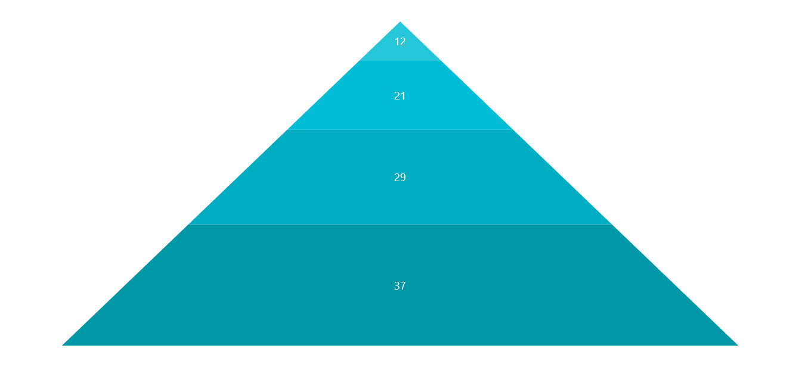
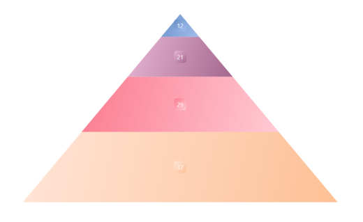
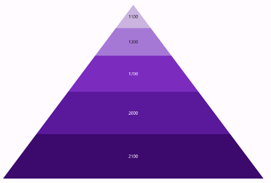
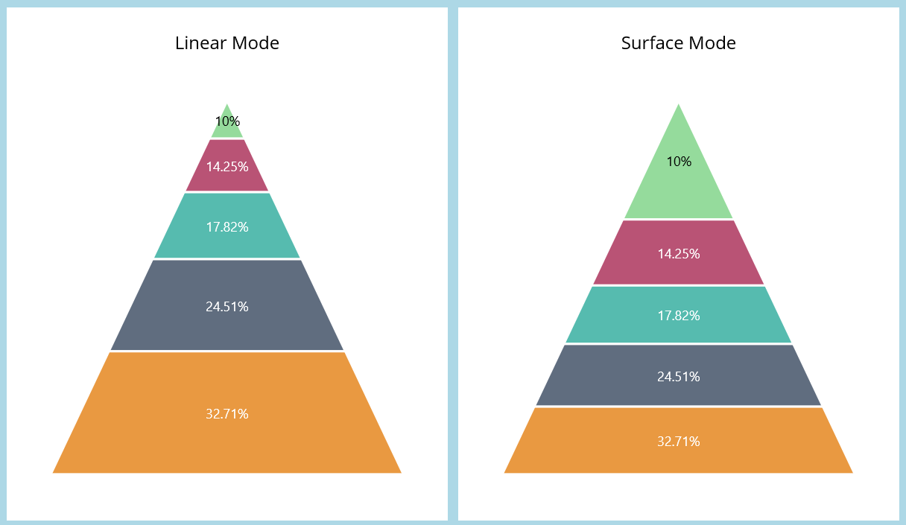

# Appearance in .NET MAUI Pyramid Chart

The appearance of the [SfPyramidChart](https://help.syncfusion.com/cr/maui/Syncfusion.Maui.Charts.SfPyramidChart.html) can be customized by using the custom palettes and gradients that enhance the visual appeal of the application.

N> **Prerequisite:** Ensure that the required NuGet package is installed, the necessary namespaces are imported, and the **Pyramid Chart** control is properly configured in your application. For detailed setup and configuration instructions, refer to the **[Getting Started](https://help.syncfusion.com/maui/pyramid-charts/getting-started)** guide.

## Add a title

The chart title provides quick information to the user about the data being plotted in the chart. You can set the title using the [Title](https://help.syncfusion.com/cr/maui/Syncfusion.Maui.Charts.ChartBase.html#Syncfusion_Maui_Charts_ChartBase_Title) property of the pyramid chart as follows.





<chart:SfPyramidChart ItemsSource="{Binding Data}"
                      XBindingPath="XValue"
                      YBindingPath="YValue">
    <chart:SfPyramidChart.Title>
        <Label Text="Pyramid Stages"/>
    </chart:SfPyramidChart.Title>
</chart:SfPyramidChart>





SfPyramidChart chart = new SfPyramidChart()
{
    ItemsSource = new ViewModel().Data,
    XBindingPath = "XValue",
    YBindingPath = "YValue",
    Title = new Label()
    {
        Text = "Pyramid Stages"
    }
};

this.Content = chart;



  

## Custom PaletteBrushes

The [SfPyramidChart](https://help.syncfusion.com/cr/maui/Syncfusion.Maui.Charts.SfPyramidChart.html) allows you to define your own brushes with preferred order by using the [PaletteBrushes](https://help.syncfusion.com/cr/maui/Syncfusion.Maui.Charts.SfPyramidChart.html#Syncfusion_Maui_Charts_SfPyramidChart_PaletteBrushes) property, as shown in the code below.





<chart:SfPyramidChart ItemsSource="{Binding Data}"
                      XBindingPath="XValue"
                      YBindingPath="YValue"
                      PaletteBrushes="{Binding CustomBrushes}">
</chart:SfPyramidChart>





public class ViewModel
{
    public ObservableCollection<Model> Data { get; set; }

    public List<Brush> CustomBrushes { get; set; }

    public ViewModel()
    {
        CustomBrushes = new List<Brush>();
        CustomBrushes.Add(new SolidColorBrush(Color.FromRgb(38, 198, 218)));
        CustomBrushes.Add(new SolidColorBrush(Color.FromRgb(0, 188, 212)));
        CustomBrushes.Add(new SolidColorBrush(Color.FromRgb(0, 172, 193)));
        CustomBrushes.Add(new SolidColorBrush(Color.FromRgb(0, 151, 167)));
        CustomBrushes.Add(new SolidColorBrush(Color.FromRgb(0, 131, 143)));
    }
}





## Apply gradient

The gradient for the pyramid chart can be set by using the [PaletteBrushes](https://help.syncfusion.com/cr/maui/Syncfusion.Maui.Charts.SfPyramidChart.html#Syncfusion_Maui_Charts_SfPyramidChart_PaletteBrushes) property of the chart with the help of the [LinearGradientBrush](https://learn.microsoft.com/en-us/dotnet/maui/user-interface/brushes/lineargradient) or [RadialGradientBrush](https://learn.microsoft.com/en-us/dotnet/maui/user-interface/brushes/radialgradient).





<chart:SfPyramidChart ItemsSource="{Binding Data}"
                      XBindingPath="XValue"
                      YBindingPath="YValue"
                      PaletteBrushes="{Binding CustomBrushes}">
</chart:SfPyramidChart>





public class ViewModel
{
    public ObservableCollection<Model> Data { get; set; }

    public List<Brush> CustomBrushes { get; set; }

    public ViewModel()
    {
        CustomBrushes = new List<Brush>();

        LinearGradientBrush gradientColor1 = new LinearGradientBrush();
        gradientColor1.GradientStops = new GradientStopCollection()
        {
            new GradientStop() { Offset = 1, Color = Color.FromArgb("#a3bded") },
            new GradientStop() { Offset = 0, Color = Color.FromArgb("#6991c7") }
        };

        LinearGradientBrush gradientColor2 = new LinearGradientBrush();
        gradientColor2.GradientStops = new GradientStopCollection()
        {
            new GradientStop() { Offset = 1, Color = Color.FromArgb("#A5678E") },
            new GradientStop() { Offset = 0, Color = Color.FromArgb("#E8B7D4") }
        };

        LinearGradientBrush gradientColor3 = new LinearGradientBrush();
        gradientColor3.GradientStops = new GradientStopCollection()
        {
            new GradientStop() { Offset = 1, Color = Color.FromArgb("#FFCAD4") },
            new GradientStop() { Offset = 0, Color = Color.FromArgb("#FB7B8E") }
        };

        LinearGradientBrush gradientColor4 = new LinearGradientBrush();
        gradientColor4.GradientStops = new GradientStopCollection()
        {
            new GradientStop() { Offset = 1, Color = Color.FromArgb("#FDC094") },
            new GradientStop() { Offset = 0, Color = Color.FromArgb("#FFE5D8") }
        };

        LinearGradientBrush gradientColor5 = new LinearGradientBrush();
        gradientColor5.GradientStops = new GradientStopCollection()
        {
            new GradientStop() { Offset = 1, Color = Color.FromArgb("#CFF4D2") },
            new GradientStop() { Offset = 0, Color = Color.FromArgb("#56C596") }
        };

        CustomBrushes.Add(gradientColor1);
        CustomBrushes.Add(gradientColor2);
        CustomBrushes.Add(gradientColor3);
        CustomBrushes.Add(gradientColor4);
        CustomBrushes.Add(gradientColor5);
    }
}





## Point color path

The [SfPyramidChart](https://help.syncfusion.com/cr/maui/Syncfusion.Maui.Charts.SfPyramidChart.html) supports using the [PointColorPath](https://help.syncfusion.com/cr/maui/Syncfusion.Maui.Charts.SfPyramidChart.html#Syncfusion_Maui_Charts_SfPyramidChart_PointColorPath) property to assign different colors to each data point. By binding this property to a color field in the data source, each segment can be dynamically styled with its own color.

The following code example demonstrates how to define a data model with a `PointColor` property and bind it to the chart series.





public class PointColorViewModel
{
    public ObservableCollection<Model> Data { get; set; }

    public PointColorViewModel()
    {
        Data = new ObservableCollection<Model>()
        {
            new() { XValue = "Stage A", YValue = 1100, PointColor = Color.FromArgb("#D1A8F3") },
            new() { XValue = "Stage B", YValue = 1300, PointColor = Color.FromArgb("#A35DE5") },
            new() { XValue = "Stage C", YValue = 1700, PointColor = Color.FromArgb("#8933DE") },
            new() { XValue = "Stage D", YValue = 2000, PointColor = Color.FromArgb("#6621AC") },
            new() { XValue = "Stage E", YValue = 2100, PointColor = Color.FromArgb("#551E8B") },
        };
    }
}

public class Model
{
    public string? XValue { get; set; }
    public double YValue { get; set; }
    public Color? PointColor { get; set; }
}





Set `ItemsSource` to your data collection and map `XBindingPath`, `YBindingPath`, and `PointColorPath` to the corresponding model properties.





<chart:SfPyramidChart ItemsSource="{Binding Data}"
                      XBindingPath="XValue"
                      YBindingPath="YValue"
                      PointColorPath="PointColor">
</chart:SfPyramidChart>





SfPyramidChart chart = new SfPyramidChart()
{
    ItemsSource = new PointColorViewModel().Data,
    XBindingPath = "XValue",
    YBindingPath = "YValue",
    PointColorPath = "PointColor"
};

this.Content = chart;





N> The priority for color assignment is as follows: `Fill` > `PointColorPath` > `PaletteBrushes`.

## Pyramid modes

The [SfPyramidChart](https://help.syncfusion.com/cr/maui/Syncfusion.Maui.Charts.SfPyramidChart.html) allows you to render a chart in a `Linear` or `Surface` mode by using the [Mode](https://help.syncfusion.com/cr/maui/Syncfusion.Maui.Charts.SfPyramidChart.html#Syncfusion_Maui_Charts_SfPyramidChart_Mode) property. In the [Linear](https://help.syncfusion.com/cr/maui/Syncfusion.Maui.Charts.PyramidMode.html#Syncfusion_Maui_Charts_PyramidMode_Linear) mode, the height of the pyramid segment is based on the y-value. In the [Surface](https://help.syncfusion.com/cr/maui/Syncfusion.Maui.Charts.PyramidMode.html#Syncfusion_Maui_Charts_PyramidMode_Surface) mode, the area of the pyramid segment is based on the y-value. By default, the `Mode` property is set to `Linear`.





<chart:SfPyramidChart ItemsSource="{Binding Data}"
                      XBindingPath="XValue"
                      YBindingPath="YValue"
                      Mode="Surface">
</chart:SfPyramidChart>





SfPyramidChart chart = new SfPyramidChart()
{
    ItemsSource = new ViewModel().Data,
    XBindingPath = "XValue",
    YBindingPath = "YValue",
    Mode = PyramidMode.Surface
};

this.Content = chart;





