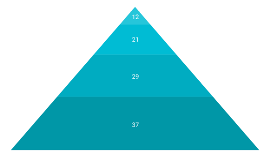
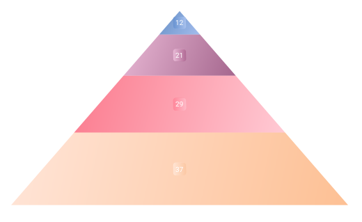

# Appearance in .NET MAUI Pyramid Chart

The appearance of the [SfPyramidChart](https://help.syncfusion.com/cr/maui/Syncfusion.Maui.Charts.SfPyramidChart.html) can be customized by using the predefined palettes, custom palettes, and gradient which allows enriching the application.

## Custom PaletteBrushes

The [SfPyramidChart](https://help.syncfusion.com/cr/maui/Syncfusion.Maui.Charts.SfPyramidChart.html) allows you to define your own brushes with preferred order by using the [PaletteBrushes](https://help.syncfusion.com/cr/maui/Syncfusion.Maui.Charts.SfPyramidChart.html#Syncfusion_Maui_Charts_SfPyramidChart_PaletteBrushes) property, as shown in the code below.





<chart:SfPyramidChart ItemsSource="{Binding Data}" 
                      XBindingPath="Name"
                      YBindingPath="Value"
                      PaletteBrushes="{Binding CustomBrushes}">
. . .
</chart:SfPyramidChart>





public class ViewModel
{
	public ObservableCollection<Model> Data { get; set; }

	public List<Brush> CustomBrushes { get; set; }
	public ViewModel()
	{
	 CustomBrushes = new List<Brush>();
	 CustomBrushes.Add(new SolidColorBrush(Color.FromRgb(38, 198, 218)));
	 CustomBrushes.Add(new SolidColorBrush(Color.FromRgb(0, 188, 212)));
	 CustomBrushes.Add(new SolidColorBrush(Color.FromRgb(0, 172, 193)));
	 CustomBrushes.Add(new SolidColorBrush(Color.FromRgb(0, 151, 167)));
	 CustomBrushes.Add(new SolidColorBrush(Color.FromRgb(0, 131, 143)));
	}
. . .
}





## Applying Gradient

The gradient for the pyramid chart can be set by using the [PaletteBrushes](https://help.syncfusion.com/cr/maui/Syncfusion.Maui.Charts.SfPyramidChart.html#Syncfusion_Maui_Charts_SfPyramidChart_PaletteBrushes) property of the chart with the help of the `LinearGradientBrush` or `RadialGradientBrush`.





<chart:SfPyramidChart ItemsSource="{Binding Data}" 
                      XBindingPath="Name"
                      YBindingPath="Value"
                      PaletteBrushes="{Binding CustomBrushes}">
. . .
</chart:SfPyramidChart>





public class ViewModel
{
	public ObservableCollection<Model> Data { get; set; }

	public List<Brush> CustomBrushes { get; set; }
	public ViewModel()
	{
	 CustomBrushes = new List<Brush>();
	 LinearGradientBrush gradientColor1 = new LinearGradientBrush();
	 gradientColor1.GradientStops = new GradientStopCollection()
	 {
	    new GradientStop() { Offset = 1, Color = Color.FromArgb("#a3bded") },
	    new GradientStop() { Offset = 0, Color = Color.FromArgb("#6991c7") },
	 };

	 LinearGradientBrush gradientColor2 = new LinearGradientBrush();
	 gradientColor2.GradientStops = new GradientStopCollection()
	 {
	    new GradientStop() { Offset = 1, Color = Color.FromArgb("#A5678E") },
	    new GradientStop() { Offset = 0, Color = Color.FromArgb("#E8B7D4") }
	 };

	 LinearGradientBrush gradientColor3 = new LinearGradientBrush();
	 gradientColor3.GradientStops = new GradientStopCollection()
	 {
	    new GradientStop() { Offset = 1, Color = Color.FromArgb("#FFCAD4") },
	    new GradientStop() { Offset = 0, Color = Color.FromArgb("#FB7B8E") }
	 };

	 LinearGradientBrush gradientColor4 = new LinearGradientBrush();
	 gradientColor4.GradientStops = new GradientStopCollection()
	 {
	    new GradientStop() { Offset = 1, Color = Color.FromArgb("#FDC094") },
		new GradientStop() { Offset = 0, Color = Color.FromArgb("#FFE5D8") }
	 };

	 LinearGradientBrush gradientColor5 = new LinearGradientBrush();
	 gradientColor5.GradientStops = new GradientStopCollection()
	 {
		new GradientStop() { Offset = 1, Color = Color.FromArgb("#CFF4D2") },
		new GradientStop() { Offset = 0, Color = Color.FromArgb("#56C596") }
	 };

	 CustomBrushes.Add(gradientColor1);
	 CustomBrushes.Add(gradientColor2);
	 CustomBrushes.Add(gradientColor3);
	 CustomBrushes.Add(gradientColor4);
	 CustomBrushes.Add(gradientColor5);
	}
. . .
}





## Pyramid modes

The [SfPyramidChart](https://help.syncfusion.com/cr/maui/Syncfusion.Maui.Charts.SfPyramidChart.html) allows you to render a chart in linear or surface mode by using the [Mode](https://help.syncfusion.com/cr/maui/Syncfusion.Maui.Charts.SfPyramidChart.html#Syncfusion_Maui_Charts_SfPyramidChart_Mode) property. In [Linear](https://help.syncfusion.com/cr/maui/Syncfusion.Maui.Charts.PyramidMode.html#Syncfusion_Maui_Charts_PyramidMode_Linear) mode, the height of the pyramid segment is based on the y-value. In [Surface](https://help.syncfusion.com/cr/maui/Syncfusion.Maui.Charts.PyramidMode.html#Syncfusion_Maui_Charts_PyramidMode_Surface) mode, the area of the pyramid segment is based on the y-value. By default, the Mode property is set to linear.





<chart:SfPyramidChart ItemsSource="{Binding Data}" 
                      XBindingPath="XValue" 
                      YBindingPath="YValue"
                      Mode="Surface">
</chart:SfPyramidChart>





SfPyramidChart chart = new SfPyramidChart();

ViewModel viewModel = new ViewModel();

chart.ItemsSource = viewModel.Data;
chart.XBindingPath = "XValue";
chart.YBindingPath = "YValue";
chart.Mode =  PyramidMode.Surface;





