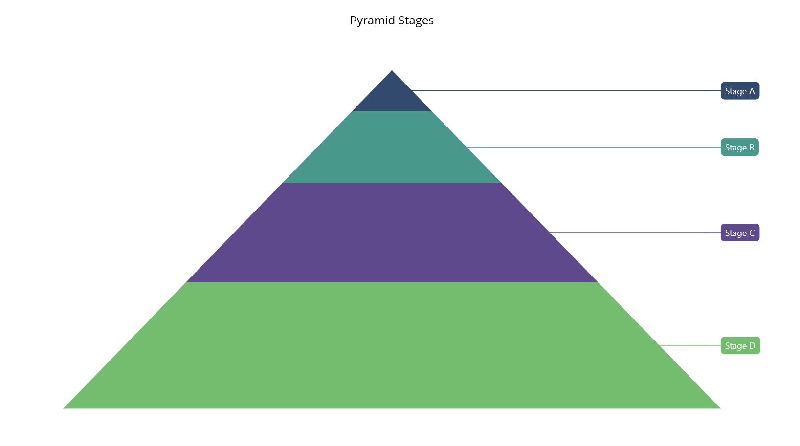

# Data Labels in .NET MAUI Pyramid Chart

Data labels are used to display values related to a chart segment. Values from data points (x, y) or other custom properties from a data source can be displayed.

N> **Prerequisite:** Ensure that the required NuGet package is installed, the necessary namespaces are imported, and the **Pyramid Chart** control is properly configured in your application. For detailed setup and configuration instructions, refer to the **[Getting Started](https://help.syncfusion.com/maui/pyramid-charts/getting-started)** guide.

## Enable data labels

To enable data labels in the chart, set the [ShowDataLabels](https://help.syncfusion.com/cr/maui/Syncfusion.Maui.Charts.SfPyramidChart.html#Syncfusion_Maui_Charts_SfPyramidChart_ShowDataLabels) property to `true`. The default value is `false`. By default, the Y-value of each data point is displayed in the label.





<chart:SfPyramidChart ItemsSource="{Binding Data}"
                      XBindingPath="XValue"
                      YBindingPath="YValue"
                      ShowDataLabels="True">
</chart:SfPyramidChart>





SfPyramidChart chart = new SfPyramidChart()
{
    ItemsSource = new ViewModel().Data,
    XBindingPath = "XValue",
    YBindingPath = "YValue",
    ShowDataLabels = true
};

this.Content = chart;



 

## Customize data labels

Data labels can be customized using the [DataLabelSettings](https://help.syncfusion.com/cr/maui/Syncfusion.Maui.Charts.SfPyramidChart.html#Syncfusion_Maui_Charts_SfPyramidChart_DataLabelSettings) property of the chart. To customize data labels, create an instance of [PyramidDataLabelSettings](https://help.syncfusion.com/cr/maui/Syncfusion.Maui.Charts.PyramidDataLabelSettings.html) and assign it to the [DataLabelSettings](https://help.syncfusion.com/cr/maui/Syncfusion.Maui.Charts.SfPyramidChart.html#Syncfusion_Maui_Charts_SfPyramidChart_DataLabelSettings) property.

### Data label settings

The following properties in [PyramidDataLabelSettings](https://help.syncfusion.com/cr/maui/Syncfusion.Maui.Charts.PyramidDataLabelSettings.html) are used to customize data labels:

* [`LabelPlacement`](https://help.syncfusion.com/cr/maui/Syncfusion.Maui.Charts.ChartDataLabelSettings.html#Syncfusion_Maui_Charts_ChartDataLabelSettings_LabelPlacement) — Positions the pyramid chart data labels at [Auto](https://help.syncfusion.com/cr/maui/Syncfusion.Maui.Charts.DataLabelPlacement.html#Syncfusion_Maui_Charts_DataLabelPlacement_Auto), [Inner](https://help.syncfusion.com/cr/maui/Syncfusion.Maui.Charts.DataLabelPlacement.html#Syncfusion_Maui_Charts_DataLabelPlacement_Inner), [Center](https://help.syncfusion.com/cr/maui/Syncfusion.Maui.Charts.DataLabelPlacement.html#Syncfusion_Maui_Charts_DataLabelPlacement_Center), or [Outer](https://help.syncfusion.com/cr/maui/Syncfusion.Maui.Charts.DataLabelPlacement.html#Syncfusion_Maui_Charts_DataLabelPlacement_Outer). Default value is `Auto`.
* [`UseSeriesPalette`](https://help.syncfusion.com/cr/maui/Syncfusion.Maui.Charts.ChartDataLabelSettings.html#Syncfusion_Maui_Charts_ChartDataLabelSettings_UseSeriesPalette) — Sets the chart segment color as the data label background color.
* [`Context`](https://help.syncfusion.com/cr/maui/Syncfusion.Maui.Charts.PyramidDataLabelSettings.html#Syncfusion_Maui_Charts_PyramidDataLabelSettings_Context) — Gets or sets the content to be displayed in the label using the [PyramidDataLabelContext](https://help.syncfusion.com/cr/maui/Syncfusion.Maui.Charts.PyramidDataLabelContext.html) enum. Supported values are `XValue` and `YValue`.
* [`LabelStyle`](https://help.syncfusion.com/cr/maui/Syncfusion.Maui.Charts.ChartDataLabelSettings.html#Syncfusion_Maui_Charts_ChartDataLabelSettings_LabelStyle) — Customizes the appearance of the data labels. Properties available in the [ChartDataLabelStyle](https://help.syncfusion.com/cr/maui/Syncfusion.Maui.Charts.ChartDataLabelStyle.html) class include:
  * [Margin](https://help.syncfusion.com/cr/maui/Syncfusion.Maui.Charts.ChartLabelStyle.html#Syncfusion_Maui_Charts_ChartLabelStyle_Margin) — Gets or sets the label margin (type: `Thickness`).
  * [Background](https://help.syncfusion.com/cr/maui/Syncfusion.Maui.Charts.ChartLabelStyle.html#Syncfusion_Maui_Charts_ChartLabelStyle_Background) — Gets or sets the label background color (type: `Brush`).
  * [FontAttributes](https://help.syncfusion.com/cr/maui/Syncfusion.Maui.Charts.ChartLabelStyle.html#Syncfusion_Maui_Charts_ChartLabelStyle_FontAttributes) — Gets or sets the font style (type: `FontAttributes`).
  * [FontSize](https://help.syncfusion.com/cr/maui/Syncfusion.Maui.Charts.ChartLabelStyle.html#Syncfusion_Maui_Charts_ChartLabelStyle_FontSize) — Gets or sets the font size (type: `double`).
  * [Stroke](https://help.syncfusion.com/cr/maui/Syncfusion.Maui.Charts.ChartLabelStyle.html#Syncfusion_Maui_Charts_ChartLabelStyle_Stroke) — Gets or sets the border color (type: `Brush`).
  * [StrokeWidth](https://help.syncfusion.com/cr/maui/Syncfusion.Maui.Charts.ChartLabelStyle.html#Syncfusion_Maui_Charts_ChartLabelStyle_StrokeWidth) — Gets or sets the border width (type: `double`).
  * [CornerRadius](https://help.syncfusion.com/cr/maui/Syncfusion.Maui.Charts.ChartLabelStyle.html#Syncfusion_Maui_Charts_ChartLabelStyle_CornerRadius) — Gets or sets the rounded corners for the label (type: `CornerRadius`).
  * [TextColor](https://help.syncfusion.com/cr/maui/Syncfusion.Maui.Charts.ChartLabelStyle.html#Syncfusion_Maui_Charts_ChartLabelStyle_TextColor) — Gets or sets the label text color (type: `Color`).





<chart:SfPyramidChart ItemsSource="{Binding Data}"
                      XBindingPath="XValue"
                      YBindingPath="YValue"
                      ShowDataLabels="True">
    <chart:SfPyramidChart.DataLabelSettings>
        <chart:PyramidDataLabelSettings LabelPlacement="Outer" 
                                        Context="XValue" 
                                        UseSeriesPalette="True">
            <chart:PyramidDataLabelSettings.LabelStyle>
                <chart:ChartDataLabelStyle Margin="2"/>
            </chart:PyramidDataLabelSettings.LabelStyle>
        </chart:PyramidDataLabelSettings>
    </chart:SfPyramidChart.DataLabelSettings>
</chart:SfPyramidChart>





SfPyramidChart chart = new SfPyramidChart()
{
    ItemsSource = new ViewModel().Data,
    XBindingPath = "XValue",
    YBindingPath = "YValue",
    ShowDataLabels = true
};

ChartDataLabelStyle labelStyle = new ChartDataLabelStyle()
{
    Margin = 2
};

chart.DataLabelSettings = new PyramidDataLabelSettings()
{
    Context = PyramidDataLabelContext.XValue,
    LabelPlacement = DataLabelPlacement.Outer,
    UseSeriesPalette = true,
    LabelStyle = labelStyle
};

this.Content = chart;





