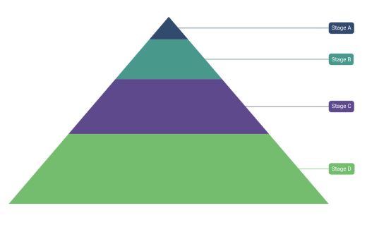

# Data Labels in .NET MAUI Chart

Data labels are used to display values related to a chart segment. Values from data point(x, y) or other custom properties from a data source can be displayed. 

## Enable Data Labels 

To define the data label in the chart, set the [ShowDataLabels](https://help.syncfusion.com/cr/maui/Syncfusion.Maui.Charts.SfPyramidChart.html#Syncfusion_Maui_Charts_SfPyramidChart_ShowDataLabels) property to true. The default value of [ShowDataLabels](https://help.syncfusion.com/cr/maui/Syncfusion.Maui.Charts.SfPyramidChart.html#Syncfusion_Maui_Charts_SfPyramidChart_ShowDataLabels) property is false. 





<chart:SfPyramidChart ShowDataLabels="True"/>
. . .
</chart:SfPyramidChart>





SfPyramidChart chart = new SfPyramidChart();
. . .
chart.ShowDataLabels = true;
this.Content = chart;



 

## Data label customization

 Data labels can be customized by using the [DataLabelSettings](https://help.syncfusion.com/cr/maui/Syncfusion.Maui.Charts.SfPyramidChart.html#Syncfusion_Maui_Charts_SfPyramidChart_DataLabelSettings) property of the chart. For customizing, need to create an instance of [PyramidDataLabelSettings](https://help.syncfusion.com/cr/maui/Syncfusion.Maui.Charts.PyramidDataLabelSettings.html) and set to the [DataLabelSettings](https://help.syncfusion.com/cr/maui/Syncfusion.Maui.Charts.SfPyramidChart.html#Syncfusion_Maui_Charts_SfPyramidChart_DataLabelSettings) property.The following properties, which are available in [PyramidDataLabelSettings](https://help.syncfusion.com/cr/maui/Syncfusion.Maui.Charts.PyramidDataLabelSettings.html), are used to customize the data labels. 

 * [`LabelPlacement`](https://help.syncfusion.com/cr/maui/Syncfusion.Maui.Charts.ChartDataLabelSettings.html#Syncfusion_Maui_Charts_ChartDataLabelSettings_LabelPlacement) - It used to position the pyramid chart data labels at [Auto](https://help.syncfusion.com/cr/maui/Syncfusion.Maui.Charts.DataLabelPlacement.html#Syncfusion_Maui_Charts_DataLabelPlacement_Auto), [Inner](https://help.syncfusion.com/cr/maui/Syncfusion.Maui.Charts.DataLabelPlacement.html#Syncfusion_Maui_Charts_DataLabelPlacement_Inner), [Center](https://help.syncfusion.com/cr/maui/Syncfusion.Maui.Charts.DataLabelPlacement.html#Syncfusion_Maui_Charts_DataLabelPlacement_Center) and [Outer](https://help.syncfusion.com/cr/maui/Syncfusion.Maui.Charts.DataLabelPlacement.html#Syncfusion_Maui_Charts_DataLabelPlacement_Outer).
 * [`UseSeriesPalette`](https://help.syncfusion.com/cr/maui/Syncfusion.Maui.Charts.ChartDataLabelSettings.html#Syncfusion_Maui_Charts_ChartDataLabelSettings_UseSeriesPalette) - It used to set the interior of the chart to the data label background.
 * [`Context`](https://help.syncfusion.com/cr/maui/Syncfusion.Maui.Charts.PyramidDataLabelSettings.html#Syncfusion_Maui_Charts_PyramidDataLabelSettings_Context) of type `PyramidDataLabelContext`, indicates weather to show x or y value in the label content.
 * [`LabelStyle`](https://help.syncfusion.com/cr/maui/Syncfusion.Maui.Charts.ChartDataLabelSettings.html#Syncfusion_Maui_Charts_ChartDataLabelSettings_LabelStyle) - It used to customize the data label's appearance. The following properties, which are available in [LabelStyle](https://help.syncfusion.com/cr/maui/Syncfusion.Maui.Charts.ChartDataLabelSettings.html#Syncfusion_Maui_Charts_ChartDataLabelSettings_LabelStyle).
    * [Margin](https://help.syncfusion.com/cr/maui/Syncfusion.Maui.Charts.ChartLabelStyle.html#Syncfusion_Maui_Charts_ChartLabelStyle_Margin) of type `Thickness`, indicates the label's margin.
    * [Background](https://help.syncfusion.com/cr/maui/Syncfusion.Maui.Charts.ChartLabelStyle.html#Syncfusion_Maui_Charts_ChartLabelStyle_Background), of type `Brush`, indicates the label background color.
    * [FontAttributes](https://help.syncfusion.com/cr/maui/Syncfusion.Maui.Charts.ChartLabelStyle.html#Syncfusion_Maui_Charts_ChartLabelStyle_FontAttributes), of type `FontAttributes`, indicates the font style of the data label.
    * [FontSize](https://help.syncfusion.com/cr/maui/Syncfusion.Maui.Charts.ChartLabelStyle.html#Syncfusion_Maui_Charts_ChartLabelStyle_FontSize), of type `double`, indicates the font size.
    * [Stroke](https://help.syncfusion.com/cr/maui/Syncfusion.Maui.Charts.ChartLabelStyle.html#Syncfusion_Maui_Charts_ChartLabelStyle_Stroke), of type `Brush`, indicates the brush used to paint the border of the data label.
    * [StrokeWidth](https://help.syncfusion.com/cr/maui/Syncfusion.Maui.Charts.ChartLabelStyle.html#Syncfusion_Maui_Charts_ChartLabelStyle_StrokeWidth), of type `double`, indicates the width of the label's border.
    * [CornerRadius](https://help.syncfusion.com/cr/maui/Syncfusion.Maui.Charts.ChartLabelStyle.html#Syncfusion_Maui_Charts_ChartLabelStyle_CornerRadius), of type `CornerRadius`, indicates the rounded corner for label.
    * [TextColor](https://help.syncfusion.com/cr/maui/Syncfusion.Maui.Charts.ChartLabelStyle.html#Syncfusion_Maui_Charts_ChartLabelStyle_TextColor), of type `Color`, indicates the color of the displayed text.





<chart:SfPyramidChart ShowDataLabels="True">
    . . .
    <chart:SfPyramidChart.DataLabelSettings>
        <chart:PyramidDataLabelSettings LabelPlacement="Outer" 
                                        Context="XValue" 
                                        UseSeriesPalette="True">
            <chart:PyramidDataLabelSettings.LabelStyle>
                <chart:ChartDataLabelStyle Margin="2"/>
            </chart:PyramidDataLabelSettings.LabelStyle>
        </chart:PyramidDataLabelSettings>
    </chart:SfPyramidChart.DataLabelSettings>
</chart:SfPyramidChart>





SfPyramidChart chart = new SfPyramidChart();
. . .
chart.ShowDataLabels = true;
ChartDataLabelStyle labelStyle = new ChartDataLabelStyle()
{
    Margin = 2,
};
chart.DataLabelSettings = new PyramidDataLabelSettings()
{
    Context=PyramidDataLabelContext.XValue,
    LabelPlacement=DataLabelPlacement.Outer,
    UseSeriesPalette=true,
    LabelStyle = labelStyle,
};

this.Content = chart;



 

