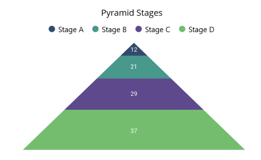

# Getting Started with .NET MAUI Chart(SfPyramidChart)

This section explains how to populate the pyramid chart with data, a title, data labels, a legend, and tooltips, as well as the essential aspects for getting started with the pyramid chart.

To get start quickly with our .NET MAUI Pyramid Chart, you can check the below video.



## Prerequisites

Before starting, ensure the following are set up:

1. .NET 7 SDK (https://dotnet.microsoft.com/en-us/download/dotnet/7.0) or later is installed.
2. A .NET MAUI development environment is ready with either Visual Studio 2022 (v17.3 or later) or VS Code. If using VS Code, make sure the .NET MAUI workload is installed and configured as per the instructions provided [here](https://learn.microsoft.com/en-us/dotnet/maui/get-started/installation?view=net-maui-8.0&tabs=visual-studio-code).

## Step 1: Create a New MAUI Project

### Visual Studio

1. Go to File > New > Project and choose the .NET MAUI App template.
2. Name the project and choose a location, then click Next.
3. Select the .NET framework version and click Create.

### Visual Studio Code

1. Open the command palette by pressing `Ctrl+Shift+P`` and type .NET:New Project and enter.
2. Choose the .NET MAUI App template.
3. Select the project location, type the project name and press enter.
4. Then choose Create project

## Step 2: Install the Syncfusion MAUI Charts NuGet Package

1. In Solution Explorer, right-click the project and choose Manage NuGet Packages.
2. Search for Syncfusion.Maui.Charts on [nuget.org](https://www.nuget.org/) and install the latest version.
3. Ensure all dependencies are correctly installed, and restore your project.

## Step 3: Add a Basic Pyramid Chart

1. To initialize the control, import the Chart namespace into your code.
2. Initialize [SfPyramidChart](https://help.syncfusion.com/cr/maui/Syncfusion.Maui.Charts.SfPyramidChart.html).

 



<ContentPage   
    . . .
    xmlns:chart="clr-namespace:Syncfusion.Maui.Charts;assembly=Syncfusion.Maui.Charts">

    <chart:SfPyramidChart/>
</ContentPage>
 


 

You can also create the chart programmatically in the MainPage.xaml.cs file:

 



using Syncfusion.Maui.Charts;
. . .

public partial class MainWindow : ContentPage
{
    public MainPage()
    {
        this.InitializeComponent();
        SfPyramidChart chart = new SfPyramidChart();
    }
}   




## Step 4: Register the handler

[Syncfusion.Maui.Core nuget](https://www.nuget.org/packages/Syncfusion.Maui.Core) is a dependent package for all Syncfusion controls of .NET MAUI. In the **MauiProgram.cs file**, register the handler for Syncfusion core.



using Microsoft.Maui;
using Microsoft.Maui.Hosting;
using Microsoft.Maui.Controls.Compatibility;
using Microsoft.Maui.Controls.Hosting;
using Microsoft.Maui.Controls.Xaml;
using Syncfusion.Maui.Core.Hosting;

namespace ChartGettingStarted
{
    public static class MauiProgram
    {
        public static MauiApp CreateMauiApp()
        {
            var builder = MauiApp.CreateBuilder();
            builder
            .UseMauiApp<App>()
            .ConfigureSyncfusionCore()
            .ConfigureFonts(fonts =>
            {
                fonts.AddFont("OpenSans-Regular.ttf", "OpenSansRegular");
            });

            return builder.Build();
        }
    }
}

 

## Step 5: Define the View Model

### Data Model

Now, let us define a simple data model that represents a data point in the chart.

  



public class Stage
{
    public string Name { get; set; }
    public double Value { get; set; }
}

 

 

### View Model

Next, create a view model class and initialize a list of `Model` objects as follows.

  



public class ChartViewModel
{
    public List<Stage> Data { get; set; }

    public ChartViewModel()
    {
        Data = new List<Stage>()
        {
            new Stage(){Name = "Stage A", Value = 12},
            new Stage(){Name = "Stage B", Value = 21},
            new Stage(){Name = "Stage C", Value = 29},
            new Stage(){Name = "Stage D", Value = 37},
        };
    }
}

 

 

### Binding the ViewModel

Create a `ViewModel` instance and set it as the chart's `BindingContext`. This enables property binding from `ViewModel` class.

N> Add the namespace of `ViewModel` class to your XAML Page, if you prefer to set `BindingContext` in XAML.

 

 

<ContentPage
    . . .
    xmlns:chart="clr-namespace:Syncfusion.Maui.Charts;assembly=Syncfusion.Maui.Charts"
    xmlns:model="clr-namespace:ChartGettingStarted">

    <chart:SfPyramidChart>
        <chart:SfPyramidChart.BindingContext>
            <model:ChartViewModel/>
        </chart:SfPyramidChart.BindingContext>
    </chart:SfPyramidChart>
</ContentPage>



 

ChartViewModel viewModel = new ChartViewModel();
chart.BindingContext = viewModel;



 

## Step 6: Add Data Binding to the Chart

 Binding `Data` to the pyramid chart [ItemsSource](https://help.syncfusion.com/cr/maui/Syncfusion.Maui.Charts.SfPyramidChart.html#Syncfusion_Maui_Charts_SfPyramidChart_ItemsSource) property from its BindingContext to create our own pyramid chart.

   



<chart:SfPyramidChart ItemsSource="{Binding Data}" 
                      XBindingPath="Name" 
                      YBindingPath="Value"/>
. . .            
</chart:SfPyramidChart>





SfPyramidChart chart = new SfPyramidChart();
ChartViewModel viewModel = new ChartViewModel();
chart.BindingContext = viewModel;
chart.ItemsSource = viewModel.Data;
chart.XBindingPath = "Name";
chart.YBindingPath = "Value";
this.Content = chart;



 

## Step 7: Customize the Chart

### Add a title

The title of the chart acts as the title to provide quick information to the user about the data being plotted in the chart. You can set the title using the [Title](https://help.syncfusion.com/cr/maui/Syncfusion.Maui.Charts.ChartBase.html#Syncfusion_Maui_Charts_ChartBase_Title) property of the pyramid chart as follows.

 



<chart:SfPyramidChart>
    <chart:SfPyramidChart.Title>
        <Label Text="Pyramid Stages"/>
    </chart:SfPyramidChart.Title>
    . . .
</chart:SfPyramidChart>





SfPyramidChart chart = new SfPyramidChart();
chart.Title = new Label
{
    Text = "Pyramid Stages"
};



  

### Enable the data labels

The [ShowDataLabels](https://help.syncfusion.com/cr/maui/Syncfusion.Maui.Charts.SfPyramidChart.html#Syncfusion_Maui_Charts_SfPyramidChart_ShowDataLabels) property of the chart can be used to enable data labels to improve the readability of the pyramid chart. The label visibility is set to `False` by default.

 



<chart:SfPyramidChart ShowDataLabels="True">
    . . .
</chart:SfPyramidChart>





SfPyramidChart chart = new SfPyramidChart();
. . .
chart.ShowDataLabels = true;



 

### Enable a legend

The legend provides information about the data point displayed in the pyramid chart. The [Legend](https://help.syncfusion.com/cr/maui/Syncfusion.Maui.Charts.ChartBase.html#Syncfusion_Maui_Charts_ChartBase_Legend) property of the chart was used to enable it.

 



<chart:SfPyramidChart>
    . . .
    <chart:SfPyramidChart.Legend>
    <chart:ChartLegend/>
    </chart:SfPyramidChart.Legend>
</chart:SfPyramidChart>





SfPyramidChart chart = new SfPyramidChart();
. . .
chart.Legend = new ChartLegend();



 

### Enable Tooltip

Tooltips are used to show information about the segment, when mouse over on it. Enable tooltip by setting the chart [EnableTooltip](https://help.syncfusion.com/cr/maui/Syncfusion.Maui.Charts.SfPyramidChart.html#Syncfusion_Maui_Charts_SfPyramidChart_EnableTooltip) property as true.

 



<chart:SfPyramidChart EnableTooltip="True">
    . . .
</chart:SfPyramidChart>





SfPyramidChart chart = new SfPyramidChart();
. . .
chart.EnableTooltip = true;





The following code example gives you the complete code of above configurations.

 



<chart:SfPyramidChart ItemsSource="{Binding Data}" 
                      ShowDataLabels="True" 
                      EnableTooltip="True"
                      XBindingPath="Name"         
                      YBindingPath="Value">
    <chart:SfPyramidChart.Title>
        <Label Text="Pyramid Stages"/>
    </chart:SfPyramidChart.Title>
    <chart:SfPyramidChart.BindingContext>
        <model:ChartViewModel/>
    </chart:SfPyramidChart.BindingContext>
    <chart:SfPyramidChart.Legend>
        <chart:ChartLegend/>
    </chart:SfPyramidChart.Legend>
</chart:SfPyramidChart>
 




using Syncfusion.Maui.Charts;
. . .
public partial class MainPage : ContentPage
{   
    public MainWindow()
    {
        SfPyramidChart chart = new SfPyramidChart();
        chart.Title = new Label
        {
            Text = "Pyramid Stages"
        };
        chart.Legend = new ChartLegend();
        ChartViewModel viewModel = new ChartViewModel();
        chart.BindingContext = viewModel;

        chart.ItemsSource = viewModel.Data;
        chart.XBindingPath = "Name";
        chart.YBindingPath = "Value";
        chart.EnableTooltip = true;
        chart.ShowDataLabels = true;
        this.Content = chart;
    }
}





## Step 8: Running the Application
Press **F5** to build and run the application. Once compiled, the chart will be displayed with the data provided.

The following chart is created as a result of the previous codes.

You can find the complete getting started sample from this [link](https://github.com/SyncfusionExamples/GettingStarted_PyramidChart_MAUI).