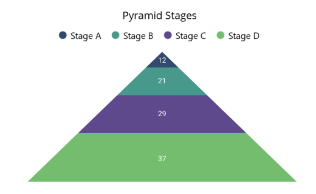

# Getting Started with .NET MAUI Chart(SfPyramidChart)

This section explains how to populate the pyramid chart with data, a title, data labels, a legend, and tooltips, as well as the essential aspects for getting started with the pyramid chart.

To get start quickly with our [.NET MAUI Pyramid Chart](https://help.syncfusion.com/cr/maui/Syncfusion.Maui.Charts.SfPyramidChart.html), you can check the below video.






## Prerequisites
Before proceeding, ensure the following are set up:

1. Install [.NET 9 SDK](https://dotnet.microsoft.com/en-us/download/dotnet/9.0) or later.
2. Set up a .NET MAUI environment with Visual Studio 2022 v17.12 or later.

## Step 1: Create a new .NET MAUI project

1. Go to **File > New > Project** and choose the **.NET MAUI App** template.
2. Name the project and choose a location. Click **Next**.
3. Select the .NET framework version and click **Create**.

## Step 2: Install the Syncfusion® MAUI Charts package

1. In **Solution Explorer**, right-click the project and choose **Manage NuGet Packages**.
2. Search for [Syncfusion.Maui.Charts](https://www.nuget.org/packages/Syncfusion.Maui.Charts/) and install the latest version.
3. Ensure the necessary dependencies are installed correctly, and the project is restored.




## Prerequisites

Before proceeding, ensure the following are set up:

1. Install [.NET 9 SDK](https://dotnet.microsoft.com/en-us/download/dotnet/9.0) or later.
2. Set up a .NET MAUI environment with Visual Studio Code.
3. Ensure that the .NET MAUI workloads are installed and configured as described [here](https://learn.microsoft.com/en-us/dotnet/maui/get-started/installation?view=net-maui-9.0&tabs=visual-studio-code).

## Step 1: Create a new .NET MAUI project

1. Open the command palette by pressing `Ctrl+Shift+P` and type **.NET:New Project** and enter.
2. Choose the **.NET MAUI App** template.
3. Select the project location, type the project name and press **Enter.**
4. Then choose **Create project.**

## Step 2: Install the Syncfusion® MAUI Charts Package

1. Press <kbd>Ctrl</kbd> + <kbd>`</kbd> (backtick) to open the integrated terminal in Visual Studio Code.
2. Ensure you're in the project root directory where your .csproj file is located.
3. Run the command `dotnet add package Syncfusion.Maui.Charts` to install the Syncfusion® .NET MAUI Charts NuGet package.
4. To ensure all dependencies are installed, run `dotnet restore`.



## Prerequisites

Before proceeding, ensure the following are set up:

1. Install [.NET 9 SDK](https://dotnet.microsoft.com/en-us/download/dotnet/9.0) or later.
2. Set up a .NET MAUI environment with JetBrains Rider 2024.3 or later.
3. Make sure the MAUI workloads are installed and configured as described [here.](https://www.jetbrains.com/help/rider/MAUI.html#before-you-start)

## Step 1: Create a new .NET MAUI Project

1. Go to **File > New Solution,** Select .NET (C#) and choose the .NET MAUI App template.
2. Enter the Project Name, Solution Name, and Location.
3. Select the .NET framework version and click Create.

## Step 2: Install the Syncfusion® MAUI Charts NuGet package

1. In **Solution Explorer,** right-click the project and choose **Manage NuGet Packages.**
2. Search for [Syncfusion.Maui.Charts](https://www.nuget.org/packages/Syncfusion.Maui.Charts/) and install the latest version.
3. Ensure the necessary dependencies are installed correctly, and the project is restored. If not, Open the Terminal in Rider and manually run: `dotnet restore`




## Step 3: Register Syncfusion handler

Make sure to add the namespace.



using Syncfusion.Maui.Core.Hosting;



Register the Syncfusion core handler in your `CreateMauiApp` method of `MauiProgram.cs` file to use Syncfusion controls.



builder.ConfigureSyncfusionCore();
 


## Step 4: Create Model and ViewModel

Now, let us define a simple data Model and ViewModel that represents a data point in the chart.

  


public class StageModel
{
    public string Name { get; set; }
    public double Value { get; set; }
}

public class StageViewModel
{
    public List<StageModel> Data { get; set; }
    public StageViewModel()
    {
        Data = new List<StageModel>()
        {
            new StageModel(){Name = "Stage A", Value = 12},
            new StageModel(){Name = "Stage B", Value = 21},
            new StageModel(){Name = "Stage C", Value = 29},
            new StageModel(){Name = "Stage D", Value = 37},
        };
    }
}
 
 

## Step 5: Import Pyramid Chart namespace

Add the following namespace in your XAML or C#.




xmlns:chart="clr-namespace:Syncfusion.Maui.Charts;assembly=Syncfusion.Maui.Charts"




using Syncfusion.Maui.Charts;




## Step 6: Add the Pyramid Chart component

Configure the `Pyramid Chart` component to visually represent data in a hierarchical, proportional format. It is commonly used to display stages in a process or categorical data with decreasing values. Binding `Data` to the pyramid chart [ItemsSource](https://help.syncfusion.com/cr/maui/Syncfusion.Maui.Charts.SfPyramidChart.html#Syncfusion_Maui_Charts_SfPyramidChart_ItemsSource) property from its BindingContext to create our own pyramid chart.

 



<chart:SfPyramidChart ItemsSource="{Binding Data}" 
                    ShowDataLabels="True" 
                    EnableTooltip="True"
                    XBindingPath="Name"         
                    YBindingPath="Value">
    <chart:SfPyramidChart.Title>
        <Label Text="Pyramid Stages"/>
    </chart:SfPyramidChart.Title>
    <chart:SfPyramidChart.BindingContext>
        <model:StageViewModel/>
    </chart:SfPyramidChart.BindingContext>
    <chart:SfPyramidChart.Legend>
        <chart:ChartLegend/>
    </chart:SfPyramidChart.Legend>
</chart:SfPyramidChart>





SfPyramidChart chart = new SfPyramidChart();
chart.Title = new Label()
{
    Text = "Pyramid Stages"
};
chart.Legend = new ChartLegend();
StageViewModel viewModel = new StageViewModel();
chart.BindingContext = viewModel;
chart.ItemsSource = viewModel.Data;
chart.XBindingPath = "Name";
chart.YBindingPath = "Value";
chart.EnableTooltip = true;
chart.ShowDataLabels = true;
this.Content = chart;





You can download the Pyramid Charts Getting Started sample from [GitHub](https://github.com/SyncfusionExamples/GettingStarted_PyramidChart_MAUI).