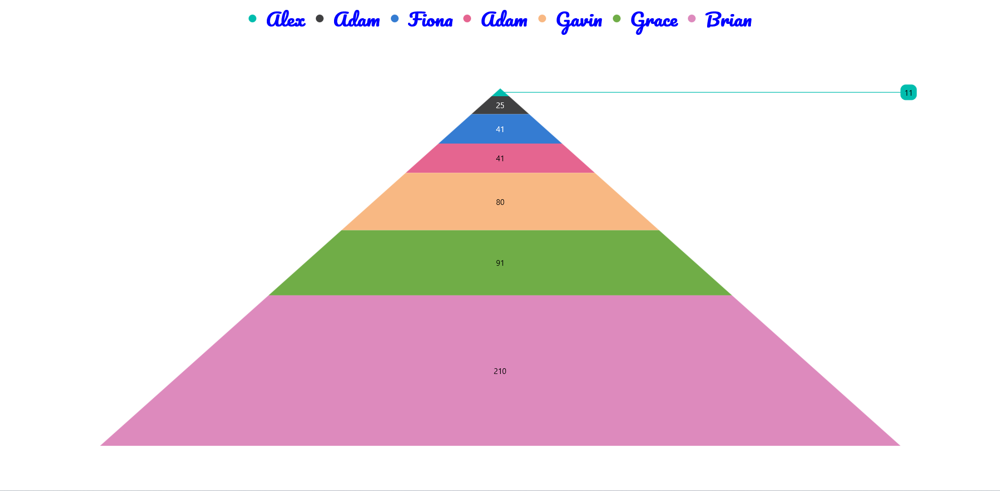
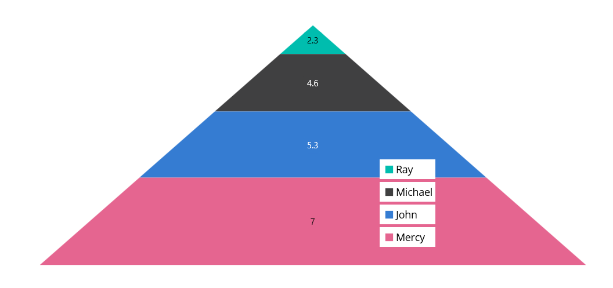
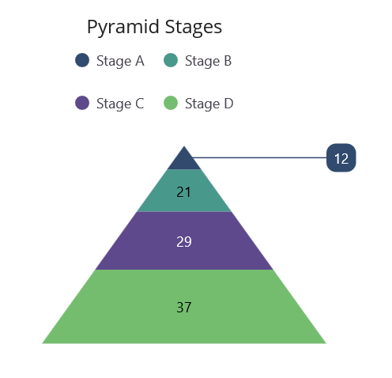

# Legend in .NET MAUI Pyramid Chart

The [Legend](https://help.syncfusion.com/cr/maui/Syncfusion.Maui.Charts.ChartBase.html#Syncfusion_Maui_Charts_ChartBase_Legend) provides a list of data points, helping to identify the corresponding pyramid segments in the chart. Here is a detailed guide on how to define and customize the legend in the pyramid chart.

N> **Prerequisite:** Ensure that the required NuGet package is installed, the necessary namespaces are imported, and the **Pyramid Chart** control is properly configured in your application. For detailed setup and configuration instructions, refer to the **[Getting Started](https://help.syncfusion.com/maui/pyramid-charts/getting-started)** guide.

## Defining the legend

To define the legend in the chart, initialize the [ChartLegend](https://help.syncfusion.com/cr/maui/Syncfusion.Maui.Charts.ChartLegend.html) class and assign it to the [Legend](https://help.syncfusion.com/cr/maui/Syncfusion.Maui.Charts.ChartBase.html#Syncfusion_Maui_Charts_ChartBase_Legend) property.





<chart:SfPyramidChart ItemsSource="{Binding Data}" 
                      XBindingPath="XValue"
                      YBindingPath="YValue">
    <chart:SfPyramidChart.Legend>
        <chart:ChartLegend/>
    </chart:SfPyramidChart.Legend>
</chart:SfPyramidChart>





SfPyramidChart chart = new SfPyramidChart()
{
    ItemsSource = new ViewModel().Data,
    XBindingPath = "XValue",
    YBindingPath = "YValue",
};

chart.Legend = new ChartLegend();
this.Content = chart;





## Legend visibility

The visibility of the chart legend can be controlled using the [IsVisible](https://help.syncfusion.com/cr/maui/Syncfusion.Maui.Charts.ChartLegend.html#Syncfusion_Maui_Charts_ChartLegend_IsVisible) property. By default, the IsVisible property is set to `true`.




    
<chart:SfPyramidChart ItemsSource="{Binding Data}" 
                      XBindingPath="XValue"
                      YBindingPath="YValue">
    <chart:SfPyramidChart.Legend>
        <chart:ChartLegend IsVisible="True"/>
    </chart:SfPyramidChart.Legend>
</chart:SfPyramidChart>





SfPyramidChart chart = new SfPyramidChart()
{
    ItemsSource = new ViewModel().Data,
    XBindingPath = "XValue",
    YBindingPath = "YValue",
};

chart.Legend = new ChartLegend()
{ 
    IsVisible = true 
};

this.Content = chart;





## Customizing labels

The appearance of the legend label can be customized using the [LabelStyle](https://help.syncfusion.com/cr/maui/Syncfusion.Maui.Charts.ChartLegend.html#Syncfusion_Maui_Charts_ChartLegend_LabelStyle) property. 

* [`TextColor`](https://help.syncfusion.com/cr/maui/Syncfusion.Maui.Charts.ChartLegendLabelStyle.html#Syncfusion_Maui_Charts_ChartLegendLabelStyle_TextColor) — Gets or sets the color of the label.
* [`FontFamily`](https://help.syncfusion.com/cr/maui/Syncfusion.Maui.Charts.ChartLegendLabelStyle.html#Syncfusion_Maui_Charts_ChartLegendLabelStyle_FontFamily) — Gets or sets the font family for the legend label. 
* [`FontAttributes`](https://help.syncfusion.com/cr/maui/Syncfusion.Maui.Charts.ChartLegendLabelStyle.html#Syncfusion_Maui_Charts_ChartLegendLabelStyle_FontAttributes) — Gets or sets the font style for the legend label. 
* [`FontSize`](https://help.syncfusion.com/cr/maui/Syncfusion.Maui.Charts.ChartLegendLabelStyle.html#Syncfusion_Maui_Charts_ChartLegendLabelStyle_FontSize) — Gets or sets the font size for the legend label.
* [`Margin`](https://help.syncfusion.com/cr/maui/Syncfusion.Maui.Charts.ChartLegendLabelStyle.html#Syncfusion_Maui_Charts_ChartLegendLabelStyle_Margin) — Gets or sets the margin size of labels.

 



<chart:SfPyramidChart ItemsSource="{Binding Data}" 
                      XBindingPath="XValue"
                      YBindingPath="YValue">
    <chart:SfPyramidChart.Legend>
        <chart:ChartLegend>
            <chart:ChartLegend.LabelStyle>
                <chart:ChartLegendLabelStyle TextColor="Blue" Margin="5" FontSize="18" FontAttributes="Bold" FontFamily="PlaywriteAR-Regular"/>
            </chart:ChartLegend.LabelStyle>
        </chart:ChartLegend>
    </chart:SfPyramidChart.Legend>
</chart:SfPyramidChart>





SfPyramidChart chart = new SfPyramidChart()
{
    XBindingPath = "XValue",
    YBindingPath = "YValue",
    ItemsSource = new ViewModel().Data,
};

chart.Legend = new ChartLegend();
ChartLegendLabelStyle labelStyle = new ChartLegendLabelStyle()
{
    TextColor = Colors.Blue,
    FontSize = 18,
    FontAttributes = FontAttributes.Bold,
    Margin = 5,
    FontFamily = "PlaywriteAR-Regular"
};
chart.Legend.LabelStyle = labelStyle;
this.Content = chart;





## Legend icon

To specify the legend icon for the chart segments, use the [LegendIcon](https://help.syncfusion.com/cr/maui/Syncfusion.Maui.Charts.SfPyramidChart.html#Syncfusion_Maui_Charts_SfPyramidChart_LegendIcon) property and change its type using the [ChartLegendIconType](https://help.syncfusion.com/cr/maui/Syncfusion.Maui.Charts.ChartLegendIconType.html) enum values. The default value of the LegendIcon property is `Circle`.





<chart:SfPyramidChart ItemsSource="{Binding Data}"
                      XBindingPath="XValue" 
                      YBindingPath="YValue"
                      LegendIcon="Diamond">
    <chart:SfPyramidChart.Legend>
        <chart:ChartLegend/>
    </chart:SfPyramidChart.Legend>
</chart:SfPyramidChart> 





SfPyramidChart chart = new SfPyramidChart()
{
    ItemsSource = new ViewModel().Data,
    XBindingPath = "XValue",
    YBindingPath = "YValue",
    LegendIcon = ChartLegendIconType.Diamond
};
chart.Legend = new ChartLegend();

this.Content = chart;





## Placement

The legend can be positioned to the left, right, top, or bottom of the chart area using the [Placement](https://help.syncfusion.com/cr/maui/Syncfusion.Maui.Charts.ChartLegend.html#Syncfusion_Maui_Charts_ChartLegend_Placement) property in the ChartLegend class. The default placement is `Top`.





<chart:SfPyramidChart ItemsSource="{Binding Data}" 
                      XBindingPath="XValue"
                      YBindingPath="YValue">
    <chart:SfPyramidChart.Legend>
        <chart:ChartLegend Placement="Bottom">
        </chart:ChartLegend>
    </chart:SfPyramidChart.Legend>
</chart:SfPyramidChart>





SfPyramidChart chart = new SfPyramidChart()
{
    XBindingPath = "XValue",
    YBindingPath = "YValue",
    ItemsSource = new ViewModel().Data
};
   
chart.Legend = new ChartLegend()
{
    Placement = LegendPlacement.Bottom 
};

this.Content = chart;





## Floating legend

The floating legend feature allows you to position the legend inside the chart area based on its defined placement. When [IsFloating](https://help.syncfusion.com/cr/maui/Syncfusion.Maui.Charts.ChartLegend.html#Syncfusion_Maui_Charts_ChartLegend_IsFloating) is set to true, the legend will start from the specified [Placement](https://help.syncfusion.com/cr/maui/Syncfusion.Maui.Charts.ChartLegend.html#Syncfusion_Maui_Charts_ChartLegend_Placement) (such as Top, Bottom, Left, or Right) and then move according to the offset values, enabling precise control over the legend’s location.

* [OffsetX](https://help.syncfusion.com/cr/maui/Syncfusion.Maui.Charts.ChartLegend.html#Syncfusion_Maui_Charts_ChartLegend_OffsetX): Specifies the horizontal distance from the defined placement position.
* [OffsetY](https://help.syncfusion.com/cr/maui/Syncfusion.Maui.Charts.ChartLegend.html#Syncfusion_Maui_Charts_ChartLegend_OffsetY): Specifies the vertical distance from the defined placement position.





<chart:SfPyramidChart ItemsSource="{Binding Data}" 
                      XBindingPath="XValue"
                      YBindingPath="YValue">
    <chart:SfPyramidChart.Legend>
        <chart:ChartLegend Placement="Right"
                           IsFloating="True" 
                           OffsetX="-300" 
                           OffsetY="80">
        </chart:ChartLegend>
    </chart:SfPyramidChart.Legend>
</chart:SfPyramidChart>





SfPyramidChart chart = new SfPyramidChart()
{
    XBindingPath = "XValue",
    YBindingPath = "YValue",
    ItemsSource = new ViewModel().Data
};
   
chart.Legend = new ChartLegend()
{
    Placement = LegendPlacement.Right,
    IsFloating = true,
    OffsetX = -300,
    OffsetY = 80
};

this.Content = chart;





## Toggle segment visibility

The visibility of segments in the pyramid chart can be controlled by tapping the legend item using the [ToggleSeriesVisibility](https://help.syncfusion.com/cr/maui/Syncfusion.Maui.Charts.ChartLegend.html#Syncfusion_Maui_Charts_ChartLegend_ToggleSeriesVisibility) property. The default value of ToggleSeriesVisibility is `false`.





<chart:SfPyramidChart ItemsSource="{Binding Data}" 
                      XBindingPath="XValue"         
                      YBindingPath="YValue">
    <chart:SfPyramidChart.Legend>
        <chart:ChartLegend ToggleSeriesVisibility="True"/>
    </chart:SfPyramidChart.Legend>
</chart:SfPyramidChart>





SfPyramidChart pyramidChart = new SfPyramidChart()
{
    ItemsSource = new ViewModel().Data,
    XBindingPath = "XValue",
    YBindingPath = "YValue"
};

pyramidChart.Legend = new ChartLegend()
{
    ToggleSeriesVisibility = true
};
this.Content = pyramidChart;





## Legend maximum size request
To set the maximum size request for the legend view, override the [GetMaximumSizeCoefficient](https://help.syncfusion.com/cr/maui/Syncfusion.Maui.Charts.ChartLegend.html#Syncfusion_Maui_Charts_ChartLegend_GetMaximumSizeCoefficient) protected method in [ChartLegend](https://help.syncfusion.com/cr/maui/Syncfusion.Maui.Charts.ChartLegend.html) class. The value should be between 0 and 1, representing the maximum size request, not the desired size for the legend items layout.





<chart:SfPyramidChart>
    <chart:SfPyramidChart.Legend>
        <local:LegendExt/>
    </chart:SfPyramidChart.Legend>
</chart:SfPyramidChart>





public class LegendExt : ChartLegend
{
    protected override double GetMaximumSizeCoefficient()
    {
        return 0.7;
    }
}

SfPyramidChart chart = new SfPyramidChart();
chart.Legend = new LegendExt();
this.Content = chart;





## Items layout
The [ItemsLayout](https://help.syncfusion.com/cr/maui/Syncfusion.Maui.Charts.ChartLegend.html#Syncfusion_Maui_Charts_ChartLegend_ItemsLayout) property is used to customize the arrangement and position of each legend item. The default value is `null`. This property accepts any layout type.





<chart:SfPyramidChart ItemsSource="{Binding Data}" 
                      XBindingPath="XValue"  
                      YBindingPath="YValue">
    <chart:SfPyramidChart.Legend>
        <chart:ChartLegend>
            <chart:ChartLegend.ItemsLayout>
                <FlexLayout Wrap="Wrap" WidthRequest="400">
                </FlexLayout>
            </chart:ChartLegend.ItemsLayout>
        </chart:ChartLegend>
    </chart:SfPyramidChart.Legend>
</chart:SfPyramidChart>





SfPyramidChart chart = new SfPyramidChart()
{
    XBindingPath = "XValue",
    YBindingPath = "YValue",
    ItemsSource = new ViewModel().Data
};

ChartLegend legend = new ChartLegend();

legend.ItemsLayout = new FlexLayout()
{
    Wrap = FlexWrap.Wrap,
    WidthRequest = 400
};

chart.Legend = legend;
this.Content = chart;
        




## Item template

The [ChartLegend](https://help.syncfusion.com/cr/maui/Syncfusion.Maui.Charts.ChartLegend.html) supports customizing the appearance of legend items using the [ItemTemplate](https://help.syncfusion.com/cr/maui/Syncfusion.Maui.Charts.ChartLegend.html#Syncfusion_Maui_Charts_ChartLegend_ItemTemplate) property. The default value of ItemTemplate is `null`.

N> The BindingContext of the template is the corresponding underlying legend item provided in the ChartLegendItem class.





<chart:SfPyramidChart ItemsSource="{Binding Data}" 
                      XBindingPath="XValue"  
                      YBindingPath="YValue" x:Name="chart">

    <chart:SfPyramidChart.Resources>
        <DataTemplate x:Key="legendTemplate">
            <HorizontalStackLayout Spacing="3">
                <Rectangle HeightRequest="12" WidthRequest="12"
                           Background="{Binding IconBrush}"/>
                <Label Text="{Binding Text}" VerticalOptions="Center"/>
            </HorizontalStackLayout>
        </DataTemplate>
    </chart:SfPyramidChart.Resources>  
    
    <chart:SfPyramidChart.Legend>
        <chart:ChartLegend ItemTemplate="{StaticResource legendTemplate}"/>
    </chart:SfPyramidChart.Legend>

</chart:SfPyramidChart>





SfPyramidChart chart = new SfPyramidChart()
{
    XBindingPath = "XValue",
    YBindingPath = "YValue",
    ItemsSource = new ViewModel().Data
};
     
ChartLegend legend = new ChartLegend();
legend.ItemTemplate = chart.Resources["legendTemplate"] as DataTemplate;

chart.Legend = legend;
this.Content = chart;





## Events

### LegendItemCreated event

The [LegendItemCreated](https://help.syncfusion.com/cr/maui/Syncfusion.Maui.Charts.ChartLegend.html#Syncfusion_Maui_Charts_ChartLegend_LegendItemCreated) event is triggered when the chart legend item is created. The argument contains the [LegendItem](https://help.syncfusion.com/cr/maui/Syncfusion.Maui.Core.LegendItemEventArgs.html#Syncfusion_Maui_Core_LegendItemEventArgs_LegendItem) object. The following properties are present in [LegendItem](https://help.syncfusion.com/cr/maui/Syncfusion.Maui.Core.LegendItemEventArgs.html#Syncfusion_Maui_Core_LegendItemEventArgs_LegendItem):

* [`Text`](https://help.syncfusion.com/cr/maui/Syncfusion.Maui.Core.ILegendItem.html#Syncfusion_Maui_Core_ILegendItem_Text) — Gets or sets the text of the label.
* [`TextColor`](https://help.syncfusion.com/cr/maui/Syncfusion.Maui.Core.ILegendItem.html#Syncfusion_Maui_Core_ILegendItem_TextColor) — Gets or sets the color of the label.
* [`FontFamily`](https://help.syncfusion.com/cr/maui/Syncfusion.Maui.Core.ILegendItem.html#Syncfusion_Maui_Core_ILegendItem_FontFamily) — Gets or sets the font family for the legend label.
* [`FontAttributes`](https://help.syncfusion.com/cr/maui/Syncfusion.Maui.Core.ILegendItem.html#Syncfusion_Maui_Core_ILegendItem_FontAttributes) — Gets or sets the font style for the legend label.
* [`FontSize`](https://help.syncfusion.com/cr/maui/Syncfusion.Maui.Core.ILegendItem.html#Syncfusion_Maui_Core_ILegendItem_FontSize) — Gets or sets the font size for the legend label.
* [`TextMargin`](https://help.syncfusion.com/cr/maui/Syncfusion.Maui.Core.ILegendItem.html#Syncfusion_Maui_Core_ILegendItem_TextMargin) — Gets or sets the margin size of labels.
* [`IconBrush`](https://help.syncfusion.com/cr/maui/Syncfusion.Maui.Core.ILegendItem.html#Syncfusion_Maui_Core_ILegendItem_IconBrush) — Gets or sets the color of the legend icon.
* [`IconType`](https://help.syncfusion.com/cr/maui/Syncfusion.Maui.Core.ILegendItem.html#Syncfusion_Maui_Core_ILegendItem_IconType) — Gets or sets the icon type for the legend icon.
* [`IconHeight`](https://help.syncfusion.com/cr/maui/Syncfusion.Maui.Core.ILegendItem.html#Syncfusion_Maui_Core_ILegendItem_IconHeight) — Gets or sets the icon height of the legend icon.
* [`IconWidth`](https://help.syncfusion.com/cr/maui/Syncfusion.Maui.Core.ILegendItem.html#Syncfusion_Maui_Core_ILegendItem_IconWidth) — Gets or sets the icon width of the legend icon.
* [`IsToggled`](https://help.syncfusion.com/cr/maui/Syncfusion.Maui.Core.ILegendItem.html#Syncfusion_Maui_Core_ILegendItem_IsToggled) — Gets or sets the toggle visibility of the legend.
* [`DisableBrush`](https://help.syncfusion.com/cr/maui/Syncfusion.Maui.Core.ILegendItem.html#Syncfusion_Maui_Core_ILegendItem_DisableBrush) — Gets or sets the color of the legend when toggled.
* [`Index`](https://help.syncfusion.com/cr/maui/Syncfusion.Maui.Core.ILegendItem.html#Syncfusion_Maui_Core_ILegendItem_Index) — Gets the index position of the legend.
* [`Item`](https://help.syncfusion.com/cr/maui/Syncfusion.Maui.Core.ILegendItem.html#Syncfusion_Maui_Core_ILegendItem_Item) — Gets the corresponding series for the legend item.

The following code example demonstrates how to handle the LegendItemCreated event:





<chart:SfPyramidChart ItemsSource="{Binding Data}" 
                      XBindingPath="XValue"
                      YBindingPath="YValue">
    <chart:SfPyramidChart.Legend>
        <chart:ChartLegend LegendItemCreated="OnLegendItemCreated"/>
    </chart:SfPyramidChart.Legend>
</chart:SfPyramidChart>





SfPyramidChart chart = new SfPyramidChart();
chart.Legend = new ChartLegend();
chart.Legend.LegendItemCreated += OnLegendItemCreated;

private void OnLegendItemCreated(object sender, LegendItemEventArgs e)
{
    // Handle legend item creation
    if (e.LegendItem != null)
    {
        // Customize the legend item appearance
        e.LegendItem.TextColor = Colors.Blue;
        e.LegendItem.FontSize = 14;
    }
}





## Limitations
* Do not add items explicitly.
* When using BindableLayouts, do not bind ItemsSource explicitly.
* For better UX, arrange items vertically for left and right dock positions, and vice versa for top and bottom dock positions.
* If the layout's measured size is larger than the MaximumHeightRequest, scrolling will be enabled.
* If MaximumHeightRequest is set to 1 and the chart's available size is smaller than the layout's measured size, the series may not have enough space to draw properly.
