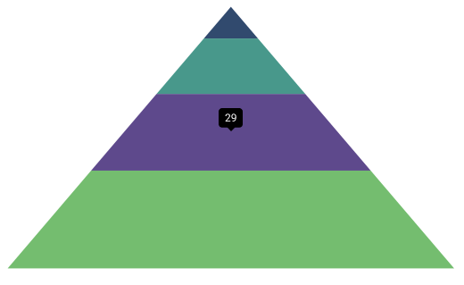
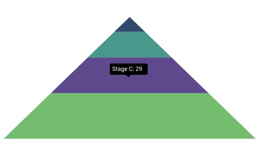

# Tooltip in .NET MAUI Chart

The tooltip helps in providing additional information while hovering over the funnel segment. By default, the value of the pyramid process (Y value) will be shown in the tooltip.

## Enable Tooltip

To define the tooltip in the chart, set the [EnableTooltip](https://help.syncfusion.com/cr/maui/Syncfusion.Maui.Charts.SfPyramidChart.html#Syncfusion_Maui_Charts_SfPyramidChart_EnableTooltip) property of [SfPyramidChart](https://help.syncfusion.com/cr/maui/Syncfusion.Maui.Charts.SfPyramidChart.html) to true.





<chart:SfPyramidChart EnableTooltip="True">
. . .
</chart:SfPyramidChart>





SfPyramidChart chart = new SfPyramidChart();
. . .      
chart.EnableTooltip = true;
this.Content = chart;





The [ChartTooltipBehavior](https://help.syncfusion.com/cr/maui/Syncfusion.Maui.Charts.ChartTooltipBehavior.html) is used to customize the tooltip. For customizing the tooltip, create an instance [ChartTooltipBehavior](https://help.syncfusion.com/cr/maui/Syncfusion.Maui.Charts.ChartTooltipBehavior.html) and set it to the [TooltipBehavior](https://help.syncfusion.com/cr/maui/Syncfusion.Maui.Charts.ChartBase.html#Syncfusion_Maui_Charts_ChartBase_TooltipBehavior) property of [SfPyramidChart](https://help.syncfusion.com/cr/maui/Syncfusion.Maui.Charts.SfPyramidChart.html). The following properties are used to customize the tooltip:

* [Background](https://help.syncfusion.com/cr/maui/Syncfusion.Maui.Charts.ChartTooltipBehavior.html#Syncfusion_Maui_Charts_ChartTooltipBehavior_Background) of type `Brush`, indicates background color to the tooltip label.
* [FontAttributes](https://help.syncfusion.com/cr/maui/Syncfusion.Maui.Charts.ChartTooltipBehavior.html#Syncfusion_Maui_Charts_ChartTooltipBehavior_FontAttributes) of type `FontAttributes`, indicates the font style of the label.
* [FontFamily](https://help.syncfusion.com/cr/maui/Syncfusion.Maui.Charts.ChartTooltipBehavior.html#Syncfusion_Maui_Charts_ChartTooltipBehavior_FontFamily) of type `string`, indicates the font family for the label.
* [FontSize](https://help.syncfusion.com/cr/maui/Syncfusion.Maui.Charts.ChartTooltipBehavior.html#Syncfusion_Maui_Charts_ChartTooltipBehavior_FontSize) of type `float`, indicates the font size.
* [Duration](https://help.syncfusion.com/cr/maui/Syncfusion.Maui.Charts.ChartTooltipBehavior.html#Syncfusion_Maui_Charts_ChartTooltipBehavior_Duration) of type `int`, indicates the duration for displaying the tooltip.
* [Margin](https://help.syncfusion.com/cr/maui/Syncfusion.Maui.Charts.ChartTooltipBehavior.html#Syncfusion_Maui_Charts_ChartTooltipBehavior_Margin) of type `Thickness`, indicates the label's margin.
* [TextColor](https://help.syncfusion.com/cr/maui/Syncfusion.Maui.Charts.ChartTooltipBehavior.html#Syncfusion_Maui_Charts_ChartTooltipBehavior_TextColor) of type `Color`, indicates the color of the displayed text.





<chart:SfPyramidChart EnableTooltip="True">
    . . .
    <chart:SfPyramidChart.TooltipBehavior>
        <chart:ChartTooltipBehavior Duration="4"/>
    </chart:SfPyramidChart.TooltipBehavior>
</chart:SfPyramidChart>





SfPyramidChart chart = new SfPyramidChart();
. . .
chart.EnableTooltip = true;
chart.TooltipBehavior = new ChartTooltipBehavior()
{
    Duration = 4,
};
this.Content = chart;





## Tooltip Template

[TooltipTemplate](https://help.syncfusion.com/cr/maui/Syncfusion.Maui.Charts.SfPyramidChart.html#Syncfusion_Maui_Charts_SfPyramidChart_TooltipTemplate) is used to show additional information other than the default UI.





<Grid x:Name="grid">
    <Grid.Resources>
        <DataTemplate x:Key="tooltipTemplate">
            <StackLayout Orientation="Horizontal">
                <Label Text="{Binding Item.Name}"
                       TextColor="White"
                       FontAttributes="Bold"
                       HorizontalOptions="Center"
                       VerticalOptions="Center"/>
                <Label Text="{Binding Item.Value,StringFormat=': {0}'}"
                       TextColor="White"
                       FontAttributes="Bold"
                       HorizontalOptions="Center"
                       VerticalOptions="Center"/>
            </StackLayout>
        </DataTemplate>
    </Grid.Resources>

    <chart:SfPyramidChart EnableTooltip="True"
                          TooltipTemplate="{StaticResource tooltipTemplate}">
	. . .
    </chart:SfPyramidChart>
</Grid>





SfPyramidChart chart = new SfPyramidChart();
. . .
chart.EnableTooltip = true;
chart.TooltipTemplate= grid.Resources["tooltipTemplate"] as DataTemplate;
. . .     
this.Content = chart;





