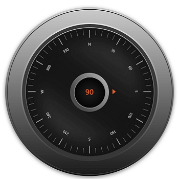

# Axis in .NET MAUI Radial Gauge

The [`Radial Axis`](https://help.syncfusion.com/cr/maui/Syncfusion.Maui.Gauges.RadialAxis.html?tabs=tabid-1) is a circular arc in which a set of values are displayed along a linear or custom scale based on the design requirements. Axis elements such as labels, ticks and axis line can be easily customized. 

## Axis customization

This section will cover the axis customization options.

### Background content

[`Radial axis`](https://help.syncfusion.com/cr/maui/Syncfusion.Maui.Gauges.RadialAxis.html?tabs=tabid-1) allows you to add any visual contents as its background using the [`BackgroundContent`](https://help.syncfusion.com/cr/maui/Syncfusion.Maui.Gauges.RadialAxis.html#Syncfusion_Maui_Gauges_RadialAxis_BackgroundContent) property.





 <gauge:SfRadialGauge x:Name="gauge">
            <gauge:SfRadialGauge.Axes>
                <gauge:RadialAxis x:Name="axis"
                                          ShowAxisLine="False"
                                          RadiusFactor="1"
                                          CanRotateLabels="True"
                                          TickOffset="0.32"
                                          OffsetUnit="Factor"
                                          LabelCreated="RadialAxis_LabelCreated"
                                          StartAngle="270"
                                          EndAngle="270"
                                          LabelOffset="0.05"
                                          Maximum="360"
                                          Minimum="0"
                                          Interval="30"
                                          MinorTicksPerInterval="4">
                    <gauge:RadialAxis.AxisLabelStyle>
                        <gauge:GaugeLabelStyle TextColor="White" FontSize="11"/>
                    </gauge:RadialAxis.AxisLabelStyle>
                    <gauge:RadialAxis.MajorTickStyle>
                        <gauge:RadialTickStyle Length="0.087" LengthUnit="Factor" 
                                               Stroke="#FF949494" StrokeThickness="2.3"/>
                    </gauge:RadialAxis.MajorTickStyle>
                    <gauge:RadialAxis.MinorTickStyle>
                        <gauge:RadialTickStyle Length="0.058" LengthUnit="Factor"
                                               Stroke="#FF616161" StrokeThickness="1.6"/>
                    </gauge:RadialAxis.MinorTickStyle>

                    <gauge:RadialAxis.BackgroundContent>
                        <Image  Source="axisbackground.png"/>
                    </gauge:RadialAxis.BackgroundContent>

                    <gauge:RadialAxis.Pointers>
                        <gauge:ShapePointer Value="90"
                                                     Fill="#FFDF5F2D"
                                                     EnableAnimation="True"
                                                     AnimationDuration="1200"
                                                      AnimationEasing="{x:Static Easing.SpringOut}"
                                                     Offset="0.71"
                                                     OffsetUnit="Factor"
                                                     ShapeType="Triangle"
                                                     ShapeHeight="10"
                                                     ShapeWidth="15">
                        </gauge:ShapePointer>
                    </gauge:RadialAxis.Pointers>

                    <gauge:RadialAxis.Annotations>
                        <gauge:GaugeAnnotation DirectionValue="270">
                            <gauge:GaugeAnnotation.Content>
                                <Label Text="90" TextColor="#FFDF5F2D"
                                                   FontAttributes="Bold"
                                                   FontSize="22" />
                            </gauge:GaugeAnnotation.Content>
                        </gauge:GaugeAnnotation>
                    </gauge:RadialAxis.Annotations>
                </gauge:RadialAxis>
            </gauge:SfRadialGauge.Axes>
        </gauge:SfRadialGauge>





SfRadialGauge sfRadialGauge = new SfRadialGauge();

            RadialAxis radialAxis = new RadialAxis();
            radialAxis.ShowAxisLine = false;
            radialAxis.RadiusFactor = 1;
            radialAxis.CanRotateLabels = true;
            radialAxis.TickOffset = 0.32;
            radialAxis.OffsetUnit = SizeUnit.Factor;
            radialAxis.LabelCreated += RadialAxis_LabelCreated;
            radialAxis.StartAngle = 270;
            radialAxis.EndAngle = 270;
            radialAxis.LabelOffset = 0.05;
            radialAxis.Maximum = 360;
            radialAxis.Minimum = 0;
            radialAxis.Interval = 30;
            radialAxis.MinorTicksPerInterval = 4;
            radialAxis.AxisLabelStyle = new GaugeLabelStyle()
            {
                TextColor = Colors.White,
                FontSize = 11
            };
            radialAxis.MajorTickStyle = new RadialTickStyle()
            {
                Length = 0.087,
                LengthUnit = SizeUnit.Factor,
                Stroke = new SolidColorBrush(Color.FromHex("FF949494")),
                StrokeThickness = 2.3
            };
            radialAxis.MinorTickStyle = new RadialTickStyle()
            {
                Length = 0.058,
                LengthUnit = SizeUnit.Factor,
                Stroke = new SolidColorBrush(Color.FromHex("FF616161")),
                StrokeThickness = 2.3
            };
            Image image = new Image { Source = "axisbackground.png" };
            radialAxis.BackgroundContent = image;
            sfRadialGauge.Axes.Add(radialAxis);

            ShapePointer markerPointer = new ShapePointer();
            markerPointer.Value = 90;
            markerPointer.Fill = new SolidColorBrush(Color.FromRgb(223, 95, 45));
            markerPointer.EnableAnimation = true;
            markerPointer.AnimationDuration = 1200;
            markerPointer.Offset = 0.71;
            markerPointer.OffsetUnit = SizeUnit.Factor;
            markerPointer.ShapeType = MarkerType.Triangle;
            markerPointer.ShapeHeight = 10;
            markerPointer.ShapeWidth = 15;
            radialAxis.Pointers.Add(markerPointer);

            GaugeAnnotation gaugeAnnotation = new GaugeAnnotation();
            gaugeAnnotation.DirectionValue = 270;
            Label label = new Label();
            label.Text = "90";
            label.TextColor = Color.FromRgb(223, 95, 45);
            label.FontAttributes = FontAttributes.Bold;
            label.FontSize = 22;
            gaugeAnnotation.Content = label;
            radialAxis.Annotations.Add(gaugeAnnotation);

            this.Content = sfRadialGauge;

// Label prepared event.
 private void RadialAxis_LabelCreated(object sender, LabelCreatedEventArgs e)
        {
            if (e.Text == "90")
            {
                e.Text = "E";
            }
            else if (e.Text == "360")
            {
                e.Text = string.Empty;
            }
            else
            {
                if (e.Text == "0")
                {
                    e.Text = "N";
                }
                else if (e.Text == "180")
                {
                    e.Text = "S";
                }
                else if (e.Text == "270")
                {
                    e.Text = "W";
                }
            }
        }





### Setting axis minimum and maximum

The [`Minimum`](https://help.syncfusion.com/cr/maui/Syncfusion.Maui.Gauges.RadialAxis.html#Syncfusion_Maui_Gauges_RadialAxis_Minimum) and [`Maximum`](https://help.syncfusion.com/cr/maui/Syncfusion.Maui.Gauges.RadialAxis.html#Syncfusion_Maui_Gauges_RadialAxis_Maximum) properties of an axis can be used to customize the axis scale range. The default value of [`Minimum`](https://help.syncfusion.com/cr/maui/Syncfusion.Maui.Gauges.RadialAxis.html#Syncfusion_Maui_Gauges_RadialAxis_Minimum) is 0 and [`Maximum`](https://help.syncfusion.com/cr/maui/Syncfusion.Maui.Gauges.RadialAxis.html#Syncfusion_Maui_Gauges_RadialAxis_Maximum) is 100.





<gauge:SfRadialGauge>
    <gauge:SfRadialGauge.Axes>
        <gauge:RadialAxis Minimum="-60"
                          Maximum="60" />
    </gauge:SfRadialGauge.Axes>
</gauge:SfRadialGauge>





SfRadialGauge sfRadialGauge = new SfRadialGauge();

RadialAxis radialAxis = new RadialAxis();
radialAxis.Minimum = -60;
radialAxis.Maximum = 60;
sfRadialGauge.Axes.Add(radialAxis);

this.Content = sfRadialGauge;





### Interval

The interval between labels can be customized using the [`Interval`](https://help.syncfusion.com/cr/maui/Syncfusion.Maui.Gauges.RadialAxis.html#Syncfusion_Maui_Gauges_RadialAxis_Interval) property. By default, auto-interval will be calculated based on available scale range and size. If you need to change the default interval, use this property. 





<gauge:SfRadialGauge>
    <gauge:SfRadialGauge.Axes>
        <gauge:RadialAxis Interval="20" />
    </gauge:SfRadialGauge.Axes>
</gauge:SfRadialGauge>





SfRadialGauge sfRadialGauge = new SfRadialGauge();

RadialAxis radialAxis = new RadialAxis();
radialAxis.Interval = 20;
sfRadialGauge.Axes.Add(radialAxis);

this.Content = sfRadialGauge;





### Angle customization

The start and end angles of radial axis can be customized using the [`StartAngle`](https://help.syncfusion.com/cr/maui/Syncfusion.Maui.Gauges.RadialAxis.html#Syncfusion_Maui_Gauges_RadialAxis_StartAngle) and [`EndAngle`](https://help.syncfusion.com/cr/maui/Syncfusion.Maui.Gauges.RadialAxis.html#Syncfusion_Maui_Gauges_RadialAxis_EndAngle) properties.





<gauge:SfRadialGauge>
    <gauge:SfRadialGauge.Axes>
        <gauge:RadialAxis StartAngle="180"
                          EndAngle="90" />
    </gauge:SfRadialGauge.Axes>
</gauge:SfRadialGauge>





SfRadialGauge sfRadialGauge = new SfRadialGauge();

RadialAxis radialAxis = new RadialAxis();
radialAxis.StartAngle = 180;
radialAxis.EndAngle = 90;
sfRadialGauge.Axes.Add(radialAxis);

this.Content = sfRadialGauge;





### Radius customization

The radius of the radial axis can be customized using the [`RadiusFactor`](https://help.syncfusion.com/cr/maui/Syncfusion.Maui.Gauges.RadialAxis.html#Syncfusion_Maui_Gauges_RadialAxis_RadiusFactor) property. The default value of the [`RadiusFactor`](https://help.syncfusion.com/cr/maui/Syncfusion.Maui.Gauges.RadialAxis.html#Syncfusion_Maui_Gauges_RadialAxis_RadiusFactor) is 0.8. The value of [`RadiusFactor`](https://help.syncfusion.com/cr/maui/Syncfusion.Maui.Gauges.RadialAxis.html#Syncfusion_Maui_Gauges_RadialAxis_RadiusFactor) ranges from 0 to 1. For example, When the [`RadiusFactor`](https://help.syncfusion.com/cr/maui/Syncfusion.Maui.Gauges.RadialAxis.html#Syncfusion_Maui_Gauges_RadialAxis_RadiusFactor) value is 1, the full radius will be considered for rendering the axis and when the [`RadiusFactor`](https://help.syncfusion.com/cr/maui/Syncfusion.Maui.Gauges.RadialAxis.html#Syncfusion_Maui_Gauges_RadialAxis_RadiusFactor) value is 0.5, then half of the radius value will be considered for rendering the axis circle.





<gauge:SfRadialGauge>
    <gauge:SfRadialGauge.Axes>
        <gauge:RadialAxis />
        <gauge:RadialAxis RadiusFactor="0.5" />
    </gauge:SfRadialGauge.Axes>
</gauge:SfRadialGauge>





SfRadialGauge sfRadialGauge = new SfRadialGauge();

RadialAxis radialAxis1 = new RadialAxis();
sfRadialGauge.Axes.Add(radialAxis1);

RadialAxis radialAxis2 = new RadialAxis();
radialAxis2.RadiusFactor = 0.5;
sfRadialGauge.Axes.Add(radialAxis2);

this.Content = sfRadialGauge;





### Positioning axis based on its angle

The [`CanScaleToFit`](https://help.syncfusion.com/cr/maui/Syncfusion.Maui.Gauges.RadialAxis.html#Syncfusion_Maui_Gauges_RadialAxis_CanScaleToFit) property of radial axis is used to fit the axis position on available size based on the provided [`StartAngle`](https://help.syncfusion.com/cr/maui/Syncfusion.Maui.Gauges.RadialAxis.html#Syncfusion_Maui_Gauges_RadialAxis_StartAngle) and [`EndAngle`](https://help.syncfusion.com/cr/maui/Syncfusion.Maui.Gauges.RadialAxis.html#Syncfusion_Maui_Gauges_RadialAxis_EndAngle). By default, the [`CanScaleToFit`](https://help.syncfusion.com/cr/maui/Syncfusion.Maui.Gauges.RadialAxis.html#Syncfusion_Maui_Gauges_RadialAxis_CanScaleToFit) is true.





 <gauge:SfRadialGauge BackgroundColor="#FFF8B195">
            <gauge:SfRadialGauge.Axes>
                <gauge:RadialAxis CanScaleToFit="False" StartAngle="180"
                          EndAngle="0"
                          Interval="10" >
                    <gauge:RadialAxis.AxisLineStyle>
                        <gauge:AxisLineStyle Fill="#FF355C7D"/>
                    </gauge:RadialAxis.AxisLineStyle>
                </gauge:RadialAxis>
            </gauge:SfRadialGauge.Axes>
        </gauge:SfRadialGauge>





VerticalStackLayout layout = new VerticalStackLayout();
            layout.Padding = new Thickness(5);
            SfRadialGauge sfRadialGauge = new SfRadialGauge();
            sfRadialGauge.BackgroundColor = Color.FromRgb(248, 177, 149);
            RadialAxis radialAxis = new RadialAxis();
            radialAxis.StartAngle = 180;
            radialAxis.CanScaleToFit = false;
            radialAxis.EndAngle = 0;
            radialAxis.Interval = 10;
            radialAxis.AxisLineStyle.Fill = new SolidColorBrush(Color.FromRgb(53, 92, 125));
            sfRadialGauge.Axes.Add(radialAxis);

            layout.Children.Add(sfRadialGauge);
            this.Content = layout;





### Axis label rotation

The axis label can be rotated based on its current angle using the [`CanRotateLabels`](https://help.syncfusion.com/cr/maui/Syncfusion.Maui.Gauges.RadialAxis.html#Syncfusion_Maui_Gauges_RadialAxis_CanRotateLabels) property. The default value of [`CanRotateLabels`](https://help.syncfusion.com/cr/maui/Syncfusion.Maui.Gauges.RadialAxis.html#Syncfusion_Maui_Gauges_RadialAxis_CanRotateLabels) is false.





<gauge:SfRadialGauge>
    <gauge:SfRadialGauge.Axes>
        <gauge:RadialAxis CanRotateLabels="True" />
    </gauge:SfRadialGauge.Axes>
</gauge:SfRadialGauge>





SfRadialGauge sfRadialGauge = new SfRadialGauge();

RadialAxis radialAxis = new RadialAxis();
radialAxis.CanRotateLabels = true;
sfRadialGauge.Axes.Add(radialAxis);

this.Content = sfRadialGauge;





### Edge label customization

The visibility of the first and last labels of an axis can be customized using the [`ShowFirstLabel`](https://help.syncfusion.com/cr/maui/Syncfusion.Maui.Gauges.RadialAxis.html#Syncfusion_Maui_Gauges_RadialAxis_ShowFirstLabel) and [`ShowLastLabel`](https://help.syncfusion.com/cr/maui/Syncfusion.Maui.Gauges.RadialAxis.html#Syncfusion_Maui_Gauges_RadialAxis_ShowLastLabel) properties. 

* [`ShowFirstLabel`](https://help.syncfusion.com/cr/maui/Syncfusion.Maui.Gauges.RadialAxis.html#Syncfusion_Maui_Gauges_RadialAxis_ShowFirstLabel) – Enables or disables the first label of the axis.
* [`ShowLastLabel`](https://help.syncfusion.com/cr/maui/Syncfusion.Maui.Gauges.RadialAxis.html#Syncfusion_Maui_Gauges_RadialAxis_ShowLastLabel) – Enables or disables the last label of the axis.

The default value of both the [`ShowFirstLabel`](https://help.syncfusion.com/cr/maui/Syncfusion.Maui.Gauges.RadialAxis.html#Syncfusion_Maui_Gauges_RadialAxis_ShowFirstLabel) and [`ShowLastLabel`](https://help.syncfusion.com/cr/maui/Syncfusion.Maui.Gauges.RadialAxis.html#Syncfusion_Maui_Gauges_RadialAxis_ShowLastLabel) properties is true.





<gauge:SfRadialGauge>
    <gauge:SfRadialGauge.Axes>
        <gauge:RadialAxis Minimum="0"
                          Maximum="12"
                          Interval="1"
                          StartAngle="270"
                          EndAngle="270"
                          ShowFirstLabel="False" />
    </gauge:SfRadialGauge.Axes>
</gauge:SfRadialGauge>





SfRadialGauge sfRadialGauge = new SfRadialGauge();

RadialAxis radialAxis = new RadialAxis();
radialAxis.Minimum = 0;
radialAxis.Maximum = 12;
radialAxis.Interval = 1;
radialAxis.StartAngle = 270;
radialAxis.EndAngle = 270;
radialAxis.ShowFirstLabel = false;
sfRadialGauge.Axes.Add(radialAxis);

this.Content = sfRadialGauge;





### Axis direction customization

The direction of radial axis can be customized by its [`IsInversed`](https://help.syncfusion.com/cr/maui/Syncfusion.Maui.Gauges.RadialAxis.html#Syncfusion_Maui_Gauges_RadialAxis_IsInversed) property. 

When the [`IsInversed`](https://help.syncfusion.com/cr/maui/Syncfusion.Maui.Gauges.RadialAxis.html#Syncfusion_Maui_Gauges_RadialAxis_IsInversed) property is true, the axis can be placed in counter-clockwise direction. When the [`IsInversed`](https://help.syncfusion.com/cr/maui/Syncfusion.Maui.Gauges.RadialAxis.html#Syncfusion_Maui_Gauges_RadialAxis_IsInversed) property is set to false, the axis will be positioned in clockwise direction.





<gauge:SfRadialGauge>
    <gauge:SfRadialGauge.Axes>
        <gauge:RadialAxis IsInversed="True" />
    </gauge:SfRadialGauge.Axes>
</gauge:SfRadialGauge>





SfRadialGauge sfRadialGauge = new SfRadialGauge();

RadialAxis radialAxis = new RadialAxis();
radialAxis.IsInversed = true;
sfRadialGauge.Axes.Add(radialAxis);

this.Content = sfRadialGauge;





### Maximum number of labels per 100 logical pixels

By default, a maximum of three labels are displayed for each 100 logical pixels in an axis. The maximum number of labels that should present within 100 logical pixels length can be customized using the [`MaximumLabelsCount`](https://help.syncfusion.com/cr/maui/Syncfusion.Maui.Gauges.RadialAxis.html#Syncfusion_Maui_Gauges_RadialAxis_MaximumLabelsCount) property of the axis. This property is applicable only for automatic range calculation and will not work, if you set value for interval property of an axis.





<gauge:SfRadialGauge>
    <gauge:SfRadialGauge.Axes>
        <gauge:RadialAxis MaximumLabelsCount="5" />
    </gauge:SfRadialGauge.Axes>
</gauge:SfRadialGauge>





SfRadialGauge sfRadialGauge = new SfRadialGauge();

RadialAxis radialAxis = new RadialAxis();
radialAxis.MaximumLabelsCount = 5;
sfRadialGauge.Axes.Add(radialAxis);

this.Content = sfRadialGauge;





## Axis line customization

The radial axis line can be customized using the [`AxisLineStyle`](https://help.syncfusion.com/cr/maui/Syncfusion.Maui.Gauges.RadialAxis.html#Syncfusion_Maui_Gauges_RadialAxis_AxisLineStyle) with the following properties.

* [`Thickness`](https://help.syncfusion.com/cr/maui/Syncfusion.Maui.Gauges.RadialLineStyle.html#Syncfusion_Maui_Gauges_RadialLineStyle_Thickness) – Customizes the thickness of axis line.
* [`ThicknessUnit`](https://help.syncfusion.com/cr/maui/Syncfusion.Maui.Gauges.RadialLineStyle.html#Syncfusion_Maui_Gauges_RadialLineStyle_ThicknessUnit) – Allows to specify the thickness of the axis line either in pixel or factor. Its default value is [`Pixel`](https://help.syncfusion.com/cr/maui/Syncfusion.Maui.Gauges.SizeUnit.html#Syncfusion_Maui_Gauges_SizeUnit_Pixel).
* [`Fill`](https://help.syncfusion.com/cr/maui/Syncfusion.Maui.Gauges.RadialLineStyle.html#Syncfusion_Maui_Gauges_RadialLineStyle_Fill) – Customizes the color of the axis line.
* [`GradientStops`](https://help.syncfusion.com/cr/maui/Syncfusion.Maui.Gauges.RadialLineStyle.html#Syncfusion_Maui_Gauges_RadialLineStyle_GradientStops) - Allows to apply the gradient brush for axis line.

### Axis line width in pixel

If the [`ThicknessUnit`](https://help.syncfusion.com/cr/maui/Syncfusion.Maui.Gauges.RadialLineStyle.html#Syncfusion_Maui_Gauges_RadialLineStyle_ThicknessUnit) is set as a pixel, the axis line will be rendered based on the pixel values given in [`Thickness`](https://help.syncfusion.com/cr/maui/Syncfusion.Maui.Gauges.RadialLineStyle.html#Syncfusion_Maui_Gauges_RadialLineStyle_Thickness).





 <gauge:SfRadialGauge>
            <gauge:SfRadialGauge.Axes>
                <gauge:RadialAxis>
                    <gauge:RadialAxis.AxisLineStyle>
                        <gauge:RadialLineStyle ThicknessUnit="Pixel" Thickness="30"/>
                    </gauge:RadialAxis.AxisLineStyle>
                </gauge:RadialAxis>
            </gauge:SfRadialGauge.Axes>
        </gauge:SfRadialGauge>





SfRadialGauge sfRadialGauge = new SfRadialGauge();

            RadialAxis radialAxis = new RadialAxis();
            radialAxis.AxisLineStyle.Thickness = 30;
            radialAxis.AxisLineStyle.ThicknessUnit = SizeUnit.Pixel;
            sfRadialGauge.Axes.Add(radialAxis);

            this.Content = sfRadialGauge;





### Axis line width in factor

If the [`ThicknessUnit`](https://help.syncfusion.com/cr/maui/Syncfusion.Maui.Gauges.RadialLineStyle.html#Syncfusion_Maui_Gauges_RadialLineStyle_ThicknessUnit) is set to factor, the given factor value in the [`Thickness`](https://help.syncfusion.com/cr/maui/Syncfusion.Maui.Gauges.RadialLineStyle.html#Syncfusion_Maui_Gauges_RadialLineStyle_Thickness) is multiplied by the axis radius. The value of the factor ranges from 0 to 1.





<gauge:SfRadialGauge>
            <gauge:SfRadialGauge.Axes>
                <gauge:RadialAxis>
                    <gauge:RadialAxis.AxisLineStyle>
                        <gauge:RadialLineStyle ThicknessUnit="Factor" Thickness="0.1"/>
                    </gauge:RadialAxis.AxisLineStyle>
                </gauge:RadialAxis>
            </gauge:SfRadialGauge.Axes>
        </gauge:SfRadialGauge>





 SfRadialGauge sfRadialGauge = new SfRadialGauge();

            RadialAxis radialAxis = new RadialAxis();
            radialAxis.AxisLineStyle.Thickness = 0.1;
            radialAxis.AxisLineStyle.ThicknessUnit = SizeUnit.Factor;
            sfRadialGauge.Axes.Add(radialAxis);

            this.Content = sfRadialGauge;





### Setting axis line fill brush

To fill the brush to axis line using the [`Fill`](https://help.syncfusion.com/cr/maui/Syncfusion.Maui.Gauges.RadialLineStyle.html#Syncfusion_Maui_Gauges_RadialLineStyle_Fill) property of the radial axis. 





<gauge:SfRadialGauge>
            <gauge:SfRadialGauge.Axes>
                <gauge:RadialAxis>
                    <gauge:RadialAxis.AxisLineStyle>
                        <gauge:RadialLineStyle ThicknessUnit="Factor" 
                                               Thickness="0.1"
                                               Fill="BlueViolet"/>
                    </gauge:RadialAxis.AxisLineStyle>
                </gauge:RadialAxis>
            </gauge:SfRadialGauge.Axes>
        </gauge:SfRadialGauge>





SfRadialGauge sfRadialGauge = new SfRadialGauge();

RadialAxis radialAxis = new RadialAxis();
radialAxis.AxisLineStyle.Thickness = 0.1;
radialAxis.AxisLineStyle.ThicknessUnit = SizeUnit.Factor;
radialAxis.AxisLineStyle.Fill = new SolidColorBrush(Colors.BlueViolet);
sfRadialGauge.Axes.Add(radialAxis);

this.Content = sfRadialGauge;





### Setting gradient brush to axis line

The [`GradientStops`](https://help.syncfusion.com/cr/maui/Syncfusion.Maui.Gauges.RadialLineStyle.html#Syncfusion_Maui_Gauges_RadialLineStyle_GradientStops) property of radial axis allows you to specify the gradient brush to the axis line by specifying the different colors based on provided axis value.





<gauge:SfRadialGauge>
            <gauge:SfRadialGauge.Axes>
                <gauge:RadialAxis>
                    <gauge:RadialAxis.AxisLineStyle>
                        <gauge:RadialLineStyle ThicknessUnit="Factor" 
                                               Thickness="0.1">
                            <gauge:RadialLineStyle.GradientStops>
                                <gauge:GaugeGradientStop Value="25"
                                         Color="#FFFF7676" />
                                <gauge:GaugeGradientStop Value="75"
                                         Color="#FFF54EA2" />
                            </gauge:RadialLineStyle.GradientStops>
                        </gauge:RadialLineStyle>
                    </gauge:RadialAxis.AxisLineStyle>
                </gauge:RadialAxis>
            </gauge:SfRadialGauge.Axes>
        </gauge:SfRadialGauge>





SfRadialGauge sfRadialGauge = new SfRadialGauge();

            RadialAxis radialAxis = new RadialAxis();
            radialAxis.AxisLineStyle.Thickness = 0.1;
            radialAxis.AxisLineStyle.ThicknessUnit = SizeUnit.Factor;
            GaugeGradientStop gaugeGradientStop1 = new GaugeGradientStop();
            gaugeGradientStop1.Value = 25;
            gaugeGradientStop1.Color = Color.FromRgb(255, 118, 118);
            radialAxis.AxisLineStyle.GradientStops.Add(gaugeGradientStop1);

            GaugeGradientStop gaugeGradientStop2 = new GaugeGradientStop();
            gaugeGradientStop2.Value = 75;
            gaugeGradientStop2.Color = Color.FromRgb(245, 78, 162);
            radialAxis.AxisLineStyle.GradientStops.Add(gaugeGradientStop2);

            sfRadialGauge.Axes.Add(radialAxis);

            this.Content = sfRadialGauge;





### Axis line visibility

The visibility of the axis line can be customized using the [`ShowAxisLine`](https://help.syncfusion.com/cr/maui/Syncfusion.Maui.Gauges.RadialAxis.html#Syncfusion_Maui_Gauges_RadialAxis_ShowAxisLine) property of axis. By default, this property is set to true.





<gauge:SfRadialGauge>
    <gauge:SfRadialGauge.Axes>
        <gauge:RadialAxis ShowAxisLine="False" />
    </gauge:SfRadialGauge.Axes>
</gauge:SfRadialGauge>





SfRadialGauge sfRadialGauge = new SfRadialGauge();

RadialAxis radialAxis = new RadialAxis();
radialAxis.ShowAxisLine = false;
sfRadialGauge.Axes.Add(radialAxis);

this.Content = sfRadialGauge;





## Axis label customization

The axis labels can be customized using the following properties:

* [`TextColor`](https://help.syncfusion.com/cr/maui/Syncfusion.Maui.Gauges.GaugeLabelStyle.html#Syncfusion_Maui_Gauges_GaugeLabelStyle_TextColor) – Allows you to customize the color of the labels.
* [`FontAttributes`](https://help.syncfusion.com/cr/maui/Syncfusion.Maui.Gauges.GaugeLabelStyle.html#Syncfusion_Maui_Gauges_GaugeLabelStyle_FontAttributes) – Allows you to specify the font attribute for labels.
* [`FontSize`](https://help.syncfusion.com/cr/maui/Syncfusion.Maui.Gauges.GaugeLabelStyle.html#Syncfusion_Maui_Gauges_GaugeLabelStyle_FontSize) – Allows you to specify the font size for labels.
* [`FontFamily`](https://help.syncfusion.com/cr/maui/Syncfusion.Maui.Gauges.GaugeLabelStyle.html#Syncfusion_Maui_Gauges_GaugeLabelStyle_FontFamily) – Allows you to specify the various font families for labels.





<gauge:SfRadialGauge>
            <gauge:SfRadialGauge.Axes>
                <gauge:RadialAxis>
                    <gauge:RadialAxis.AxisLabelStyle>
                        <gauge:GaugeLabelStyle TextColor="Red" 
                                               FontAttributes="Bold"
                                               FontSize="15"/>
                    </gauge:RadialAxis.AxisLabelStyle>
                </gauge:RadialAxis>
            </gauge:SfRadialGauge.Axes>
        </gauge:SfRadialGauge>





SfRadialGauge sfRadialGauge = new SfRadialGauge();

            RadialAxis radialAxis = new RadialAxis();
            radialAxis.AxisLabelStyle.FontSize = 15;
            radialAxis.AxisLabelStyle.TextColor = Colors.Red;
            radialAxis.AxisLabelStyle.FontAttributes = FontAttributes.Bold;
            sfRadialGauge.Axes.Add(radialAxis);

this.Content = sfRadialGauge;





### Formatting axis label

The following property of the axis allows you to customize the axis label text.

* [`LabelFormat`](https://help.syncfusion.com/cr/maui/Syncfusion.Maui.Gauges.RadialAxis.html#Syncfusion_Maui_Gauges_RadialAxis_LabelFormat) - Allows you to customize the axis label with the globalized label format.







<gauge:SfRadialGauge>
    <gauge:SfRadialGauge.Axes>
        <gauge:RadialAxis LabelFormat="c" />
    </gauge:SfRadialGauge.Axes>
</gauge:SfRadialGauge>





SfRadialGauge sfRadialGauge = new SfRadialGauge();

RadialAxis radialAxis = new RadialAxis();
radialAxis.LabelFormat = "c";
sfRadialGauge.Axes.Add(radialAxis);

this.Content = sfRadialGauge;







{{ codesnippet1 | UnOrderList_Indent_Level_1 }} 

### Label visibility

The [`ShowLabels`](https://help.syncfusion.com/cr/maui/Syncfusion.Maui.Gauges.RadialAxis.html#Syncfusion_Maui_Gauges_RadialAxis_ShowLabels) property of axis allows you to enable or disable the visibility of labels. The default value of the property is true.





<gauge:SfRadialGauge>
    <gauge:SfRadialGauge.Axes>
        <gauge:RadialAxis ShowLabels="False" />
    </gauge:SfRadialGauge.Axes>
</gauge:SfRadialGauge>





SfRadialGauge sfRadialGauge = new SfRadialGauge();

RadialAxis radialAxis = new RadialAxis();
radialAxis.ShowLabels = false;
sfRadialGauge.Axes.Add(radialAxis);

this.Content = sfRadialGauge;





### Label placement

The radial axis allows you to position the labels either inside or outside of the axis line using the [`LabelPosition`](https://help.syncfusion.com/cr/maui/Syncfusion.Maui.Gauges.RadialAxis.html#Syncfusion_Maui_Gauges_RadialAxis_LabelPosition) property. By default, labels are positioned inside the axis line.





<gauge:SfRadialGauge>
    <gauge:SfRadialGauge.Axes>
        <gauge:RadialAxis LabelPosition="Outside" />
    </gauge:SfRadialGauge.Axes>
</gauge:SfRadialGauge>





SfRadialGauge sfRadialGauge = new SfRadialGauge();

RadialAxis radialAxis = new RadialAxis();
radialAxis.LabelPosition = GaugeLabelsPosition.Outside;
sfRadialGauge.Axes.Add(radialAxis);

this.Content = sfRadialGauge;





### Label position customization

The [`LabelOffset`](https://help.syncfusion.com/cr/maui/Syncfusion.Maui.Gauges.RadialAxis.html#Syncfusion_Maui_Gauges_RadialAxis_LabelOffset) property allows to adjust the distance between the axis line and the labels. The [`OffsetUnit`](https://help.syncfusion.com/cr/maui/Syncfusion.Maui.Gauges.RadialAxis.html#Syncfusion_Maui_Gauges_RadialAxis_OffsetUnit) property of axis allows to specify the label offset either in factor or pixels. By default, the value of the label offset is `double.NaN`.

### Label offset in pixel

If the [`OffsetUnit`](https://help.syncfusion.com/cr/maui/Syncfusion.Maui.Gauges.RadialAxis.html#Syncfusion_Maui_Gauges_RadialAxis_OffsetUnit) is set as a pixel, the axis labels will be moved based on the pixel values given in [`LabelOffset`](https://help.syncfusion.com/cr/maui/Syncfusion.Maui.Gauges.RadialAxis.html#Syncfusion_Maui_Gauges_RadialAxis_LabelOffset).





<gauge:SfRadialGauge>
    <gauge:SfRadialGauge.Axes>
        <gauge:RadialAxis LabelOffset="70"
                          OffsetUnit="Pixel" />
    </gauge:SfRadialGauge.Axes>
</gauge:SfRadialGauge>





SfRadialGauge sfRadialGauge = new SfRadialGauge();

RadialAxis radialAxis = new RadialAxis();
radialAxis.OffsetUnit = SizeUnit.Pixel;
radialAxis.LabelOffset = 70;
sfRadialGauge.Axes.Add(radialAxis);

this.Content = sfRadialGauge;





### Label offset in factor

If the [`OffsetUnit`](https://help.syncfusion.com/cr/maui/Syncfusion.Maui.Gauges.RadialAxis.html#Syncfusion_Maui_Gauges_RadialAxis_OffsetUnit) is set as a factor, then the provided factor value in the [`LabelOffset`](https://help.syncfusion.com/cr/maui/Syncfusion.Maui.Gauges.RadialAxis.html#Syncfusion_Maui_Gauges_RadialAxis_LabelOffset) is multiplied by the axis radius. The factor value ranges from 0 to 1.





<gauge:SfRadialGauge>
    <gauge:SfRadialGauge.Axes>
        <gauge:RadialAxis LabelOffset="0.3"
                          OffsetUnit="Factor" />
    </gauge:SfRadialGauge.Axes>
</gauge:SfRadialGauge>





SfRadialGauge sfRadialGauge = new SfRadialGauge();

RadialAxis radialAxis = new RadialAxis();
radialAxis.OffsetUnit = SizeUnit.Factor;
radialAxis.LabelOffset = 0.3;
sfRadialGauge.Axes.Add(radialAxis);

this.Content = sfRadialGauge;





N> The [`OffsetUnit`](https://help.syncfusion.com/cr/maui/Syncfusion.Maui.Gauges.RadialAxis.html#Syncfusion_Maui_Gauges_RadialAxis_OffsetUnit) property of axis is common for both the [`TickOffset`](https://help.syncfusion.com/cr/maui/Syncfusion.Maui.Gauges.RadialAxis.html#Syncfusion_Maui_Gauges_RadialAxis_TickOffset) and [`LabelOffset`](https://help.syncfusion.com/cr/maui/Syncfusion.Maui.Gauges.RadialAxis.html#Syncfusion_Maui_Gauges_RadialAxis_LabelOffset).

## Tick customization

The major and minor tick lines of an axis can be customized using the [`MajorTickStyle`](https://help.syncfusion.com/cr/maui/Syncfusion.Maui.Gauges.RadialAxis.html#Syncfusion_Maui_Gauges_RadialAxis_MajorTickStyle) and [`MinorTickStyle`](https://help.syncfusion.com/cr/maui/Syncfusion.Maui.Gauges.RadialAxis.html#Syncfusion_Maui_Gauges_RadialAxis_MinorTickStyle) by the following properties.

* [`Length`](https://help.syncfusion.com/cr/maui/Syncfusion.Maui.Gauges.GaugeTickStyle.html#Syncfusion_Maui_Gauges_GaugeTickStyle_Length) – Specifics the length of ticks.

* [`LengthUnit`](https://help.syncfusion.com/cr/maui/Syncfusion.Maui.Gauges.RadialTickStyle.html#Syncfusion_Maui_Gauges_RadialTickStyle_LengthUnit) – Allows you to specify the tick length either in pixels or factor. 

* [`Stroke`](https://help.syncfusion.com/cr/maui/Syncfusion.Maui.Gauges.GaugeTickStyle.html#Syncfusion_Maui_Gauges_GaugeTickStyle_Stroke) – Allows you to specify the color for tick line.

* [`StrokeThickness`](https://help.syncfusion.com/cr/maui/Syncfusion.Maui.Gauges.GaugeTickStyle.html#Syncfusion_Maui_Gauges_GaugeTickStyle_StrokeThickness)– Allows you to specify the width for tick line.

* [`StrokeDashArray`](https://help.syncfusion.com/cr/maui/Syncfusion.Maui.Gauges.GaugeTickStyle.html#Syncfusion_Maui_Gauges_GaugeTickStyle_StrokeDashArray) – Allows you to specify the dash array for tick line.

### Tick length in pixel

If the [`LengthUnit`](https://help.syncfusion.com/cr/maui/Syncfusion.Maui.Gauges.RadialTickStyle.html#Syncfusion_Maui_Gauges_RadialTickStyle_LengthUnit) is set as a pixel, the tick lines will be rendered based on the pixel values given in [`Length`](https://help.syncfusion.com/cr/maui/Syncfusion.Maui.Gauges.GaugeTickStyle.html#Syncfusion_Maui_Gauges_GaugeTickStyle_Length).





<gauge:SfRadialGauge>
            <gauge:SfRadialGauge.Axes>
                <gauge:RadialAxis>
                    <gauge:RadialAxis.MajorTickStyle>
                        <gauge:RadialTickStyle LengthUnit="Pixel" Length="15"/>
                    </gauge:RadialAxis.MajorTickStyle>
                    <gauge:RadialAxis.MinorTickStyle>
                        <gauge:RadialTickStyle LengthUnit="Pixel" Length="10"/>
                    </gauge:RadialAxis.MinorTickStyle>
                </gauge:RadialAxis>
            </gauge:SfRadialGauge.Axes>
        </gauge:SfRadialGauge>





SfRadialGauge sfRadialGauge = new SfRadialGauge();
            RadialAxis radialAxis = new RadialAxis();
            radialAxis.MajorTickStyle.Length = 15;
            radialAxis.MajorTickStyle.LengthUnit = SizeUnit.Pixel;
            radialAxis.MinorTickStyle.Length = 10;
            radialAxis.MinorTickStyle.LengthUnit = SizeUnit.Pixel;
            sfRadialGauge.Axes.Add(radialAxis);

this.Content = sfRadialGauge;





### Tick length in factor

If the [`LengthUnit`](https://help.syncfusion.com/cr/maui/Syncfusion.Maui.Gauges.RadialTickStyle.html#Syncfusion_Maui_Gauges_RadialTickStyle_LengthUnit) is set as a factor, the provided factor value in the [`Length`](https://help.syncfusion.com/cr/maui/Syncfusion.Maui.Gauges.GaugeTickStyle.html#Syncfusion_Maui_Gauges_GaugeTickStyle_Length) is multiplied by the axis radius, respectively. The factor value ranges from 0 to 1.





 <gauge:SfRadialGauge>
            <gauge:SfRadialGauge.Axes>
                <gauge:RadialAxis>
                    <gauge:RadialAxis.MajorTickStyle>
                        <gauge:RadialTickStyle LengthUnit="Factor" Length="0.1"/>
                    </gauge:RadialAxis.MajorTickStyle>
                    <gauge:RadialAxis.MinorTickStyle>
                        <gauge:RadialTickStyle LengthUnit="Factor" Length="0.05"/>
                    </gauge:RadialAxis.MinorTickStyle>
                </gauge:RadialAxis>
            </gauge:SfRadialGauge.Axes>
        </gauge:SfRadialGauge>





SfRadialGauge sfRadialGauge = new SfRadialGauge();
            RadialAxis radialAxis = new RadialAxis();
            radialAxis.MajorTickStyle.Length = 0.1;
            radialAxis.MajorTickStyle.LengthUnit = SizeUnit.Factor;
            radialAxis.MinorTickStyle.Length = 0.05;
            radialAxis.MinorTickStyle.LengthUnit = SizeUnit.Factor;
            sfRadialGauge.Axes.Add(radialAxis);

this.Content = sfRadialGauge;





### Tick style customization

The [`Stroke`](https://help.syncfusion.com/cr/maui/Syncfusion.Maui.Gauges.GaugeTickStyle.html#Syncfusion_Maui_Gauges_GaugeTickStyle_Stroke), [`StrokeThickness`](https://help.syncfusion.com/cr/maui/Syncfusion.Maui.Gauges.GaugeTickStyle.html#Syncfusion_Maui_Gauges_GaugeTickStyle_StrokeThickness), and [`StrokeDashArray`](https://help.syncfusion.com/cr/maui/Syncfusion.Maui.Gauges.GaugeTickStyle.html#Syncfusion_Maui_Gauges_GaugeTickStyle_StrokeDashArray) properties allows you to customize the axis tick as shown in the following code example.





<gauge:SfRadialGauge>
            <gauge:SfRadialGauge.Axes>
                <gauge:RadialAxis>
                    <gauge:RadialAxis.MajorTickStyle>
                        <gauge:RadialTickStyle Stroke="Black" 
                                               Length="15"
                                               StrokeThickness="1.5" 
                                               StrokeDashArray="5,2"/>
                    </gauge:RadialAxis.MajorTickStyle>
                    <gauge:RadialAxis.MinorTickStyle>
                        <gauge:RadialTickStyle Stroke="Black" 
                                               Length="10"
                                               StrokeThickness="1.5"
                                               StrokeDashArray="3,2"/>
                    </gauge:RadialAxis.MinorTickStyle>
                </gauge:RadialAxis>
            </gauge:SfRadialGauge.Axes>
        </gauge:SfRadialGauge>





SfRadialGauge sfRadialGauge = new SfRadialGauge();
            
            RadialAxis radialAxis = new RadialAxis();
            radialAxis.MajorTickStyle.Length = 15;
            radialAxis.MajorTickStyle.Stroke = new SolidColorBrush(Colors.Black);
            radialAxis.MajorTickStyle.StrokeThickness = 1.5;
            DoubleCollection collection = new DoubleCollection();
            collection.Add(5);
            collection.Add(2);
            radialAxis.MajorTickStyle.StrokeDashArray = collection;
            
            radialAxis.MinorTickStyle.Length = 10;
            radialAxis.MinorTickStyle.Stroke = new SolidColorBrush(Colors.Black);
            radialAxis.MinorTickStyle.StrokeThickness = 1.5;
            collection = new DoubleCollection();
            collection.Add(3);
            collection.Add(2);
            radialAxis.MinorTickStyle.StrokeDashArray = collection;
            
            sfRadialGauge.Axes.Add(radialAxis);
            
            this.Content = sfRadialGauge;





### Setting minor ticks count

The major ticks are generated based on the [`Interval`](https://help.syncfusion.com/cr/maui/Syncfusion.Maui.Gauges.RadialAxis.html#Syncfusion_Maui_Gauges_RadialAxis_Interval) property. Like major ticks, the minor ticks are generated using the [`MinorTicksPerInterval`](https://help.syncfusion.com/cr/maui/Syncfusion.Maui.Gauges.RadialAxis.html#Syncfusion_Maui_Gauges_RadialAxis_MinorTicksPerInterval) property of axis. By default, the count value of this property is 1.





<gauge:SfRadialGauge>
    <gauge:SfRadialGauge.Axes>
        <gauge:RadialAxis MinorTicksPerInterval="4" />
    </gauge:SfRadialGauge.Axes>
</gauge:SfRadialGauge>





SfRadialGauge sfRadialGauge = new SfRadialGauge();

RadialAxis radialAxis = new RadialAxis();
radialAxis.MinorTicksPerInterval = 4;
sfRadialGauge.Axes.Add(radialAxis);

this.Content = sfRadialGauge;





### Tick line visibility

The [`ShowTicks`](https://help.syncfusion.com/cr/maui/Syncfusion.Maui.Gauges.RadialAxis.html#Syncfusion_Maui_Gauges_RadialAxis_ShowTicks) property of the axis is used to enable or disable the visibility of both the major and the minor ticks of axis. The default value of this property is true.





<gauge:SfRadialGauge>
    <gauge:SfRadialGauge.Axes>
        <gauge:RadialAxis ShowTicks="False" />
    </gauge:SfRadialGauge.Axes>
</gauge:SfRadialGauge>





SfRadialGauge sfRadialGauge = new SfRadialGauge();

RadialAxis radialAxis = new RadialAxis();
radialAxis.ShowTicks = false;
sfRadialGauge.Axes.Add(radialAxis);

this.Content = sfRadialGauge;





### Tick placement

The radial axis allows you to position the ticks either inside or outside or center of the axis line using the [`TickPosition`](https://help.syncfusion.com/cr/maui/Syncfusion.Maui.Gauges.RadialAxis.html#Syncfusion_Maui_Gauges_RadialAxis_TickPosition) property. By default, ticks are positioned inside the axis line.





<gauge:SfRadialGauge>
    <gauge:SfRadialGauge.Axes>
        <gauge:RadialAxis TickPosition="Outside" />
    </gauge:SfRadialGauge.Axes>
</gauge:SfRadialGauge>





SfRadialGauge sfRadialGauge = new SfRadialGauge();

RadialAxis radialAxis = new RadialAxis();
radialAxis.TickPosition = GaugeElementPosition.Outside;
sfRadialGauge.Axes.Add(radialAxis);

this.Content = sfRadialGauge;





### Tick position customization

The [`OffsetUnit`](https://help.syncfusion.com/cr/maui/Syncfusion.Maui.Gauges.RadialAxis.html#Syncfusion_Maui_Gauges_RadialAxis_OffsetUnit) property of axis allows you to specify the [`TickOffset`](https://help.syncfusion.com/cr/maui/Syncfusion.Maui.Gauges.RadialAxis.html#Syncfusion_Maui_Gauges_RadialAxis_TickOffset) either in factor or pixels and the default value of [`OffsetUnit`](https://help.syncfusion.com/cr/maui/Syncfusion.Maui.Gauges.RadialAxis.html#Syncfusion_Maui_Gauges_RadialAxis_OffsetUnit) and [`TickOffset`](https://help.syncfusion.com/cr/maui/Syncfusion.Maui.Gauges.RadialAxis.html#Syncfusion_Maui_Gauges_RadialAxis_TickOffset) is pixel and `double.NaN`.

### Tick offset in pixel

If the [`OffsetUnit`](https://help.syncfusion.com/cr/maui/Syncfusion.Maui.Gauges.RadialAxis.html#Syncfusion_Maui_Gauges_RadialAxis_OffsetUnit) is set as a pixel, the axis ticks will be moved based on the pixel values given in [`TickOffset`](https://help.syncfusion.com/cr/maui/Syncfusion.Maui.Gauges.RadialAxis.html#Syncfusion_Maui_Gauges_RadialAxis_TickOffset).





<gauge:SfRadialGauge>
    <gauge:SfRadialGauge.Axes>
        <gauge:RadialAxis TickOffset="50" />
    </gauge:SfRadialGauge.Axes>
</gauge:SfRadialGauge>





SfRadialGauge sfRadialGauge = new SfRadialGauge();

RadialAxis radialAxis = new RadialAxis();
radialAxis.TickOffset = 50;
sfRadialGauge.Axes.Add(radialAxis);

this.Content = sfRadialGauge;





### Tick offset in factor

If the [`OffsetUnit`](https://help.syncfusion.com/cr/maui/Syncfusion.Maui.Gauges.RadialAxis.html#Syncfusion_Maui_Gauges_RadialAxis_OffsetUnit) is set as a factor, the provided factor value in the [`TickOffset`](https://help.syncfusion.com/cr/maui/Syncfusion.Maui.Gauges.RadialAxis.html#Syncfusion_Maui_Gauges_RadialAxis_TickOffset) is multiplied by the axis radius. The factor value ranges from 0 to 1.





<gauge:SfRadialGauge>
    <gauge:SfRadialGauge.Axes>
        <gauge:RadialAxis TickOffset="0.1"
                          OffsetUnit="Factor" />
    </gauge:SfRadialGauge.Axes>
</gauge:SfRadialGauge>





SfRadialGauge sfRadialGauge = new SfRadialGauge();

RadialAxis radialAxis = new RadialAxis();
radialAxis.TickOffset = 0.1;
radialAxis.OffsetUnit = SizeUnit.Factor;
sfRadialGauge.Axes.Add(radialAxis);

this.Content = sfRadialGauge;





N> The [`OffsetUnit`](https://help.syncfusion.com/cr/maui/Syncfusion.Maui.Gauges.RadialAxis.html#Syncfusion_Maui_Gauges_RadialAxis_OffsetUnit) property of axis is common for both the [`TickOffset`](https://help.syncfusion.com/cr/maui/Syncfusion.Maui.Gauges.RadialAxis.html#Syncfusion_Maui_Gauges_RadialAxis_TickOffset) and [`LabelOffset`](https://help.syncfusion.com/cr/maui/Syncfusion.Maui.Gauges.RadialAxis.html#Syncfusion_Maui_Gauges_RadialAxis_LabelOffset).

## Multiple axis

The [`radial gauge`](https://help.syncfusion.com/maui/radial-gauge/overview) allows you to add n number of radial axis in its axes collection. You can also customize individual axis added in the [`Axes`](https://help.syncfusion.com/cr/maui/Syncfusion.Maui.Gauges.SfRadialGauge.html#Syncfusion_Maui_Gauges_SfRadialGauge_Axes) collection.





<gauge:SfRadialGauge>
            <gauge:SfRadialGauge.Axes>
                <gauge:RadialAxis Maximum="60"
                            Interval="10"
                            MinorTicksPerInterval="5"
                            RadiusFactor="0.63">
                    <gauge:RadialAxis.AxisLineStyle>
                        <gauge:RadialLineStyle Fill="Black" Thickness="3"/>
                    </gauge:RadialAxis.AxisLineStyle>
                    <gauge:RadialAxis.AxisLabelStyle>
                        <gauge:GaugeLabelStyle TextColor="Black"/>
                    </gauge:RadialAxis.AxisLabelStyle>
                    <gauge:RadialAxis.MajorTickStyle>
                        <gauge:RadialTickStyle Length="0.10" LengthUnit="Factor" Stroke="Black" StrokeThickness="1.5"/>
                    </gauge:RadialAxis.MajorTickStyle>
                    <gauge:RadialAxis.MinorTickStyle>
                        <gauge:RadialTickStyle Length="0.05" LengthUnit="Factor" Stroke="Black" StrokeThickness="1.5"/>
                    </gauge:RadialAxis.MinorTickStyle>
                </gauge:RadialAxis>

                <gauge:RadialAxis LabelPosition="Outside"
                            TickPosition="Outside"
                            Minimum="0"
                            Maximum="100"
                            Interval="10"
                            MinorTicksPerInterval="5"
                            RadiusFactor="0.63">
                    <gauge:RadialAxis.AxisLineStyle>
                        <gauge:RadialLineStyle Fill="#8f1502" Thickness="3"/>
                    </gauge:RadialAxis.AxisLineStyle>
                    <gauge:RadialAxis.AxisLabelStyle>
                        <gauge:GaugeLabelStyle TextColor="#8f1502"/>
                    </gauge:RadialAxis.AxisLabelStyle>
                    <gauge:RadialAxis.MajorTickStyle>
                        <gauge:RadialTickStyle Length="0.15" LengthUnit="Factor" Stroke="#8f1502" StrokeThickness="1.5"/>
                    </gauge:RadialAxis.MajorTickStyle>
                    <gauge:RadialAxis.MinorTickStyle>
                        <gauge:RadialTickStyle Length="0.07" LengthUnit="Factor" Stroke="#8f1502" StrokeThickness="1.5"/>
                    </gauge:RadialAxis.MinorTickStyle>
                </gauge:RadialAxis>
            </gauge:SfRadialGauge.Axes>
        </gauge:SfRadialGauge>





            SfRadialGauge sfRadialGauge = new SfRadialGauge();

            RadialAxis innerRadialAxis = new RadialAxis();
            innerRadialAxis.Maximum = 60;
            innerRadialAxis.Interval = 10;
            innerRadialAxis.MinorTicksPerInterval = 5;
            innerRadialAxis.RadiusFactor = 0.63;
            innerRadialAxis.MajorTickStyle.LengthUnit = SizeUnit.Factor;
            innerRadialAxis.MinorTickStyle.LengthUnit = SizeUnit.Factor;

            innerRadialAxis.MinorTickStyle.Length = 0.05;
            innerRadialAxis.MinorTickStyle.Stroke = new SolidColorBrush(Colors.Black);
            innerRadialAxis.MinorTickStyle.StrokeThickness = 1.5;

            innerRadialAxis.MajorTickStyle.Length = 0.10;
            innerRadialAxis.MajorTickStyle.Stroke = new SolidColorBrush(Colors.Black);
            innerRadialAxis.MajorTickStyle.StrokeThickness = 1.5;

            innerRadialAxis.AxisLineStyle.Thickness = 3;
            innerRadialAxis.AxisLineStyle.Fill = new SolidColorBrush(Colors.Black);
            
            innerRadialAxis.AxisLabelStyle.TextColor = Colors.Black;
            
            sfRadialGauge.Axes.Add(innerRadialAxis);

            RadialAxis outerRadialAxis = new RadialAxis();
            outerRadialAxis.LabelPosition = GaugeLabelsPosition.Outside;
            outerRadialAxis.TickPosition = GaugeElementPosition.Outside;
            outerRadialAxis.Minimum = 0;
            outerRadialAxis.Maximum = 100;
            outerRadialAxis.Interval = 10;
            outerRadialAxis.MinorTicksPerInterval = 5;
            outerRadialAxis.RadiusFactor = 0.63;
            outerRadialAxis.MajorTickStyle.LengthUnit = SizeUnit.Factor;
            outerRadialAxis.MinorTickStyle.LengthUnit = SizeUnit.Factor;

            outerRadialAxis.MinorTickStyle.Length = 0.07;
            outerRadialAxis.MinorTickStyle.Stroke = new SolidColorBrush(Color.FromRgb(143, 21, 2));
            outerRadialAxis.MinorTickStyle.StrokeThickness = 1.5;

            outerRadialAxis.MajorTickStyle.Length = 0.15;
            outerRadialAxis.MajorTickStyle.Stroke = new SolidColorBrush(Color.FromRgb(143, 21, 2));
            outerRadialAxis.MajorTickStyle.StrokeThickness = 1.5;

            outerRadialAxis.AxisLineStyle.Thickness = 3;
            outerRadialAxis.AxisLineStyle.Fill = new SolidColorBrush(Color.FromRgb(143, 21, 2));
            
            outerRadialAxis.AxisLabelStyle.TextColor = Color.FromRgb(143, 21, 2);
            
            sfRadialGauge.Axes.Add(outerRadialAxis);

            this.Content = sfRadialGauge;





## Custom scale range

The radial gauge allows you to define a custom scale range by extending the axis based on your business logic.





<gauge:SfRadialGauge>
    <gauge:SfRadialGauge.Axes>
        <local:RadialAxisExt Maximum="150" />
    </gauge:SfRadialGauge.Axes>
</gauge:SfRadialGauge>





public class RadialAxisExt : RadialAxis
    {
        protected override List<GaugeLabelInfo> GenerateVisibleLabels()
        {
            List<GaugeLabelInfo> customLabels = new List<GaugeLabelInfo>();

            for (int i = 0; i < 9; i++)
            {
                double value = CalculateLabelValue(i);
                GaugeLabelInfo label = new GaugeLabelInfo
                {
                    Value = value,
                    Text = value.ToString()
                };
                customLabels.Add(label);
            }

            return customLabels;
        }

        public override double ValueToFactor(double value)
        {
            if (value >= 0 && value <= 2)
            {
                return (value * 0.125) / 2;
            }
            else if (value > 2 && value <= 5)
            {
                return (((value - 2) * 0.125) / (5 - 2)) + (1 * 0.125);
            }
            else if (value > 5 && value <= 10)
            {
                return (((value - 5) * 0.125) / (10 - 5)) + (2 * 0.125);
            }
            else if (value > 10 && value <= 20)
            {
                return (((value - 10) * 0.125) / (20 - 10)) + (3 * 0.125);
            }
            else if (value > 20 && value <= 30)
            {
                return (((value - 20) * 0.125) / (30 - 20)) + (4 * 0.125);
            }
            else if (value > 30 && value <= 50)
            {
                return (((value - 30) * 0.125) / (50 - 30)) + (5 * 0.125);
            }
            else if (value > 50 && value <= 100)
            {
                return (((value - 50) * 0.125) / (100 - 50)) + (6 * 0.125);
            }
            else if (value > 100 && value <= 150)
            {
                return (((value - 100) * 0.125) / (150 - 100)) + (7 * 0.125);
            }
            else
            {
                return 1;
            }
        }

        double CalculateLabelValue(double value)
        {
            if (value == 0)
            {
                return 0;
            }
            else if (value == 1)
            {
                return 2;
            }
            else if (value == 2)
            {
                return 5;
            }
            else if (value == 3)
            {
                return 10;
            }
            else if (value == 4)
            {
                return 20;
            }
            else if (value == 5)
            {
                return 30;
            }
            else if (value == 6)
            {
                return 50;
            }
            else if (value == 7)
            {
                return 100;
            }
            else
            {
                return 150;
            }
        }
    }





## Events

### LabelCreated

The [`LabelCreated`](https://help.syncfusion.com/cr/maui/Syncfusion.Maui.Gauges.RadialAxis.html#Syncfusion_Maui_Gauges_RadialAxis_LabelCreated) event is triggered each time a label is created for use. The following properties can be customized for each label in this event args:

* [`Text`](https://help.syncfusion.com/cr/maui/Syncfusion.Maui.Gauges.LabelCreatedEventArgs.html#Syncfusion_Maui_Gauges_LabelCreatedEventArgs_Text) – Allows you to customize the text property of label.
* [`Style`](https://help.syncfusion.com/cr/maui/Syncfusion.Maui.Gauges.LabelCreatedEventArgs.html#Syncfusion_Maui_Gauges_LabelCreatedEventArgs_Style) - Allows you to customize the text style.





<gauge:SfRadialGauge>
            <gauge:SfRadialGauge.Axes>
                <gauge:RadialAxis LabelCreated="RadialAxis_LabelCreated" />
            </gauge:SfRadialGauge.Axes>
        </gauge:SfRadialGauge>





 private void RadialAxis_LabelCreated(object sender, LabelCreatedEventArgs e)
        {
            e.Text += " %";
            e.Style = new GaugeLabelStyle()
            {
                TextColor = Colors.Red
            };
        }





