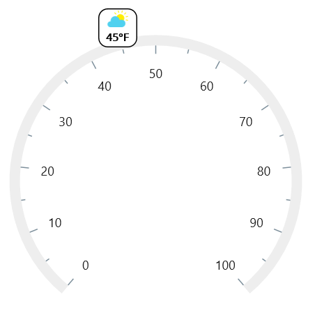

# Content Pointers in .NET MAUI Radial Gauge

The [`ContentPointer`](https://help.syncfusion.com/cr/maui/Syncfusion.Maui.Gauges.ContentPointer.html) in [`SfRadialGauge`](https://help.syncfusion.com/cr/maui/Syncfusion.Maui.Gauges.SfRadialGauge.html) allows the use of any .NET MAUI content as pointer. The following code sample uses a `Ellipse` and `Label` as content pointer.





 <gauge:SfRadialGauge>
                <gauge:SfRadialGauge.Axes>
                    <gauge:RadialAxis >
                        <gauge:RadialAxis.Pointers>
                            <gauge:ContentPointer  Value="45">
                                <gauge:ContentPointer.Content>
                                    <Grid HeightRequest="37" WidthRequest="37" >
                                        <RoundRectangle  Fill="White"
                                                         CornerRadius="8"
                                                         Stroke="Black" 
                                                         StrokeThickness="2"/>
                                        <VerticalStackLayout>
                                            <Image Source="sun.png" 
                                                   HeightRequest="20" 
                                                   WidthRequest="20"
                                                   HorizontalOptions="Center"/>
                                            <Label Text="45°F" 
                                                   HorizontalOptions="Center"
                                                   TextColor="Black" 
                                                   FontAttributes="Bold"
                                                   FontSize="10"/>
                                        </VerticalStackLayout>
                                    </Grid>
                                </gauge:ContentPointer.Content>
                            </gauge:ContentPointer>
                        </gauge:RadialAxis.Pointers>
                    </gauge:RadialAxis>
                </gauge:SfRadialGauge.Axes>
            </gauge:SfRadialGauge>





SfRadialGauge sfRadialGauge = new SfRadialGauge();

        RadialAxis radialAxis = new RadialAxis();
        sfRadialGauge.Axes.Add(radialAxis);

        ContentPointer pointer = new ContentPointer();
        pointer.Value = 45;
        Grid grid = new Grid();
        grid.HeightRequest = 37;
        grid.WidthRequest = 37;
        grid.Children.Add(new RoundRectangle()
        {
            Fill = new SolidColorBrush(Colors.White),
            CornerRadius = 8,
            Stroke = new SolidColorBrush(Colors.Black),
            StrokeThickness = 2,
        });
        VerticalStackLayout verticalStackLayout = new VerticalStackLayout();
        verticalStackLayout.Children.Add(new Image()
        {
            Source = "sun.png",
            HorizontalOptions=LayoutOptions.Center,
            HeightRequest = 20,
            WidthRequest = 20,
        });
        verticalStackLayout.Children.Add(new Label()
        {
            Text = "45°F",
            HorizontalOptions = LayoutOptions.Center,
            TextColor = Colors.Black,
            FontAttributes = FontAttributes.Bold,
            FontSize = 10
        });
        grid.Children.Add(verticalStackLayout);
        pointer.Content = grid;
        radialAxis.Pointers.Add(pointer);

        this.Content = sfRadialGauge;





## Position customization

The content pointer can be moved closer to or further from its actual position using the [`Offset`](https://help.syncfusion.com/cr/maui/Syncfusion.Maui.Gauges.MarkerPointer.html#Syncfusion_Maui_Gauges_MarkerPointer_Offset) and [`OffsetUnit`](https://help.syncfusion.com/cr/maui/Syncfusion.Maui.Gauges.MarkerPointer.html#Syncfusion_Maui_Gauges_MarkerPointer_OffsetUnitProperty) properties.

When you set [`OffsetUnit`](https://help.syncfusion.com/cr/maui/Syncfusion.Maui.Gauges.MarkerPointer.html#Syncfusion_Maui_Gauges_MarkerPointer_OffsetUnitProperty) to logical pixels, the content pointer is moved based on the logical pixels value. When you set [`OffsetUnit`](https://help.syncfusion.com/cr/maui/Syncfusion.Maui.Gauges.MarkerPointer.html#Syncfusion_Maui_Gauges_MarkerPointer_OffsetUnitProperty) to factor, then the provided factor will be multiplied by the axis radius value, and the pointer will be moved accordingly. The default value of [`OffsetUnit`](https://help.syncfusion.com/cr/maui/Syncfusion.Maui.Gauges.MarkerPointer.html#Syncfusion_Maui_Gauges_MarkerPointer_OffsetUnitProperty) is [`SizeUnit.Pixel`](https://help.syncfusion.com/cr/maui/Syncfusion.Maui.Gauges.SizeUnit.html#Syncfusion_Maui_Gauges_SizeUnit_Pixel).





 <gauge:SfRadialGauge>
                <gauge:SfRadialGauge.Axes>
                    <gauge:RadialAxis >
                        <gauge:RadialAxis.Pointers>
                            <gauge:ContentPointer  Value="45" Offset="-20">
                                <gauge:ContentPointer.Content>
                                    <Grid HeightRequest="37" WidthRequest="37" >
                                        <RoundRectangle  Fill="White"
                                                         CornerRadius="8"
                                                         Stroke="Black" 
                                                      StrokeThickness="2" />
                                        <VerticalStackLayout>
                                            <Image Source="sun.png" 
                                                   HeightRequest="20" 
                                                   WidthRequest="20"
                                                   HorizontalOptions="Center"/>
                                            <Label Text="45°F" 
                                                   HorizontalOptions="Center"
                                                   TextColor="Black" 
                                                   FontAttributes="Bold"
                                                   FontSize="10"/>
                                        </VerticalStackLayout>
                                    </Grid>
                                </gauge:ContentPointer.Content>
                            </gauge:ContentPointer>
                        </gauge:RadialAxis.Pointers>
                    </gauge:RadialAxis>
                </gauge:SfRadialGauge.Axes>
            </gauge:SfRadialGauge>





SfRadialGauge sfRadialGauge = new SfRadialGauge();

        RadialAxis radialAxis = new RadialAxis();
        sfRadialGauge.Axes.Add(radialAxis);

        ContentPointer pointer = new ContentPointer();
        pointer.Value = 45;
        pointer.Offset = -20;        
        Grid grid = new Grid();
        grid.HeightRequest = 37;
        grid.WidthRequest = 37;
        grid.Children.Add(new RoundRectangle()
        {
            Fill = new SolidColorBrush(Colors.White),
            CornerRadius = 8,
            Stroke = new SolidColorBrush(Colors.Black),
            StrokeThickness = 2,
        });
        VerticalStackLayout verticalStackLayout = new VerticalStackLayout();
        verticalStackLayout.Children.Add(new Image()
        {
            Source = "sun.png",
            HorizontalOptions=LayoutOptions.Center,
            HeightRequest = 20,
            WidthRequest = 20,
        });
        verticalStackLayout.Children.Add(new Label()
        {
            Text = "45°F",
            HorizontalOptions = LayoutOptions.Center,
            TextColor = Colors.Black,
            FontAttributes = FontAttributes.Bold,
            FontSize = 10
        });
        grid.Children.Add(verticalStackLayout);
        pointer.Content = grid;
        radialAxis.Pointers.Add(pointer);

        this.Content = sfRadialGauge;





