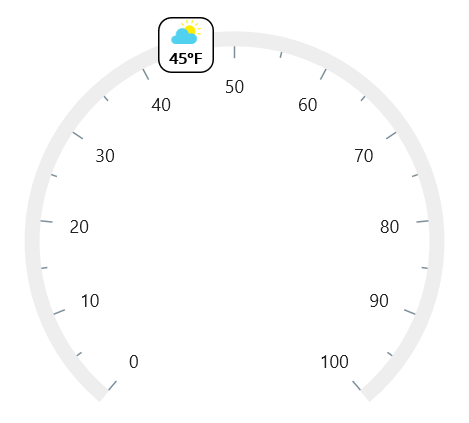
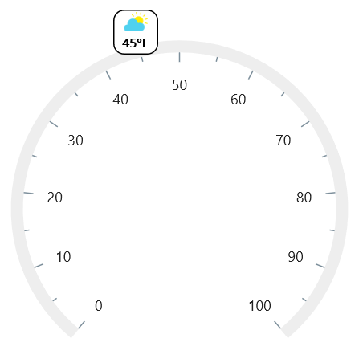

# Content Pointers in .NET MAUI Radial Gauge

The [`ContentPointer`](https://help.syncfusion.com/cr/maui/Syncfusion.Maui.Gauges.ContentPointer.html) in [`SfRadialGauge`](https://help.syncfusion.com/cr/maui/Syncfusion.Maui.Gauges.SfRadialGauge.html) allows you to use any .NET MAUI content as a pointer. The following code sample uses a `RoundRectangle` and a `Label` as the content pointer.

N> **Prerequisite:** Ensure that the required NuGet package is installed, the necessary namespaces are imported, and the **SfRadialGauge** control is properly configured in your application. For detailed setup and configuration instructions, refer to the **[Getting Started](https://help.syncfusion.com/maui/radial-gauge/getting-started)** guide.





<gauge:SfRadialGauge>
    <gauge:SfRadialGauge.Axes>
        <gauge:RadialAxis >
            <gauge:RadialAxis.Pointers>
                <gauge:ContentPointer  Value = "45">
                    <gauge:ContentPointer.Content>
                        <Grid HeightRequest = "37" WidthRequest = "37" >
                            <RoundRectangle Fill = "White"
                                            CornerRadius = "8"
                                            Stroke = "Black" 
                                            StrokeThickness = "2"/>
                            <VerticalStackLayout>
                                 <Image Source = "sun.png" 
                                        HeightRequest = "20" 
                                        WidthRequest = "20"
                                        HorizontalOptions = "Center"/>
                                 <Label Text = "45°F" 
                                        HorizontalOptions = "Center"
                                        TextColor = "Black" 
                                        FontAttributes = "Bold"
                                        FontSize = "10"/>
                            </VerticalStackLayout>
                        </Grid>
                    </gauge:ContentPointer.Content>
                </gauge:ContentPointer>
            </gauge:RadialAxis.Pointers>
        </gauge:RadialAxis>
    </gauge:SfRadialGauge.Axes>
</gauge:SfRadialGauge>





SfRadialGauge sfRadialGauge = new SfRadialGauge();

RadialAxis radialAxis = new RadialAxis();
sfRadialGauge.Axes.Add(radialAxis);

ContentPointer pointer = new ContentPointer();
pointer.Value = 45;
Grid grid = new Grid();
grid.HeightRequest = 37;
grid.WidthRequest = 37;
grid.Add(new RoundRectangle()
{
    Fill = new SolidColorBrush(Colors.White),
    CornerRadius = 8,
    Stroke = new SolidColorBrush(Colors.Black),
    StrokeThickness = 2,
});
VerticalStackLayout verticalStackLayout = new VerticalStackLayout();
verticalStackLayout.Add(new Image()
{
    Source = "sun.png",
    HorizontalOptions=LayoutOptions.Center,
    HeightRequest = 20,
    WidthRequest = 20,
});
verticalStackLayout.Add(new Label()
{
    Text = "45°F",
    HorizontalOptions = LayoutOptions.Center,
    TextColor = Colors.Black,
    FontAttributes = FontAttributes.Bold,
    FontSize = 10
});
grid.Add(verticalStackLayout);
pointer.Content = grid;
radialAxis.Pointers.Add(pointer);

this.Content = sfRadialGauge;





## Position customization

The content pointer can be moved near or far from its actual position using the [`Offset`](https://help.syncfusion.com/cr/maui/Syncfusion.Maui.Gauges.MarkerPointer.html#Syncfusion_Maui_Gauges_MarkerPointer_Offset) and [`OffsetUnit`](https://help.syncfusion.com/cr/maui/Syncfusion.Maui.Gauges.MarkerPointer.html#Syncfusion_Maui_Gauges_MarkerPointer_OffsetUnitProperty) properties.

When [`OffsetUnit`](https://help.syncfusion.com/cr/maui/Syncfusion.Maui.Gauges.MarkerPointer.html#Syncfusion_Maui_Gauges_MarkerPointer_OffsetUnitProperty) is set to `SizeUnit.Pixel`, the content pointer is moved by the logical pixel value provided in [`Offset`](https://help.syncfusion.com/cr/maui/Syncfusion.Maui.Gauges.MarkerPointer.html#Syncfusion_Maui_Gauges_MarkerPointer_Offset). When [`OffsetUnit`](https://help.syncfusion.com/cr/maui/Syncfusion.Maui.Gauges.MarkerPointer.html#Syncfusion_Maui_Gauges_MarkerPointer_OffsetUnitProperty) is set to `SizeUnit.Factor`, the provided factor is multiplied by the axis radius value, and then the pointer is moved by the resulting value. The default value of [`OffsetUnit`](https://help.syncfusion.com/cr/maui/Syncfusion.Maui.Gauges.MarkerPointer.html#Syncfusion_Maui_Gauges_MarkerPointer_OffsetUnitProperty) is `SizeUnit.Pixel`.





<gauge:SfRadialGauge>
    <gauge:SfRadialGauge.Axes>
        <gauge:RadialAxis >
            <gauge:RadialAxis.Pointers>
                <gauge:ContentPointer  Value = "45" Offset = "-20">
                    <gauge:ContentPointer.Content>
                        <Grid HeightRequest = "37" WidthRequest = "37" >
                            <RoundRectangle Fill = "White"
                                            CornerRadius = "8"
                                            Stroke = "Black" 
                                            StrokeThickness = "2" />
                            <VerticalStackLayout>
                                 <Image Source = "sun.png" 
                                        HeightRequest = "20" 
                                        WidthRequest = "20"
                                        HorizontalOptions = "Center"/>
                                 <Label Text = "45°F" 
                                        HorizontalOptions = "Center"
                                        TextColor = "Black" 
                                        FontAttributes = "Bold"
                                        FontSize = "10"/>
                            </VerticalStackLayout>
                        </Grid>
                    </gauge:ContentPointer.Content>
                </gauge:ContentPointer>
            </gauge:RadialAxis.Pointers>
        </gauge:RadialAxis>
    </gauge:SfRadialGauge.Axes>
</gauge:SfRadialGauge>





SfRadialGauge sfRadialGauge = new SfRadialGauge();

RadialAxis radialAxis = new RadialAxis();
sfRadialGauge.Axes.Add(radialAxis);

ContentPointer pointer = new ContentPointer();
pointer.Value = 45;
pointer.Offset = -20;        
Grid grid = new Grid();
grid.HeightRequest = 37;
grid.WidthRequest = 37;
grid.Add(new RoundRectangle()
{
    Fill = new SolidColorBrush(Colors.White),
    CornerRadius = 8,
    Stroke = new SolidColorBrush(Colors.Black),
    StrokeThickness = 2,
});
VerticalStackLayout verticalStackLayout = new VerticalStackLayout();
verticalStackLayout.Add(new Image()
{
    Source = "sun.png",
    HorizontalOptions=LayoutOptions.Center,
    HeightRequest = 20,
    WidthRequest = 20,
});
verticalStackLayout.Add(new Label()
{
    Text = "45°F",
    HorizontalOptions = LayoutOptions.Center,
    TextColor = Colors.Black,
    FontAttributes = FontAttributes.Bold,
    FontSize = 10
});
grid.Add(verticalStackLayout);
pointer.Content = grid;
radialAxis.Pointers.Add(pointer);

this.Content = sfRadialGauge;





