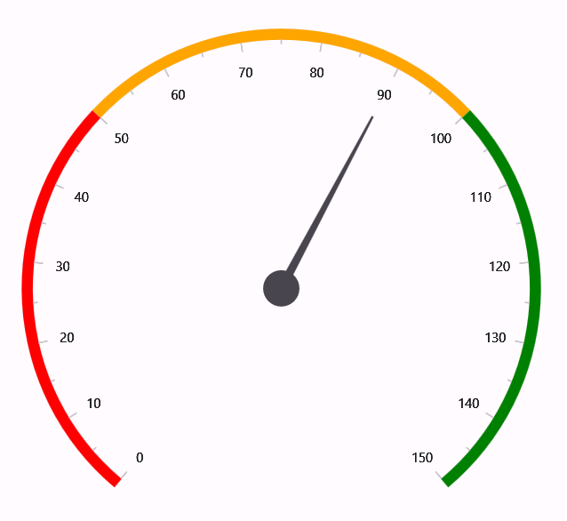

# Getting Started with .NET MAUI Radial Gauge

This section explains the steps required to add the [`.NET MAUI Radial Gauge`](https://help.syncfusion.com/cr/maui/Syncfusion.Maui.Gauges.SfRadialGauge.html) control and its elements such as axis, range, pointer, and annotation. This section covers only basic features needed to get started with Syncfusion&reg; radial gauge control. Follow the steps below to add a .NET MAUI Radial gauge control to your project.

To get start quickly with our .NET MAUI Radial Gauge, you can check the below video.






## Prerequisites
Before proceeding, ensure the following are set up:

1. Install [.NET 9 SDK](https://dotnet.microsoft.com/en-us/download/dotnet/9.0) or later.
2. Set up a .NET MAUI environment with Visual Studio 2022 v17.12 or later.

## Step 1: Create a New .NET MAUI Project

1. Go to **File > New > Project** and choose the **.NET MAUI App** template.
2. Name the project and choose a location. Then click **Next**.
3. Select the .NET framework version and click **Create**.

## Step 2: Install the Syncfusion&reg; .NET MAUI Radial Gauge NuGet Package

1. In **Solution Explorer,** right-click the project and choose **Manage NuGet Packages.**
2. Search for [Syncfusion.Maui.Gauges](https://www.nuget.org/packages/Syncfusion.Maui.Gauges/) and install the latest version.
3. Ensure the necessary dependencies are installed correctly, and the project is restored.




## Prerequisites

Before proceeding, ensure the following are set up:

1. Install [.NET 9 SDK](https://dotnet.microsoft.com/en-us/download/dotnet/9.0) or later.
2. Set up a .NET MAUI environment with Visual Studio Code.
3. Ensure that the .NET MAUI workloads are installed and configured as described [here](https://learn.microsoft.com/en-us/dotnet/maui/get-started/installation?view=net-maui-9.0&tabs=visual-studio-code).

## Step 1: Create a New .NET MAUI Project

1. Open the command palette by pressing `Ctrl+Shift+P` and type **.NET:New Project** and enter.
2. Choose the **.NET MAUI App** template.
3. Select the project location, type the project name and press **Enter**.
4. Then choose **Create project.**

## Step 2: Install the Syncfusion&reg; .NET MAUI Radial Gauge NuGet Package

1. Press <kbd>Ctrl</kbd> + <kbd>`</kbd> (backtick) to open the integrated terminal in Visual Studio Code.
2. Ensure you're in the project root directory where your .csproj file is located.
3. Run the command `dotnet add package Syncfusion.Maui.Gauges` to install the Syncfusion® .NET MAUI Gauges NuGet package.
4. To ensure all dependencies are installed, run `dotnet restore`.




## Prerequisites

Before proceeding, ensure the following are set up:

1. Install [.NET 9 SDK](https://dotnet.microsoft.com/en-us/download/dotnet/9.0) or later.
2. Set up a .NET MAUI environment with JetBrains Rider 2024.3 or later.
3. Make sure the MAUI workloads are installed and configured as described [here.](https://www.jetbrains.com/help/rider/MAUI.html#before-you-start)

## Step 1: Create a new .NET MAUI Project

1. Go to **File > New Solution,** Select .NET (C#) and choose the .NET MAUI App template.
2. Enter the Project Name, Solution Name, and Location.
3. Select the .NET framework version and click Create.

## Step 2: Install the Syncfusion® MAUI Radial Gauge Package

1. In **Solution Explorer,** right-click the project and choose **Manage NuGet Packages.**
2. Search for [Syncfusion.Maui.Gauges](https://www.nuget.org/packages/Syncfusion.Maui.Gauges/) and install the latest version.
3. Ensure the necessary dependencies are installed correctly, and the project is restored. If not, Open the Terminal in Rider and manually run: `dotnet restore`




## Step 3: Register Syncfusion handler
 
Make sure to add the namespace.
 

using Syncfusion.Maui.Core.Hosting;

 
Register the Syncfusion core handler in your CreateMauiApp method of `MauiProgram.cs` file to use Syncfusion controls.
 

builder.ConfigureSyncfusionCore();


## Step 4: Import Radial Gauge namespace

Add the following namespace in your XAML or C#.




xmlns:gauge="clr-namespace:Syncfusion.Maui.Gauges;assembly=Syncfusion.Maui.Gauges"




using Syncfusion.Maui.Gauges;




## Step 5: Add the Radial Gauge component

Learn how to initialize the Syncfusion .NET MAUI SfRadialGauge control and configure its elements such as Axes, Ranges, Pointers, and Annotations to visualize data effectively.




<gauge:SfRadialGauge>
    <gauge:SfRadialGauge.Axes>
        <gauge:RadialAxis Interval="10"
                          Maximum="150" >
            <gauge:RadialAxis.Ranges>
                <gauge:RadialRange StartValue="0"
                                  EndValue="50"
                                  Fill="Red" />
                <gauge:RadialRange StartValue="50"
                                  EndValue="100"
                                  Fill="Orange" />
                <gauge:RadialRange StartValue="100"
                                  EndValue="150"
                                  Fill="Green" />
            </gauge:RadialAxis.Ranges>
            <gauge:RadialAxis.Pointers>
                <gauge:NeedlePointer Value="90" />
            </gauge:RadialAxis.Pointers>
            <gauge:RadialAxis.Annotations>
                <gauge:GaugeAnnotation x:Name="annotation"
                                       DirectionUnit="Angle"
                                       DirectionValue="90"
                                       PositionFactor="0.5">
                    <gauge:GaugeAnnotation.Content>
                        <Label Text="90"
                            FontSize="25"
                            FontAttributes="Bold" 
                            TextColor="Black"/>
                    </gauge:GaugeAnnotation.Content>
                </gauge:GaugeAnnotation>
            </gauge:RadialAxis.Annotations>
        </gauge:RadialAxis>
    </gauge:SfRadialGauge.Axes>
</gauge:SfRadialGauge>





var gauge = new SfRadialGauge();
var axis = new RadialAxis
{
    Maximum = 150,
    Interval = 10
};

axis.Ranges.Add(new RadialRange { StartValue = 0, EndValue = 50, Fill = Colors.Red });
axis.Ranges.Add(new RadialRange { StartValue = 50, EndValue = 100, Fill = Colors.Orange });
axis.Ranges.Add(new RadialRange { StartValue = 100, EndValue = 150, Fill = Colors.Green });

axis.Pointers.Add(new NeedlePointer { Value = 90 });

var annotation = new GaugeAnnotation
{
    DirectionUnit = AnnotationDirection.Angle,
    DirectionValue = 90,
    PositionFactor = 0.5,
    Content = new Label
    {
        Text = "90",
        FontSize = 25,
        FontAttributes = FontAttributes.Bold,
        TextColor = Colors.Black
    }
};

axis.Annotations.Add(annotation);
gauge.Axes.Add(axis);
Content = gauge;

You can download the Radial Gauge Getting Started sample from [here](https://github.com/SyncfusionExamples/MAUI-Radial-Gauge-Getting-Started-)

N> You can refer to our [.NET MAUI Radial Gauge](https://www.syncfusion.com/maui-controls/maui-radial-gauge) feature tour page for its groundbreaking feature representations. You can also explore our [.NET MAUI Radial Gauge Example](https://github.com/syncfusion/maui-demos/tree/master/MAUI/Gauges/SampleBrowser.Maui.Gauges/Samples/RadialGauge) that shows you how to render the Radial Gauge in .NET MAUI.