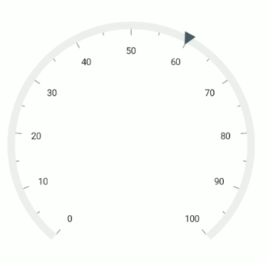
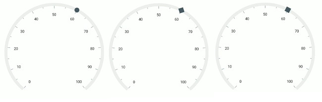
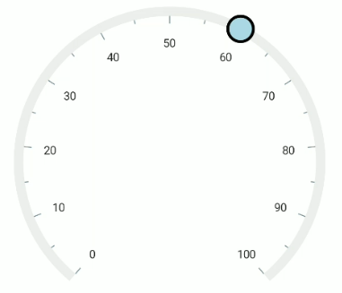
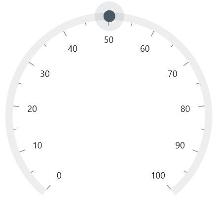

# Shape Pointer in .NET MAUI Radial Gauge

Indicate current values by using different types of shape pointers. You can change the shape type using the [`ShapeType`](https://help.syncfusion.com/cr/maui/Syncfusion.Maui.Gauges.ShapeType.html) property.





<gauge:SfRadialGauge>
    <gauge:SfRadialGauge.Axes>
        <gauge:RadialAxis>
            <gauge:RadialAxis.Pointers>
                <gauge:ShapePointer Value="60" />
            </gauge:RadialAxis.Pointers>
        </gauge:RadialAxis>
    </gauge:SfRadialGauge.Axes>
</gauge:SfRadialGauge>





SfRadialGauge sfRadialGauge = new SfRadialGauge();

RadialAxis radialAxis = new RadialAxis();
sfRadialGauge.Axes.Add(radialAxis);

ShapePointer pointer = new ShapePointer();
pointer.Value = 60;
radialAxis.Pointers.Add(pointer);

this.Content = sfRadialGauge;





The gauge supports the following types of shapes:

* [`Circle`](https://help.syncfusion.com/cr/maui/Syncfusion.Maui.Gauges.ShapeType.html#Syncfusion_Maui_Gauges_ShapeType_Circle)
* [`Diamond`](https://help.syncfusion.com/cr/maui/Syncfusion.Maui.Gauges.ShapeType.html#Syncfusion_Maui_Gauges_ShapeType_Diamond)
* [`Inverted triangle`](https://help.syncfusion.com/cr/maui/Syncfusion.Maui.Gauges.ShapeType.html#Syncfusion_Maui_Gauges_ShapeType_InvertedTriangle)
* [`Rectangle`](https://help.syncfusion.com/cr/maui/Syncfusion.Maui.Gauges.ShapeType.html#Syncfusion_Maui_Gauges_ShapeType_Rectangle)
* [`Triangle`](https://help.syncfusion.com/cr/maui/Syncfusion.Maui.Gauges.ShapeType.html#Syncfusion_Maui_Gauges_ShapeType_Triangle)

## Shape customization

The shape pointer can be customized using the following properties:

* [`Fill`](https://help.syncfusion.com/cr/maui/Syncfusion.Maui.Gauges.ShapePointer.html#Syncfusion_Maui_Gauges_ShapePointer_Fill) – You can customize the shape color.
* [`ShapeHeight`](https://help.syncfusion.com/cr/maui/Syncfusion.Maui.Gauges.ShapePointer.html#Syncfusion_Maui_Gauges_ShapePointer_ShapeHeight) – You can specify the shape height.
* [`ShapeWidth`](https://help.syncfusion.com/cr/maui/Syncfusion.Maui.Gauges.ShapePointer.html#Syncfusion_Maui_Gauges_ShapePointer_ShapeWidth) – You can specify the shape width.
* [`Stroke`](https://help.syncfusion.com/cr/maui/Syncfusion.Maui.Gauges.ShapePointer.html#Syncfusion_Maui_Gauges_ShapePointer_Stroke) – You can specify the border color for the shape.
* [`BorderWidth`](https://help.syncfusion.com/cr/maui/Syncfusion.Maui.Gauges.ShapePointer.html#Syncfusion_Maui_Gauges_ShapePointer_BorderWidth) – You can specify the border width of the shape.
* [`HasShadow`](https://help.syncfusion.com/cr/maui/Syncfusion.Maui.Gauges.ShapePointer.html#Syncfusion_Maui_Gauges_ShapePointer_HasShadow) – You can specify the shadow of the shape.





<gauge:SfRadialGauge>
    <gauge:SfRadialGauge.Axes>
        <gauge:RadialAxis>
            <gauge:RadialAxis.Pointers>
                <gauge:ShapePointer Value="60"
                                     ShapeHeight="30"
                                     ShapeWidth="30"
                                     Stroke="Black"
                                     BorderWidth="3"
                                     ShapeType="Circle"
                                     Fill="LightBlue"/>
            </gauge:RadialAxis.Pointers>
        </gauge:RadialAxis>
    </gauge:SfRadialGauge.Axes>
</gauge:SfRadialGauge>





SfRadialGauge sfRadialGauge = new SfRadialGauge();

RadialAxis radialAxis = new RadialAxis();
sfRadialGauge.Axes.Add(radialAxis);

ShapePointer pointer = new ShapePointer();
pointer.Value = 60;
pointer.ShapeHeight = 30;
pointer.ShapeWidth = 30;
pointer.Stroke = Colors.Black;
pointer.BorderWidth = 3;
pointer.ShapeType = ShapeType.Circle;
pointer.Fill = new SolidColorBrush(Colors.LightBlue);
radialAxis.Pointers.Add(pointer);

this.Content = sfRadialGauge;





## Shadow support

The shadow can be applied by the [`HasShadow`](https://help.syncfusion.com/cr/maui/Syncfusion.Maui.Gauges.ShapePointer.html#Syncfusion_Maui_Gauges_ShapePointer_HasShadow) property.





 <gauge:SfRadialGauge>
                <gauge:SfRadialGauge.Axes>
                    <gauge:RadialAxis>
                        <gauge:RadialAxis.Pointers>
                            <gauge:ShapePointer Value="60" ShapeType="Circle" 
                                                HasShadow="True"/>
                        </gauge:RadialAxis.Pointers>
                    </gauge:RadialAxis>
                </gauge:SfRadialGauge.Axes>
            </gauge:SfRadialGauge>





SfRadialGauge sfRadialGauge = new SfRadialGauge();

RadialAxis radialAxis = new RadialAxis();
sfRadialGauge.Axes.Add(radialAxis);

ShapePointer pointer = new ShapePointer();
pointer.Value = 60;
pointer.ShapeType = ShapeType.Circle;
pointer.HasShadow = true;
radialAxis.Pointers.Add(pointer);

this.Content = sfRadialGauge;





## Shape pointer overlay

The shape pointer overlay is rendered around the shape when the shape pointer is dragged. When [`IsInteractive`](https://help.syncfusion.com/cr/maui/Syncfusion.Maui.Gauges.RadialPointer.html#Syncfusion_Maui_Gauges_RadialPointer_IsInteractive) property of pointer is set to true and the marker is dragged, the overlay will come around the marker pointer.

The shape pointer overlay can be customized using the following properties:

* [`OverlayFill`](https://help.syncfusion.com/cr/maui/Syncfusion.Maui.Gauges.ShapePointer.html#Syncfusion_Maui_Gauges_ShapePointer_OverlayFill) – You can specify the color for the shapes' dragging overlay.
* [`OverlayRadius`](https://help.syncfusion.com/cr/maui/Syncfusion.Maui.Gauges.ShapePointer.html#Syncfusion_Maui_Gauges_ShapePointer_OverlayRadius) – You can specify the radius for the shapes' dragging overlay.





  <gauge:SfRadialGauge>
                <gauge:SfRadialGauge.Axes>
                    <gauge:RadialAxis>
                        <gauge:RadialAxis.Pointers>
                            <gauge:ShapePointer Value="60" ShapeType="Circle" 
                                                IsInteractive="True" 
                                                OverlayRadius="20"/>
                        </gauge:RadialAxis.Pointers>
                    </gauge:RadialAxis>
                </gauge:SfRadialGauge.Axes>
            </gauge:SfRadialGauge>





SfRadialGauge sfRadialGauge = new SfRadialGauge();

RadialAxis radialAxis = new RadialAxis();
sfRadialGauge.Axes.Add(radialAxis);

ShapePointer pointer = new ShapePointer();
pointer.Value = 60;
pointer.ShapeType = ShapeType.Circle;
pointer.OverlayRadius = 20;
pointer.IsInteractive = true;
radialAxis.Pointers.Add(pointer);

this.Content = sfRadialGauge;





## Marker position customization

The marker pointer can be moved near or far from its actual position using the [`Offset`](https://help.syncfusion.com/cr/maui/Syncfusion.Maui.Gauges.MarkerPointer.html#Syncfusion_Maui_Gauges_MarkerPointer_Offset) and [`OffsetUnit`](https://help.syncfusion.com/cr/maui/Syncfusion.Maui.Gauges.MarkerPointer.html#Syncfusion_Maui_Gauges_MarkerPointer_OffsetUnit) properties. 

When you set [`OffsetUnit`](https://help.syncfusion.com/cr/maui/Syncfusion.Maui.Gauges.MarkerPointer.html#Syncfusion_Maui_Gauges_MarkerPointer_OffsetUnit) to pixel, the marker pointer will be moved based on the pixel value. If you set [`OffsetUnit`](https://help.syncfusion.com/cr/maui/Syncfusion.Maui.Gauges.MarkerPointer.html#Syncfusion_Maui_Gauges_MarkerPointer_OffsetUnit) to factor, then the provided factor will be multiplied by the scale radius value, and then the pointer will be moved to corresponding value. The default value of [`OffsetUnit`](https://help.syncfusion.com/cr/maui/Syncfusion.Maui.Gauges.MarkerPointer.html#Syncfusion_Maui_Gauges_MarkerPointer_OffsetUnit) is [`SizeUnit.Pixel`](https://help.syncfusion.com/cr/maui/Syncfusion.Maui.Gauges.SizeUnit.html#Syncfusion_Maui_Gauges_SizeUnit_Pixel).





<gauge:SfRadialGauge>
    <gauge:SfRadialGauge.Axes>
        <gauge:RadialAxis>
            <gauge:RadialAxis.Pointers>
                <gauge:ShapePointer Value="60"
                                    Offset="-18"/>
            </gauge:RadialAxis.Pointers>
        </gauge:RadialAxis>
    </gauge:SfRadialGauge.Axes>
</gauge:SfRadialGauge>





SfRadialGauge sfRadialGauge = new SfRadialGauge();

RadialAxis radialAxis = new RadialAxis();
sfRadialGauge.Axes.Add(radialAxis);

ShapePointer pointer = new ShapePointer();
pointer.Value = 60;
pointer.Offset = -18;
radialAxis.Pointers.Add(pointer);

this.Content = sfRadialGauge;





