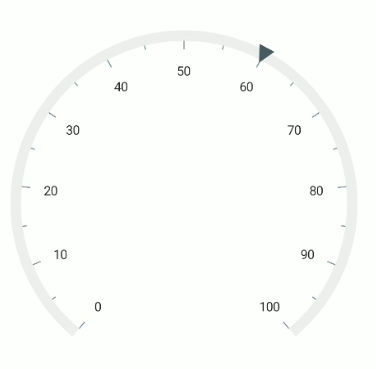
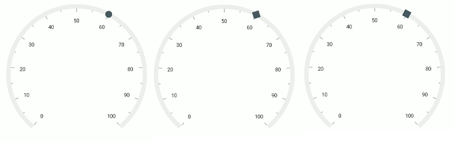
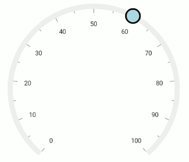
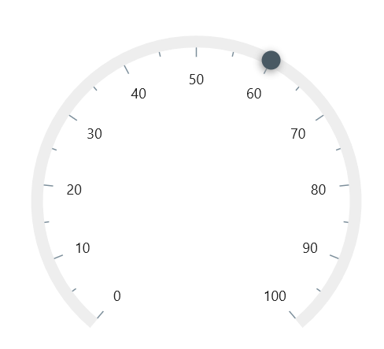
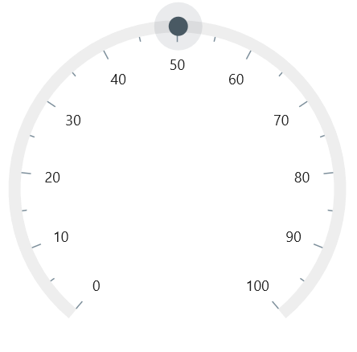
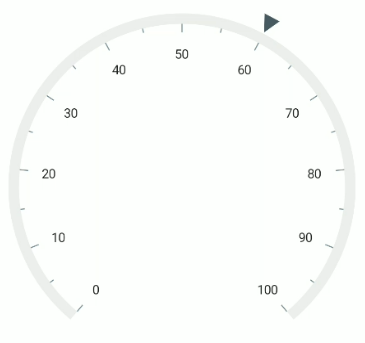

# Shape Pointer in .NET MAUI Radial Gauge

Indicate current values by using different types of shape pointers. You can change the shape type using the [`ShapeType`](https://help.syncfusion.com/cr/maui/Syncfusion.Maui.Gauges.ShapeType.html) property.

N> **Prerequisite:** Ensure that the required NuGet package is installed, the necessary namespaces are imported, and the **SfRadialGauge** control is properly configured in your application. For detailed setup and configuration instructions, refer to the **[Getting Started](https://help.syncfusion.com/maui/radial-gauge/getting-started)** guide.





<gauge:SfRadialGauge>
    <gauge:SfRadialGauge.Axes>
        <gauge:RadialAxis>
            <gauge:RadialAxis.Pointers>
                <gauge:ShapePointer Value = "60" />
            </gauge:RadialAxis.Pointers>
        </gauge:RadialAxis>
    </gauge:SfRadialGauge.Axes>
</gauge:SfRadialGauge>





SfRadialGauge sfRadialGauge = new SfRadialGauge();

RadialAxis radialAxis = new RadialAxis();
sfRadialGauge.Axes.Add(radialAxis);

ShapePointer pointer = new ShapePointer();
pointer.Value = 60;
radialAxis.Pointers.Add(pointer);

this.Content = sfRadialGauge;





Gauge supports the following types of shapes:

* [`Circle`](https://help.syncfusion.com/cr/maui/Syncfusion.Maui.Gauges.ShapeType.html#Syncfusion_Maui_Gauges_ShapeType_Circle)
* [`Diamond`](https://help.syncfusion.com/cr/maui/Syncfusion.Maui.Gauges.ShapeType.html#Syncfusion_Maui_Gauges_ShapeType_Diamond)
* [`Inverted triangle`](https://help.syncfusion.com/cr/maui/Syncfusion.Maui.Gauges.ShapeType.html#Syncfusion_Maui_Gauges_ShapeType_InvertedTriangle)
* [`Rectangle`](https://help.syncfusion.com/cr/maui/Syncfusion.Maui.Gauges.ShapeType.html#Syncfusion_Maui_Gauges_ShapeType_Rectangle)
* [`Triangle`](https://help.syncfusion.com/cr/maui/Syncfusion.Maui.Gauges.ShapeType.html#Syncfusion_Maui_Gauges_ShapeType_Triangle)

## Shape customization

The shape pointer can be customized using the following properties:

* [`Fill`](https://help.syncfusion.com/cr/maui/Syncfusion.Maui.Gauges.ShapePointer.html#Syncfusion_Maui_Gauges_ShapePointer_Fill) - Specifies the color of the shape.
* [`ShapeHeight`](https://help.syncfusion.com/cr/maui/Syncfusion.Maui.Gauges.ShapePointer.html#Syncfusion_Maui_Gauges_ShapePointer_ShapeHeight) - Specifies the height of the shape.
* [`ShapeWidth`](https://help.syncfusion.com/cr/maui/Syncfusion.Maui.Gauges.ShapePointer.html#Syncfusion_Maui_Gauges_ShapePointer_ShapeWidth) - Specifies the width of the shape.
* [`Stroke`](https://help.syncfusion.com/cr/maui/Syncfusion.Maui.Gauges.ShapePointer.html#Syncfusion_Maui_Gauges_ShapePointer_Stroke) - Specifies the border color of the shape.
* [`BorderWidth`](https://help.syncfusion.com/cr/maui/Syncfusion.Maui.Gauges.ShapePointer.html#Syncfusion_Maui_Gauges_ShapePointer_BorderWidth) - Specifies the border width of the shape.
* [`HasShadow`](https://help.syncfusion.com/cr/maui/Syncfusion.Maui.Gauges.ShapePointer.html#Syncfusion_Maui_Gauges_ShapePointer_HasShadow) - Specifies whether to apply a shadow to the shape.





<gauge:SfRadialGauge>
    <gauge:SfRadialGauge.Axes>
        <gauge:RadialAxis>
            <gauge:RadialAxis.Pointers>
                <gauge:ShapePointer Value = "60"
                                    ShapeHeight = "30"
                                    ShapeWidth = "30"
                                    Stroke = "Black"
                                    BorderWidth = "3"
                                    ShapeType = "Circle"
                                    Fill = "LightBlue"/>
            </gauge:RadialAxis.Pointers>
        </gauge:RadialAxis>
    </gauge:SfRadialGauge.Axes>
</gauge:SfRadialGauge>





SfRadialGauge sfRadialGauge = new SfRadialGauge();

RadialAxis radialAxis = new RadialAxis();
sfRadialGauge.Axes.Add(radialAxis);

ShapePointer pointer = new ShapePointer();
pointer.Value = 60;
pointer.ShapeHeight = 30;
pointer.ShapeWidth = 30;
pointer.Stroke = new SolidColorBrush(Colors.Black);
pointer.BorderWidth = 3;
pointer.ShapeType = ShapeType.Circle;
pointer.Fill = new SolidColorBrush(Colors.LightBlue);
radialAxis.Pointers.Add(pointer);

this.Content = sfRadialGauge;





## Shadow support

The shadow can be applied by the [`HasShadow`](https://help.syncfusion.com/cr/maui/Syncfusion.Maui.Gauges.ShapePointer.html#Syncfusion_Maui_Gauges_ShapePointer_HasShadow) property.





<gauge:SfRadialGauge>
    <gauge:SfRadialGauge.Axes>
        <gauge:RadialAxis>
            <gauge:RadialAxis.Pointers>
                <gauge:ShapePointer Value = "60" 
                                    ShapeType = "Circle" 
                                    HasShadow = "True"/>
            </gauge:RadialAxis.Pointers>
        </gauge:RadialAxis>
    </gauge:SfRadialGauge.Axes>
</gauge:SfRadialGauge>





SfRadialGauge sfRadialGauge = new SfRadialGauge();

RadialAxis radialAxis = new RadialAxis();
sfRadialGauge.Axes.Add(radialAxis);

ShapePointer pointer = new ShapePointer();
pointer.Value = 60;
pointer.ShapeType = ShapeType.Circle;
pointer.HasShadow = true;
radialAxis.Pointers.Add(pointer);

this.Content = sfRadialGauge;





## Shape pointer overlay

The shape pointer overlay is rendered around the shape when the shape pointer is dragged. When [`IsInteractive`](https://help.syncfusion.com/cr/maui/Syncfusion.Maui.Gauges.RadialPointer.html#Syncfusion_Maui_Gauges_RadialPointer_IsInteractive) property of pointer is set to true and the marker is dragged, the overlay will come around the marker pointer.

The shape pointer overlay can be customized using the following properties:

* [`OverlayFill`](https://help.syncfusion.com/cr/maui/Syncfusion.Maui.Gauges.ShapePointer.html#Syncfusion_Maui_Gauges_ShapePointer_OverlayFill) - Specifies the color of the dragging overlay.
* [`OverlayRadius`](https://help.syncfusion.com/cr/maui/Syncfusion.Maui.Gauges.ShapePointer.html#Syncfusion_Maui_Gauges_ShapePointer_OverlayRadius) - Specifies the radius of the dragging overlay.





<gauge:SfRadialGauge>
    <gauge:SfRadialGauge.Axes>
        <gauge:RadialAxis>
            <gauge:RadialAxis.Pointers>
                <gauge:ShapePointer Value = "60" 
                                    ShapeType = "Circle" 
                                    IsInteractive = "True" 
                                    OverlayRadius = "20"/>
            </gauge:RadialAxis.Pointers>
        </gauge:RadialAxis>
    </gauge:SfRadialGauge.Axes>
</gauge:SfRadialGauge>





SfRadialGauge sfRadialGauge = new SfRadialGauge();

RadialAxis radialAxis = new RadialAxis();
sfRadialGauge.Axes.Add(radialAxis);

ShapePointer pointer = new ShapePointer();
pointer.Value = 60;
pointer.ShapeType = ShapeType.Circle;
pointer.OverlayRadius = 20;
pointer.IsInteractive = true;
radialAxis.Pointers.Add(pointer);

this.Content = sfRadialGauge;





## Shape pointer position customization

The shape pointer can be moved near or far from its actual position using the [`Offset`](https://help.syncfusion.com/cr/maui/Syncfusion.Maui.Gauges.ShapePointer.html#Syncfusion_Maui_Gauges_ShapePointer_Offset) and [`OffsetUnit`](https://help.syncfusion.com/cr/maui/Syncfusion.Maui.Gauges.ShapePointer.html#Syncfusion_Maui_Gauges_ShapePointer_OffsetUnit) properties. 

When [`OffsetUnit`](https://help.syncfusion.com/cr/maui/Syncfusion.Maui.Gauges.ShapePointer.html#Syncfusion_Maui_Gauges_ShapePointer_OffsetUnit) is set to [`SizeUnit.Pixel`](https://help.syncfusion.com/cr/maui/Syncfusion.Maui.Gauges.SizeUnit.html#Syncfusion_Maui_Gauges_SizeUnit_Pixel), the shape pointer is moved by the provided pixel value. When [`OffsetUnit`](https://help.syncfusion.com/cr/maui/Syncfusion.Maui.Gauges.ShapePointer.html#Syncfusion_Maui_Gauges_ShapePointer_OffsetUnit) is set to [`SizeUnit.Factor`](https://help.syncfusion.com/cr/maui/Syncfusion.Maui.Gauges.SizeUnit.html#Syncfusion_Maui_Gauges_SizeUnit_Factor), the provided value is multiplied by the axis radius and the pointer is moved to the corresponding position. The default value of [`OffsetUnit`](https://help.syncfusion.com/cr/maui/Syncfusion.Maui.Gauges.ShapePointer.html#Syncfusion_Maui_Gauges_ShapePointer_OffsetUnit) is [`SizeUnit.Pixel`](https://help.syncfusion.com/cr/maui/Syncfusion.Maui.Gauges.SizeUnit.html#Syncfusion_Maui_Gauges_SizeUnit_Pixel).





<gauge:SfRadialGauge>
    <gauge:SfRadialGauge.Axes>
        <gauge:RadialAxis>
            <gauge:RadialAxis.Pointers>
                <gauge:ShapePointer Value = "60"
                                    Offset = "-18"/>
            </gauge:RadialAxis.Pointers>
        </gauge:RadialAxis>
    </gauge:SfRadialGauge.Axes>
</gauge:SfRadialGauge>





SfRadialGauge sfRadialGauge = new SfRadialGauge();

RadialAxis radialAxis = new RadialAxis();
sfRadialGauge.Axes.Add(radialAxis);

ShapePointer pointer = new ShapePointer();
pointer.Value = 60;
pointer.Offset = -18;
radialAxis.Pointers.Add(pointer);

this.Content = sfRadialGauge;





