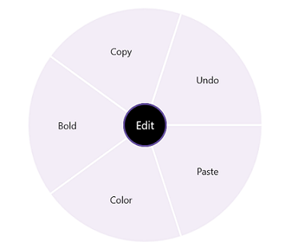
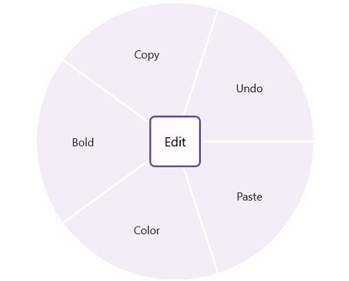
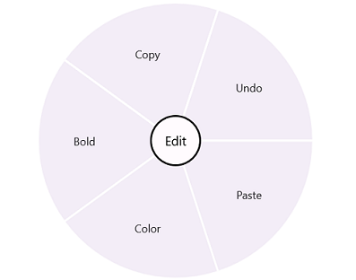
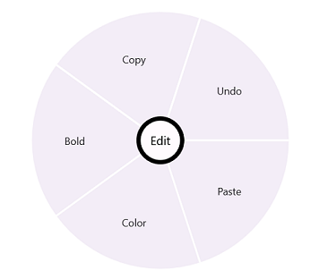
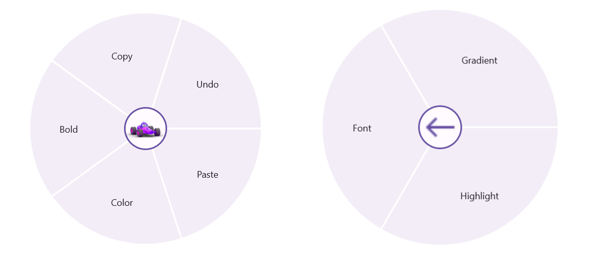

# CenterButton Customization in MAUI Radial Menu (SfRadialMenu)

The CenterButton or BackButton in radial menu is a view in the center of the radial menu. It performs the operations such as opening and closing the rim and navigating to the next level items. The radial menu allows you customize the CenterButton/BackButton with `FontIcon`, `Custom View`, and `Caption`.

## CenterButtonText and CenterButtonBackText

The [`CenterButtonText`](https://help.syncfusion.com/cr/maui/Syncfusion.Maui.RadialMenu.SfRadialMenu.html#Syncfusion_Maui_RadialMenu_SfRadialMenu_CenterButtonText) changes the text of the center button in [`SfRadialMenu`](https://help.syncfusion.com/cr/maui/Syncfusion.Maui.RadialMenu.SfRadialMenu.html), and the [`CenterButtonBackText`](https://help.syncfusion.com/cr/maui/Syncfusion.Maui.RadialMenu.SfRadialMenu.html#Syncfusion_Maui_RadialMenu_SfRadialMenu_CenterButtonBackText) changes the text of the center back button in [`SfRadialMenu`](https://help.syncfusion.com/cr/maui/Syncfusion.Maui.RadialMenu.SfRadialMenu.html).





<?xml version="1.0" encoding="utf-8" ?>
<ContentPage xmlns="http://schemas.microsoft.com/dotnet/2021/maui"
             xmlns:x="http://schemas.microsoft.com/winfx/2009/xaml"
             xmlns:local="clr-namespace:RadialSample"
             xmlns:syncfusion="clr-namespace:Syncfusion.Maui.RadialMenu;assembly=Syncfusion.Maui.RadialMenu"
             x:Class="RadialSample.MainPage">
    <syncfusion:SfRadialMenu
                    CenterButtonText="Edit"
                    CenterButtonBackText="Back">
        <syncfusion:SfRadialMenu.Items>
            <syncfusion:SfRadialMenuItem Text="Bold" 
                                         FontSize="12"/>
            <syncfusion:SfRadialMenuItem Text="Copy" 
                                         FontSize="12"/>
            <syncfusion:SfRadialMenuItem Text="Undo" 
                                         FontSize="12"/>
            <syncfusion:SfRadialMenuItem Text="Paste" 
                                         FontSize="12"/>
            <syncfusion:SfRadialMenuItem Text="Color" FontSize="12">
                <syncfusion:SfRadialMenuItem.Items>
                    <syncfusion:SfRadialMenuItem Text="Font" 
                                                 FontSize="12" 
                                                 ItemWidth="50"/>
                    <syncfusion:SfRadialMenuItem Text="Gradient" 
                                                 FontSize="12" 
                                                 ItemWidth="50"/>
                    <syncfusion:SfRadialMenuItem Text="Highlight" 
                                                 FontSize="12" 
                                                 ItemWidth="50"/>
                </syncfusion:SfRadialMenuItem.Items>
            </syncfusion:SfRadialMenuItem>
        </syncfusion:SfRadialMenu.Items>
    </syncfusion:SfRadialMenu>
</ContentPage>
    




using Syncfusion.Maui.RadialMenu;

namespace RadialSample
{
    public partial class MainPage : ContentPage
    {
        public MainPage()
        {
            InitializeComponent();
            string[] mainItem = new string[] { "Bold", "Copy", "Paste", "Undo", "Color" };
            string[] colorItem = new string[] { "Font", "Gradient", "Highlight" };

            SfRadialMenu radialMenu = new SfRadialMenu()
            {
               CenterButtonText = "Edit",
               CenterButtonBackText = "Back",
            };

            for (int i = 0; i < 5; i++)
            {
                SfRadialMenuItem mainMenuItems = new SfRadialMenuItem();
                mainMenuItems.Text = mainItem[i];
                mainMenuItems.FontSize = 12;
                syncfusion.Items.Add(mainMenuItems);
            }

            for (int i = 0; i < 3; i++)
            {
                SfRadialMenuItem colorSubMenuItem = new SfRadialMenuItem();
                colorSubMenuItem.Text = colorItem[i];
                colorSubMenuItem.FontSize = 12;
                colorSubMenuItem.ItemWidth = 50;
                radialMenu.Items[4].Items.Add(colorSubMenuItem);
            }

            this.Content = radialMenu;
        }
    }
}





## CenterButtonTextColor and CenterButtonBackTextColor

The [`CenterButtonTextColor`](https://help.syncfusion.com/cr/maui/Syncfusion.Maui.RadialMenu.SfRadialMenu.html#Syncfusion_Maui_RadialMenu_SfRadialMenu_CenterButtonTextColor) changes the text color of the center button in [`SfRadialMenu`](https://help.syncfusion.com/cr/maui/Syncfusion.Maui.RadialMenu.SfRadialMenu.html), and the [`CenterButtonBackTextColor`](https://help.syncfusion.com/cr/maui/Syncfusion.Maui.RadialMenu.SfRadialMenu.html#Syncfusion_Maui_RadialMenu_SfRadialMenu_CenterButtonBackTextColor) changes the text color of the center back button in [`SfRadialMenu`](https://help.syncfusion.com/cr/maui/Syncfusion.Maui.RadialMenu.SfRadialMenu.html).





<?xml version="1.0" encoding="utf-8" ?>
<ContentPage xmlns="http://schemas.microsoft.com/dotnet/2021/maui"
             xmlns:x="http://schemas.microsoft.com/winfx/2009/xaml"
             xmlns:local="clr-namespace:RadialSample"
             xmlns:syncfusion="clr-namespace:Syncfusion.Maui.RadialMenu;assembly=Syncfusion.Maui.RadialMenu"
             x:Class="RadialSample.MainPage">
    <syncfusion:SfRadialMenu
                    CenterButtonTextColor="Blue"
                    CenterButtonText="Edit"
                    CenterButtonBackTextColor="Yellow"
                    CenterButtonBackText="Back">
        <syncfusion:SfRadialMenu.Items>
            <syncfusion:SfRadialMenuItem Text="Bold" 
                                         FontSize="12"/>
            <syncfusion:SfRadialMenuItem Text="Copy" 
                                         FontSize="12"/>
            <syncfusion:SfRadialMenuItem Text="Undo" 
                                         FontSize="12"/>
            <syncfusion:SfRadialMenuItem Text="Paste" 
                                         FontSize="12"/>
            <syncfusion:SfRadialMenuItem Text="Color" FontSize="12">
                <syncfusion:SfRadialMenuItem.Items>
                    <syncfusion:SfRadialMenuItem Text="Font" 
                                                 FontSize="12" 
                                                 ItemWidth="50"/>
                    <syncfusion:SfRadialMenuItem Text="Gradient" 
                                                 FontSize="12" 
                                                 ItemWidth="50"/>
                    <syncfusion:SfRadialMenuItem Text="Highlight" 
                                                 FontSize="12" 
                                                 ItemWidth="50"/>
                </syncfusion:SfRadialMenuItem.Items>
            </syncfusion:SfRadialMenuItem>
        </syncfusion:SfRadialMenu.Items>
    </syncfusion:SfRadialMenu>
</ContentPage>

    




using Syncfusion.Maui.RadialMenu;

namespace RadialSample
{
    public partial class MainPage : ContentPage
    {
        public MainPage()
        {
            InitializeComponent();
            string[] mainItem = new string[] { "Bold", "Copy", "Paste", "Undo", "Color" };
            string[] colorItem = new string[] { "Font", "Gradient", "Highlight" };

            SfRadialMenu radialMenu = new SfRadialMenu()
            {
                CenterButtonText = "Edit",
                CenterButtonBackText = "Back",
                CenterButtonTextColor = Colors.Blue,
                CenterButtonBackTextColor = Colors.Yellow,
            };
            
            for (int i = 0; i < 5; i++)
            {
                SfRadialMenuItem mainMenuItems = new SfRadialMenuItem();
                mainMenuItems.Text = mainItem[i];
                mainMenuItems.FontSize = 12;
                syncfusion.Items.Add(mainMenuItems);
            }

            for (int i = 0; i < 3; i++)
            {
                SfRadialMenuItem colorSubMenuItem = new SfRadialMenuItem();
                colorSubMenuItem.Text = colorItem[i];
                colorSubMenuItem.FontSize = 12;
                colorSubMenuItem.ItemWidth = 50;
                radialMenu.Items[4].Items.Add(colorSubMenuItem);
            }

            this.Content = radialMenu;
        }
    }
}





## CenterButtonBackgroundColor

The [`CenterButtonBackgroundColor`](https://help.syncfusion.com/cr/maui/Syncfusion.Maui.RadialMenu.SfRadialMenu.html#Syncfusion_Maui_RadialMenu_SfRadialMenu_CenterButtonBackgroundColor) changes the background color of the center button in [`SfRadialMenu`](https://help.syncfusion.com/cr/maui/Syncfusion.Maui.RadialMenu.SfRadialMenu.html).





<?xml version="1.0" encoding="utf-8" ?>
<ContentPage xmlns="http://schemas.microsoft.com/dotnet/2021/maui"
             xmlns:x="http://schemas.microsoft.com/winfx/2009/xaml"
             xmlns:local="clr-namespace:RadialSample"
             xmlns:syncfusion="clr-namespace:Syncfusion.Maui.RadialMenu;assembly=Syncfusion.Maui.RadialMenu"
             x:Class="RadialSample.MainPage">
    <syncfusion:SfRadialMenu  CenterButtonBackgroundColor="#000000" 
                              CenterButtonText="Edit"
                              CenterButtonTextColor="White">
        <syncfusion:SfRadialMenu.Items>
            <syncfusion:SfRadialMenuItem Text="Bold" FontSize="12"/>
            <syncfusion:SfRadialMenuItem Text="Copy" FontSize="12"/>
            <syncfusion:SfRadialMenuItem Text="Undo" FontSize="12"/>
            <syncfusion:SfRadialMenuItem Text="Paste" FontSize="12"/>
            <syncfusion:SfRadialMenuItem Text="Color" FontSize="12"/>
        </syncfusion:SfRadialMenu.Items>
    </syncfusion:SfRadialMenu>
</ContentPage>
    




using Syncfusion.Maui.RadialMenu;

namespace RadialSample
{
    public partial class MainPage : ContentPage
    {
        public MainPage()
        {
            InitializeComponent();
            SfRadialMenu radialMenu = new SfRadialMenu()
            {
                CenterButtonBackgroundColor = Color.FromArgb("#000000"),
                CenterButtonText = "Edit",
                CenterButtonTextColor = Colors.White,
            };

            RadialMenuItemsCollection itemCollection =  new RadialMenuItemsCollection()
            {
                new SfRadialMenuItem() { Text = "Bold", FontSize = 12 },
                new SfRadialMenuItem() { Text = "Copy", FontSize = 12 },
                new SfRadialMenuItem() { Text = "Paste", FontSize = 12 },
                new SfRadialMenuItem() { Text = "Undo", FontSize = 12 },
                new SfRadialMenuItem() { Text = "Color", FontSize = 12 },
            };
           
            radialMenu.Items = itemCollection;
            this.Content = radialMenu;
        }
    }
}





## CenterButtonRadius

The [`CenterButtonRadius`](https://help.syncfusion.com/cr/maui/Syncfusion.Maui.RadialMenu.SfRadialMenu.html#Syncfusion_Maui_RadialMenu_SfRadialMenu_CenterButtonRadius) changes the radius of the center button in [`SfRadialMenu`](https://help.syncfusion.com/cr/maui/Syncfusion.Maui.RadialMenu.SfRadialMenu.html).





<?xml version="1.0" encoding="utf-8" ?>
<ContentPage xmlns="http://schemas.microsoft.com/dotnet/2021/maui"
             xmlns:x="http://schemas.microsoft.com/winfx/2009/xaml"
             xmlns:local="clr-namespace:RadialSample"
             xmlns:syncfusion="clr-namespace:Syncfusion.Maui.RadialMenu;assembly=Syncfusion.Maui.RadialMenu"
             x:Class="RadialSample.MainPage">
    <syncfusion:SfRadialMenu CenterButtonText="Edit" CenterButtonRadius="5">
        <syncfusion:SfRadialMenu.Items>
            <syncfusion:SfRadialMenuItem Text="Bold" FontSize="12"/>
            <syncfusion:SfRadialMenuItem Text="Copy" FontSize="12"/>
            <syncfusion:SfRadialMenuItem Text="Undo" FontSize="12"/>
            <syncfusion:SfRadialMenuItem Text="Paste" FontSize="12"/>
            <syncfusion:SfRadialMenuItem Text="Color" FontSize="12"/>
        </syncfusion:SfRadialMenu.Items>
    </syncfusion:SfRadialMenu>
</ContentPage>
    




using Syncfusion.Maui.RadialMenu;

namespace RadialSample
{
    public partial class MainPage : ContentPage
    {
        public MainPage()
        {
            InitializeComponent();
            SfRadialMenu radialMenu = new SfRadialMenu()
            {
                CenterButtonText="Edit",
                CenterButtonRadius = 5,
            };

            RadialMenuItemsCollection itemCollection =  new RadialMenuItemsCollection()
            new SfRadialMenuItem() { Text = "Bold", FontSize = 12 },
            new SfRadialMenuItem() { Text = "Copy", FontSize = 12 },
            new SfRadialMenuItem() { Text = "Paste", FontSize = 12 },
            new SfRadialMenuItem() { Text = "Undo", FontSize = 12 },
            new SfRadialMenuItem() { Text = "Color", FontSize = 12 },
            radialMenu.Items = itemCollection;
            this.Content = radialMenu;
        }
    }
}





## CenterButtonFontFamily and CenterButtonBackFontFamily

The [`CenterButtonFontFamily`](https://help.syncfusion.com/cr/maui/Syncfusion.Maui.RadialMenu.SfRadialMenu.html#Syncfusion_Maui_RadialMenu_SfRadialMenu_CenterButtonFontFamily) changes the font family of the center button in [`SfRadialMenu`](https://help.syncfusion.com/cr/maui/Syncfusion.Maui.RadialMenu.SfRadialMenu.html), and the [`CenterButtonBackFontFamily`](https://help.syncfusion.com/cr/maui/Syncfusion.Maui.RadialMenu.SfRadialMenu.html#Syncfusion_Maui_RadialMenu_SfRadialMenu_CenterButtonBackFontFamily) changes the font family of the center back button in [`SfRadialMenu`](https://help.syncfusion.com/cr/maui/Syncfusion.Maui.RadialMenu.SfRadialMenu.html).





<?xml version="1.0" encoding="utf-8" ?>
<ContentPage xmlns="http://schemas.microsoft.com/dotnet/2021/maui"
             xmlns:x="http://schemas.microsoft.com/winfx/2009/xaml"
             xmlns:local="clr-namespace:RadialSample"
             xmlns:syncfusion="clr-namespace:Syncfusion.Maui.RadialMenu;assembly=Syncfusion.Maui.RadialMenu"
             x:Class="RadialSample.MainPage">
    <syncfusion:SfRadialMenu CenterButtonBackFontFamily="Maui Material Assets"
                    CenterButtonBackText="&#xe72d;"
                    CenterButtonFontFamily="Maui Material Assets"
                    CenterButtonText="&#xe710;">
        <syncfusion:SfRadialMenu.Items>
            <syncfusion:SfRadialMenuItem Text="Bold" 
                                         FontSize="12"/>
            <syncfusion:SfRadialMenuItem Text="Copy" 
                                         FontSize="12"/>
            <syncfusion:SfRadialMenuItem Text="Undo" 
                                         FontSize="12"/>
            <syncfusion:SfRadialMenuItem Text="Paste" 
                                         FontSize="12"/>
            <syncfusion:SfRadialMenuItem Text="Color" FontSize="12">
                <syncfusion:SfRadialMenuItem.Items>
                    <syncfusion:SfRadialMenuItem Text="Font" 
                                                 FontSize="12" 
                                                 ItemWidth="50"/>
                    <syncfusion:SfRadialMenuItem Text="Gradient" 
                                                 FontSize="12" 
                                                 ItemWidth="50"/>
                    <syncfusion:SfRadialMenuItem Text="Highlight" 
                                                 FontSize="12" 
                                                 ItemWidth="50"/>
                </syncfusion:SfRadialMenuItem.Items>
            </syncfusion:SfRadialMenuItem>
        </syncfusion:SfRadialMenu.Items>
    </syncfusion:SfRadialMenu>
</ContentPage>
    




using Syncfusion.Maui.RadialMenu;

namespace RadialSample
{
    public partial class MainPage : ContentPage
    {
        public MainPage()
        {
            InitializeComponent();
            string[] mainItem = new string[] { "Bold", "Copy", "Paste", "Undo", "Color" };
            string[] colorItem = new string[] { "Font", "Gradient", "Highlight" };
            SfRadialMenu radialMenu = new SfRadialMenu()
            {
                CenterButtonBackFontFamily="Maui Material Assets",
                CenterButtonBackText="&#xe72d;",
                CenterButtonFontFamily="Maui Material Assets",
                CenterButtonText="&#xe710;",
            };

            for (int i = 0; i < 5; i++)
            {
                SfRadialMenuItem mainMenuItems = new SfRadialMenuItem();
                mainMenuItems.Text = mainItem[i];
                mainMenuItems.FontSize = 12;
                syncfusion.Items.Add(mainMenuItems);
            }

            for (int i = 0; i < 3; i++)
            {
                SfRadialMenuItem colorSubMenuItem = new SfRadialMenuItem();
                colorSubMenuItem.Text = colorItem[i];
                colorSubMenuItem.FontSize = 12;
                colorSubMenuItem.ItemWidth = 50;
                radialMenu.Items[4].Items.Add(colorSubMenuItem);
            }

            this.Content = radialMenu;
        }
    }
}





## CenterButtonFontSize and CenterButtonBackFontSize

The [`CenterButtonFontSize`](https://help.syncfusion.com/cr/maui/Syncfusion.Maui.RadialMenu.SfRadialMenu.html#Syncfusion_Maui_RadialMenu_SfRadialMenu_CenterButtonFontSize) changes the font size of the center button in [`SfRadialMenu`](https://help.syncfusion.com/cr/maui/Syncfusion.Maui.RadialMenu.SfRadialMenu.html), and the [`CenterButtonBackFontSize`](https://help.syncfusion.com/cr/maui/Syncfusion.Maui.RadialMenu.SfRadialMenu.html?tabs=tabid-1%2Ctabid-3%2Ctabid-36#Syncfusion_Maui_RadialMenu_SfRadialMenu_CenterButtonBackFontSize) changes the font size of the center back button in [`SfRadialMenu`](https://help.syncfusion.com/cr/maui/Syncfusion.Maui.RadialMenu.SfRadialMenu.html).





<?xml version="1.0" encoding="utf-8" ?>
<ContentPage xmlns="http://schemas.microsoft.com/dotnet/2021/maui"
             xmlns:x="http://schemas.microsoft.com/winfx/2009/xaml"
             xmlns:local="clr-namespace:RadialSample"
             xmlns:syncfusion="clr-namespace:Syncfusion.Maui.RadialMenu;assembly=Syncfusion.Maui.RadialMenu"
             x:Class="RadialSample.MainPage">
    <syncfusion:SfRadialMenu CenterButtonBackFontFamily="Maui Material Assets"
                    CenterButtonBackFontSize="28"
                    CenterButtonBackText="&#xe72d;"
                    CenterButtonFontFamily="Maui Material Assets"
                    CenterButtonFontSize="20"
                    CenterButtonText="&#xe710;">
        <syncfusion:SfRadialMenu.Items>
            <syncfusion:SfRadialMenuItem Text="Bold" 
                                         FontSize="12"/>
            <syncfusion:SfRadialMenuItem Text="Copy" 
                                         FontSize="12"/>
            <syncfusion:SfRadialMenuItem Text="Undo" 
                                         FontSize="12"/>
            <syncfusion:SfRadialMenuItem Text="Paste" 
                                         FontSize="12"/>
            <syncfusion:SfRadialMenuItem Text="Color" FontSize="12">
                <syncfusion:SfRadialMenuItem.Items>
                    <syncfusion:SfRadialMenuItem Text="Font" 
                                                 FontSize="12" 
                                                 ItemWidth="50"/>
                    <syncfusion:SfRadialMenuItem Text="Gradient" 
                                                 FontSize="12" 
                                                 ItemWidth="50"/>
                    <syncfusion:SfRadialMenuItem Text="Highlight" 
                                                 FontSize="12" 
                                                 ItemWidth="50"/>
                </syncfusion:SfRadialMenuItem.Items>
            </syncfusion:SfRadialMenuItem>
        </syncfusion:SfRadialMenu.Items>
    </syncfusion:SfRadialMenu>
</ContentPage>
    




using Syncfusion.Maui.RadialMenu;

namespace RadialSample
{
    public partial class MainPage : ContentPage
    {
        public MainPage()
        {
            InitializeComponent();
            string[] mainItem = new string[] { "Bold", "Copy", "Paste", "Undo", "Color" };
            string[] colorItem = new string[] { "Font", "Gradient", "Highlight" };
            SfRadialMenu radialMenu = new SfRadialMenu()
            {
                CenterButtonBackFontFamily="Maui Material Assets",
                CenterButtonBackFontSize=28,
                CenterButtonBackText="&#xe72d;",
                CenterButtonFontFamily="Maui Material Assets",
                CenterButtonFontSize=20,
                CenterButtonText="&#xe710;",
            };

            for (int i = 0; i < 5; i++)
            {
                SfRadialMenuItem mainMenuItems = new SfRadialMenuItem();
                mainMenuItems.Text = mainItem[i];
                mainMenuItems.FontSize = 12;
                syncfusion.Items.Add(mainMenuItems);
            }

            for (int i = 0; i < 3; i++)
            {
                SfRadialMenuItem colorSubMenuItem = new SfRadialMenuItem();
                colorSubMenuItem.Text = colorItem[i];
                colorSubMenuItem.FontSize = 12;
                colorSubMenuItem.ItemWidth = 50;
                radialMenu.Items[4].Items.Add(colorSubMenuItem);
            }

            this.Content = radialMenu;
        }
    }
}





## CenterButtonFontAttributes and CenterButtonBackFontAttributes

The [`CenterButtonFontAttributes`](https://help.syncfusion.com/cr/maui/Syncfusion.Maui.RadialMenu.SfRadialMenu.html#Syncfusion_Maui_RadialMenu_SfRadialMenu_CenterButtonFontAttributes) changes the font attributes of the center button in [`SfRadialMenu`](https://help.syncfusion.com/cr/maui/Syncfusion.Maui.RadialMenu.SfRadialMenu.html).





<?xml version="1.0" encoding="utf-8" ?>
<ContentPage xmlns="http://schemas.microsoft.com/dotnet/2021/maui"
             xmlns:x="http://schemas.microsoft.com/winfx/2009/xaml"
             xmlns:local="clr-namespace:RadialSample"
             xmlns:syncfusion="clr-namespace:Syncfusion.Maui.RadialMenu;assembly=Syncfusion.Maui.RadialMenu"
             x:Class="RadialSample.MainPage">
    <syncfusion:SfRadialMenu CenterButtonText="Edit"
                             CenterButtonBackText="Back
                             CenterButtonFontAttributes="Bold"
                             CenterButtonBackFontAttributes="Bold">
               <syncfusion:SfRadialMenu.Items>
                    <syncfusion:SfRadialMenuItem Text="Bold" 
                                                 FontSize="12"/>
                    <syncfusion:SfRadialMenuItem Text="Copy" 
                                                 FontSize="12"/>
                    <syncfusion:SfRadialMenuItem Text="Undo" 
                                                 FontSize="12"/>
                    <syncfusion:SfRadialMenuItem Text="Paste" 
                                                 FontSize="12"/>
                    <syncfusion:SfRadialMenuItem Text="Color" FontSize="12">
                        <syncfusion:SfRadialMenuItem.Items>
                            <syncfusion:SfRadialMenuItem Text="Font" 
                                                         FontSize="12" 
                                                         ItemWidth="50"/>
                            <syncfusion:SfRadialMenuItem Text="Gradient" 
                                                         FontSize="12" 
                                                         ItemWidth="50"/>
                            <syncfusion:SfRadialMenuItem Text="Highlight" 
                                                         FontSize="12" 
                                                         ItemWidth="50"/>
                        </syncfusion:SfRadialMenuItem.Items>
                    </syncfusion:SfRadialMenuItem>
        </syncfusion:SfRadialMenu.Items>
    </syncfusion:SfRadialMenu>
</ContentPage>
    




using Syncfusion.Maui.RadialMenu;

namespace RadialSample
{
    public partial class MainPage : ContentPage
    {
        public MainPage()
        {
            InitializeComponent();
            string[] mainItem = new string[] { "Bold", "Copy", "Paste", "Undo", "Color" };
            string[] colorItem = new string[] { "Font", "Gradient", "Highlight" };
            SfRadialMenu radialMenu = new SfRadialMenu()
            {
                CenterButtonText = "Edit",
                CenterButtonBackText = "Back",
                CenterButtonFontAttributes = FontAttributes.Bold,
                CenterButtonBackFontAttributes = FontAttributes.Bold,
            };

            for (int i = 0; i < 5; i++)
            {
                SfRadialMenuItem mainMenuItems = new SfRadialMenuItem();
                mainMenuItems.Text = mainItem[i];
                mainMenuItems.FontSize = 12;
                syncfusion.Items.Add(mainMenuItems);
            }

            for (int i = 0; i < 3; i++)
            {
                SfRadialMenuItem colorSubMenuItem = new SfRadialMenuItem();
                colorSubMenuItem.Text = colorItem[i];
                colorSubMenuItem.FontSize = 12;
                colorSubMenuItem.ItemWidth = 50;
                radialMenu.Items[4].Items.Add(colorSubMenuItem);
            }

            this.Content = radialMenu;
        }
    }
}





## CenterButtonStroke

The [`CenterButtonStroke`](https://help.syncfusion.com/cr/maui/Syncfusion.Maui.RadialMenu.SfRadialMenu.html#Syncfusion_Maui_RadialMenu_SfRadialMenu_CenterButtonStroke) changes the stroke color of the center button in [`SfRadialMenu`](https://help.syncfusion.com/cr/maui/Syncfusion.Maui.RadialMenu.SfRadialMenu.html).





<?xml version="1.0" encoding="utf-8" ?>
<ContentPage xmlns="http://schemas.microsoft.com/dotnet/2021/maui"
             xmlns:x="http://schemas.microsoft.com/winfx/2009/xaml"
             xmlns:local="clr-namespace:RadialSample"
             xmlns:syncfusion="clr-namespace:Syncfusion.Maui.RadialMenu;assembly=Syncfusion.Maui.RadialMenu"
             x:Class="RadialSample.MainPage">
    <syncfusion:SfRadialMenu CenterButtonText="Edit" CenterButtonStroke="Black">
        <syncfusion:SfRadialMenu.Items>
            <syncfusion:SfRadialMenuItem Text="Bold" FontSize="12"/>
            <syncfusion:SfRadialMenuItem Text="Copy" FontSize="12"/>
            <syncfusion:SfRadialMenuItem Text="Undo" FontSize="12"/>
            <syncfusion:SfRadialMenuItem Text="Paste" FontSize="12"/>
            <syncfusion:SfRadialMenuItem Text="Color" FontSize="12"/>
        </syncfusion:SfRadialMenu.Items>
    </syncfusion:SfRadialMenu>
</ContentPage>
    




using Syncfusion.Maui.RadialMenu;

namespace RadialSample
{
    public partial class MainPage : ContentPage
    {
        public MainPage()
        {
            InitializeComponent();
            SfRadialMenu radialMenu = new SfRadialMenu()
            {
                CenterButtonStroke = Colors.Black,
                CenterButtonText="Edit",
            };

            RadialMenuItemsCollection itemCollection =  new RadialMenuItemsCollection()
            new SfRadialMenuItem() { Text = "Bold", FontSize = 12 },
            new SfRadialMenuItem() { Text = "Copy", FontSize = 12 },
            new SfRadialMenuItem() { Text = "Paste", FontSize = 12 },
            new SfRadialMenuItem() { Text = "Undo", FontSize = 12 },
            new SfRadialMenuItem() { Text = "Color", FontSize = 12 },
            radialMenu.Items = itemCollection;
            this.Content = radialMenu;
        }
    }
}





## CenterButtonStrokeThickness

The [`CenterButtonStrokeThickness`](https://help.syncfusion.com/cr/maui/Syncfusion.Maui.RadialMenu.SfRadialMenu.html#Syncfusion_Maui_RadialMenu_SfRadialMenu_CenterButtonStrokeThickness) changes the stroke thickness of the center button in [`SfRadialMenu`](https://help.syncfusion.com/cr/maui/Syncfusion.Maui.RadialMenu.SfRadialMenu.html).





<?xml version="1.0" encoding="utf-8" ?>
<ContentPage xmlns="http://schemas.microsoft.com/dotnet/2021/maui"
             xmlns:x="http://schemas.microsoft.com/winfx/2009/xaml"
             xmlns:local="clr-namespace:RadialSample"
             xmlns:syncfusion="clr-namespace:Syncfusion.Maui.RadialMenu;assembly=Syncfusion.Maui.RadialMenu"
             x:Class="RadialSample.MainPage">
    <syncfusion:SfRadialMenu CenterButtonText="Edit"
                             CenterButtonStroke="Black"
                             CenterButtonStrokeThickness="5">
        <syncfusion:SfRadialMenu.Items>
            <syncfusion:SfRadialMenuItem Text="Bold" FontSize="12"/>
            <syncfusion:SfRadialMenuItem Text="Copy" FontSize="12"/>
            <syncfusion:SfRadialMenuItem Text="Undo" FontSize="12"/>
            <syncfusion:SfRadialMenuItem Text="Paste" FontSize="12"/>
            <syncfusion:SfRadialMenuItem Text="Color" FontSize="12"/>
        </syncfusion:SfRadialMenu.Items>
    </syncfusion:SfRadialMenu>
</ContentPage>
    




using Syncfusion.Maui.RadialMenu;

namespace RadialSample
{
    public partial class MainPage : ContentPage
    {
        public MainPage()
        {
            InitializeComponent();
            SfRadialMenu radialMenu = new SfRadialMenu()
            {
                CenterButtonText="Edit",
                CenterButtonStroke = Colors.Black,
                CenterButtonStrokeThickness = 5,
            };

            RadialMenuItemsCollection itemCollection =  new RadialMenuItemsCollection()
            new SfRadialMenuItem() { Text = "Bold", FontSize = 12 },
            new SfRadialMenuItem() { Text = "Copy", FontSize = 12 },
            new SfRadialMenuItem() { Text = "Paste", FontSize = 12 },
            new SfRadialMenuItem() { Text = "Undo", FontSize = 12 },
            new SfRadialMenuItem() { Text = "Color", FontSize = 12 },
            radialMenu.Items = itemCollection;
            this.Content = radialMenu;
        }
    }
}





## CenterButtonView and CenterButtonBackView

You can customize the center button using [`CenterButtonView`](https://help.syncfusion.com/cr/maui/Syncfusion.Maui.RadialMenu.SfRadialMenu.html#Syncfusion_Maui_RadialMenu_SfRadialMenu_CenterButtonView) and center back button using [`CenterButtonBackView`](https://help.syncfusion.com/cr/maui/Syncfusion.Maui.RadialMenu.SfRadialMenu.html#Syncfusion_Maui_RadialMenu_SfRadialMenu_CenterButtonBackView) in  [`SfRadialMenu`](https://help.syncfusion.com/cr/maui/Syncfusion.Maui.RadialMenu.SfRadialMenu.html).





<?xml version="1.0" encoding="utf-8" ?>
<ContentPage xmlns="http://schemas.microsoft.com/dotnet/2021/maui"
             xmlns:x="http://schemas.microsoft.com/winfx/2009/xaml"
             xmlns:local="clr-namespace:RadialSample"
             xmlns:syncfusion="clr-namespace:Syncfusion.Maui.RadialMenu;assembly=Syncfusion.Maui.RadialMenu"
             x:Class="RadialSample.MainPage">
    <syncfusion:SfRadialMenu x:Name="radialMenu">
        <syncfusion:SfRadialMenu.CenterButtonView>
            <Grid>
                <StackLayout VerticalOptions="Center">
                    <Image Source="dotnet_bot.png"/>
                </StackLayout>
            </Grid>
        </syncfusion:SfRadialMenu.CenterButtonView>
        <syncfusion:SfRadialMenu.CenterButtonBackView>
            <Grid>
                <StackLayout VerticalOptions="Center">
                    <Image Source="backicon.png"/>
                </StackLayout>
            </Grid>
        </syncfusion:SfRadialMenu.CenterButtonBackView>
         <syncfusion:SfRadialMenu.Items>
                    <syncfusion:SfRadialMenuItem Text="Bold" 
                                                 FontSize="12"/>
                    <syncfusion:SfRadialMenuItem Text="Copy" 
                                                 FontSize="12"/>
                    <syncfusion:SfRadialMenuItem Text="Undo" 
                                                 FontSize="12"/>
                    <syncfusion:SfRadialMenuItem Text="Paste" 
                                                 FontSize="12"/>
                    <syncfusion:SfRadialMenuItem Text="Color" FontSize="12">
                        <syncfusion:SfRadialMenuItem.Items>
                            <syncfusion:SfRadialMenuItem Text="Font" 
                                                         FontSize="12" 
                                                         ItemWidth="50"/>
                            <syncfusion:SfRadialMenuItem Text="Gradient" 
                                                         FontSize="12" 
                                                         ItemWidth="50"/>
                            <syncfusion:SfRadialMenuItem Text="Highlight" 
                                                         FontSize="12" 
                                                         ItemWidth="50"/>
                        </syncfusion:SfRadialMenuItem.Items>
                    </syncfusion:SfRadialMenuItem>
        </syncfusion:SfRadialMenu.Items>
    </syncfusion:SfRadialMenu>
</ContentPage>





using Syncfusion.Maui.RadialMenu;

namespace RadialSample
{
    public partial class MainPage : ContentPage
    {
        public MainPage()
        {
            InitializeComponent();
            string[] mainItem = new string[] { "Bold", "Copy", "Paste", "Undo", "Color" };
            string[] colorItem = new string[] { "Font", "Gradient", "Highlight" };
            Grid centerButtonGrid = new Grid();
            Grid centerButtonBackGrid = new Grid();
            StackLayout centerButtonLayout = new StackLayout()
            {
                VerticalOptions = LayoutOptions.Center
            };
            StackLayout centerButtonBackLayout = new StackLayout()
            {
                VerticalOptions = LayoutOptions.Center
            };

            centerButtonLayout.Children.Add(new Image() { Source = "dotnet_bot.png" });
            centerButtonGrid.Children.Add(centerButtonLayout);
            centerButtonBackLayout.Children.Add(new Image() { Source = "backicon.png" });
            centerButtonBackGrid.Children.Add(centerButtonBackLayout);

            SfRadialMenu radialMenu = new SfRadialMenu()
            {
                CenterButtonView = centerButtonGrid,
                CenterButtonBackView = centerButtonBackGrid
            };

            for (int i = 0; i < 5; i++)
            {
                SfRadialMenuItem mainMenuItems = new SfRadialMenuItem();
                mainMenuItems.Text = mainItem[i];
                mainMenuItems.FontSize = 12;
                syncfusion.Items.Add(mainMenuItems);
            }

            for (int i = 0; i < 3; i++)
            {
                SfRadialMenuItem colorSubMenuItem = new SfRadialMenuItem();
                colorSubMenuItem.Text = colorItem[i];
                colorSubMenuItem.FontSize = 12;
                colorSubMenuItem.ItemWidth = 50;
                radialMenu.Items[4].Items.Add(colorSubMenuItem);
            }

            this.Content = radialMenu;
        }
    }
}





## EnableCenterButtonAnimation

The [`EnableCenterButtonAnimation`](https://help.syncfusion.com/cr/maui/Syncfusion.Maui.RadialMenu.SfRadialMenu.html#Syncfusion_Maui_RadialMenu_SfRadialMenu_EnableCenterButtonAnimation) is used to either enable or disable animation of the center button in [`SfRadialMenu`](https://help.syncfusion.com/cr/maui/Syncfusion.Maui.RadialMenu.SfRadialMenu.html).





<?xml version="1.0" encoding="utf-8" ?>
<ContentPage xmlns="http://schemas.microsoft.com/dotnet/2021/maui"
             xmlns:x="http://schemas.microsoft.com/winfx/2009/xaml"
             xmlns:local="clr-namespace:RadialSample"
             xmlns:syncfusion="clr-namespace:Syncfusion.Maui.RadialMenu;assembly=Syncfusion.Maui.RadialMenu"
             x:Class="RadialSample.MainPage">
    <syncfusion:SfRadialMenu  EnableCenterButtonAnimation="True">
        <syncfusion:SfRadialMenu.Items>
            <syncfusion:SfRadialMenuItem Text="Bold" FontSize="12"/>
            <syncfusion:SfRadialMenuItem Text="Copy" FontSize="12"/>
            <syncfusion:SfRadialMenuItem Text="Undo" FontSize="12"/>
            <syncfusion:SfRadialMenuItem Text="Paste" FontSize="12"/>
            <syncfusion:SfRadialMenuItem Text="Color" FontSize="12"/>
        </syncfusion:SfRadialMenu.Items>
    </syncfusion:SfRadialMenu>
</ContentPage>
    




using Syncfusion.Maui.RadialMenu;

namespace RadialSample
{
    public partial class MainPage : ContentPage
    {
        public MainPage()
        {
            InitializeComponent();
            SfRadialMenu radialMenu = new SfRadialMenu()
            {
                EnableCenterButtonAnimation = true
            };

            RadialMenuItemsCollection itemCollection =  new RadialMenuItemsCollection()
            new SfRadialMenuItem() { Text = "Bold", FontSize = 12 },
            new SfRadialMenuItem() { Text = "Copy", FontSize = 12 },
            new SfRadialMenuItem() { Text = "Paste", FontSize = 12 },
            new SfRadialMenuItem() { Text = "Undo", FontSize = 12 },
            new SfRadialMenuItem() { Text = "Color", FontSize = 12 },
            radialMenu.Items = itemCollection;
            this.Content = radialMenu;
        }
    }
}





## CenterButtonFontAutoScalingEnabled

The `CenterButtonFontAutoScalingEnabled` property is used to automatically scale the Radial menu's center button font size based on the operating system's text size. The default value of the `CenterButtonFontAutoScalingEnabled` property is `false.` This property applies to both the  [`CenterButtonText`](https://help.syncfusion.com/cr/maui/Syncfusion.Maui.RadialMenu.SfRadialMenu.html#Syncfusion_Maui_RadialMenu_SfRadialMenu_CenterButtonText) and the [`CenterButtonBackText`](https://help.syncfusion.com/cr/maui/Syncfusion.Maui.RadialMenu.SfRadialMenu.html#Syncfusion_Maui_RadialMenu_SfRadialMenu_CenterButtonBackText).





 <syncfusion:SfRadialMenu  CenterButtonFontAutoScalingEnabled="True">
 </syncfusion:SfRadialMenu>
    




using Syncfusion.Maui.RadialMenu;

namespace RadialSample
{
    public partial class MainPage : ContentPage
    {
        public MainPage()
        {
            InitializeComponent();
            SfRadialMenu radialMenu = new SfRadialMenu()
            {
                CenterButtonFontAutoScalingEnabled = true,
            };
        }
    }
}



