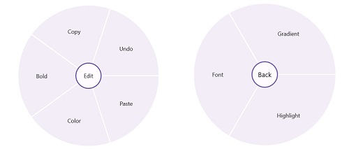
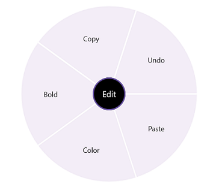
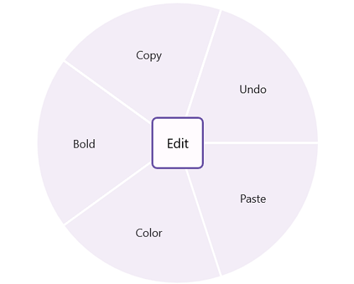
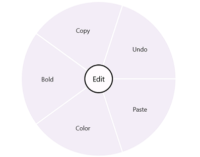
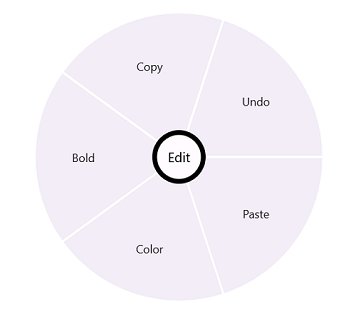
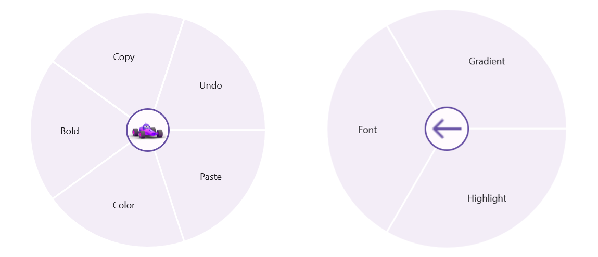

# CenterButton Customization in .NET MAUI Radial Menu (SfRadialMenu)

## Prerequisites

Before using the [SfTabView](https://help.syncfusion.com/cr/maui/Syncfusion.Maui.RadialMenu.SfRadialMenu.html), ensure the following NuGet package is installed in your .NET MAUI project:

- `Syncfusion.Maui.RadialMenu`

For step-by-step setup, refer to the [Getting Started](https://help.syncfusion.com/maui/radial-menu/getting-started) documentation.

## Overview

The center button (or back button) in the Radial Menu is the view at the center of the menu. It performs operations such as opening and closing the menu and navigating to the next-level items. You can customize the center button / back button with a `FontIcon`, a `Custom View`, and a text `Caption`.

## Properties Summary

| Property | Type | Default | Description |
| --- | --- | --- | --- |
| `CenterButtonText` | `string` | `string.Empty` | Text shown on the center button. |
| `CenterButtonBackText` | `string` | `string.Empty` | Text shown on the center back button. |
| `CenterButtonTextColor` | `Color` | `Colors.Black` | Foreground color of the center button text. |
| `CenterButtonBackTextColor` | `Color` | `Colors.Black` | Foreground color of the center back button text. |
| `CenterButtonBackgroundColor` | `Color` | `Colors.White` | Background color of the center button. |
| `CenterButtonRadius` | `double` | `0` | Corner radius (in device-independent units) of the center button. |
| `CenterButtonFontFamily` | `string` | `null` | Font family used by the center button text. |
| `CenterButtonBackFontFamily` | `string` | `null` | Font family used by the center back button text. |
| `CenterButtonFontSize` | `double` | `14` | Font size (in points) of the center button text. |
| `CenterButtonBackFontSize` | `double` | `14` | Font size (in points) of the center back button text. |
| `CenterButtonFontAttributes` | `FontAttributes` | `None` | Font attributes (e.g., `Bold`, `Italic`) for the center button text. |
| `CenterButtonBackFontAttributes` | `FontAttributes` | `None` | Font attributes for the center back button text. |
| `CenterButtonStroke` | `Color` | `Colors.Black` | Border color of the center button. |
| `CenterButtonStrokeThickness` | `double` | `1` | Border thickness of the center button. |
| `CenterButtonView` | `View` | `null` | Custom view rendered as the center button. |
| `CenterButtonBackView` | `View` | `null` | Custom view rendered as the center back button. |
| `EnableCenterButtonAnimation` | `bool` | `true` | Enables or disables the open/close animation of the center button. |
| `CenterButtonFontAutoScalingEnabled` | `bool` | `false` | Scales the center button font with the OS text size. Applies to both the center button and back button. |
| `CenterButtonSize` | `double` | `56` | Diameter (in device-independent units) of the center button. |

## CenterButtonText and CenterButtonBackText

The [`CenterButtonText`](https://help.syncfusion.com/cr/maui/Syncfusion.Maui.RadialMenu.SfRadialMenu.html#Syncfusion_Maui_RadialMenu_SfRadialMenu_CenterButtonText) changes the text of the center button in [`SfRadialMenu`](https://help.syncfusion.com/cr/maui/Syncfusion.Maui.RadialMenu.SfRadialMenu.html), and the [`CenterButtonBackText`](https://help.syncfusion.com/cr/maui/Syncfusion.Maui.RadialMenu.SfRadialMenu.html#Syncfusion_Maui_RadialMenu_SfRadialMenu_CenterButtonBackText) changes the text of the center back button.





<radialMenu:SfRadialMenu
                CenterButtonText="Edit"
                CenterButtonBackText="Back">
    <radialMenu:SfRadialMenu.Items>
        <radialMenu:SfRadialMenuItem Text="Bold" FontSize="12"/>
        <radialMenu:SfRadialMenuItem Text="Copy" FontSize="12"/>
        <radialMenu:SfRadialMenuItem Text="Undo" FontSize="12"/>
        <radialMenu:SfRadialMenuItem Text="Paste" FontSize="12"/>
        <radialMenu:SfRadialMenuItem Text="Color" FontSize="12">
            <radialMenu:SfRadialMenuItem.Items>
                <radialMenu:SfRadialMenuItem Text="Font" FontSize="12" ItemWidth="50"/>
                <radialMenu:SfRadialMenuItem Text="Gradient" FontSize="12" ItemWidth="50"/>
                <radialMenu:SfRadialMenuItem Text="Highlight" FontSize="12" ItemWidth="50"/>
            </radialMenu:SfRadialMenuItem.Items>
        </radialMenu:SfRadialMenuItem>
    </radialMenu:SfRadialMenu.Items>
</radialMenu:SfRadialMenu>
    



string[] mainItem = [ "Bold", "Copy", "Paste", "Undo", "Color" ];
string[] colorItem = ["Font", "Gradient", "Highlight"];

SfRadialMenu radialMenu = new SfRadialMenu()
{
    CenterButtonText = "Edit",
    CenterButtonBackText = "Back",
};

for (int i = 0; i < 5; i++)
{
    SfRadialMenuItem mainMenuItems = new SfRadialMenuItem();
    mainMenuItems.Text = mainItem[i];
    mainMenuItems.FontSize = 12;
    radialMenu.Items.Add(mainMenuItems);
}

for (int i = 0; i < 3; i++)
{
    SfRadialMenuItem colorSubMenuItem = new SfRadialMenuItem();
    colorSubMenuItem.Text = colorItem[i];
    colorSubMenuItem.FontSize = 12;
    colorSubMenuItem.ItemWidth = 50;
    radialMenu.Items[4].Items.Add(colorSubMenuItem);
}         




## CenterButtonTextColor and CenterButtonBackTextColor

The [`CenterButtonTextColor`](https://help.syncfusion.com/cr/maui/Syncfusion.Maui.RadialMenu.SfRadialMenu.html#Syncfusion_Maui_RadialMenu_SfRadialMenu_CenterButtonTextColor) changes the text color of the center button, and the [`CenterButtonBackTextColor`](https://help.syncfusion.com/cr/maui/Syncfusion.Maui.RadialMenu.SfRadialMenu.html#Syncfusion_Maui_RadialMenu_SfRadialMenu_CenterButtonBackTextColor) changes the text color of the center back button.





<?xml version="1.0" encoding="utf-8" ?>
<ContentPage xmlns="http://schemas.microsoft.com/dotnet/2021/maui"
             xmlns:x="http://schemas.microsoft.com/winfx/2009/xaml"
             xmlns:local="clr-namespace:RadialSample"
             xmlns:syncfusion="clr-namespace:Syncfusion.Maui.RadialMenu;assembly=Syncfusion.Maui.RadialMenu"
             x:Class="RadialSample.MainPage">
    <radialMenu:SfRadialMenu
                    CenterButtonTextColor="Blue"
                    CenterButtonText="Edit"
                    CenterButtonBackTextColor="Yellow"
                    CenterButtonBackText="Back">
        <radialMenu:SfRadialMenu.Items>
            <radialMenu:SfRadialMenuItem Text="Bold" 
                                         FontSize="12"/>
            <radialMenu:SfRadialMenuItem Text="Copy" 
                                         FontSize="12"/>
            <radialMenu:SfRadialMenuItem Text="Undo" 
                                         FontSize="12"/>
            <radialMenu:SfRadialMenuItem Text="Paste" 
                                         FontSize="12"/>
            <radialMenu:SfRadialMenuItem Text="Color" FontSize="12">
                <radialMenu:SfRadialMenuItem.Items>
                    <radialMenu:SfRadialMenuItem Text="Font" 
                                                 FontSize="12" 
                                                 ItemWidth="50"/>
                    <radialMenu:SfRadialMenuItem Text="Gradient" 
                                                 FontSize="12" 
                                                 ItemWidth="50"/>
                    <radialMenu:SfRadialMenuItem Text="Highlight" 
                                                 FontSize="12" 
                                                 ItemWidth="50"/>
                </radialMenu:SfRadialMenuItem.Items>
            </radialMenu:SfRadialMenuItem>
        </radialMenu:SfRadialMenu.Items>
    </radialMenu:SfRadialMenu>
</ContentPage>

    




using Syncfusion.Maui.RadialMenu;
using Microsoft.Maui.Controls;
using Microsoft.Maui.Graphics;

namespace RadialSample
{
    public partial class MainPage : ContentPage
    {
        public MainPage()
        {
            InitializeComponent();
            string[] mainItem = new string[] { "Bold", "Copy", "Paste", "Undo", "Color" };
            string[] colorItem = new string[] { "Font", "Gradient", "Highlight" };

            SfRadialMenu radialMenu = new SfRadialMenu()
            {
                CenterButtonText = "Edit",
                CenterButtonBackText = "Back",
                CenterButtonTextColor = Colors.Blue,
                CenterButtonBackTextColor = Colors.Yellow,
            };
            
            for (int i = 0; i < 5; i++)
            {
                SfRadialMenuItem mainMenuItems = new SfRadialMenuItem();
                mainMenuItems.Text = mainItem[i];
                mainMenuItems.FontSize = 12;
                radialMenu.Items.Add(mainMenuItems);
            }

            for (int i = 0; i < 3; i++)
            {
                SfRadialMenuItem colorSubMenuItem = new SfRadialMenuItem();
                colorSubMenuItem.Text = colorItem[i];
                colorSubMenuItem.FontSize = 12;
                colorSubMenuItem.ItemWidth = 50;
                radialMenu.Items[4].Items.Add(colorSubMenuItem);
            }

            this.Content = radialMenu;
        }
    }
}





## CenterButtonBackgroundColor

The [`CenterButtonBackgroundColor`](https://help.syncfusion.com/cr/maui/Syncfusion.Maui.RadialMenu.SfRadialMenu.html#Syncfusion_Maui_RadialMenu_SfRadialMenu_CenterButtonBackgroundColor) changes the background color of the center button.





<radialMenu:SfRadialMenu  CenterButtonBackgroundColor="#000000" 
                            CenterButtonText="Edit"
                            CenterButtonTextColor="White">
    <radialMenu:SfRadialMenu.Items>
        <radialMenu:SfRadialMenuItem Text="Bold" FontSize="12"/>
        <radialMenu:SfRadialMenuItem Text="Copy" FontSize="12"/>
        <radialMenu:SfRadialMenuItem Text="Undo" FontSize="12"/>
        <radialMenu:SfRadialMenuItem Text="Paste" FontSize="12"/>
        <radialMenu:SfRadialMenuItem Text="Color" FontSize="12"/>
    </radialMenu:SfRadialMenu.Items>
</radialMenu:SfRadialMenu>
    




SfRadialMenu radialMenu = new SfRadialMenu()
{
    CenterButtonBackgroundColor = Color.FromArgb("#000000"),
    CenterButtonText = "Edit",
    CenterButtonTextColor = Colors.White,
    Items =  new RadialMenuItemsCollection()
    {
        new SfRadialMenuItem() { Text = "Bold", FontSize = 12 },
        new SfRadialMenuItem() { Text = "Copy", FontSize = 12 },
        new SfRadialMenuItem() { Text = "Paste", FontSize = 12 },
        new SfRadialMenuItem() { Text = "Undo", FontSize = 12 },
        new SfRadialMenuItem() { Text = "Color", FontSize = 12 },
    },
};





## CenterButtonRadius

The [`CenterButtonRadius`](https://help.syncfusion.com/cr/maui/Syncfusion.Maui.RadialMenu.SfRadialMenu.html#Syncfusion_Maui_RadialMenu_SfRadialMenu_CenterButtonRadius) changes the radius of the center button.





<radialMenu:SfRadialMenu CenterButtonText="Edit" CenterButtonRadius="5">
    <radialMenu:SfRadialMenu.Items>
        <radialMenu:SfRadialMenuItem Text="Bold" FontSize="12"/>
        <radialMenu:SfRadialMenuItem Text="Copy" FontSize="12"/>
        <radialMenu:SfRadialMenuItem Text="Undo" FontSize="12"/>
        <radialMenu:SfRadialMenuItem Text="Paste" FontSize="12"/>
        <radialMenu:SfRadialMenuItem Text="Color" FontSize="12"/>
    </radialMenu:SfRadialMenu.Items>
</radialMenu:SfRadialMenu>





SfRadialMenu radialMenu = new SfRadialMenu()
{
    CenterButtonText="Edit",
    CenterButtonRadius = 5,
    Items =  new RadialMenuItemsCollection()
    {
        new SfRadialMenuItem() { Text = "Bold", FontSize = 12 },
        new SfRadialMenuItem() { Text = "Copy", FontSize = 12 },
        new SfRadialMenuItem() { Text = "Paste", FontSize = 12 },
        new SfRadialMenuItem() { Text = "Undo", FontSize = 12 },
        new SfRadialMenuItem() { Text = "Color", FontSize = 12 },
    },
};
            





## CenterButtonFontFamily and CenterButtonBackFontFamily

The [`CenterButtonFontFamily`](https://help.syncfusion.com/cr/maui/Syncfusion.Maui.RadialMenu.SfRadialMenu.html#Syncfusion_Maui_RadialMenu_SfRadialMenu_CenterButtonFontFamily) changes the font family of the center button, and the [`CenterButtonBackFontFamily`](https://help.syncfusion.com/cr/maui/Syncfusion.Maui.RadialMenu.SfRadialMenu.html#Syncfusion_Maui_RadialMenu_SfRadialMenu_CenterButtonBackFontFamily) changes the font family of the center back button.





<radialMenu:SfRadialMenu CenterButtonBackFontFamily="Maui Material Assets"
                CenterButtonBackText="&#xe72d;"
                CenterButtonFontFamily="Maui Material Assets"
                CenterButtonText="&#xe710;">
    <radialMenu:SfRadialMenu.Items>
        <radialMenu:SfRadialMenuItem Text="Bold" FontSize="12"/>
        <radialMenu:SfRadialMenuItem Text="Copy" FontSize="12"/>
        <radialMenu:SfRadialMenuItem Text="Undo" FontSize="12"/>
        <radialMenu:SfRadialMenuItem Text="Paste" FontSize="12"/>
        <radialMenu:SfRadialMenuItem Text="Color" FontSize="12">
            <radialMenu:SfRadialMenuItem.Items>
                <radialMenu:SfRadialMenuItem Text="Font" FontSize="12"  ItemWidth="50"/>
                <radialMenu:SfRadialMenuItem Text="Gradient" FontSize="12" ItemWidth="50"/>
                <radialMenu:SfRadialMenuItem Text="Highlight" FontSize="12" ItemWidth="50"/>
            </radialMenu:SfRadialMenuItem.Items>
        </radialMenu:SfRadialMenuItem>
    </radialMenu:SfRadialMenu.Items>
</radialMenu:SfRadialMenu>
    




string[] mainItem = new string[] { "Bold", "Copy", "Paste", "Undo", "Color" };
string[] colorItem = new string[] { "Font", "Gradient", "Highlight" };
SfRadialMenu radialMenu = new SfRadialMenu()
{
    CenterButtonBackFontFamily="Maui Material Assets",
    CenterButtonBackText="\ue72d",
    CenterButtonFontFamily="Maui Material Assets",
    CenterButtonText="\ue710",
};

for (int i = 0; i < 5; i++)
{
    SfRadialMenuItem mainMenuItems = new SfRadialMenuItem();
    mainMenuItems.Text = mainItem[i];
    mainMenuItems.FontSize = 12;
    radialMenu.Items.Add(mainMenuItems);
}

for (int i = 0; i < 3; i++)
{
    SfRadialMenuItem colorSubMenuItem = new SfRadialMenuItem();
    colorSubMenuItem.Text = colorItem[i];
    colorSubMenuItem.FontSize = 12;
    colorSubMenuItem.ItemWidth = 50;
    radialMenu.Items[4].Items.Add(colorSubMenuItem);
}





## CenterButtonFontSize and CenterButtonBackFontSize

The [`CenterButtonFontSize`](https://help.syncfusion.com/cr/maui/Syncfusion.Maui.RadialMenu.SfRadialMenu.html#Syncfusion_Maui_RadialMenu_SfRadialMenu_CenterButtonFontSize) changes the font size of the center button, and the [`CenterButtonBackFontSize`](https://help.syncfusion.com/cr/maui/Syncfusion.Maui.RadialMenu.SfRadialMenu.html?tabs=tabid-1%2Ctabid-3%2Ctabid-36#Syncfusion_Maui_RadialMenu_SfRadialMenu_CenterButtonBackFontSize) changes the font size of the center back button.





<radialMenu:SfRadialMenu CenterButtonBackFontFamily="Maui Material Assets"
                CenterButtonBackFontSize="28"
                CenterButtonBackText="&#xe72d;"
                CenterButtonFontFamily="Maui Material Assets"
                CenterButtonFontSize="20"
                CenterButtonText="&#xe710;">
    <radialMenu:SfRadialMenu.Items>
        <radialMenu:SfRadialMenuItem Text="Bold" 
                                        FontSize="12"/>
        <radialMenu:SfRadialMenuItem Text="Copy" 
                                        FontSize="12"/>
        <radialMenu:SfRadialMenuItem Text="Undo" 
                                        FontSize="12"/>
        <radialMenu:SfRadialMenuItem Text="Paste" 
                                        FontSize="12"/>
        <radialMenu:SfRadialMenuItem Text="Color" FontSize="12">
            <radialMenu:SfRadialMenuItem.Items>
                <radialMenu:SfRadialMenuItem Text="Font" 
                                                FontSize="12" 
                                                ItemWidth="50"/>
                <radialMenu:SfRadialMenuItem Text="Gradient" 
                                                FontSize="12" 
                                                ItemWidth="50"/>
                <radialMenu:SfRadialMenuItem Text="Highlight" 
                                                FontSize="12" 
                                                ItemWidth="50"/>
            </radialMenu:SfRadialMenuItem.Items>
        </radialMenu:SfRadialMenuItem>
    </radialMenu:SfRadialMenu.Items>
</radialMenu:SfRadialMenu>
    




string[] mainItem = new string[] { "Bold", "Copy", "Paste", "Undo", "Color" };
string[] colorItem = new string[] { "Font", "Gradient", "Highlight" };
SfRadialMenu radialMenu = new SfRadialMenu()
{
    CenterButtonBackFontFamily="Maui Material Assets",
    CenterButtonBackFontSize=28,
    CenterButtonBackText="\ue72d",
    CenterButtonFontFamily="Maui Material Assets",
    CenterButtonFontSize=20,
    CenterButtonText="\ue710",
};

for (int i = 0; i < 5; i++)
{
    SfRadialMenuItem mainMenuItems = new SfRadialMenuItem();
    mainMenuItems.Text = mainItem[i];
    mainMenuItems.FontSize = 12;
    radialMenu.Items.Add(mainMenuItems);
}

for (int i = 0; i < 3; i++)
{
    SfRadialMenuItem colorSubMenuItem = new SfRadialMenuItem();
    colorSubMenuItem.Text = colorItem[i];
    colorSubMenuItem.FontSize = 12;
    colorSubMenuItem.ItemWidth = 50;
    radialMenu.Items[4].Items.Add(colorSubMenuItem);
}





## CenterButtonFontAttributes and CenterButtonBackFontAttributes

The [`CenterButtonFontAttributes`](https://help.syncfusion.com/cr/maui/Syncfusion.Maui.RadialMenu.SfRadialMenu.html#Syncfusion_Maui_RadialMenu_SfRadialMenu_CenterButtonFontAttributes) sets the font attributes (for example, `Bold` or `Italic`) of the center button. The [`CenterButtonBackFontAttributes`](https://help.syncfusion.com/cr/maui/Syncfusion.Maui.RadialMenu.SfRadialMenu.html#Syncfusion_Maui_RadialMenu_SfRadialMenu_CenterButtonBackFontAttributes) does the same for the center back button.





<radialMenu:SfRadialMenu CenterButtonText="Edit"
                            CenterButtonBackText="Back"
                            CenterButtonFontAttributes="Bold"
                            CenterButtonBackFontAttributes="Bold">
    <radialMenu:SfRadialMenu.Items>
        <radialMenu:SfRadialMenuItem Text="Bold"
                                        FontSize="12"/>
        <radialMenu:SfRadialMenuItem Text="Copy"
                                        FontSize="12"/>
        <radialMenu:SfRadialMenuItem Text="Undo"
                                        FontSize="12"/>
        <radialMenu:SfRadialMenuItem Text="Paste"
                                        FontSize="12"/>
        <radialMenu:SfRadialMenuItem Text="Color" FontSize="12">
            <radialMenu:SfRadialMenuItem.Items>
                <radialMenu:SfRadialMenuItem Text="Font"
                                                FontSize="12"
                                                ItemWidth="50"/>
                <radialMenu:SfRadialMenuItem Text="Gradient"
                                                FontSize="12"
                                                ItemWidth="50"/>
                <radialMenu:SfRadialMenuItem Text="Highlight"
                                                FontSize="12"
                                                ItemWidth="50"/>
            </radialMenu:SfRadialMenuItem.Items>
        </radialMenu:SfRadialMenuItem>
    </radialMenu:SfRadialMenu.Items>
</radialMenu:SfRadialMenu>
    



string[] mainItem = new string[] { "Bold", "Copy", "Paste", "Undo", "Color" };
string[] colorItem = new string[] { "Font", "Gradient", "Highlight" };
SfRadialMenu radialMenu = new SfRadialMenu()
{
    CenterButtonText = "Edit",
    CenterButtonBackText = "Back",
    CenterButtonFontAttributes = FontAttributes.Bold,
    CenterButtonBackFontAttributes = FontAttributes.Bold,
};

for (int i = 0; i < 5; i++)
{
    SfRadialMenuItem mainMenuItems = new SfRadialMenuItem();
    mainMenuItems.Text = mainItem[i];
    mainMenuItems.FontSize = 12;
    radialMenu.Items.Add(mainMenuItems);
}

for (int i = 0; i < 3; i++)
{
    SfRadialMenuItem colorSubMenuItem = new SfRadialMenuItem();
    colorSubMenuItem.Text = colorItem[i];
    colorSubMenuItem.FontSize = 12;
    colorSubMenuItem.ItemWidth = 50;
    radialMenu.Items[4].Items.Add(colorSubMenuItem);
}
            



## CenterButtonStroke

The [`CenterButtonStroke`](https://help.syncfusion.com/cr/maui/Syncfusion.Maui.RadialMenu.SfRadialMenu.html#Syncfusion_Maui_RadialMenu_SfRadialMenu_CenterButtonStroke) property changes the stroke color of the center button in the [`SfRadialMenu`](https://help.syncfusion.com/cr/maui/Syncfusion.Maui.RadialMenu.SfRadialMenu.html).





<radialMenu:SfRadialMenu CenterButtonText="Edit" CenterButtonStroke="Black">
    <radialMenu:SfRadialMenu.Items>
        <radialMenu:SfRadialMenuItem Text="Bold" FontSize="12"/>
        <radialMenu:SfRadialMenuItem Text="Copy" FontSize="12"/>
        <radialMenu:SfRadialMenuItem Text="Undo" FontSize="12"/>
        <radialMenu:SfRadialMenuItem Text="Paste" FontSize="12"/>
        <radialMenu:SfRadialMenuItem Text="Color" FontSize="12"/>
    </radialMenu:SfRadialMenu.Items>
</radialMenu:SfRadialMenu>
    




SfRadialMenu radialMenu = new SfRadialMenu()
{
    CenterButtonStroke = Colors.Black,
    CenterButtonText="Edit",
};

RadialMenuItemsCollection itemCollection =  new RadialMenuItemsCollection()
{
    new SfRadialMenuItem() { Text = "Bold", FontSize = 12 },
    new SfRadialMenuItem() { Text = "Copy", FontSize = 12 },
    new SfRadialMenuItem() { Text = "Paste", FontSize = 12 },
    new SfRadialMenuItem() { Text = "Undo", FontSize = 12 },
    new SfRadialMenuItem() { Text = "Color", FontSize = 12 },
};
radialMenu.Items = itemCollection;





## CenterButtonStrokeThickness

The [`CenterButtonStrokeThickness`](https://help.syncfusion.com/cr/maui/Syncfusion.Maui.RadialMenu.SfRadialMenu.html#Syncfusion_Maui_RadialMenu_SfRadialMenu_CenterButtonStrokeThickness) changes the stroke thickness of the center button in [`SfRadialMenu`](https://help.syncfusion.com/cr/maui/Syncfusion.Maui.RadialMenu.SfRadialMenu.html).





<radialMenu:SfRadialMenu CenterButtonText="Edit"
                            CenterButtonStroke="Black"
                            CenterButtonStrokeThickness="5">
    <radialMenu:SfRadialMenu.Items>
        <radialMenu:SfRadialMenuItem Text="Bold" FontSize="12"/>
        <radialMenu:SfRadialMenuItem Text="Copy" FontSize="12"/>
        <radialMenu:SfRadialMenuItem Text="Undo" FontSize="12"/>
        <radialMenu:SfRadialMenuItem Text="Paste" FontSize="12"/>
        <radialMenu:SfRadialMenuItem Text="Color" FontSize="12"/>
    </radialMenu:SfRadialMenu.Items>
</radialMenu:SfRadialMenu>
    




SfRadialMenu radialMenu = new SfRadialMenu()
{
    CenterButtonText="Edit",
    CenterButtonStroke = Colors.Black,
    CenterButtonStrokeThickness = 5,
    Items =  new RadialMenuItemsCollection()
    {
        new SfRadialMenuItem() { Text = "Bold", FontSize = 12 },
        new SfRadialMenuItem() { Text = "Copy", FontSize = 12 },
        new SfRadialMenuItem() { Text = "Paste", FontSize = 12 },
        new SfRadialMenuItem() { Text = "Undo", FontSize = 12 },
        new SfRadialMenuItem() { Text = "Color", FontSize = 12 },
    },
};
           




## CenterButtonView and CenterButtonBackView

You can customize the center button using [`CenterButtonView`](https://help.syncfusion.com/cr/maui/Syncfusion.Maui.RadialMenu.SfRadialMenu.html#Syncfusion_Maui_RadialMenu_SfRadialMenu_CenterButtonView) and the center back button using [`CenterButtonBackView`](https://help.syncfusion.com/cr/maui/Syncfusion.Maui.RadialMenu.SfRadialMenu.html#Syncfusion_Maui_RadialMenu_SfRadialMenu_CenterButtonBackView) in  [`SfRadialMenu`](https://help.syncfusion.com/cr/maui/Syncfusion.Maui.RadialMenu.SfRadialMenu.html).





<radialMenu:SfRadialMenu x:Name="radialMenu">
    <radialMenu:SfRadialMenu.CenterButtonView>
        <Grid>
            <StackLayout VerticalOptions="Center">
                <Image Source="dotnet_bot.png"/>
            </StackLayout>
        </Grid>
    </radialMenu:SfRadialMenu.CenterButtonView>
    <radialMenu:SfRadialMenu.CenterButtonBackView>
        <Grid>
            <StackLayout VerticalOptions="Center">
                <Image Source="backicon.png"/>
            </StackLayout>
        </Grid>
    </radialMenu:SfRadialMenu.CenterButtonBackView>
        <radialMenu:SfRadialMenu.Items>
                <radialMenu:SfRadialMenuItem Text="Bold" 
                                                FontSize="12"/>
                <radialMenu:SfRadialMenuItem Text="Copy" 
                                                FontSize="12"/>
                <radialMenu:SfRadialMenuItem Text="Undo" 
                                                FontSize="12"/>
                <radialMenu:SfRadialMenuItem Text="Paste" 
                                                FontSize="12"/>
                <radialMenu:SfRadialMenuItem Text="Color" FontSize="12">
                    <radialMenu:SfRadialMenuItem.Items>
                        <radialMenu:SfRadialMenuItem Text="Font" 
                                                        FontSize="12" 
                                                        ItemWidth="50"/>
                        <radialMenu:SfRadialMenuItem Text="Gradient" 
                                                        FontSize="12" 
                                                        ItemWidth="50"/>
                        <radialMenu:SfRadialMenuItem Text="Highlight" 
                                                        FontSize="12" 
                                                        ItemWidth="50"/>
                    </radialMenu:SfRadialMenuItem.Items>
                </radialMenu:SfRadialMenuItem>
    </radialMenu:SfRadialMenu.Items>
</radialMenu:SfRadialMenu>





string[] mainItem = new string[] { "Bold", "Copy", "Paste", "Undo", "Color" };
string[] colorItem = new string[] { "Font", "Gradient", "Highlight" };
Grid centerButtonGrid = new Grid();
Grid centerButtonBackGrid = new Grid();
StackLayout centerButtonLayout = new StackLayout()
{
    VerticalOptions = LayoutOptions.Center
};
StackLayout centerButtonBackLayout = new StackLayout()
{
    VerticalOptions = LayoutOptions.Center
};

centerButtonLayout.Children.Add(new Image() { Source = "dotnet_bot.png" });
centerButtonGrid.Children.Add(centerButtonLayout);
centerButtonBackLayout.Children.Add(new Image() { Source = "backicon.png" });
centerButtonBackGrid.Children.Add(centerButtonBackLayout);

SfRadialMenu radialMenu = new SfRadialMenu()
{
    CenterButtonView = centerButtonGrid,
    CenterButtonBackView = centerButtonBackGrid
};

for (int i = 0; i < 5; i++)
{
    SfRadialMenuItem mainMenuItems = new SfRadialMenuItem();
    mainMenuItems.Text = mainItem[i];
    mainMenuItems.FontSize = 12;
    radialMenu.Items.Add(mainMenuItems);
}

for (int i = 0; i < 3; i++)
{
    SfRadialMenuItem colorSubMenuItem = new SfRadialMenuItem();
    colorSubMenuItem.Text = colorItem[i];
    colorSubMenuItem.FontSize = 12;
    colorSubMenuItem.ItemWidth = 50;
    radialMenu.Items[4].Items.Add(colorSubMenuItem);
}





## EnableCenterButtonAnimation

The [`EnableCenterButtonAnimation`](https://help.syncfusion.com/cr/maui/Syncfusion.Maui.RadialMenu.SfRadialMenu.html#Syncfusion_Maui_RadialMenu_SfRadialMenu_EnableCenterButtonAnimation) property allows you to enable or disable animation of the center button in the [`SfRadialMenu`](https://help.syncfusion.com/cr/maui/Syncfusion.Maui.RadialMenu.SfRadialMenu.html).





<radialMenu:SfRadialMenu  EnableCenterButtonAnimation="True">
    <radialMenu:SfRadialMenu.Items>
        <radialMenu:SfRadialMenuItem Text="Bold" FontSize="12"/>
        <radialMenu:SfRadialMenuItem Text="Copy" FontSize="12"/>
        <radialMenu:SfRadialMenuItem Text="Undo" FontSize="12"/>
        <radialMenu:SfRadialMenuItem Text="Paste" FontSize="12"/>
        <radialMenu:SfRadialMenuItem Text="Color" FontSize="12"/>
    </radialMenu:SfRadialMenu.Items>
</radialMenu:SfRadialMenu>
    



SfRadialMenu radialMenu = new SfRadialMenu()
{
    EnableCenterButtonAnimation = true,
    Items =  new RadialMenuItemsCollection()
    {
        new SfRadialMenuItem() { Text = "Bold", FontSize = 12 },
        new SfRadialMenuItem() { Text = "Copy", FontSize = 12 },
        new SfRadialMenuItem() { Text = "Paste", FontSize = 12 },
        new SfRadialMenuItem() { Text = "Undo", FontSize = 12 },
        new SfRadialMenuItem() { Text = "Color", FontSize = 12 },
    },
};




## CenterButtonFontAutoScalingEnabled

The [CenterButtonFontAutoScalingEnabled](https://help.syncfusion.com/cr/maui/Syncfusion.Maui.RadialMenu.SfRadialMenu.html#Syncfusion_Maui_RadialMenu_SfRadialMenu_CenterButtonFontAutoScalingEnabled) property is used to automatically scale the Radial Menu's center button font size based on the operating system's text size. The default value of the `CenterButtonFontAutoScalingEnabled` property is `false`. This property applies to both the [`CenterButtonText`](https://help.syncfusion.com/cr/maui/Syncfusion.Maui.RadialMenu.SfRadialMenu.html#Syncfusion_Maui_RadialMenu_SfRadialMenu_CenterButtonText) and the [`CenterButtonBackText`](https://help.syncfusion.com/cr/maui/Syncfusion.Maui.RadialMenu.SfRadialMenu.html#Syncfusion_Maui_RadialMenu_SfRadialMenu_CenterButtonBackText).





 <radialMenu:SfRadialMenu  CenterButtonFontAutoScalingEnabled="True">
 </radialMenu:SfRadialMenu>
    




SfRadialMenu radialMenu = new SfRadialMenu()
{
    CenterButtonFontAutoScalingEnabled = true,
};





## CenterButtonSize

You can customize the size of the Radial Menu’s center button using the [CenterButtonSize](https://help.syncfusion.com/cr/maui/Syncfusion.Maui.RadialMenu.SfRadialMenu.html#Syncfusion_Maui_RadialMenu_SfRadialMenu_CenterButtonSize) property. The default value of the `CenterButtonSize` property is `56`.





 <radialMenu:SfRadialMenu  CenterButtonSize="80">
 </radialMenu:SfRadialMenu>
    




SfRadialMenu radialMenu = new SfRadialMenu()
{
    CenterButtonSize = 80,
};





## StartAngle

You can adjust the starting angle at which the radial menu items are arranged by using the [StartAngle](https://help.syncfusion.com/cr/maui/Syncfusion.Maui.RadialMenu.SfRadialMenu.html#Syncfusion_Maui_RadialMenu_SfRadialMenu_StartAngle) property. The default value of the `StartAngle` property is `0`.





 <radialMenu:SfRadialMenu  StartAngle="50">
 </radialMenu:SfRadialMenu>
    




SfRadialMenu radialMenu = new SfRadialMenu()
{
    StartAngle = 50,
};





## Image Assets for `CenterButtonView`

When you assign a custom view that contains an `Image` (such as `dotnet_bot.png` or `backicon.png` in the examples above), add the image to your MAUI project as a **MauiImage** build action and place it under `Resources/Images/`. Then register it in `MauiProgram.cs`:





builder.Logging.AddDebug();
builder.ConfigureFonts(fonts =>
{
    fonts.AddFont("MauiMaterialAssets.ttf", "Maui Material Assets");
});





For fonts (for example, `Maui Material Assets`), copy the `.ttf` file to `Resources/Fonts/`, set the build action to **MauiFont**, and register the font in `ConfigureFonts` as shown above. Without registration, the center button text will appear as the literal glyph code (for example, `\ue710`) instead of the icon.

## Troubleshooting

| Issue | Likely cause | Fix |
| --- | --- | --- |
| Center button text is blank. | `CenterButtonText` is not set or `CenterButtonView` is overriding it. | Set `CenterButtonText` explicitly, or remove `CenterButtonView`. |
| `CenterButtonView` image does not render. | The image is missing from `Resources/Images/`, the build action is wrong, or the file name is case-mismatched. | Add the image as a `MauiImage`, set the build action, and verify the `Source` matches the file name (case-sensitive on iOS/Android). |
| Font icon shows the literal code (e.g., `\ue710`). | The font file is not registered in `MauiProgram.cs`. | Register the font in `ConfigureFonts` and confirm the `.ttf` file's build action is `MauiFont`. |
| `RadialMenuItemsCollection` does not compile. | Missing `using Syncfusion.Maui.RadialMenu;`. | Add the `using` directive and rebuild. |
| `Colors` / `Color.FromArgb` are unresolved. | Missing `using Microsoft.Maui.Graphics;`. | Add the `using` directive. |
| `FontAttributes` is unresolved. | Missing `using Microsoft.Maui.Controls;`. | Add the `using` directive. |
| `CenterButtonRadius` change has no visible effect. | The center button is clipped by the rim. | Increase `CenterButtonSize` so the radius can be applied within the visible area. |

## See also

- [Getting Started with .NET MAUI Radial Menu](https://help.syncfusion.com/maui/radial-menu/getting-started)
- [SfRadialMenuItem’s Customization in MAUI Radial Menu](https://help.syncfusion.com/maui/radial-menu/sfradialmenuitem-customization)
- [Segmenting and Placing Items in .NET MAUI Radial Menu](https://help.syncfusion.com/maui/radial-menu/segmenting-placing-items)
- [CenterButton Customization in MAUI Radial Menu](https://help.syncfusion.com/maui/radial-menu/centerbutton-customization)
- [Events in .NET MAUI Radial Menu](https://help.syncfusion.com/maui/radial-menu/events)
- [Placing and Dragging in MAUI Radial Menu](https://help.syncfusion.com/maui/radial-menu/place-and-drag-radialmenu)