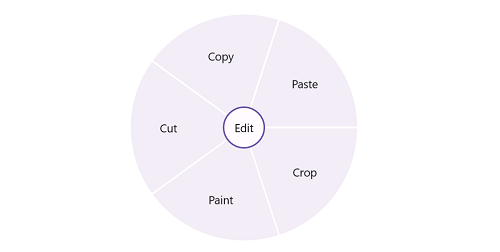

# Getting Started with .NET MAUI Radial Menu

This section guides you through setting up and configuring a [RadialMenu](https://help.syncfusion.com/cr/maui/Syncfusion.Maui.RadialMenu.html) in your .NET MAUI application. Follow the steps below to add a basic [RadialMenu](https://help.syncfusion.com/cr/maui/Syncfusion.Maui.RadialMenu.html) to your project.

To get start quickly with our .NET MAUI RadialMenu, you can check the below video.



## Prerequisites

Before proceeding, ensure the following are set up:
1. Install [.NET 7 SDK](https://dotnet.microsoft.com/en-us/download/dotnet/7.0) or later is installed.
2. Set up a .NET MAUI environment with Visual Studio 2022 (v17.3 or later) or VS Code. For VS Code users, ensure that the .NET MAUI workload is installed and configured as described [here.](https://learn.microsoft.com/en-us/dotnet/maui/get-started/installation?view=net-maui-8.0&tabs=visual-studio-code)

## Step 1: Create a New MAUI Project

1. Launch Visual Studio or VS Code.
1. Navigate to **File > New > Project,** then select the **.NET MAUI App** template.
1. Name the project and choose a location, then click Create.

## Step 2: Install the Syncfusion MAUI Core NuGet Package

1. In **Solution Explorer,** right-click the project and choose **Manage NuGet Packages.**
1. Search for [Syncfusion.Maui.Core](https://www.nuget.org/packages/Syncfusion.Maui.Core/) and install the latest version.
1. Ensure the necessary dependencies are installed correctly, and the project is restored.

## Step 3: Register the handler

Syncfusion.Maui.Core NuGet is a dependent package for all Syncfusion controls of .NET MAUI. In the MauiProgram.cs file, register the handler for Syncfusion core.




    
    using Syncfusion.Maui.Core.Hosting;
    public static class MauiProgram
    {
	    public static MauiApp CreateMauiApp()
	    {
	        var builder = MauiApp.CreateBuilder();
		    builder
			    .ConfigureSyncfusionCore()
			    .UseMauiApp<App>()
			    .ConfigureFonts(fonts =>
			    {
				    fonts.AddFont("OpenSans-Regular.ttf", "OpenSansRegular");
				    fonts.AddFont("OpenSans-Semibold.ttf", "OpenSansSemibold");
			    });

		    return builder.Build();
	    }
    }



l
## Step 4:  Add a RadialMenu

1. To initialize the control, import the Radialmenu namespace into your code.
1. Initialize [RadialMenu](https://help.syncfusion.com/cr/maui/Syncfusion.Maui.RadialMenu.html)



<ContentPage
    . . .    
    xmlns:syncfusion="clr-namespace:Syncfusion.Maui.RadialMenu;assembly=Syncfusion.Maui.RadialMenu">
    <StackLayout>
        <syncfusion:SfRadialMenu />
    </StackLayout>
</ContentPage>

    




using Syncfusion.Maui.RadialMenu;
namespace RadialMenuGettingStarted
{
    public partial class MainPage : ContentPage
    {
        public MainPage()
        {
            InitializeComponent();           
            StackLayout stackLayout = new StackLayout();
            SfRadialMenu radialMenu = new SfRadialMenu();
            stackLayout.Children.Add(syncfusion);
            this.Content = stackLayout;
        }
    }   
}




## Step 5:  Adding radial menu with items





<ContentPage 
            ...
             xmlns:syncfusion="clr-namespace:Syncfusion.Maui.RadialMenu;assembly=Syncfusion.Maui.RadialMenu">
        <syncfusion:SfRadialMenu x:Name="radialMenu" 
                                CenterButtonText="Edit"
                                CenterButtonFontSize="15">
            <syncfusion:SfRadialMenu.Items>
                <syncfusion:SfRadialMenuItem Text="Cut"
                                            FontSize="15"/>
                <syncfusion:SfRadialMenuItem Text="Copy"
                                            FontSize="15"/>
                <syncfusion:SfRadialMenuItem Text="Paste"
                                            FontSize="15"/>
                <syncfusion:SfRadialMenuItem Text="Crop"
                                            FontSize="15"/>
                <syncfusion:SfRadialMenuItem Text="Paint"
                                            FontSize="15"/>
            </syncfusion:SfRadialMenu.Items>
        </syncfusion:SfRadialMenu>
</ContentPage>





using Syncfusion.Maui.RadialMenu;

namespace RadialSample
{
    public partial class MainPage : ContentPage
    {
        public MainPage()
        {
            InitializeComponent();

            SfRadialMenu radialMenu = new SfRadialMenu()
            {
                CenterButtonText = "Edit",
                CenterButtonFontSize = 15
            };

            RadialMenuItemsCollection itemCollection = new RadialMenuItemsCollection();
            itemCollection.Add(new SfRadialMenuItem()
            {
                Text = "Cut",
                FontSize = 15
            });
            itemCollection.Add(new SfRadialMenuItem()
            {
                Text = "Copy",
                FontSize = 15
            });
            itemCollection.Add(new SfRadialMenuItem()
            {
                Text = "Paste",
                FontSize = 15
            });
            itemCollection.Add(new SfRadialMenuItem()
            {
                Text = "Crop",
                FontSize = 15
            });
            itemCollection.Add(new SfRadialMenuItem()
            {
                Text = "Paint",
                FontSize = 15
            });
            radialMenu.Items = itemCollection;
            this.Content = radialMenu;
        }
    }
}





N> You can find the getting started sample of .NET MAUI SfRadialMenu from this [link.](https://github.com/SyncfusionExamples/Getting-Started-with-.NET-MAUI-Radial-Menu)

