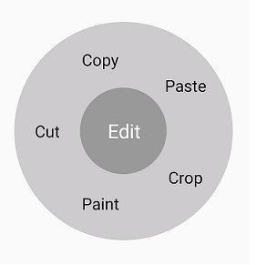

# Creating an application with .NET MAUI Radial Menu

This section explains the steps required to work with the [`SfRadioMenu`](https://help.syncfusion.com/cr/maui/Syncfusion.Maui.Buttons.SfRadialMenu.html) control for .NET MAUI.

To get start quickly with our .NET MAUI Radio Button, you can check the below video.



## Adding a .NET MAUI Radio Menu reference

Syncfusion .NET MAUI controls are available on [Nuget.org](https://www.nuget.org/). To add the [.NET MAUI Radial Menu](https://www.syncfusion.com/maui-controls/maui-radial-menu) to your project, open the NuGet Package Manager in Visual Studio, search for Syncfusion.Maui.RadialMenu, and install it.

## Handler registration 

In the MauiProgram.cs file, register the handler for the Syncfusion core.



using Microsoft.Maui;
using Microsoft.Maui.Hosting;
using Microsoft.Maui.Controls.Compatibility;
using Microsoft.Maui.Controls.Hosting;
using Microsoft.Maui.Controls.Xaml;
using Syncfusion.Maui.Core.Hosting;

namespace ButtonSample
{
    public static class MauiProgram
    {
        public static MauiApp CreateMauiApp()
        {
            var builder = MauiApp.CreateBuilder();
            builder
            .UseMauiApp<App>()
            .ConfigureSyncfusionCore()
            .ConfigureFonts(fonts =>
            {
                fonts.AddFont("OpenSans-Regular.ttf", "OpenSansRegular");
            });

            return builder.Build();
        }      
    }
}   



## Create a Simple .NET MAUI SfRadioButton

Step 1: Add the NuGet to the project as discussed in the above reference section. 

Step 2: Add the namespace as shown in the following code sample.




    xmlns:syncfusion="clr-namespace:Syncfusion.Maui.RadialMenu;assembly=Syncfusion.Maui.RadialMenu"




    using Syncfusion.Maui.RadialMenu;




Step 3: Set the control to content in `ContentPage`.




    <?xml version="1.0" encoding="utf-8">
    <ContentPage    xmlns="http://schemas.microsoft.com/dotnet/2021/maui"
                    xmlns:x="http://schemas.microsoft.com/winfx/2009/xaml"
                    xmlns:local="clr-namespace:GettingStarted"
	                xmlns:syncfusion="clr-namespace:Syncfusion.Maui.RadialMenu;assembly=Syncfusion.Maui.RadialMenu" 
	                x:Class="GettingStarted.MainPage">
        <ContentPage.Content>
            <StackLayout>
                <syncfusion:SfRadialMenu x:Name="syncfusion"/>        
            </StackLayout>
        </ContentPage.Content>
     </ContentPage>




    using Syncfusion.Maui.RadialMenu;

    namespace GettingStarted
    {
        public partial class MainPage : ContentPage
        {
            public MainPage()
            {
                InitializeComponent();
                StackLayout stackLayout = new StackLayout();
                SfRadialMenu syncfusion = new SfRadialMenu();
                stackLayout.Children.Add(syncfusion);
                this.Content = syncfusion;
            }
        }
    }




### Adding radial menu with items





<?xml version="1.0" encoding="utf-8" ?>
<ContentPage xmlns="http://schemas.microsoft.com/dotnet/2021/maui"
             xmlns:x="http://schemas.microsoft.com/winfx/2009/xaml"
             xmlns:local="clr-namespace:RadialSample"
             xmlns:syncfusion="clr-namespace:Syncfusion.Maui.RadialMenu;assembly=Syncfusion.Maui.RadialMenu" 
             x:Class="RadialSample.MainPage">
    <syncfusion:SfRadialMenu x:Name="radialMenu" 
                             CenterButtonText="Edit"
                             CenterButtonFontSize="15">
        <syncfusion:SfRadialMenu.Items>
            <syncfusion:SfRadialMenuItem Text="Cut"
                                         FontSize="15"/>
            <syncfusion:SfRadialMenuItem Text="Copy"
                                         FontSize="15"/>
            <syncfusion:SfRadialMenuItem Text="Paste"
                                         FontSize="15"/>
            <syncfusion:SfRadialMenuItem Text="Crop"
                                         FontSize="15"/>
            <syncfusion:SfRadialMenuItem Text="Paint"
                                         FontSize="15"/>
        </syncfusion:SfRadialMenu.Items>
    </syncfusion:SfRadialMenu>
</ContentPage>





using Syncfusion.SfRadialMenu.XForms;
using System.Collections.ObjectModel;
using MAUI.Forms;

namespace RadialSample
{
    public partial class MainPage : ContentPage
    {
        public MainPage()
        {
            InitializeComponent();
            SfRadialMenu syncfusion = new SfRadialMenu()
            {
                CenterButtonText = "Edit",
                CenterButtonFontSize = 15
            };
            ObservableCollection<SfRadialMenuItem> itemCollection = new ObservableCollection<SfRadialMenuItem>();
            itemCollection.Add(new SfRadialMenuItem()
            {
                Text = "Cut",
                FontSize = 15
            });
            itemCollection.Add(new SfRadialMenuItem()
            {
                Text = "Copy",
                FontSize = 15
            });
            itemCollection.Add(new SfRadialMenuItem()
            {
                Text = "Paste",
                FontSize = 15
            });
            itemCollection.Add(new SfRadialMenuItem()
            {
                Text = "Crop",
                FontSize = 15
            });
            itemCollection.Add(new SfRadialMenuItem()
            {
                Text = "Paint",
                FontSize = 15
            });
            syncfusion.Items = itemCollection;
            this.Content = radialMenu;
        }
    }
}





We have attached sample for reference. You can download the sample from the following link.

Sample link:[GettingStarted](https://github.com/SyncfusionExamples/xamarin-forms-radial-menu)

