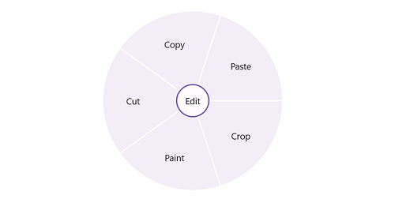

# Getting Started with .NET MAUI Radial Menu

This section guides you through setting up and configuring a [SfRadialMenu](https://help.syncfusion.com/cr/maui/Syncfusion.Maui.RadialMenu.html) in your .NET MAUI application. Follow the steps below to add a basic [SfRadialMenu](https://help.syncfusion.com/cr/maui/Syncfusion.Maui.RadialMenu.html) to your project.

To quickly get started with the .NET MAUI Radial Menu, watch this video.






## Prerequisites
Before proceeding, ensure the following are set up:

1. Install [.NET 9 SDK](https://dotnet.microsoft.com/en-us/download/dotnet/9.0) or later.
2. Set up a .NET MAUI environment with Visual Studio 2022 v17.12 or later.

## Step 1: Create a new .NET MAUI Project

1. Go to **File > New > Project** and choose the **.NET MAUI App** template.
2. Name the project and choose a location. Then, click **Next.**
3. Select the .NET framework version and click **Create.**

## Step 2: Install the Syncfusion® MAUI RadialMenu NuGet package

1. In **Solution Explorer,** right-click the project and choose **Manage NuGet Packages.**
2. Search for [Syncfusion.Maui.RadialMenu](https://www.nuget.org/packages/Syncfusion.Maui.RadialMenu/) and install the latest version.
3. Ensure the necessary dependencies are installed correctly, and the project is restored. If not, Open the Terminal in Rider and manually run: `dotnet restore`




## Prerequisites

Before proceeding, ensure the following are set up:

1. Install [.NET 9 SDK](https://dotnet.microsoft.com/en-us/download/dotnet/9.0) or later.
2. Set up a .NET MAUI environment with Visual Studio Code.
3. Ensure that the .NET MAUI workloads are installed and configured as described [here](https://learn.microsoft.com/en-us/dotnet/maui/get-started/installation?view=net-maui-9.0&tabs=visual-studio-code).

## Step 1: Create a .NET MAUI project

1. Open the command palette by pressing `Ctrl+Shift+P` and type **.NET:New Project** and enter.
2. Choose the **.NET MAUI App** template.
3. Select the project location, type the project name and press **Enter.**
4. Then choose **Create project.**

## Step 2: Install the Syncfusion® MAUI RadialMenu NuGet package

1. In **Solution Explorer,** right-click the project and choose **Manage NuGet Packages.**
2. Search for [Syncfusion.Maui.RadialMenu](https://www.nuget.org/packages/Syncfusion.Maui.RadialMenu/) and install the latest version.
3. Ensure the necessary dependencies are installed correctly, and the project is restored. If not, Open the Terminal in Rider and manually run: `dotnet restore`




## Prerequisites

Before proceeding, ensure the following are set up:

1. Install [.NET 9 SDK](https://dotnet.microsoft.com/en-us/download/dotnet/9.0) or later.
2. Set up a .NET MAUI environment with JetBrains Rider 2024.3 or later.
3. Make sure the MAUI workloads are installed and configured as described [here.](https://www.jetbrains.com/help/rider/MAUI.html#before-you-start)

## Step 1: Create a new .NET MAUI project

1. Go to **File > New Solution,** Select .NET (C#) and choose the .NET MAUI App template.
2. Enter the Project Name, Solution Name, and Location.
3. Select the .NET framework version and click Create.

## Step 2: Install the Syncfusion® MAUI RadialMenu NuGet package

1. In **Solution Explorer,** right-click the project and choose **Manage NuGet Packages.**
2. Search for [Syncfusion.Maui.RadialMenu](https://www.nuget.org/packages/Syncfusion.Maui.RadialMenu/) and install the latest version.
3. Ensure the necessary dependencies are installed correctly, and the project is restored. If not, Open the Terminal in Rider and manually run: `dotnet restore`




## Step 3: Register Syncfusion handler
 
Make sure to add the namespace.
 

using Syncfusion.Maui.Core.Hosting;

 
Register the Syncfusion core handler in your CreateMauiApp method of `MauiProgram.cs` file to use Syncfusion controls.
 

builder.ConfigureSyncfusionCore();


## Step 4: Import RadialMenu namespace

Add the following namespace in your XAML or C#.




xmlns:radialMenu="clr-namespace:Syncfusion.Maui.RadialMenu;assembly=Syncfusion.Maui.RadialMenu"




using Syncfusion.Maui.RadialMenu;




## Step 5: Add Radial Menu component

Configure the `Radial Menu` component to provide a circular, gesture-friendly interface for accessing commands and actions. It helps improve user experience by offering quick and intuitive navigation.





<radialMenu:SfRadialMenu x:Name="radialMenu" 
                         CenterButtonText="Edit"
                         CenterButtonFontSize="15">
    <radialMenu:SfRadialMenu.Items>
        <radialMenu:SfRadialMenuItem Text="Cut"/>
        <radialMenu:SfRadialMenuItem Text="Copy"/>
        <radialMenu:SfRadialMenuItem Text="Paste"/>
        <radialMenu:SfRadialMenuItem Text="Crop"/>
        <radialMenu:SfRadialMenuItem Text="Paint"/>
    </radialMenu:SfRadialMenu.Items>
</radialMenu:SfRadialMenu>





SfRadialMenu radialMenu = new SfRadialMenu()
{
    CenterButtonText = "Edit",
    CenterButtonFontSize = 15
};

RadialMenuItemsCollection itemCollection = new RadialMenuItemsCollection();
itemCollection.Add(new SfRadialMenuItem()
{
    Text = "Cut",
    FontSize = 15
});
itemCollection.Add(new SfRadialMenuItem()
{
    Text = "Copy",
    FontSize = 15
});
itemCollection.Add(new SfRadialMenuItem()
{
    Text = "Paste",
    FontSize = 15
});
itemCollection.Add(new SfRadialMenuItem()
{
    Text = "Crop",
    FontSize = 15
});
itemCollection.Add(new SfRadialMenuItem()
{
    Text = "Paint",
    FontSize = 15
});
radialMenu.Items = itemCollection;
this.Content = radialMenu;





You can download the TreeView Getting Started sammple from [here](https://github.com/SyncfusionExamples/Getting-Started-with-.NET-MAUI-Radial-Menu).

N> You can refer to our [.NET MAUI Radial Menu](https://www.syncfusion.com/maui-controls/maui-radial-menu) feature tour page for its groundbreaking feature representations. You can also explore our [.NET MAUI Effects View example](https://github.com/syncfusion/maui-demos/tree/master/MAUI/RadialMenu) that shows you how to render the Effects View in .NET MAUI.
