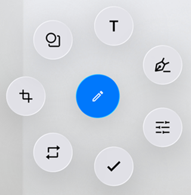

# Liquid Glass Support for .NET MAUI RadialMenu:

The [SfRadialMenu](https://help.syncfusion.com/cr/maui/Syncfusion.Maui.RadialMenu.html) supports a `liquid glass` effect (also called acrylic or glass morphism) when you enable the `EnableLiquidGlassEffect`. This feature adds a frosted, translucent style that blends with the background, giving the menu a modern and elegant look. It works best over images or colorful layouts and provides smooth visual feedback during interaction.

N>
* Supported on `macOS 26 or higher` and `iOS 26 or higher`.
* This feature is available only in `.NET 10.`




    <Grid>
        <!-- Background to make the glass effect visible while pressing the radial menu -->
        <Image Source="wallpaper.jpg" Aspect="AspectFill" />
        <radialMenu:SfRadialMenu  EnableLiquidGlassEffect="True" />
    </Grid>




SfRadialMenu radialMenu = new SfRadialMenu
{
    EnableLiquidGlassEffect = true
};




## Behavior and tips

- The glass effect is applied to the Radial Menu at render time and during user interaction.
- Place the Radial Menu over visually rich content (images, gradients, or color blocks) to better showcase the transient glass effect.
- Visual output and performance may vary by device/platform; keep backgrounds moderately detailed to maintain clarity during interaction.

The following image demonstrates the liquid glass effect of Radial Menu

