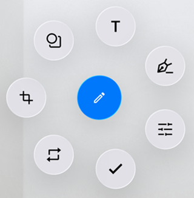

# Liquid Glass Support in .NET MAUI Radial Menu (SfRadialMenu)

## Prerequisites

Before using the [SfTabView](https://help.syncfusion.com/cr/maui/Syncfusion.Maui.RadialMenu.SfRadialMenu.html), ensure the following NuGet package is installed in your .NET MAUI project:

- `Syncfusion.Maui.RadialMenu`

For step-by-step setup, refer to the [Getting Started](https://help.syncfusion.com/maui/radial-menu/getting-started) documentation.

## Liquid Glass Support

The [`SfRadialMenu`](https://help.syncfusion.com/cr/maui/Syncfusion.Maui.RadialMenu.html) supports a Liquid Glass visual effect that renders the menu as a translucent blur of the underlying content. Enable it by setting the [`EnableLiquidGlassEffect`](https://help.syncfusion.com/cr/maui/Syncfusion.Maui.RadialMenu.SfRadialMenu.html#Syncfusion_Maui_RadialMenu_SfRadialMenu_EnableLiquidGlassEffect) property to `true`. The effect is most visible when the menu overlays colorful content; on platforms or OS versions that do not support it, the menu falls back to its default appearance.

For an overview of Liquid Glass across Syncfusion controls, see [Liquid glass integration with Syncfusion® .NET MAUI controls](https://help.syncfusion.com/maui/liquid-glass-ui/glassy-controls).

N> This feature is supported only on `.NET 10` along with `iOS 26` and `macOS 26`.

## Enable the Liquid Glass effect

The following samples show the minimum code required to enable the Liquid Glass effect. Place the menu inside a layout that has colorful background content (an image, a gradient, or a colored block) so the blur is visible.




<Grid>
    <!-- Place an image in Resources/Images with the MauiImage build action to act as the background. -->
    <Image Source="wallpaper.jpg" Aspect="AspectFill" />
    <radialMenu:SfRadialMenu EnableLiquidGlassEffect="true" />
</Grid>




public MainPage()
{
    InitializeComponent();
    Content = new Grid
    {
        Children =
        {
            new Image { Source = "wallpaper.jpg", Aspect = Aspect.AspectFill },
            new SfRadialMenu { EnableLiquidGlassEffect = true }
        }
    };
}




## Behavior and tips

- The glass effect is applied to the Radial Menu at render time and during user interaction.
- Place the Radial Menu over visually rich content (images, gradients, or color blocks) to better showcase the transient glass effect.
- Visual output and performance may vary by device/platform; keep backgrounds moderately detailed to maintain clarity during interaction.

The following image demonstrates the liquid glass effect of Radial Menu.

## See also

- [SfRadialMenuItem’s Customization in MAUI Radial Menu](https://help.syncfusion.com/maui/radial-menu/sfradialmenuitem-customization)
- [Segmenting and Placing Items in .NET MAUI Radial Menu](https://help.syncfusion.com/maui/radial-menu/segmenting-placing-items)
- [CenterButton Customization in MAUI Radial Menu](https://help.syncfusion.com/maui/radial-menu/centerbutton-customization)
- [Placing and Dragging in MAUI Radial Menu](https://help.syncfusion.com/maui/radial-menu/place-and-drag-radialmenu)