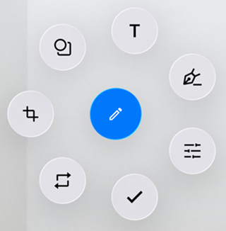

# Liquid Glass Support in .NET MAUI Radial Menu (SfRadialMenu)

The Liquid Glass Effect introduces a modern, translucent design with adaptive color tinting and light refraction, creating a sleek, glass-like user experience that remains clear and accessible while maintaining readable contrast. This section explains how to enable and customize the effect in the Syncfusion® .NET MAUI Radial Menu (SfRadialMenu) control.

## Prerequisites

Before using the [SfRadialMenu](https://help.syncfusion.com/cr/maui/Syncfusion.Maui.RadialMenu.SfRadialMenu.html), Install the [Syncfusion.Maui.RadialMenu](https://www.nuget.org/packages/Syncfusion.Maui.RadialMenu) and [Syncfusion.Maui.Core](https://www.nuget.org/packages/Syncfusion.Maui.Core) NuGet packages in your .NET MAUI project. The `Syncfusion.Maui.Core` package is required for the [SfGlassEffectView](https://help.syncfusion.com/cr/maui/Syncfusion.Maui.Core.SfGlassEffectView.html) container used to host the Liquid Glass Effect.

For step-by-step setup, refer to the [Getting Started](https://help.syncfusion.com/maui/radial-menu/getting-started) documentation.

N>
* The Liquid Glass Effect is supported only on **.NET 10** targeting **macOS 26 or higher** and **iOS 26 or higher**.
* It is not supported on Android or Windows.

## Enable the Liquid Glass effect

The `Radial Menu` supports a `liquid glass` effect when you enable the [EnableLiquidGlassEffect](https://help.syncfusion.com/cr/maui/Syncfusion.Maui.RadialMenu.SfRadialMenu.html#Syncfusion_Maui_RadialMenu_SfRadialMenu_EnableLiquidGlassEffect) property. The following samples show the minimum code required to enable the Liquid Glass effect. Place the menu inside a layout that has colorful background content (an image, a gradient, or a colored block) so the blur is visible.




<Grid>
    <!-- Place an image in Resources/Images with the MauiImage build action to act as the background. -->
    <Image Source="wallpaper.jpg" Aspect="AspectFill" />
    <radialMenu:SfRadialMenu EnableLiquidGlassEffect="True" />
</Grid>




Content = new Grid
{
    Children =
    {
        new Image { Source = "wallpaper.jpg", Aspect = Aspect.AspectFill },
        new SfRadialMenu { EnableLiquidGlassEffect = true }
    }
};




## Behavior and tips

- The glass effect is applied to the Radial Menu at render time and during user interaction.
- Place the Radial Menu over visually rich content (images, gradients, or color blocks) to better showcase the transient glass effect.
- Visual output and performance may vary by device/platform; keep backgrounds moderately detailed to maintain clarity during interaction.

The following image demonstrates the liquid glass effect of Radial Menu.

## See also

- [Radial Menu Item's Customization in MAUI Radial Menu](https://help.syncfusion.com/maui/radial-menu/sfradialmenuitem-customization)
- [Segmenting and Placing Items in .NET MAUI Radial Menu](https://help.syncfusion.com/maui/radial-menu/segmenting-placing-items)
- [Center Button Customization in MAUI Radial Menu](https://help.syncfusion.com/maui/radial-menu/centerbutton-customization)
- [Placing and Dragging in MAUI Radial Menu](https://help.syncfusion.com/maui/radial-menu/place-and-drag-radialmenu)