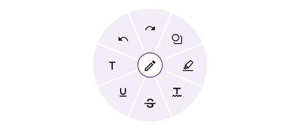

# .NET MAUI Radial Menu (SfRadialMenu) Overview

 The [.NET MAUI Radial Menu](https://www.syncfusion.com/maui-controls/maui-radial-menu) control displays a hierarchical menu in a circular layout, optimized for touch-enabled devices. It is typically used as a context menu and can expose more menu items in the same space than traditional menus.

 

## Business use cases

- Mobile applications that require **compact and touch-friendly context menus for quick actions**.  
- Design and drawing tools that use **radial menus for tool selection and commands**.  
- Productivity applications that provide **shortcut actions in a circular layout for faster interaction**.  
- Applications with limited screen space that require **efficient organization of multiple menu options**.  

## Key features

- **Drag** allows floating the radial menu over layouts to avoid blocking underlying content.  
- **Rotation** allows rotating menu items for better visual arrangement and interaction.  
- **Font icon** allows using vector-based icons to avoid rendering issues with images.  
- **Custom view** allows embedding images or custom UI elements within menu items.  
- **Segment customization** allows modifying colors, sizes, shapes, and positioning of menu segments.  
- **Auto arrangement** allows automatically arranging menu items for better usability and layout consistency.

## Related controls

- **[Button](https://help.syncfusion.com/maui/button/overview)** for triggering actions and commands in applications.  
- **[Navigation Drawer](https://help.syncfusion.com/maui/navigationdrawer/overview)** for organizing navigation options in a sliding panel.  

## Next steps

Explore further resources:

- [Getting Started](https://help.syncfusion.com/maui/radial-menu/getting-started) - step-by-step guide to begin using the Radial Menu control.
- [Customization](https://help.syncfusion.com/maui/radial-menu/sfradialmenuitem-customization) - customize layout and appearance of menu items.  
- [Populating Items](https://help.syncfusion.com/maui/radial-menu/populating-items) - configure menu structure and hierarchy.
- [UI Kit](https://www.syncfusion.com/demos/maui#maui-ui-control) - explore interactive demos and ready‑made UI examples.

## Learnings

<!-- Card 1 -->
<a href="https://www.syncfusion.com/blogs/category/net-maui" class="form-card" target="_blank">
  

    <h3 class="form-title">Explore Blogs</h3>
    

      Read insights, tutorials, and developer journeys.
    

  

</a>
<!-- Card 2 -->
<a href="https://support.syncfusion.com/kb/cross-platforms/category/76" class="form-card" target="_blank">
  

    <h3 class="form-title">Explore KB's</h3>
    

      Find quick solutions and step‑by‑step guidance.
    

  

</a>
<!-- Card 3 -->
<a href="https://www.syncfusion.com/maui-controls/maui-radial-menu" class="form-card" target="_blank">
  

    <h3 class="form-title">Feature Tour</h3>
    

      Walk through highlights and core capabilities.
    

  

</a>
<!-- Card 4 -->
<a href="https://github.com/syncfusion/maui-demos/tree/master/MAUI/RadialMenu" class="form-card" target="_blank">
  

    <h3 class="form-title">Showcase Samples</h3>
    

      Explore sample scenarios for real apps.
    

  

</a>
<!-- Card 5 -->
<a href="https://www.syncfusion.com/tutorial-videos/maui/radial-menu" class="form-card" target="_blank">
  

    <h3 class="form-title">Tutorial Videos</h3>
    

      Step‑by‑step guidance through video tutorials.
    

  

</a>
