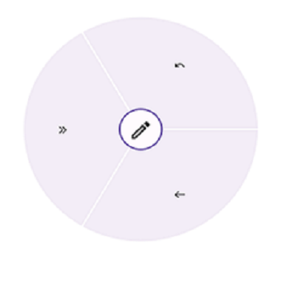

# Segmenting and Placing the Items in .NET MAUI Radial Menu

There are two different layout types available for radial menu:

*  `Default`
*  `Custom`

Both the layout types divide the available space equally among all the children in the circular panel.

## Default

Number of segments in the panel is determined by children count in the level. Hence, segment count in each hierarchical level differs, radial menu items are arranged in the sequential order as added in the radial menu.





 <radialMenu:SfRadialMenu LayoutType="Default">
        <radialMenu:SfRadialMenu.Items>
            <radialMenu:SfRadialMenuItem Text="Bold" FontSize="12"/>
            <radialMenu:SfRadialMenuItem Text="Copy" FontSize="12"/>
            <radialMenu:SfRadialMenuItem Text="Undo" FontSize="12"/>
            <radialMenu:SfRadialMenuItem Text="Paste" FontSize="12"/>
            <radialMenu:SfRadialMenuItem Text="Color" FontSize="12"/>
        </radialMenu:SfRadialMenu.Items>
</radialMenu:SfRadialMenu>





 SfRadialMenu radialMenu = new SfRadialMenu() 
 {
     LayoutType = LayoutType.Default
 };





## Custom

The number of segments in the panel is determined using the `VisibleSegmentsCount` property. Since the segment count in all the hierarchical levels are same, radial menu items are arranged in any order based on the `SegmentIndex` property.





    <radialMenu:SfRadialMenu LayoutType="Custom">
        <radialMenu:SfRadialMenu.Items>
            <radialMenu:SfRadialMenuItem Text="Bold" FontSize="12"/>
            <radialMenu:SfRadialMenuItem Text="Copy" FontSize="12"/>
            <radialMenu:SfRadialMenuItem Text="Undo" FontSize="12"/>
            <radialMenu:SfRadialMenuItem Text="Paste" FontSize="12"/>
            <radialMenu:SfRadialMenuItem Text="Color" FontSize="12"/>
        </radialMenu:SfRadialMenu.Items>
    </radialMenu:SfRadialMenu>





 SfRadialMenu radialMenu = new SfRadialMenu() 
 {
     LayoutType = LayoutType.Custom
 };





### VisibleSegmentsCount

The `VisibleSegmentsCount` property is used to specify the number of segments available in circular panel. When children count is greater than the value given in the `VisibleSegmentsCount` property, the overflowing children are not arranged in the panel. When children count is lesser than the `VisibleSegmentsCount` property, then remaining segments are left free. If number of item count is higher than VisibleItemCount, excessive items will not be shown.

### SegmentIndex
`SegmentIndex` property is used to specify the index of the radial menu item in circular panel. Based on the index, the radial menu items are inserted in the segment. When the `SegmentIndex` is not specified for a RadialMenuItem the menu item is arranged in the next available free segment.

## Code snippet for VisibleSegmentCount and SegmentIndex





   



   <radialMenu:SfRadialMenu x:Name="radialMenu"
                         CenterButtonBackFontFamily="Maui Material Assets"
                         CenterButtonBackFontSize="20"
                         CenterButtonBackText="&#xe72d;"
                         CenterButtonFontFamily="Maui Material Assets"
                         CenterButtonFontSize="20"
                         CenterButtonText="&#xe710;" 
                         LayoutType="Custom" 
                         VisibleSegmentsCount="3">
    <radialMenu:SfRadialMenu.Items>
        <radialMenu:SfRadialMenuItem 
            Text="&#xe744;"                    
            SegmentIndex="1"
            FontFamily="Maui Material Assets">
        </radialMenu:SfRadialMenuItem>
        <radialMenu:SfRadialMenuItem  
            Text="&#xe700;"                     
            SegmentIndex="0"
            FontFamily="Maui Material Assets">
        </radialMenu:SfRadialMenuItem>
        <radialMenu:SfRadialMenuItem 
                Text="&#xe72d;"                        
                SegmentIndex="2"
                FontFamily="Maui Material Assets">
        </radialMenu:SfRadialMenuItem>
        <radialMenu:SfRadialMenuItem  
            Text="&#xe735;"                    
            FontFamily="Maui Material Assets">
        </radialMenu:SfRadialMenuItem>
    </radialMenu:SfRadialMenu.Items>
</radialMenu:SfRadialMenu>





 using Syncfusion.Maui.RadialMenu;

namespace RadialSample
{
    public partial class MainPage : ContentPage
    {
        public MainPage()
        {
            InitializeComponent();

            SfRadialMenu radialMenu = new SfRadialMenu()
            {
                CenterButtonBackFontFamily="Maui Material Assets",
                CenterButtonBackFontSize=20,
                CenterButtonBackText="&#xe72d;",
                CenterButtonFontFamily="Maui Material Assets",
                CenterButtonFontSize=20,
                CenterButtonText="&#xe710;",
                LayoutType = LayoutType.Custom,
                VisibleSegmentsCount = 3,
            };
            RadialMenuItemsCollection itemCollection = new RadialMenuItemsCollection()
            {
                new SfRadialMenuItem() { FontFamily="Maui Material Assets" FontSize="20" Text="&#xe72e;" },
                new SfRadialMenuItem() { FontFamily="Maui Material Assets" FontSize="20" Text="&#xe744;" },
                new SfRadialMenuItem() { FontFamily="Maui Material Assets" FontSize="20" Text="&#xe745;" },
                new SfRadialMenuItem() { FontFamily="Maui Material Assets" FontSize="20" Text="&#xe73b;" },
                new SfRadialMenuItem() { FontFamily="Maui Material Assets" FontSize="20" Text="&#xe762;" },
            };
            
            radialMenu.Items = itemCollection;
            this.Content = radialMenu;
        }
    }
}









 SfRadialMenu radialMenu = new SfRadialMenu() 
 {
     LayoutType = LayoutType.Custom
 };





