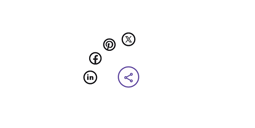

# Segmenting and Placing Items in .NET MAUI Radial Menu

There are two layout types available for the Radial Menu:

*  [`Default`](https://help.syncfusion.com/cr/maui/Syncfusion.Maui.RadialMenu.LayoutType.html#Syncfusion_Maui_RadialMenu_LayoutType_Default)
*  [`Custom`](https://help.syncfusion.com/cr/maui/Syncfusion.Maui.RadialMenu.LayoutType.html#Syncfusion_Maui_RadialMenu_LayoutType_Custom)

Both the layout types divide the available space equally among all the children in the circular panel.

## Default

The number of segments in the panel is determined by the count of children in each level. As the segment count differs in each hierarchical level, Radial Menu items are arranged in the sequential order they are added.





 <radialMenu:SfRadialMenu LayoutType="Default">
        <radialMenu:SfRadialMenu.Items>
            <radialMenu:SfRadialMenuItem Text="Bold" FontSize="12"/>
            <radialMenu:SfRadialMenuItem Text="Copy" FontSize="12"/>
            <radialMenu:SfRadialMenuItem Text="Undo" FontSize="12"/>
            <radialMenu:SfRadialMenuItem Text="Paste" FontSize="12"/>
            <radialMenu:SfRadialMenuItem Text="Color" FontSize="12"/>
        </radialMenu:SfRadialMenu.Items>
</radialMenu:SfRadialMenu>





 SfRadialMenu radialMenu = new SfRadialMenu() 
 {
     LayoutType = LayoutType.Default
 };





## Custom

The number of segments in the panel is determined by the [`VisibleSegmentsCount`](https://help.syncfusion.com/cr/maui/Syncfusion.Maui.RadialMenu.SfRadialMenu.html#Syncfusion_Maui_RadialMenu_SfRadialMenu_VisibleSegmentsCount) property. Since the segment count is the same across all hierarchical levels, radial menu items can be arranged in any order based on the [`SegmentIndex`](https://help.syncfusion.com/cr/maui/Syncfusion.Maui.RadialMenu.SfRadialMenuItem.html#Syncfusion_Maui_RadialMenu_SfRadialMenuItem_SegmentIndex) property.





    <radialMenu:SfRadialMenu LayoutType="Custom">
        <radialMenu:SfRadialMenu.Items>
            <radialMenu:SfRadialMenuItem Text="Bold" FontSize="12"/>
            <radialMenu:SfRadialMenuItem Text="Copy" FontSize="12"/>
            <radialMenu:SfRadialMenuItem Text="Undo" FontSize="12"/>
            <radialMenu:SfRadialMenuItem Text="Paste" FontSize="12"/>
            <radialMenu:SfRadialMenuItem Text="Color" FontSize="12"/>
        </radialMenu:SfRadialMenu.Items>
    </radialMenu:SfRadialMenu>





 SfRadialMenu radialMenu = new SfRadialMenu() 
 {
     LayoutType = LayoutType.Custom
 };





### VisibleSegmentsCount

The [`VisibleSegmentsCount`](https://help.syncfusion.com/cr/maui/Syncfusion.Maui.RadialMenu.SfRadialMenu.html#Syncfusion_Maui_RadialMenu_SfRadialMenu_VisibleSegmentsCount) property specifies the number of segments in circular panel. If the children count exceeds this value, the overflowing children are not displayed. If the children count is less than the [`VisibleSegmentsCount`](https://help.syncfusion.com/cr/maui/Syncfusion.Maui.RadialMenu.SfRadialMenu.html#Syncfusion_Maui_RadialMenu_SfRadialMenu_VisibleSegmentsCount), the remaining segments are left free. Excessive items beyond the `VisibleItemCount` are not shown.

### SegmentIndex

The [`SegmentIndex`](https://help.syncfusion.com/cr/maui/Syncfusion.Maui.RadialMenu.SfRadialMenuItem.html#Syncfusion_Maui_RadialMenu_SfRadialMenuItem_SegmentIndex) property specifies the index of a Radial Menu item in the circular panel. Based on the index, items are inserted into segment. If the `SegmentIndex` is not specified for a `RadialMenuItem`, the item is arranged in the next available free segment.

## Code snippet for VisibleSegmentCount and SegmentIndex





     <radialMenu:SfRadialMenu x:Name="radial_Menu"
                              CenterButtonFontFamily="MauiSampleFontIcon"
                              CenterButtonFontSize="30"
                              CenterButtonStrokeThickness="3"
                              CenterButtonText="&#xe770;"
                              LayoutType="Custom"
                              RimColor="Transparent"
                              RimRadius="300"
                              SeparatorThickness="0"
                              VisibleSegmentsCount="12">
                                <radialMenu:SfRadialMenu.Items>
                                    <radialMenu:SfRadialMenuItem
                                        x:Name="Linkedin"
                                        BackgroundColor="Transparent"
                                        FontFamily="MauiSampleFontIcon"
                                        FontSize="40"
                                        ItemHeight="40"
                                        ItemWidth="40"
                                        SegmentIndex="0"
                                        Text="&#xe79c;" />
                                    <radialMenu:SfRadialMenuItem
                                        x:Name="Facebook"
                                        BackgroundColor="Transparent"
                                        FontFamily="MauiSampleFontIcon"
                                        FontSize="40"
                                        ItemHeight="40"
                                        ItemWidth="40"
                                        SegmentIndex="1"
                                        Text="&#xe799;" />
                                    <radialMenu:SfRadialMenuItem
                                        x:Name="pinterest"
                                        BackgroundColor="Transparent"
                                        FontFamily="MauiSampleFontIcon"
                                        FontSize="40"
                                        ItemHeight="40"
                                        ItemWidth="40"
                                        SegmentIndex="2"
                                        Text="&#xe79b;" />
                                    <radialMenu:SfRadialMenuItem
                                        x:Name="twitter"
                                        BackgroundColor="Transparent"
                                        FontFamily="MauiSampleFontIcon"
                                        FontSize="40"
                                        ItemHeight="40"
                                        ItemWidth="40"
                                        SegmentIndex="3"
                                        Text="&#xe79a;" />
                                </radialMenu:SfRadialMenu.Items>
     </radialMenu:SfRadialMenu>





using Syncfusion.Maui.RadialMenu;

namespace RadialSample
{
    public partial class MainPage : ContentPage
    {
        public MainPage()
        {
            InitializeComponent();

            SfRadialMenu radialMenu = new SfRadialMenu()
            {
                CenterButtonFontFamily = "MauiSampleFontIcon",
                CenterButtonFontSize = 30,
                CenterButtonStrokeThickness = 3,
                CenterButtonText = "&#xe770;",
                LayoutType = RadialMenuLayoutType.Custom,
                RimColor = Colors.Transparent,
                RimRadius = 300,
                SeparatorThickness = 0,
                VisibleSegmentsCount = 12
            };

            SfRadialMenuItem linkedinItem = new SfRadialMenuItem
            {
                BackgroundColor = Colors.Transparent,
                FontFamily = "MauiSampleFontIcon",
                FontSize = 40,
                ItemHeight = 40,
                ItemWidth = 40,
                SegmentIndex = 0,
                Text = "&#xe79c"
            };

            SfRadialMenuItem facebookItem = new SfRadialMenuItem
            {
                BackgroundColor = Colors.Transparent,
                FontFamily = "MauiSampleFontIcon",
                FontSize = 40,
                ItemHeight = 40,
                ItemWidth = 40,
                SegmentIndex = 1,
                Text = "&#xe799;"
            };

            SfRadialMenuItem pinterestItem = new SfRadialMenuItem
            {
                BackgroundColor = Colors.Transparent,
                FontFamily = "MauiSampleFontIcon",
                FontSize = 40,
                ItemHeight = 40,
                ItemWidth = 40,
                SegmentIndex = 2,
                Text = "&#xe79b;" 
            };

            SfRadialMenuItem twitterItem = new SfRadialMenuItem
            {
                BackgroundColor = Colors.Transparent,
                FontFamily = "MauiSampleFontIcon",
                FontSize = 40,
                ItemHeight = 40,
                ItemWidth = 40,
                SegmentIndex = 3,
                Text = "&#xe79a;"
            };

            radialMenu.Items.Add(linkedinItem);
            radialMenu.Items.Add(facebookItem);
            radialMenu.Items.Add(pinterestItem);
            radialMenu.Items.Add(twitterItem);

            Content = radialMenu;
        }
    }
}





N> The [`VisibleSegmentsCount`](https://help.syncfusion.com/cr/maui/Syncfusion.Maui.RadialMenu.SfRadialMenu.html#Syncfusion_Maui_RadialMenu_SfRadialMenu_VisibleSegmentsCount) property applies only to the [`Custom`](https://help.syncfusion.com/cr/maui/Syncfusion.Maui.RadialMenu.LayoutType.html#Syncfusion_Maui_RadialMenu_LayoutType_Custom) layout.