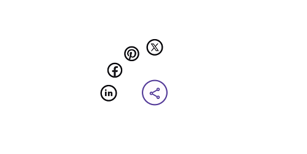

# Segmenting and Placing Items in .NET MAUI Radial Menu

## Prerequisites

Before using the [SfTabView](https://help.syncfusion.com/cr/maui/Syncfusion.Maui.RadialMenu.SfRadialMenu.html), ensure the following NuGet package is installed in your .NET MAUI project:

- `Syncfusion.Maui.RadialMenu`

For step-by-step setup, refer to the [Getting Started](https://help.syncfusion.com/maui/radial-menu/getting-started) documentation.

## Layout Type

There are two layout types available for the Radial Menu:

*  [`Default`](https://help.syncfusion.com/cr/maui/Syncfusion.Maui.RadialMenu.LayoutType.html#Syncfusion_Maui_RadialMenu_LayoutType_Default)
*  [`Custom`](https://help.syncfusion.com/cr/maui/Syncfusion.Maui.RadialMenu.LayoutType.html#Syncfusion_Maui_RadialMenu_LayoutType_Custom)

Both layout types divide the available space equally among all children in the circular panel. Use `Default` when each hierarchical level should have a segment count that matches its child count, and use `Custom` when you want a fixed segment count across all levels with explicit item placement.

## Default

The number of segments at each hierarchical level is determined by the number of children at that level. Because the segment count can differ between levels, items are arranged in the order they are added.





 <radialMenu:SfRadialMenu LayoutType="Default">
        <radialMenu:SfRadialMenu.Items>
            <radialMenu:SfRadialMenuItem Text="Bold" FontSize="12"/>
            <radialMenu:SfRadialMenuItem Text="Copy" FontSize="12"/>
            <radialMenu:SfRadialMenuItem Text="Undo" FontSize="12"/>
            <radialMenu:SfRadialMenuItem Text="Paste" FontSize="12"/>
            <radialMenu:SfRadialMenuItem Text="Color" FontSize="12"/>
        </radialMenu:SfRadialMenu.Items>
</radialMenu:SfRadialMenu>





SfRadialMenu radialMenu = new SfRadialMenu()
{
    LayoutType = LayoutType.Default,
    Items = new RadialMenuItemsCollection()
    {
        new SfRadialMenuItem() { Text = "Bold", FontSize = 12 },
        new SfRadialMenuItem() { Text = "Copy", FontSize = 12 },
        new SfRadialMenuItem() { Text = "Paste", FontSize = 12 },
        new SfRadialMenuItem() { Text = "Undo", FontSize = 12 },
        new SfRadialMenuItem() { Text = "Color", FontSize = 12 },
    },
};





## Custom

The number of segments in the panel is determined by the [`VisibleSegmentsCount`](https://help.syncfusion.com/cr/maui/Syncfusion.Maui.RadialMenu.SfRadialMenu.html#Syncfusion_Maui_RadialMenu_SfRadialMenu_SfRadialMenu_VisibleSegmentsCount) property. Because the segment count is the same across all hierarchical levels, items can be arranged in any order using the [`SegmentIndex`](https://help.syncfusion.com/cr/maui/Syncfusion.Maui.RadialMenu.SfRadialMenuItem.html#Syncfusion_Maui_RadialMenu_SfRadialMenuItem_SegmentIndex) property.





    <radialMenu:SfRadialMenu LayoutType="Custom">
        <radialMenu:SfRadialMenu.Items>
            <radialMenu:SfRadialMenuItem Text="Bold" FontSize="12"/>
            <radialMenu:SfRadialMenuItem Text="Copy" FontSize="12"/>
            <radialMenu:SfRadialMenuItem Text="Undo" FontSize="12"/>
            <radialMenu:SfRadialMenuItem Text="Paste" FontSize="12"/>
            <radialMenu:SfRadialMenuItem Text="Color" FontSize="12"/>
        </radialMenu:SfRadialMenu.Items>
    </radialMenu:SfRadialMenu>





SfRadialMenu radialMenu = new SfRadialMenu()
{
    LayoutType = LayoutType.Custom,
    Items = new RadialMenuItemsCollection()
    {
        new SfRadialMenuItem() { Text = "Bold", FontSize = 12 },
        new SfRadialMenuItem() { Text = "Copy", FontSize = 12 },
        new SfRadialMenuItem() { Text = "Paste", FontSize = 12 },
        new SfRadialMenuItem() { Text = "Undo", FontSize = 12 },
        new SfRadialMenuItem() { Text = "Color", FontSize = 12 },
    },
};





### VisibleSegmentsCount

The [`VisibleSegmentsCount`](https://help.syncfusion.com/cr/maui/Syncfusion.Maui.RadialMenu.SfRadialMenu.html#Syncfusion_Maui_RadialMenu_SfRadialMenu_VisibleSegmentsCount) property specifies the number of segments in the circular panel. It is of type `int` and the default value is `0`, which causes the panel to fall back to the [`Default`](https://help.syncfusion.com/cr/maui/Syncfusion.Maui.RadialMenu.LayoutType.html#Syncfusion_Maui_RadialMenu_LayoutType_Default) layout behavior (one segment per child). When the number of children exceeds `VisibleSegmentsCount`, the overflowing children are not displayed. When the number of children is less than `VisibleSegmentsCount`, the remaining segments are left empty.

### SegmentIndex

The [`SegmentIndex`](https://help.syncfusion.com/cr/maui/Syncfusion.Maui.RadialMenu.SfRadialMenuItem.html#Syncfusion_Maui_RadialMenu_SfRadialMenuItem_SegmentIndex) property specifies the index of a [`SfRadialMenuItem`](https://help.syncfusion.com/cr/maui/Syncfusion.Maui.RadialMenu.SfRadialMenuItem.html) in the circular panel. It is of type `int` and the default value is `-1`, which means the item is placed in the next available free segment. Based on the index, items are inserted into the specified segment. If two items share the same `SegmentIndex`, the later item overrides the earlier one. Indices that are out of range (less than `0` or greater than or equal to `VisibleSegmentsCount`) are ignored.

### Code example for VisibleSegmentsCount and SegmentIndex

The following example shows how to use `VisibleSegmentsCount` and `SegmentIndex` together in a [`SfRadialMenu`](https://help.syncfusion.com/cr/maui/Syncfusion.Maui.RadialMenu.SfRadialMenu.html). The font-icon glyph codes assume the `MauiSampleFontIcon` font is registered in the `MauiProgram.cs` file.




<radialMenu:SfRadialMenu x:Name="radial_Menu"
                        CenterButtonFontFamily="MauiSampleFontIcon"
                        CenterButtonFontSize="30"
                        CenterButtonStrokeThickness="3"
                        CenterButtonText="&#xe770;"
                        LayoutType="Custom"
                        RimColor="Transparent"
                        RimRadius="300"
                        SeparatorThickness="0"
                        VisibleSegmentsCount="12">
    <radialMenu:SfRadialMenu.Items>
        <radialMenu:SfRadialMenuItem x:Name="Linkedin"
                                    BackgroundColor="Transparent"
                                    FontFamily="MauiSampleFontIcon"
                                    FontSize="40"
                                    ItemHeight="40"
                                    ItemWidth="40"
                                    SegmentIndex="0"
                                    Text="&#xe77b;" />
        <radialMenu:SfRadialMenuItem x:Name="Facebook"
                                    BackgroundColor="Transparent"
                                    FontFamily="MauiSampleFontIcon"
                                    FontSize="40"
                                    ItemHeight="40"
                                    ItemWidth="40"
                                    SegmentIndex="1"
                                    Text="&#xe77c;" />
        <radialMenu:SfRadialMenuItem x:Name="Pinterest"
                                    BackgroundColor="Transparent"
                                    FontFamily="MauiSampleFontIcon"
                                    FontSize="40"
                                    ItemHeight="40"
                                    ItemWidth="40"
                                    SegmentIndex="2"
                                    Text="&#xe77d;" />
        <radialMenu:SfRadialMenuItem x:Name="Twitter"
                                    BackgroundColor="Transparent"
                                    FontFamily="MauiSampleFontIcon"
                                    FontSize="40"
                                    ItemHeight="40"
                                    ItemWidth="40"
                                    SegmentIndex="3"
                                    Text="&#xe77e;" />
    </radialMenu:SfRadialMenu.Items>
</radialMenu:SfRadialMenu>




SfRadialMenu radialMenu = new SfRadialMenu
{
    CenterButtonFontFamily = "MauiSampleFontIcon",
    CenterButtonFontSize = 30,
    CenterButtonStrokeThickness = 3,
    CenterButtonText = "\ue770",
    LayoutType = LayoutType.Custom,
    RimColor = Colors.Transparent,
    RimRadius = 300,
    SeparatorThickness = 0,
    VisibleSegmentsCount = 12,
    Items =
    {
        new SfRadialMenuItem
        {
            BackgroundColor = Colors.Transparent,
            FontFamily = "MauiSampleFontIcon",
            FontSize = 40,
            ItemHeight = 40,
            ItemWidth = 40,
            SegmentIndex = 0,
            Text = "\ue77b"
        },
        new SfRadialMenuItem
        {
            BackgroundColor = Colors.Transparent,
            FontFamily = "MauiSampleFontIcon",
            FontSize = 40,
            ItemHeight = 40,
            ItemWidth = 40,
            SegmentIndex = 1,
            Text = "\ue77c"
        },
        new SfRadialMenuItem
        {
            BackgroundColor = Colors.Transparent,
            FontFamily = "MauiSampleFontIcon",
            FontSize = 40,
            ItemHeight = 40,
            ItemWidth = 40,
            SegmentIndex = 2,
            Text = "\ue77d"
        },
        new SfRadialMenuItem
        {
            BackgroundColor = Colors.Transparent,
            FontFamily = "MauiSampleFontIcon",
            FontSize = 40,
            ItemHeight = 40,
            ItemWidth = 40,
            SegmentIndex = 3,
            Text = "\ue77e"
        }
    }
};
            



N> The [`VisibleSegmentsCount`](https://help.syncfusion.com/cr/maui/Syncfusion.Maui.RadialMenu.SfRadialMenu.html#Syncfusion_Maui_RadialMenu_SfRadialMenu_VisibleSegmentsCount) property applies only to the [`Custom`](https://help.syncfusion.com/cr/maui/Syncfusion.Maui.RadialMenu.LayoutType.html#Syncfusion_Maui_RadialMenu_LayoutType_Custom) layout.

## See also

- [SfRadialMenuItem’s Customization in MAUI Radial Menu](https://help.syncfusion.com/maui/radial-menu/sfradialmenuitem-customization)
- [CenterButton Customization in MAUI Radial Menu](https://help.syncfusion.com/maui/radial-menu/centerbutton-customization)
- [Placing and Dragging in MAUI Radial Menu](https://help.syncfusion.com/maui/radial-menu/place-and-drag-radialmenu)