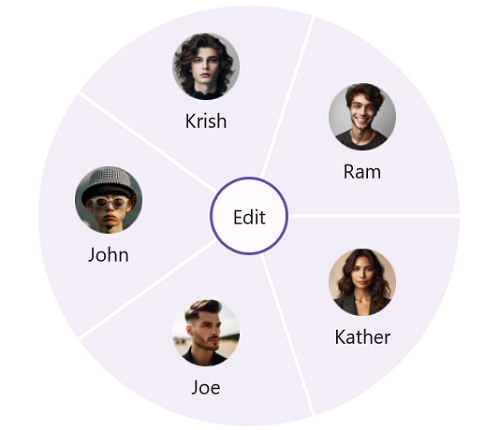
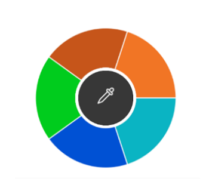

# SfRadialMenuItem's Customization in MAUI Radial Menu (SfRadialMenu)

The [`SfRadialMenuItem`](https://help.syncfusion.com/cr/maui/Syncfusion.Maui.RadialMenu.SfRadialMenuItem.html) class provides various options to customize items with `Custom Views`, `FontIcons`, and `Images`. You can add Radial Menu items by hierarchy. To add a [`SfRadialMenuItem`](https://help.syncfusion.com/cr/maui/Syncfusion.Maui.RadialMenu.SfRadialMenuItem.html) to a [`SfRadialMenu`](https://help.syncfusion.com/cr/maui/Syncfusion.Maui.RadialMenu.SfRadialMenu.html), create an instance of [`SfRadialMenuItem`](https://help.syncfusion.com/cr/maui/Syncfusion.Maui.RadialMenu.SfRadialMenuItem.html), and add it to the [`Items`](https://help.syncfusion.com/cr/maui/Syncfusion.Maui.RadialMenu.SfRadialMenuItem.html#Syncfusion_Maui_RadialMenu_SfRadialMenuItem_Items) property.

## Items

The [`Items`](https://help.syncfusion.com/cr/maui/Syncfusion.Maui.RadialMenu.SfRadialMenuItem.html#Syncfusion_Maui_RadialMenu_SfRadialMenuItem_Items) property populates items on the inner rim of the [`SfRadialMenu`](https://help.syncfusion.com/cr/maui/Syncfusion.Maui.RadialMenu.SfRadialMenu.html) when tapping the outer rim items.





<?xml version="1.0" encoding="utf-8" ?>
<ContentPage xmlns="http://schemas.microsoft.com/dotnet/2021/maui"
             xmlns:x="http://schemas.microsoft.com/winfx/2009/xaml"
             xmlns:local="clr-namespace:RadialSample"
             xmlns:syncfusion="clr-namespace:Syncfusion.Maui.RadialMenu;assembly=Syncfusion.Maui.RadialMenu"
             x:Class="RadialSample.MainPage">
             <syncfusion:SfRadialMenu CenterButtonText="Edit" 
                             CenterButtonFontSize="12">
                <syncfusion:SfRadialMenu.Items>
                    <syncfusion:SfRadialMenuItem Text="Bold" 
                                                 FontSize="12"/>
                    <syncfusion:SfRadialMenuItem Text="Copy" 
                                                 FontSize="12"/>
                    <syncfusion:SfRadialMenuItem Text="Undo" 
                                                 FontSize="12"/>
                    <syncfusion:SfRadialMenuItem Text="Paste" 
                                                 FontSize="12"/>
                    <syncfusion:SfRadialMenuItem Text="Color" FontSize="12">
                        <syncfusion:SfRadialMenuItem.Items>
                            <syncfusion:SfRadialMenuItem Text="Font" 
                                                         FontSize="12" 
                                                         ItemWidth="50"/>
                            <syncfusion:SfRadialMenuItem Text="Gradient" 
                                                         FontSize="12" 
                                                         ItemWidth="50"/>
                            <syncfusion:SfRadialMenuItem Text="Highlight" 
                                                         FontSize="12" 
                                                         ItemWidth="50"/>
                        </syncfusion:SfRadialMenuItem.Items>
                    </syncfusion:SfRadialMenuItem>
                </syncfusion:SfRadialMenu.Items>
    </syncfusion:SfRadialMenu>
</ContentPage>





using Syncfusion.Maui.RadialMenu;

namespace RadialSample
{
    public partial class MainPage : ContentPage
    {
        public MainPage()
        {
            InitializeComponent();
             string[] mainItem = new string[] { "Bold", "Copy", "Paste", "Undo", "Color" };
            string[] colorItem = new string[] { "Font", "Gradient", "Highlight" };

            SfRadialMenu radialMenu = new SfRadialMenu();

            // Adding radial menu outer rim items.

            for (int i = 0; i < 5; i++)
            {
                SfRadialMenuItem mainMenuItems = new SfRadialMenuItem();
                mainMenuItems.Text = mainItem[i];
                mainMenuItems.FontSize = 12;
                syncfusion.Items.Add(mainMenuItems);
            }

            // Adding inner rim items.

            for (int i = 0; i < 3; i++)
            {
                SfRadialMenuItem colorSubMenuItem = new SfRadialMenuItem();
                colorSubMenuItem.Text = colorItem[i];
                colorSubMenuItem.FontSize = 12;
                colorSubMenuItem.ItemWidth = 50;
                radialMenu.Items[4].Items.Add(colorSubMenuItem);
            }

            this.Content = radialMenu;
        }
    }
}





## Text

The [`Text`](https://help.syncfusion.com/cr/maui/Syncfusion.Maui.RadialMenu.SfRadialMenuItem.html#Syncfusion_Maui_RadialMenu_SfRadialMenuItem_Text) property provides text to the [`SfRadialMenuItem`](https://help.syncfusion.com/cr/maui/Syncfusion.Maui.RadialMenu.SfRadialMenuItem.html).





<?xml version="1.0" encoding="utf-8" ?>
<ContentPage xmlns="http://schemas.microsoft.com/dotnet/2021/maui"
             xmlns:x="http://schemas.microsoft.com/winfx/2009/xaml"
             xmlns:local="clr-namespace:RadialSample"
             xmlns:syncfusion="clr-namespace:Syncfusion.Maui.RadialMenu;assembly=Syncfusion.Maui.RadialMenu"
             x:Class="RadialSample.MainPage">
     <syncfusion:SfRadialMenu>
        <syncfusion:SfRadialMenu.Items>
            <syncfusion:SfRadialMenuItem Text="Bold" FontSize="12"/>
            <syncfusion:SfRadialMenuItem Text="Copy" FontSize="12"/>
            <syncfusion:SfRadialMenuItem Text="Undo" FontSize="12"/>
            <syncfusion:SfRadialMenuItem Text="Paste" FontSize="12"/>
            <syncfusion:SfRadialMenuItem Text="Color" FontSize="12"/>
        </syncfusion:SfRadialMenu.Items>
    </syncfusion:SfRadialMenu>
</ContentPage>
    




using Syncfusion.Maui.RadialMenu;

namespace RadialSample
{
    public partial class MainPage : ContentPage
    {
        public MainPage()
        {
            InitializeComponent();

            SfRadialMenu radialMenu = new SfRadialMenu();
            RadialMenuItemsCollection itemCollection = new RadialMenuItemsCollection()
            {
                new SfRadialMenuItem() { Text = "Bold", FontSize = 12 },
                new SfRadialMenuItem() { Text = "Copy", FontSize = 12 },
                new SfRadialMenuItem() { Text = "Paste", FontSize = 12 },
                new SfRadialMenuItem() { Text = "Undo", FontSize = 12 },
                new SfRadialMenuItem() { Text = "Color", FontSize = 12 },
            };
            
            radialMenu.Items = itemCollection;
            this.Content = radialMenu;
        }
    }
}





## ItemHeight and ItemWidth

The [`ItemHeight`](https://help.syncfusion.com/cr/maui/Syncfusion.Maui.RadialMenu.SfRadialMenuItem.html#Syncfusion_Maui_RadialMenu_SfRadialMenuItem_ItemHeight) property changes the height, and the [`ItemWidth`](https://help.syncfusion.com/cr/maui/Syncfusion.Maui.RadialMenu.SfRadialMenuItem.html#Syncfusion_Maui_RadialMenu_SfRadialMenuItem_ItemWidth) property changes the width of the [`SfRadialMenuItem`](https://help.syncfusion.com/cr/maui/Syncfusion.Maui.RadialMenu.SfRadialMenuItem.html).





<?xml version="1.0" encoding="utf-8" ?>
<ContentPage xmlns="http://schemas.microsoft.com/dotnet/2021/maui"
             xmlns:x="http://schemas.microsoft.com/winfx/2009/xaml"
             xmlns:local="clr-namespace:RadialSample"
             xmlns:syncfusion="clr-namespace:Syncfusion.Maui.RadialMenu;assembly=Syncfusion.Maui.RadialMenu"
             x:Class="RadialSample.MainPage">
    <syncfusion:SfRadialMenu CenterButtonText = "Edit">
        <syncfusion:SfRadialMenu.Items>
            <syncfusion:SfRadialMenuItem ItemHeight="60" ItemWidth="60" Text="John"  Image="johnson.png"/>
            <syncfusion:SfRadialMenuItem ItemHeight="60" ItemWidth="60" Text="Krish" Image="krish.png"/>
            <syncfusion:SfRadialMenuItem ItemHeight="60" ItemWidth="60" Text="Ram"   Image="ram.png"/>
            <syncfusion:SfRadialMenuItem ItemHeight="60" ItemWidth="60" Text="Kather"  Image="kather.png"/>
            <syncfusion:SfRadialMenuItem ItemHeight="60" ItemWidth="60" Text="Joe"  Image="joe.png"/>
        </syncfusion:SfRadialMenu.Items>
    </syncfusion:SfRadialMenu>
</ContentPage>
    




using Syncfusion.Maui.RadialMenu;

namespace RadialSample
{
    public partial class MainPage : ContentPage
    {
        public MainPage()
        {
            InitializeComponent();

            SfRadialMenu radialMenu = new SfRadialMenu()
            {
                CenterButtonText = "Edit",
            };
            RadialMenuItemsCollection itemCollection = new RadialMenuItemsCollection()
            {
                new SfRadialMenuItem() { Text="John",  Image="johnson.png", ItemHeight=60, ItemWidth=60 },
                new SfRadialMenuItem() { Text="Krish", Image="krish.png", ItemHeight=60, ItemWidth=60 },
                new SfRadialMenuItem() { Text="Ram",   Image="ram.png", ItemHeight=60, ItemWidth=60 },
                new SfRadialMenuItem() { Text="Kather",  Image="kather.png", ItemHeight=60, ItemWidth=60 },
                new SfRadialMenuItem() { Text="Joe",  Image="joe.png", ItemHeight=60, ItemWidth=60 },
            };
            radialMenu.Items = itemCollection;
            this.Content = radialMenu;
        }
    }
}





## BackgroundColor

The [`BackgroundColor`](https://help.syncfusion.com/cr/maui/Syncfusion.Maui.RadialMenu.SfRadialMenuItem.html#Syncfusion_Maui_RadialMenu_SfRadialMenuItem_BackgroundColor) property changes the background color of the [`SfRadialMenuItem`](https://help.syncfusion.com/cr/maui/Syncfusion.Maui.RadialMenu.SfRadialMenuItem.html).





<?xml version="1.0" encoding="utf-8" ?>
<ContentPage xmlns="http://schemas.microsoft.com/dotnet/2021/maui"
             xmlns:x="http://schemas.microsoft.com/winfx/2009/xaml"
             xmlns:local="clr-namespace:RadialSample"
             xmlns:syncfusion="clr-namespace:Syncfusion.Maui.RadialMenu;assembly=Syncfusion.Maui.RadialMenu"
             x:Class="RadialSample.MainPage">
    <radialMenu:SfRadialMenu CenterButtonText="&#xe710;"
                             CenterButtonFontFamily="Maui Material Assets"
                             CenterButtonFontSize="28">
        <radialMenu:SfRadialMenuItem.Items>
            <radialMenu:SfRadialMenuItem BackgroundColor="#00cc1d" />
            <radialMenu:SfRadialMenuItem BackgroundColor="#c65619" />
            <radialMenu:SfRadialMenuItem BackgroundColor="#F17525" />
            <radialMenu:SfRadialMenuItem BackgroundColor="#0bb4c3" />
            <radialMenu:SfRadialMenuItem BackgroundColor="#0051d4" />
        </radialMenu:SfRadialMenuItem.Items>
    </radialMenu:SfRadialMenu>
</ContentPage>
    




using Syncfusion.Maui.RadialMenu;

namespace RadialSample
{
    public partial class MainPage : ContentPage
    {
        public MainPage()
        {
            InitializeComponent();

            SfRadialMenu radialMenu = new SfRadialMenu()
            {
                CenterButtonText="&#xe710;"
                CenterButtonFontFamily="Maui Material Assets",
                CenterButtonFontSize=28,
            };
            RadialMenuItemsCollection itemCollection = new RadialMenuItemsCollection()
            {
                new SfRadialMenuItem() { BackgroundColor= Color.FromArgb("#00cc1d") },
                new SfRadialMenuItem() { BackgroundColor= Color.FromArgb("#c65619") },
                new SfRadialMenuItem() { BackgroundColor= Color.FromArgb("#F17525") },
                new SfRadialMenuItem() { BackgroundColor= Color.FromArgb("#0bb4c3") },
                new SfRadialMenuItem() { BackgroundColor= Color.FromArgb("#0051d4") },
            };
            radialMenu.Items = itemCollection;
            this.Content = radialMenu;
        }
    }
}





## FontFamily

The [`FontFamily`](https://help.syncfusion.com/cr/maui/Syncfusion.Maui.RadialMenu.SfRadialMenuItem.html#Syncfusion_Maui_RadialMenu_SfRadialMenuItem_FontFamily) property changes the font family of text in the [`SfRadialMenuItem`](https://help.syncfusion.com/cr/maui/Syncfusion.Maui.RadialMenu.SfRadialMenuItem.html).





<?xml version="1.0" encoding="utf-8" ?>
<ContentPage xmlns="http://schemas.microsoft.com/dotnet/2021/maui"
             xmlns:x="http://schemas.microsoft.com/winfx/2009/xaml"
             xmlns:local="clr-namespace:RadialSample"
             xmlns:syncfusion="clr-namespace:Syncfusion.Maui.RadialMenu;assembly=Syncfusion.Maui.RadialMenu"
             x:Class="RadialSample.MainPage">
   <syncfusion:SfRadialMenu>
        <syncfusion:SfRadialMenu.Items>
            <syncfusion:SfRadialMenuItem Text="John" FontFamily="Times New Roman"/>
            <syncfusion:SfRadialMenuItem Text="Krish" FontFamily="Times New Roman"/>
            <syncfusion:SfRadialMenuItem Text="Ram" FontFamily="Times New Roman"/>
            <syncfusion:SfRadialMenuItem Text="Kather" FontFamily="Times New Roman"/>
            <syncfusion:SfRadialMenuItem Text="Joe" FontFamily="Times New Roman"/>
        </syncfusion:SfRadialMenu.Items>
    </syncfusion:SfRadialMenu>
</ContentPage>
    




using Syncfusion.Maui.RadialMenu;

namespace RadialSample
{
    public partial class MainPage : ContentPage
    {
        public MainPage()
        {
            InitializeComponent();

            SfRadialMenu radialMenu = new SfRadialMenu();
            RadialMenuItemsCollection itemCollection = new RadialMenuItemsCollection()
            {
                new SfRadialMenuItem() { Text = "Bold", FontFamily="Times New Roman" },
                new SfRadialMenuItem() { Text = "Copy", FontFamily="Times New Roman" },
                new SfRadialMenuItem() { Text = "Paste", FontFamily="Times New Roman" },
                new SfRadialMenuItem() { Text = "Undo", FontFamily="Times New Roman" },
                new SfRadialMenuItem() { Text = "Color", FontFamily="Times New Roman" },
            };
            radialMenu.Items = itemCollection;
            this.Content = radialMenu;
        }
    }
}





## FontSize

The [`FontSize`](https://help.syncfusion.com/cr/maui/Syncfusion.Maui.RadialMenu.SfRadialMenuItem.html#Syncfusion_Maui_RadialMenu_SfRadialMenuItem_FontSize) property adjusts the text size in the [`SfRadialMenuItem`](https://help.syncfusion.com/cr/maui/Syncfusion.Maui.RadialMenu.SfRadialMenuItem.html).





<?xml version="1.0" encoding="utf-8" ?>
<ContentPage xmlns="http://schemas.microsoft.com/dotnet/2021/maui"
             xmlns:x="http://schemas.microsoft.com/winfx/2009/xaml"
             xmlns:local="clr-namespace:RadialSample"
             xmlns:syncfusion="clr-namespace:Syncfusion.Maui.RadialMenu;assembly=Syncfusion.Maui.RadialMenu"
             x:Class="RadialSample.MainPage">
    <syncfusion:SfRadialMenu>
        <syncfusion:SfRadialMenu.Items>
            <syncfusion:SfRadialMenuItem Text="John" FontSize="16"/>
            <syncfusion:SfRadialMenuItem Text="Krish" FontSize="18"/>
            <syncfusion:SfRadialMenuItem Text="Ram" FontSize="20"/>
            <syncfusion:SfRadialMenuItem Text="Kather" FontSize="22"/>
            <syncfusion:SfRadialMenuItem Text="Joe" FontSize="24"/>
        </syncfusion:SfRadialMenu.Items>
    </syncfusion:SfRadialMenu>
</ContentPage>

    




using Syncfusion.Maui.RadialMenu;

namespace RadialSample
{
    public partial class MainPage : ContentPage
    {
        public MainPage()
        {
            InitializeComponent();

            SfRadialMenu radialMenu = new SfRadialMenu();
            RadialMenuItemsCollection itemCollection = new RadialMenuItemsCollection()
            {
                new SfRadialMenuItem() { Text = "Bold",  FontSize=16 },
                new SfRadialMenuItem() { Text = "Copy", FontSize=18 },
                new SfRadialMenuItem() { Text = "Paste", FontSize=20 },
                new SfRadialMenuItem() { Text = "Undo", FontSize=22 },
                new SfRadialMenuItem() { Text = "Color", FontSize=24 },
            };
            radialMenu.Items = itemCollection;
            this.Content = radialMenu;
        }
    }
}





## FontAttributes

The [`FontAttributes`](https://help.syncfusion.com/cr/maui/Syncfusion.Maui.RadialMenu.SfRadialMenuItem.html#Syncfusion_Maui_RadialMenu_SfRadialMenuItem_FontAttributes) property allows you to change the font attributes of text in the [`SfRadialMenuItem`](https://help.syncfusion.com/cr/maui/Syncfusion.Maui.RadialMenu.SfRadialMenuItem.html).





<?xml version="1.0" encoding="utf-8" ?>
<ContentPage xmlns="http://schemas.microsoft.com/dotnet/2021/maui"
             xmlns:x="http://schemas.microsoft.com/winfx/2009/xaml"
             xmlns:local="clr-namespace:RadialSample"
             xmlns:syncfusion="clr-namespace:Syncfusion.Maui.RadialMenu;assembly=Syncfusion.Maui.RadialMenu"
             x:Class="RadialSample.MainPage">
    <syncfusion:SfRadialMenu>
        <syncfusion:SfRadialMenu.Items>
            <syncfusion:SfRadialMenuItem Text="John" FontAttributes="None"/>
            <syncfusion:SfRadialMenuItem Text="Krish" FontAttributes="Bold"/>
            <syncfusion:SfRadialMenuItem Text="Ram" FontAttributes="Italic"/>
        </syncfusion:SfRadialMenu.Items>
    </syncfusion:SfRadialMenu>
</ContentPage>
    




using Syncfusion.Maui.RadialMenu;

namespace RadialSample
{
    public partial class MainPage : ContentPage
    {
        public MainPage()
        {
            InitializeComponent();

            SfRadialMenu radialMenu = new SfRadialMenu();
            RadialMenuItemsCollection itemCollection = new RadialMenuItemsCollection()
            {
                new SfRadialMenuItem() { Text = "Bold",  FontAttributes = FontAttributes.None },
                new SfRadialMenuItem() { Text = "Copy", FontAttributes = FontAttributes.Bold },
                new SfRadialMenuItem() { Text = "Paste", FontAttributes = FontAttributes.Italic },
            };
            radialMenu.Items = itemCollection;
            this.Content = radialMenu;
        }
    }
}





## Image

The [`Image`](https://help.syncfusion.com/cr/maui/Syncfusion.Maui.RadialMenu.SfRadialMenuItem.html#Syncfusion_Maui_RadialMenu_SfRadialMenuItem_Image) property is used to specify an image for the [`SfRadialMenuItem`](https://help.syncfusion.com/cr/maui/Syncfusion.Maui.RadialMenu.SfRadialMenuItem.html).





<?xml version="1.0" encoding="utf-8" ?>
<ContentPage xmlns="http://schemas.microsoft.com/dotnet/2021/maui"
             xmlns:x="http://schemas.microsoft.com/winfx/2009/xaml"
             xmlns:local="clr-namespace:RadialSample"
             xmlns:syncfusion="clr-namespace:Syncfusion.Maui.RadialMenu;assembly=Syncfusion.Maui.RadialMenu"
             x:Class="RadialSample.MainPage">
    <syncfusion:SfRadialMenu>
        <syncfusion:SfRadialMenu.Items>
            <syncfusion:SfRadialMenuItem Image="johnson.png"/>
            <syncfusion:SfRadialMenuItem Image="krish.png"/>
            <syncfusion:SfRadialMenuItem Image="ram.png"/>
            <syncfusion:SfRadialMenuItem Image="kather.png"/>
            <syncfusion:SfRadialMenuItem Image="joe.png"/>
        </syncfusion:SfRadialMenu.Items>
    </syncfusion:SfRadialMenu>
</ContentPage>
    




using Syncfusion.Maui.RadialMenu;

namespace RadialSample
{
    public partial class MainPage : ContentPage
    {
        public MainPage()
        {
            InitializeComponent();

            SfRadialMenu radialMenu = new SfRadialMenu();
            RadialMenuItemsCollection itemCollection = new RadialMenuItemsCollection()
            {
                new SfRadialMenuItem() { Image="johnson.png" },
                new SfRadialMenuItem() { Image="krish.png" },
                new SfRadialMenuItem() { Image="ram.png" },
                new SfRadialMenuItem() { Image="kather.png" },
                new SfRadialMenuItem() { Image="joe.png" },
            };
            radialMenu.Items = itemCollection;
            this.Content = radialMenu;
        }
    }
}





## View

The [`View`](https://help.syncfusion.com/cr/maui/Syncfusion.Maui.RadialMenu.SfRadialMenuItem.html#Syncfusion_Maui_RadialMenu_SfRadialMenuItem_View) property allows you to add a custom view to the [`SfRadialMenuItem`](https://help.syncfusion.com/cr/maui/Syncfusion.Maui.RadialMenu.SfRadialMenuItem.html).





<?xml version="1.0" encoding="utf-8" ?>
<ContentPage xmlns="http://schemas.microsoft.com/dotnet/2021/maui"
             xmlns:x="http://schemas.microsoft.com/winfx/2009/xaml"
             xmlns:local="clr-namespace:RadialSample"
             xmlns:syncfusion="clr-namespace:Syncfusion.Maui.RadialMenu;assembly=Syncfusion.Maui.RadialMenu"
             x:Class="RadialSample.MainPage">
    <radialMenu:SfRadialMenu>
        <radialMenu:SfRadialMenu.Items>
            <radialMenu:SfRadialMenuItem>
                <radialMenu:SfRadialMenuItem.View>
                    <Label Text="Cut"
                               HorizontalTextAlignment="Center"
                               VerticalTextAlignment="Center"/>
                </radialMenu:SfRadialMenuItem.View>
            </radialMenu:SfRadialMenuItem>
             <radialMenu:SfRadialMenuItem>
                <radialMenu:SfRadialMenuItem.View>
                    <Label Text="Copy"
                               HorizontalTextAlignment="Center"
                               VerticalTextAlignment="Center"/>
                </radialMenu:SfRadialMenuItem.View>
            </radialMenu:SfRadialMenuItem>
             <radialMenu:SfRadialMenuItem>
                <radialMenu:SfRadialMenuItem.View>
                    <Label Text="Paste"
                               HorizontalTextAlignment="Center"
                               VerticalTextAlignment="Center"/>
                </radialMenu:SfRadialMenuItem.View>
            </radialMenu:SfRadialMenuItem>
        </radialMenu:SfRadialMenu.Items>
    </radialMenu:SfRadialMenu>
</ContentPage>
    




using Syncfusion.Maui.RadialMenu;

namespace RadialSample
{
    public partial class MainPage : ContentPage
    {
        public MainPage()
        {
            InitializeComponent();
            SfRadialMenu radialMenu = new SfRadialMenu();
            radialMenu.Items.Add(new SfRadialMenuItem()
            {
                View = new Label()
                {
                    Text = "Cut",
                    HorizontalTextAlignment = TextAlignment.Center,
                    VerticalTextAlignment = TextAlignment.Center
                }
            });
            radialMenu.Items.Add(new SfRadialMenuItem()
            {
                View = new Label()
                {
                    Text = "Copy",
                    HorizontalTextAlignment = TextAlignment.Center,
                    VerticalTextAlignment = TextAlignment.Center
                }
            });
            radialMenu.Items.Add(new SfRadialMenuItem()
            {
                View = new Label()
                {
                    Text = "Paste",
                    HorizontalTextAlignment = TextAlignment.Center,
                    VerticalTextAlignment = TextAlignment.Center
                }
            });

            this.Content = radialMenu;
        }
    }
}





### Command and CommandParameter for SfRadialMenuItem

The [`Command`](https://help.syncfusion.com/cr/maui/Syncfusion.Maui.RadialMenu.SfRadialMenuItem.html#Syncfusion_Maui_RadialMenu_SfRadialMenuItem_Command) property is used to associate a command with an instance of [`SfRadialMenuItem`](https://help.syncfusion.com/cr/maui/Syncfusion.Maui.RadialMenu.SfRadialMenuItem.html). This property is typically set using the MVVM pattern to bind callbacks back into the ViewModel.

When you click an [`SfRadialMenuItem`](https://help.syncfusion.com/cr/maui/Syncfusion.Maui.RadialMenu.SfRadialMenuItem.html), the item that is tapped will trigger a display action. Below is an example demonstrating how to use the command.




<ContentPage xmlns="http://schemas.microsoft.com/dotnet/2021/maui"
             xmlns:x="http://schemas.microsoft.com/winfx/2009/xaml"
             xmlns:local="clr-namespace:RadialSample"
             xmlns:syncfusion="clr-namespace:Syncfusion.Maui.RadialMenu;assembly=Syncfusion.Maui.RadialMenu"
             x:Class="RadialSample.MainPage"
             mc:Ignorable="d"
             x:Class="RadialCommandSample.MainPage">
     <ContentPage.Content>
        <radialMenu:SfRadialMenu                        
                             CenterButtonText="Edit"
                             CenterButtonFontSize="15">
            <radialMenu:SfRadialMenu.Items>
                <radialMenu:SfRadialMenuItem  Command="{Binding CutItemCommand}" CommandParameter="Cut is tapped"  Text="Cut"
                                         FontSize="15"/>
                <radialMenu:SfRadialMenuItem Command="{Binding CopyItemCommand}" CommandParameter="Copy is tapped"  Text="Copy"
                                         FontSize="15"/>
                <radialMenu:SfRadialMenuItem Command="{Binding PasteItemCommand}" CommandParameter="Paste is tapped" Text="Paste"
                                         FontSize="15"/>
                <radialMenu:SfRadialMenuItem Command="{Binding CropItemCommand}" CommandParameter="Crop is tapped" Text="Crop"
                                         FontSize="15"/>
                <radialMenu:SfRadialMenuItem Command="{Binding PaintItemCommand}" CommandParameter="Paint is tapped" Text="Paint"
                                         FontSize="15"/>
            </radialMenu:SfRadialMenu.Items>
        </radialMenu:SfRadialMenu>
    </ContentPage.Content>

</ContentPage>




using Syncfusion.Maui.RadialMenu;

namespace RadialMenuCommandSample
{
    public partial class MainPage : ContentPage
    {
        ViewModel viewModel;
        public MainPage()
        {
            InitializeComponent();
            viewModel = new ViewModel(this);
            this.BindingContext = viewModel;

            SfRadialMenu radialMenu = new SfRadialMenu();
            RadialMenuItemsCollection itemCollection = new RadialMenuItemsCollection()
            {
                new SfRadialMenuItem() { Text = "Cut", FontSize = 12 , Command = viewModel.CutItemCommand , CommandParameter = "Bold is tapped"},
                new SfRadialMenuItem() { Text = "Copy", FontSize = 12 , Command =viewModel.CopyItemCommand, CommandParameter = "Copy is tapped" },
                new SfRadialMenuItem() { Text = "Paste", FontSize = 12, Command = viewModel.PasteItemCommand , CommandParameter = "Paste is tapped" },
                new SfRadialMenuItem() { Text = "Crop", FontSize = 12, Command = viewModel.CropItemCommand, CommandParameter = "Crop is tapped" },
                new SfRadialMenuItem() { Text = "Paint", FontSize = 12, Command = viewModel.PaintItemCommand, CommandParameter = "Paint is tapped" },
            };
            radialMenu.Items = itemCollection;
            this.Content = radialMenu;
        }
    }
}




Define the [`Command`](https://help.syncfusion.com/cr/maui/Syncfusion.Maui.RadialMenu.SfRadialMenuItem.html#Syncfusion_Maui_RadialMenu_SfRadialMenuItem_Command) in the RadialMenuItem, then populate the action in the ViewModel.



using CommunityToolkit.Mvvm.ComponentModel;
using System.Windows.Input;

namespace RadialMenuCommandSample
{
    partial class ViewModel : ObservableObject
    {
        [ObservableProperty]
        ICommand cutItemCommand;

        [ObservableProperty]
        private ICommand copyItemCommand;

        [ObservableProperty]
        private ICommand pasteItemCommand;

        [ObservableProperty]
        private ICommand cropItemCommand;

        [ObservableProperty]
        private ICommand paintItemCommand;

        Page page;

        public ViewModel(Page page)
        {
            this.page = page;
            CutItemCommand = new Command(ButtonClicked);
            CopyItemCommand = new Command(ButtonClicked);
            PasteItemCommand = new Command(ButtonClicked);
            CropItemCommand = new Command(ButtonClicked);
            PaintItemCommand = new Command(ButtonClicked);
        }

        private async void ButtonClicked(object sender)
        {
            var text = (sender as string).ToString();
            await page.DisplayAlert("Alert", text, "OK");
        }
    }
}



## FontAutoScalingEnabled

The [FontAutoScalingEnabled](https://help.syncfusion.com/cr/maui/Syncfusion.Maui.RadialMenu.SfRadialMenuItem.html#Syncfusion_Maui_RadialMenu_SfRadialMenuItem_FontAutoScalingEnabled) property is used to automatically scale the Radial Menu item's font size based on the operating system's text size. The default value of the `FontAutoScalingEnabled` property is `false`.





<syncfusion:SfRadialMenu>
    <syncfusion:SfRadialMenu.Items>
        <syncfusion:SfRadialMenuItem Text="Bold" FontAutoScalingEnabled="True"/>
        <syncfusion:SfRadialMenuItem Text="Copy" FontAutoScalingEnabled="True"/>
        <syncfusion:SfRadialMenuItem Text="Undo" FontAutoScalingEnabled="True"/>
        <syncfusion:SfRadialMenuItem Text="Paste" FontAutoScalingEnabled="True"/>
        <syncfusion:SfRadialMenuItem Text="Color" FontAutoScalingEnabled="True"/>
    </syncfusion:SfRadialMenu.Items>
</syncfusion:SfRadialMenu>





SfRadialMenu radialMenu = new SfRadialMenu();
RadialMenuItemsCollection itemCollection = new RadialMenuItemsCollection()
{
    new SfRadialMenuItem() { Text = "Bold",  FontAutoScalingEnabled = true },
    new SfRadialMenuItem() { Text = "Copy", FontAutoScalingEnabled = true },
    new SfRadialMenuItem() { Text = "Undo", FontAutoScalingEnabled = true },
    new SfRadialMenuItem() { Text = "Paste", FontAutoScalingEnabled = true },
    new SfRadialMenuItem() { Text = "Color", FontAutoScalingEnabled = true },
};
radialMenu.Items = itemCollection;



