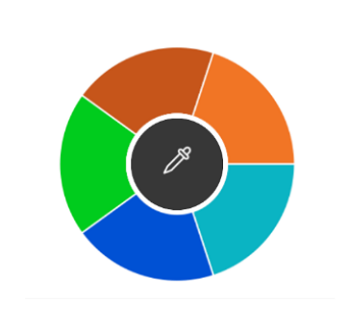
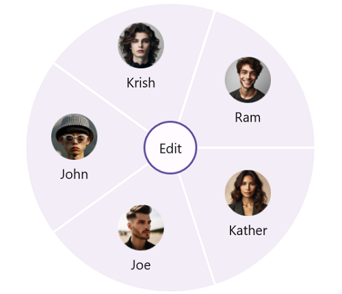

# SfRadialMenuItem Customization in .NET MAUI Radial Menu (SfRadialMenu)

## Prerequisites

Before using the [SfTabView](https://help.syncfusion.com/cr/maui/Syncfusion.Maui.RadialMenu.SfRadialMenu.html), ensure the following NuGet package is installed in your .NET MAUI project:

- `Syncfusion.Maui.RadialMenu`

For step-by-step setup, refer to the [Getting Started](https://help.syncfusion.com/maui/radial-menu/getting-started) documentation.

## Overview

The [`SfRadialMenuItem`](https://help.syncfusion.com/cr/maui/Syncfusion.Maui.RadialMenu.SfRadialMenuItem.html) class provides options to customize the appearance and behavior of each item in a [`SfRadialMenu`](https://help.syncfusion.com/cr/maui/Syncfusion.Maui.RadialMenu.SfRadialMenu.html). You can customize the following:

* Text-related properties — [`Text`](#text), [`FontFamily`](#fontfamily), [`FontSize`](#fontsize), [`FontAttributes`](#fontattributes), and [`FontAutoScalingEnabled`](#fontautoscalingenabled)
* Visual properties — [`BackgroundColor`](#backgroundcolor), [`ItemHeight`/`ItemWidth`](#itemheight-and-itemwidth), [`Image`](#image), and [`View`](#view)
* Hierarchy and behavior — [`Items`](#items), [`Command`](#command-and-commandparameter), and [`CommandParameter`](#command-and-commandparameter)

N> The `Command` and `CommandParameter` properties, the `View` property, and the `FontAutoScalingEnabled` property are supported in .NET MAUI 7.0 and later, and require the `Syncfusion.Maui.RadialMenu` package version 21.2.3 or higher.

## Items

The [`Items`](https://help.syncfusion.com/cr/maui/Syncfusion.Maui.RadialMenu.SfRadialMenuItem.html#Syncfusion_Maui_RadialMenu_SfRadialMenuItem_Items) property of `SfRadialMenuItem` is of type [`RadialMenuItemsCollection`](https://help.syncfusion.com/cr/maui/Syncfusion.Maui.RadialMenu.RadialMenuItemsCollection.html). Items added to this collection are displayed on the inner rim when the user taps the parent outer-rim item, enabling hierarchical sub-menus.





<radialMenu:SfRadialMenu CenterButtonText="Edit" CenterButtonFontSize="12">
    <radialMenu:SfRadialMenu.Items>
        <radialMenu:SfRadialMenuItem Text="Bold" FontSize="12" />
        <radialMenu:SfRadialMenuItem Text="Copy" FontSize="12" />
        <radialMenu:SfRadialMenuItem Text="Undo" FontSize="12" />
        <radialMenu:SfRadialMenuItem Text="Paste" FontSize="12" />
        <radialMenu:SfRadialMenuItem Text="Color" FontSize="12">
            <radialMenu:SfRadialMenuItem.Items>
                <radialMenu:SfRadialMenuItem Text="Font" FontSize="12" ItemWidth="50" />
                <radialMenu:SfRadialMenuItem Text="Gradient" FontSize="12" ItemWidth="50" />
                <radialMenu:SfRadialMenuItem Text="Highlight" FontSize="12" ItemWidth="50" />
            </radialMenu:SfRadialMenuItem.Items>
        </radialMenu:SfRadialMenuItem>
    </radialMenu:SfRadialMenu.Items>
</radialMenu:SfRadialMenu>





SfRadialMenu radialMenu = new SfRadialMenu();

// Add outer-rim items.
string[] mainItem = new string[] { "Bold", "Copy", "Paste", "Undo", "Color" };
for (int i = 0; i < mainItem.Length; i++)
{
    radialMenu.Items.Add(new SfRadialMenuItem
    {
        Text = mainItem[i],
        FontSize = 12
    });
}

// Add inner-rim (sub-menu) items under the "Color" outer item (index 4).
string[] colorItem = new string[] { "Font", "Gradient", "Highlight" };
for (int i = 0; i < colorItem.Length; i++)
{
    radialMenu.Items[4].Items.Add(new SfRadialMenuItem
    {
        Text = colorItem[i],
        FontSize = 12,
        ItemWidth = 50
    });
}





N> For more information on populating items, see [Populating Items in .NET MAUI Radial Menu](https://help.syncfusion.com/maui/radial-menu/populating-items).

## Text

The [`Text`](https://help.syncfusion.com/cr/maui/Syncfusion.Maui.RadialMenu.SfRadialMenuItem.html#Syncfusion_Maui_RadialMenu_SfRadialMenuItem_Text) property is of type `string` and its default value is `null`. It provides the label displayed inside the `SfRadialMenuItem`.





<radialMenu:SfRadialMenu>
    <radialMenu:SfRadialMenu.Items>
        <radialMenu:SfRadialMenuItem Text="Bold" FontSize="12" />
        <radialMenu:SfRadialMenuItem Text="Copy" FontSize="12" />
        <radialMenu:SfRadialMenuItem Text="Undo" FontSize="12" />
        <radialMenu:SfRadialMenuItem Text="Paste" FontSize="12" />
        <radialMenu:SfRadialMenuItem Text="Color" FontSize="12" />
    </radialMenu:SfRadialMenu.Items>
</radialMenu:SfRadialMenu>





SfRadialMenu radialMenu = new SfRadialMenu()
{
    LayoutType = LayoutType.Custom,
    Items = new RadialMenuItemsCollection()
    {
        new SfRadialMenuItem() { Text = "Bold", FontSize = 12 },
        new SfRadialMenuItem() { Text = "Copy", FontSize = 12 },
        new SfRadialMenuItem() { Text = "Paste", FontSize = 12 },
        new SfRadialMenuItem() { Text = "Undo", FontSize = 12 },
        new SfRadialMenuItem() { Text = "Color", FontSize = 12 },
    },
};





## BackgroundColor

The [`BackgroundColor`](https://help.syncfusion.com/cr/maui/Syncfusion.Maui.RadialMenu.SfRadialMenuItem.html#Syncfusion_Maui_RadialMenu_SfRadialMenuItem_BackgroundColor) property is of type `Color` and its default value is `Colors.Transparent`. It changes the background color of the `SfRadialMenuItem`.





<radialMenu:SfRadialMenu CenterButtonText="&#xe710;"
                            CenterButtonFontFamily="Maui Material Assets"
                            CenterButtonFontSize="28">
    <radialMenu:SfRadialMenu.Items>
        <radialMenu:SfRadialMenuItem BackgroundColor="#00cc1d" />
        <radialMenu:SfRadialMenuItem BackgroundColor="#c65619" />
        <radialMenu:SfRadialMenuItem BackgroundColor="#F17525" />
        <radialMenu:SfRadialMenuItem BackgroundColor="#0bb4c3" />
        <radialMenu:SfRadialMenuItem BackgroundColor="#0051d4" />
    </radialMenu:SfRadialMenu.Items>
</radialMenu:SfRadialMenu>





SfRadialMenu radialMenu = new SfRadialMenu()
{
    CenterButtonText = "\ue710",
    CenterButtonFontFamily = "Maui Material Assets",
    CenterButtonFontSize = 28,
    Items = new RadialMenuItemsCollection()
    {
        new SfRadialMenuItem() { BackgroundColor = Color.FromArgb("#00cc1d") },
        new SfRadialMenuItem() { BackgroundColor = Color.FromArgb("#c65619") },
        new SfRadialMenuItem() { BackgroundColor = Color.FromArgb("#F17525") },
        new SfRadialMenuItem() { BackgroundColor = Color.FromArgb("#0bb4c3") },
        new SfRadialMenuItem() { BackgroundColor = Color.FromArgb("#0051d4") },
    },
};





N> When using a font icon for the `CenterButtonText`, the referenced font (for example, `Maui Material Assets`) must be registered in the `MauiProgram.cs` file via `ConfigureFonts`.

## ItemHeight and ItemWidth

The [`ItemHeight`](https://help.syncfusion.com/cr/maui/Syncfusion.Maui.RadialMenu.SfRadialMenuItem.html#Syncfusion_Maui_RadialMenu_SfRadialMenuItem_ItemHeight) and [`ItemWidth`](https://help.syncfusion.com/cr/maui/Syncfusion.Maui.RadialMenu.SfRadialMenuItem.html#Syncfusion_Maui_RadialMenu_SfRadialMenuItem_ItemWidth) properties are of type `double` and their default value is `-1`, which means the item uses the size defined by the parent `SfRadialMenu`. Set these properties to change the height and width of each `SfRadialMenuItem` in device-independent units (DIPs).





<radialMenu:SfRadialMenu CenterButtonText="Edit">
    <radialMenu:SfRadialMenu.Items>
        <radialMenu:SfRadialMenuItem ItemHeight="60" ItemWidth="60" Text="John" Image="johnson.png" />
        <radialMenu:SfRadialMenuItem ItemHeight="60" ItemWidth="60" Text="Krish" Image="krish.png" />
        <radialMenu:SfRadialMenuItem ItemHeight="60" ItemWidth="60" Text="Ram" Image="ram.png" />
        <radialMenu:SfRadialMenuItem ItemHeight="60" ItemWidth="60" Text="Kather" Image="kather.png" />
        <radialMenu:SfRadialMenuItem ItemHeight="60" ItemWidth="60" Text="Joe" Image="joe.png" />
    </radialMenu:SfRadialMenu.Items>
</radialMenu:SfRadialMenu>





SfRadialMenu radialMenu = new SfRadialMenu
{
    CenterButtonText = "Edit",
    Items = new RadialMenuItemsCollection()
    {
        new SfRadialMenuItem() { Text = "John", Image = "johnson.png", ItemHeight = 60, ItemWidth = 60 },
        new SfRadialMenuItem() { Text = "Krish", Image = "krish.png", ItemHeight = 60, ItemWidth = 60 },
        new SfRadialMenuItem() { Text = "Ram", Image = "ram.png", ItemHeight = 60, ItemWidth = 60 },
        new SfRadialMenuItem() { Text = "Kather", Image = "kather.png", ItemHeight = 60, ItemWidth = 60 },
        new SfRadialMenuItem() { Text = "Joe", Image = "joe.png", ItemHeight = 60, ItemWidth = 60 },
    },
};





## Image

The [`Image`](https://help.syncfusion.com/cr/maui/Syncfusion.Maui.RadialMenu.SfRadialMenuItem.html#Syncfusion_Maui_RadialMenu_SfRadialMenuItem_Image) property is of type `ImageSource` and its default value is `null`. It specifies an image for the `SfRadialMenuItem`. The `ImageSource` can be loaded from a file name, a URI, or a stream.





<radialMenu:SfRadialMenu>
    <radialMenu:SfRadialMenu.Items>
        <radialMenu:SfRadialMenuItem Image="johnson.png" />
        <radialMenu:SfRadialMenuItem Image="krish.png" />
        <radialMenu:SfRadialMenuItem Image="ram.png" />
        <radialMenu:SfRadialMenuItem Image="kather.png" />
        <radialMenu:SfRadialMenuItem Image="joe.png" />
    </radialMenu:SfRadialMenu.Items>
</radialMenu:SfRadialMenu>





SfRadialMenu radialMenu = new SfRadialMenu()
{
    Items = new RadialMenuItemsCollection()
    {
        new SfRadialMenuItem() { Image = "johnson.png" },
        new SfRadialMenuItem() { Image = "krish.png" },
        new SfRadialMenuItem() { Image = "ram.png" },
        new SfRadialMenuItem() { Image = "kather.png" },
        new SfRadialMenuItem() { Image = "joe.png" },
    },
};





N> Place the images in `Resources/Images/` and add the following to your `.csproj` so they are recognized as `MauiImage` items: <MauiImage Include="Resources/Images\*.png" />

## View

The [`View`](https://help.syncfusion.com/cr/maui/Syncfusion.Maui.RadialMenu.SfRadialMenuItem.html#Syncfusion_Maui_RadialMenu_SfRadialMenuItem_View) property is of type `View` and its default value is `null`. It allows you to place any .NET MAUI view (for example, a `Label`, `Image`, or a custom layout) inside the `SfRadialMenuItem`. The `View` is rendered instead of the default text-and-icon appearance. Use `ItemHeight` and `ItemWidth` to control the size of the rendered view.





<radialMenu:SfRadialMenu>
    <radialMenu:SfRadialMenu.Items>
        <radialMenu:SfRadialMenuItem>
            <radialMenu:SfRadialMenuItem.View>
                <Label Text="Cut"
                        HorizontalTextAlignment="Center"
                        VerticalTextAlignment="Center" />
            </radialMenu:SfRadialMenuItem.View>
        </radialMenu:SfRadialMenuItem>
        <radialMenu:SfRadialMenuItem>
            <radialMenu:SfRadialMenuItem.View>
                <Label Text="Copy"
                        HorizontalTextAlignment="Center"
                        VerticalTextAlignment="Center" />
            </radialMenu:SfRadialMenuItem.View>
        </radialMenu:SfRadialMenuItem>
        <radialMenu:SfRadialMenuItem>
            <radialMenu:SfRadialMenuItem.View>
                <Label Text="Paste"
                        HorizontalTextAlignment="Center"
                        VerticalTextAlignment="Center" />
            </radialMenu:SfRadialMenuItem.View>
        </radialMenu:SfRadialMenuItem>
    </radialMenu:SfRadialMenu.Items>
</radialMenu:SfRadialMenu>





SfRadialMenu radialMenu = new SfRadialMenu
{
    Items =
    {
        new SfRadialMenuItem
        {
            View = new Label
            {
                Text = "Cut",
                HorizontalTextAlignment = TextAlignment.Center,
                VerticalTextAlignment = TextAlignment.Center
            }
        },
        new SfRadialMenuItem
        {
            View = new Label
            {
                Text = "Copy",
                HorizontalTextAlignment = TextAlignment.Center,
                VerticalTextAlignment = TextAlignment.Center
            }
        },
        new SfRadialMenuItem
        {
            View = new Label
            {
                Text = "Paste",
                HorizontalTextAlignment = TextAlignment.Center,
                VerticalTextAlignment = TextAlignment.Center
            }
        }
    }
};





## FontFamily

The [`FontFamily`](https://help.syncfusion.com/cr/maui/Syncfusion.Maui.RadialMenu.SfRadialMenuItem.html#Syncfusion_Maui_RadialMenu_SfRadialMenuItem_FontFamily) property is of type `string` and its default value is `null`, which uses the platform default font. It changes the font family of the `Text` in the `SfRadialMenuItem`. Custom fonts must be registered in `MauiProgram.cs` and shipped as `MauiFont` items.





<radialMenu:SfRadialMenu>
    <radialMenu:SfRadialMenu.Items>
        <radialMenu:SfRadialMenuItem Text="John" FontFamily="Times New Roman" />
        <radialMenu:SfRadialMenuItem Text="Krish" FontFamily="Times New Roman" />
        <radialMenu:SfRadialMenuItem Text="Ram" FontFamily="Times New Roman" />
        <radialMenu:SfRadialMenuItem Text="Kather" FontFamily="Times New Roman" />
        <radialMenu:SfRadialMenuItem Text="Joe" FontFamily="Times New Roman" />
    </radialMenu:SfRadialMenu.Items>
</radialMenu:SfRadialMenu>





SfRadialMenu radialMenu = new SfRadialMenu()
{
    Items = new RadialMenuItemsCollection()
    {
        new SfRadialMenuItem() { Text = "Bold", FontFamily = "Times New Roman" },
        new SfRadialMenuItem() { Text = "Copy", FontFamily = "Times New Roman" },
        new SfRadialMenuItem() { Text = "Paste", FontFamily = "Times New Roman" },
        new SfRadialMenuItem() { Text = "Undo", FontFamily = "Times New Roman" },
        new SfRadialMenuItem() { Text = "Color", FontFamily = "Times New Roman" },
    },
};





## FontSize

The [`FontSize`](https://help.syncfusion.com/cr/maui/Syncfusion.Maui.RadialMenu.SfRadialMenuItem.html#Syncfusion_Maui_RadialMenu_SfRadialMenuItem_FontSize) property is of type `double` and its default value is `12`. It adjusts the size of the `Text` in the `SfRadialMenuItem` in device-independent units (DIPs).





<radialMenu:SfRadialMenu>
    <radialMenu:SfRadialMenu.Items>
        <radialMenu:SfRadialMenuItem Text="John" FontSize="16" />
        <radialMenu:SfRadialMenuItem Text="Krish" FontSize="18" />
        <radialMenu:SfRadialMenuItem Text="Ram" FontSize="20" />
        <radialMenu:SfRadialMenuItem Text="Kather" FontSize="22" />
        <radialMenu:SfRadialMenuItem Text="Joe" FontSize="24" />
    </radialMenu:SfRadialMenu.Items>
</radialMenu:SfRadialMenu>





SfRadialMenu radialMenu = new SfRadialMenu()
{
    Items = new RadialMenuItemsCollection()
    {
        new SfRadialMenuItem() { Text = "John", FontSize = 16 },
        new SfRadialMenuItem() { Text = "Krish", FontSize = 18 },
        new SfRadialMenuItem() { Text = "Ram", FontSize = 20 },
        new SfRadialMenuItem() { Text = "Kather", FontSize = 22 },
        new SfRadialMenuItem() { Text = "Joe", FontSize = 24 },
    },
};





## FontAttributes

The [`FontAttributes`](https://help.syncfusion.com/cr/maui/Syncfusion.Maui.RadialMenu.SfRadialMenuItem.html#Syncfusion_Maui_RadialMenu_SfRadialMenuItem_FontAttributes) property is of type `FontAttributes` (an enum with values `None`, `Bold`, and `Italic`) and its default value is `FontAttributes.None`. It applies bold or italic styling to the `Text` in the `SfRadialMenuItem`.





<radialMenu:SfRadialMenu>
    <radialMenu:SfRadialMenu.Items>
        <radialMenu:SfRadialMenuItem Text="John" FontAttributes="None" />
        <radialMenu:SfRadialMenuItem Text="Krish" FontAttributes="Bold" />
        <radialMenu:SfRadialMenuItem Text="Ram" FontAttributes="Italic" />
    </radialMenu:SfRadialMenu.Items>
</radialMenu:SfRadialMenu>





SfRadialMenu radialMenu = new SfRadialMenu
{
    Items =
    {
        new SfRadialMenuItem { Text = "Bold",  FontAttributes = FontAttributes.None},
        new SfRadialMenuItem { Text = "Copy", FontAttributes = FontAttributes.Bold },
        new SfRadialMenuItem { Text = "Paste", FontAttributes = FontAttributes.Italic }
    }
};




## FontAutoScalingEnabled

The [`FontAutoScalingEnabled`](https://help.syncfusion.com/cr/maui/Syncfusion.Maui.RadialMenu.SfRadialMenuItem.html#Syncfusion_Maui_RadialMenu_SfRadialMenuItem_FontAutoScalingEnabled) property is of type `bool` and its default value is `false`. When set to `true`, the `FontSize` is automatically scaled based on the device's operating-system text-size setting.





<radialMenu:SfRadialMenu>
    <radialMenu:SfRadialMenu.Items>
        <radialMenu:SfRadialMenuItem Text="Bold" FontAutoScalingEnabled="True" />
        <radialMenu:SfRadialMenuItem Text="Copy" FontAutoScalingEnabled="True" />
        <radialMenu:SfRadialMenuItem Text="Undo" FontAutoScalingEnabled="True" />
        <radialMenu:SfRadialMenuItem Text="Paste" FontAutoScalingEnabled="True" />
        <radialMenu:SfRadialMenuItem Text="Color" FontAutoScalingEnabled="True" />
    </radialMenu:SfRadialMenu.Items>
</radialMenu:SfRadialMenu>





SfRadialMenu radialMenu = new SfRadialMenu()
{
    Items = new RadialMenuItemsCollection()
    {
        new SfRadialMenuItem() { Text = "Bold", FontAutoScalingEnabled = true },
        new SfRadialMenuItem() { Text = "Copy", FontAutoScalingEnabled = true },
        new SfRadialMenuItem() { Text = "Paste", FontAutoScalingEnabled = true },
        new SfRadialMenuItem() { Text = "Undo", FontAutoScalingEnabled = true },
        new SfRadialMenuItem() { Text = "Color", FontAutoScalingEnabled = true },
    },
};





## Command and CommandParameter

The [`Command`](https://help.syncfusion.com/cr/maui/Syncfusion.Maui.RadialMenu.SfRadialMenuItem.html#Syncfusion_Maui_RadialMenu_SfRadialMenuItem_Command) property is of type `ICommand` and its default value is `null`. It associates a command with an `SfRadialMenuItem`, which is typically used in the MVVM pattern to handle taps in a ViewModel.

The [`CommandParameter`](https://help.syncfusion.com/cr/maui/Syncfusion.Maui.RadialMenu.SfRadialMenuItem.html#Syncfusion_Maui_RadialMenu_SfRadialMenuItem_CommandParameter) property is of type `object` and its default value is `null`. It is passed as the argument to the `Command` when the item is tapped.

When an `SfRadialMenuItem` is tapped, its `Command` is invoked with the `CommandParameter` as the argument.

### ViewModel

The following ViewModel exposes one `ICommand` per item using the `CommunityToolkit.Mvvm` source generators. The handler displays a simple alert that identifies which item was tapped.




using System.Windows.Input;
using CommunityToolkit.Mvvm.ComponentModel;
using CommunityToolkit.Mvvm.Input;

namespace RadialSample
{
    public partial class ViewModel : ObservableObject
    {
        [ObservableProperty]
        private ICommand cutItemCommand;

        [ObservableProperty]
        private ICommand copyItemCommand;

        [ObservableProperty]
        private ICommand pasteItemCommand;

        [ObservableProperty]
        private ICommand cropItemCommand;

        [ObservableProperty]
        private ICommand paintItemCommand;

        private readonly Page page;

        public ViewModel(Page page)
        {
            this.page = page;
            CutItemCommand = new RelayCommand<string>(OnItemTapped);
            CopyItemCommand = new RelayCommand<string>(OnItemTapped);
            PasteItemCommand = new RelayCommand<string>(OnItemTapped);
            CropItemCommand = new RelayCommand<string>(OnItemTapped);
            PaintItemCommand = new RelayCommand<string>(OnItemTapped);
        }

        private async void OnItemTapped(string message)
        {
            if (string.IsNullOrEmpty(message))
            {
                return;
            }

            await page.DisplayAlert("Alert", message, "OK");
        }
    }
}




### XAML

Bind each item to the corresponding command and command parameter, and set the `BindingContext` of the page to the ViewModel instance.





<ContentPage.BindingContext>
    <local:ViewModel />
</ContentPage.BindingContext>
<radialMenu:SfRadialMenu CenterButtonText="Edit"
                            CenterButtonFontSize="15">
    <radialMenu:SfRadialMenu.Items>
        <radialMenu:SfRadialMenuItem Text="Cut" FontSize="15"
                                        Command="{Binding CutItemCommand}"
                                        CommandParameter="Cut is tapped" />
        <radialMenu:SfRadialMenuItem Text="Copy" FontSize="15"
                                        Command="{Binding CopyItemCommand}"
                                        CommandParameter="Copy is tapped" />
        <radialMenu:SfRadialMenuItem Text="Paste" FontSize="15"
                                        Command="{Binding PasteItemCommand}"
                                        CommandParameter="Paste is tapped" />
        <radialMenu:SfRadialMenuItem Text="Crop" FontSize="15"
                                        Command="{Binding CropItemCommand}"
                                        CommandParameter="Crop is tapped" />
        <radialMenu:SfRadialMenuItem Text="Paint" FontSize="15"
                                        Command="{Binding PaintItemCommand}"
                                        CommandParameter="Paint is tapped" />
    </radialMenu:SfRadialMenu.Items>
</radialMenu:SfRadialMenu>





### C#

The same bindings can be created in code. Ensure the `ViewModel` is instantiated and assigned to the `BindingContext` before the items are created, so that the commands are available.





ViewModel viewModel = new ViewModel(this);
BindingContext = viewModel;

SfRadialMenu radialMenu = new SfRadialMenu
{
    CenterButtonText = "Edit",
    CenterButtonFontSize = 15,
    Items =
    {
        new SfRadialMenuItem
        {
            Text = "Cut",
            FontSize = 15,
            Command = viewModel.CutItemCommand,
            CommandParameter = "Cut is tapped"
        },
        new SfRadialMenuItem
        {
            Text = "Copy",
            FontSize = 15,
            Command = viewModel.CopyItemCommand,
            CommandParameter = "Copy is tapped"
        },
        new SfRadialMenuItem
        {
            Text = "Paste",
            FontSize = 15,
            Command = viewModel.PasteItemCommand,
            CommandParameter = "Paste is tapped"
        },
        new SfRadialMenuItem
        {
            Text = "Crop",
            FontSize = 15,
            Command = viewModel.CropItemCommand,
            CommandParameter = "Crop is tapped"
        },
        new SfRadialMenuItem
        {
            Text = "Paint",
            FontSize = 15,
            Command = viewModel.PaintItemCommand,
            CommandParameter = "Paint is tapped"
        }
    }
};





N> The `ViewModel` constructor expects a `Page` so it can call `DisplayAlert`. Adjust the type if you want to use a different navigation pattern.

## See also

- [Getting Started with .NET MAUI Radial Menu](https://help.syncfusion.com/maui/radial-menu/getting-started)
- [Segmenting and Placing Items in .NET MAUI Radial Menu](https://help.syncfusion.com/maui/radial-menu/segmenting-placing-items)
- [CenterButton Customization in MAUI Radial Menu](https://help.syncfusion.com/maui/radial-menu/centerbutton-customization)
- [Events in .NET MAUI Radial Menu](https://help.syncfusion.com/maui/radial-menu/events)
- [Placing and Dragging in MAUI Radial Menu](https://help.syncfusion.com/maui/radial-menu/place-and-drag-radialmenu)