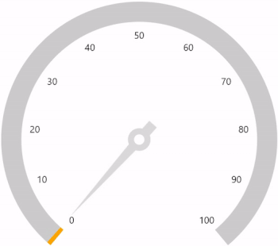
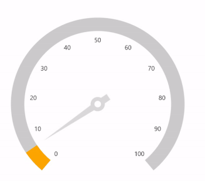

# Animation in .NET MAUI Radial Gauge

## Pointer animation

The [`EnableAnimation`](https://help.syncfusion.com/cr/maui/Syncfusion.Maui.Gauges.RadialPointer.html#Syncfusion_Maui_Gauges_RadialPointer_EnableAnimation) property of pointer allows you to enable or disable animation for pointer.





 <gauge:SfRadialGauge>
            <gauge:SfRadialGauge.Axes>
                <gauge:RadialAxis ShowTicks="False">
                    <gauge:RadialAxis.AxisLineStyle>
                        <gauge:RadialLineStyle Thickness="30"/>
                    </gauge:RadialAxis.AxisLineStyle>
                    <gauge:RadialAxis.Pointers>
                        <gauge:NeedlePointer Value="60"
                                     EnableAnimation="True"
                                     NeedleStartWidth="0"
                                     NeedleEndWidth="15"
                                     NeedleFill="#FFDADADA"
                                     KnobFill="White"
                                     KnobStroke="#FFDADADA"
                                     KnobRadius="0.09"
                                     KnobStrokeThickness="0.04"
                                     TailFill="#FFDADADA"
                                     TailLength="0.15"
                                     TailWidth="15">
                        </gauge:NeedlePointer>
                        <gauge:RangePointer Value="60"
                                    PointerWidth="30"
                                    EnableAnimation="True"
                                    Fill="Orange" />
                    </gauge:RadialAxis.Pointers>
                </gauge:RadialAxis>
            </gauge:SfRadialGauge.Axes>
        </gauge:SfRadialGauge>





SfRadialGauge sfRadialGauge = new SfRadialGauge();

            RadialAxis radialAxis = new RadialAxis();
            radialAxis.ShowTicks = false;
            radialAxis.AxisLineStyle.Thickness = 30;
            sfRadialGauge.Axes.Add(radialAxis);

            NeedlePointer needlePointer = new NeedlePointer();
            needlePointer.Value = 60;
            needlePointer.EnableAnimation = true;
            needlePointer.NeedleStartWidth = 0;
            needlePointer.NeedleEndWidth = 15;
            needlePointer.NeedleFill = new SolidColorBrush(Color.FromRgb(218, 218, 218));
            needlePointer.KnobFill = new SolidColorBrush(Colors.White);
            needlePointer.KnobStroke = Color.FromRgb(218, 218, 218);
            needlePointer.KnobRadius = 0.09;
            needlePointer.KnobStrokeThickness = 0.04;
            needlePointer.TailFill = new SolidColorBrush(Color.FromRgb(218, 218, 218));
            needlePointer.TailLength = 0.15;
            needlePointer.TailWidth = 15;
            radialAxis.Pointers.Add(needlePointer);

            RangePointer rangePointer = new RangePointer();
            rangePointer.Value = 60;
            rangePointer.PointerWidth = 30;
            rangePointer.EnableAnimation = true;
            rangePointer.Fill = new SolidColorBrush(Colors.Orange);
            radialAxis.Pointers.Add(rangePointer);

            this.Content = sfRadialGauge;




## Animation duration

The pointers [`AnimationDuration`](https://help.syncfusion.com/cr/maui/Syncfusion.Maui.Gauges.RadialPointer.html#Syncfusion_Maui_Gauges_RadialPointer_AnimationDuration) property allows you to control the animation duration (in milliseconds). The default value of animation duration is 1000ms.





 <gauge:SfRadialGauge>
            <gauge:SfRadialGauge.Axes>
                <gauge:RadialAxis ShowTicks="False">
                    <gauge:RadialAxis.AxisLineStyle>
                        <gauge:RadialLineStyle Thickness="30"/>
                    </gauge:RadialAxis.AxisLineStyle>
                    <gauge:RadialAxis.Pointers>
                        <gauge:NeedlePointer Value="60"
                                     EnableAnimation="True"
                                     AnimationDuration="3000"
                                     NeedleStartWidth="0"
                                     NeedleEndWidth="15"
                                     NeedleFill="#FFDADADA"
                                     KnobFill="White"
                                     KnobStroke="#FFDADADA"
                                     KnobRadius="0.09"
                                     KnobStrokeThickness="0.04"
                                     TailFill="#FFDADADA"
                                     TailLength="0.15"
                                     TailWidth="15">
                        </gauge:NeedlePointer>
                        <gauge:RangePointer Value="60"
                                    PointerWidth="30"
                                    EnableAnimation="True"
                                    AnimationDuration="3000"
                                    Fill="Orange" />
                    </gauge:RadialAxis.Pointers>
                </gauge:RadialAxis>
            </gauge:SfRadialGauge.Axes>
        </gauge:SfRadialGauge>





SfRadialGauge sfRadialGauge = new SfRadialGauge();

            RadialAxis radialAxis = new RadialAxis();
            radialAxis.ShowTicks = false;
            radialAxis.AxisLineStyle.Thickness = 30;
            sfRadialGauge.Axes.Add(radialAxis);

            NeedlePointer needlePointer = new NeedlePointer();
            needlePointer.Value = 60;
            needlePointer.EnableAnimation = true;
            needlePointer.AnimationDuration = 3000;
            needlePointer.NeedleStartWidth = 0;
            needlePointer.NeedleEndWidth = 15;
            needlePointer.NeedleFill = new SolidColorBrush(Color.FromRgb(218, 218, 218));
            needlePointer.KnobFill = new SolidColorBrush(Colors.White);
            needlePointer.KnobStroke = Color.FromRgb(218, 218, 218);
            needlePointer.KnobRadius = 0.09;
            needlePointer.KnobStrokeThickness = 0.04;
            needlePointer.TailFill = new SolidColorBrush(Color.FromRgb(218, 218, 218));
            needlePointer.TailLength = 0.15;
            needlePointer.TailWidth = 15;
            radialAxis.Pointers.Add(needlePointer);

            RangePointer rangePointer = new RangePointer();
            rangePointer.Value = 60;
            rangePointer.PointerWidth = 30;
            rangePointer.EnableAnimation = true;
            rangePointer.AnimationDuration = 3000;
            rangePointer.Fill = new SolidColorBrush(Colors.Orange);
            radialAxis.Pointers.Add(rangePointer);

            this.Content = sfRadialGauge;




## Animation easing

The [`AnimationEasing`](https://help.syncfusion.com/cr/maui/Syncfusion.Maui.Gauges.RadialPointer.html#Syncfusion_Maui_Gauges_RadialPointer_AnimationEasing) property of pointer allows you to use below type of easing function in pointer animation. 

* `Linear`

* `SinOut`

* `SinIn`

* `SinInOut`

* `CubicIn`

* `CubicOut`

* `CubicInOut`

* `BounceOut`

* `BounceIn`

* `SpringIn`

* `SpringOut`

The default value of [`AnimationEasing`](https://help.syncfusion.com/cr/maui/Syncfusion.Maui.Gauges.RadialPointer.html#Syncfusion_Maui_Gauges_RadialPointer_AnimationEasing) property is `Linear`.





 <gauge:SfRadialGauge>
            <gauge:SfRadialGauge.Axes>
                <gauge:RadialAxis ShowTicks="False">
                    <gauge:RadialAxis.AxisLineStyle>
                        <gauge:RadialLineStyle Thickness="30"/>
                    </gauge:RadialAxis.AxisLineStyle>
                    <gauge:RadialAxis.Pointers>
                        <gauge:NeedlePointer Value="60"
                                     EnableAnimation="True"
                                     AnimationDuration="3000"
                                     AnimationEasing="{x:Static Easing.SpringOut}"
                                     NeedleStartWidth="0"
                                     NeedleEndWidth="15"
                                     NeedleFill="#FFDADADA"
                                     KnobFill="White"
                                     KnobStroke="#FFDADADA"
                                     KnobRadius="0.09"
                                     KnobStrokeThickness="0.04"
                                     TailFill="#FFDADADA"
                                     TailLength="0.15"
                                     TailWidth="15">

                        </gauge:NeedlePointer>
                        <gauge:RangePointer Value="60"
                                    PointerWidth="30"
                                    EnableAnimation="True"
                                    AnimationDuration="3000"
                                    AnimationEasing="{x:Static Easing.SpringOut}"
                                    Fill="Orange">
                        </gauge:RangePointer>
                    </gauge:RadialAxis.Pointers>
                </gauge:RadialAxis>
            </gauge:SfRadialGauge.Axes>
        </gauge:SfRadialGauge>





SfRadialGauge sfRadialGauge = new SfRadialGauge();

            RadialAxis radialAxis = new RadialAxis();
            radialAxis.ShowTicks = false;
            radialAxis.AxisLineStyle.Thickness = 30;
            sfRadialGauge.Axes.Add(radialAxis);

            NeedlePointer needlePointer = new NeedlePointer();
            needlePointer.Value = 60;
            needlePointer.EnableAnimation = true;
            needlePointer.AnimationDuration = 3000;
            needlePointer.AnimationEasing = Easing.SpringOut;
            needlePointer.NeedleStartWidth = 0;
            needlePointer.NeedleEndWidth = 15;
            needlePointer.NeedleFill = new SolidColorBrush(Color.FromRgb(218, 218, 218));
            needlePointer.KnobFill = new SolidColorBrush(Colors.White);
            needlePointer.KnobStroke = Color.FromRgb(218, 218, 218);
            needlePointer.KnobRadius = 0.09;
            needlePointer.KnobStrokeThickness = 0.04;
            needlePointer.TailFill = new SolidColorBrush(Color.FromRgb(218, 218, 218));
            needlePointer.TailLength = 0.15;
            needlePointer.TailWidth = 15;
            radialAxis.Pointers.Add(needlePointer);

            RangePointer rangePointer = new RangePointer();
            rangePointer.Value = 60;
            rangePointer.PointerWidth = 30;
            rangePointer.EnableAnimation = true;
            rangePointer.AnimationDuration = 3000;
            rangePointer.AnimationEasing = Easing.SpringOut;
            rangePointer.Fill = new SolidColorBrush(Colors.Orange);
            radialAxis.Pointers.Add(rangePointer);

            this.Content = sfRadialGauge;




