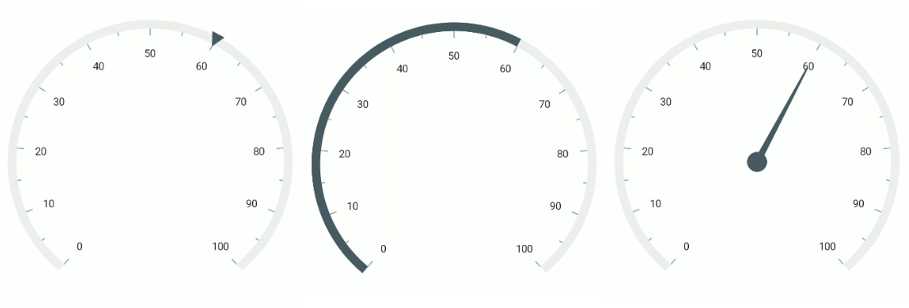

# Pointers in .NET MAUI Radial Gauge

 Pointer is used to indicate values on an axis. The radial gauge control has three types of pointers: 

* [`Marker pointer`](https://help.syncfusion.com/maui/radialgauge/marker-pointer)
* [`Needle Pointer`](https://help.syncfusion.com/maui/radialgauge/needle-pointer)
* [`Range pointer`](https://help.syncfusion.com/maui/radialgauge/range-pointer)

All the pointers can be customized as needed. You can add multiple pointers to the gauge to point the multiple values on the same scale. The value of the pointer is set using the [`Value`](https://help.syncfusion.com/cr/maui/Syncfusion.Maui.Gauges.RadialPointer.html#Syncfusion_Maui_Gauges_RadialPointer_Value) property.

## Multiple pointers

In addition to the default pointer, you can add `N` number of pointers to an axis by adding in the [`Pointers`](https://help.syncfusion.com/cr/maui/Syncfusion.Maui.Gauges.RadialAxis.html#Syncfusion_Maui_Gauges_RadialAxis_Pointers) collection property.





<gauge:SfRadialGauge>
    <gauge:SfRadialGauge.Axes>
        <gauge:RadialAxis>
            <gauge:RadialAxis.Pointers>
                <gauge:RangePointer Value="30" />
                <gauge:MarkerPointer Value="70" />
                <gauge:NeedlePointer Value="60" />
            </gauge:RadialAxis.Pointers>
        </gauge:RadialAxis>
    </gauge:SfRadialGauge.Axes>
</gauge:SfRadialGauge>





SfRadialGauge sfRadialGauge = new SfRadialGauge();

RadialAxis radialAxis = new RadialAxis();
RangePointer rangePointer = new RangePointer { Value = 30 };
radialAxis.Pointers.Add(rangePointer);
MarkerPointer markerPointer = new MarkerPointer { Value = 70 };
radialAxis.Pointers.Add(markerPointer);
NeedlePointer needlePointer = new NeedlePointer { Value = 60 };
radialAxis.Pointers.Add(needlePointer);

sfRadialGauge.Axes.Add(radialAxis);

this.Content = sfRadialGauge;





## Pointer interaction

Pointers can be dragged over the axis scale. It can be achieved by swipe or drag gestures. To enable or disable the pointer drag, use the [`IsInteractive`](https://help.syncfusion.com/cr/maui/Syncfusion.Maui.Gauges.RadialPointer.html#Syncfusion_Maui_Gauges_RadialPointer_IsInteractive) property.





<gauge:SfRadialGauge>
            <gauge:SfRadialGauge.Axes>
                <gauge:RadialAxis ShowTicks="False">
                    <gauge:RadialAxis.AxisLineStyle>
                        <gauge:RadialLineStyle Thickness="30" Fill="CornflowerBlue"/>
                    </gauge:RadialAxis.AxisLineStyle>
                    <gauge:RadialAxis.Pointers>
                        <gauge:MarkerPointer Value="30"
                                     IsInteractive="True"
                                     MarkerOffset="-30"
                                     Fill="Indigo" />
                    </gauge:RadialAxis.Pointers>
                </gauge:RadialAxis>
            </gauge:SfRadialGauge.Axes>
        </gauge:SfRadialGauge>





 SfRadialGauge sfRadialGauge = new SfRadialGauge();

            RadialAxis radialAxis = new RadialAxis();
            radialAxis.ShowTicks = false;
            radialAxis.AxisLineStyle.Fill = new SolidColorBrush(Colors.CornflowerBlue);
            radialAxis.AxisLineStyle.Thickness = 30;
            sfRadialGauge.Axes.Add(radialAxis);

            MarkerPointer markerPointer = new MarkerPointer();
            markerPointer.Value = 30;
            markerPointer.IsInteractive = true;
            markerPointer.Fill = new SolidColorBrush(Colors.Indigo);
            markerPointer.MarkerOffset = -30;
            radialAxis.Pointers.Add(markerPointer);

this.Content = sfRadialGauge;





## Event

[`ValueChangeStarted`](https://help.syncfusion.com/cr/maui/Syncfusion.Maui.Gauges.RadialPointer.html#Syncfusion_Maui_Gauges_RadialPointer_ValueChangeStarted) - Occurs whenever the pointer starts to drag.

[`ValueChanging`](https://help.syncfusion.com/cr/maui/Syncfusion.Maui.Gauges.RadialPointer.html#Syncfusion_Maui_Gauges_RadialPointer_ValueChanging) - Occurs before the current drag value gets updated as pointer value. The `Cancel` argument of `ValueChangingEventArgs` allows to restrict the update of current drag value.

[`ValueChanged`](https://help.syncfusion.com/cr/maui/Syncfusion.Maui.Gauges.RadialPointer.html#Syncfusion_Maui_Gauges_RadialPointer_ValueChanged) - Occurs whenever the pointer value is changed while dragging.

[`ValueChangeCompleted`](https://help.syncfusion.com/cr/maui/Syncfusion.Maui.Gauges.RadialPointer.html#Syncfusion_Maui_Gauges_RadialPointer_ValueChangeCompleted) - Occurs once the dragging of the pointer gets completed.





<gauge:SfRadialGauge>
    <gauge:SfRadialGauge.Axes>
        <gauge:RadialAxis>
            <gauge:RadialAxis.Pointers>
                <gauge:MarkerPointer Value="30"
                                     IsInteractive="True"
                                     ValueChanging="MarkerPointer_ValueChanging"
                                     ValueChanged="MarkerPointer_ValueChanged"/>
            </gauge:RadialAxis.Pointers>
        </gauge:RadialAxis>
    </gauge:SfRadialGauge.Axes>
</gauge:SfRadialGauge>





SfRadialGauge sfRadialGauge = new SfRadialGauge();

            RadialAxis radialAxis = new RadialAxis();
            sfRadialGauge.Axes.Add(radialAxis);

            MarkerPointer markerPointer = new MarkerPointer();
            markerPointer.Value = 30;
            markerPointer.IsInteractive = true;
            markerPointer.ValueChanging += MarkerPointer_ValueChanging;
            markerPointer.ValueChanged += MarkerPointer_ValueChanged;
            radialAxis.Pointers.Add(markerPointer);

            this.Content = sfRadialGauge;

...

private void MarkerPointer_ValueChanging(object sender, ValueChangingEventArgs e)
{
    if (e.NewValue > 60)
    {
        e.Cancel = true;
    }
}

private void MarkerPointer_ValueChanged(object sender, ValueChangedEventArgs e)
{

}




