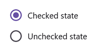

# Events in .NET MAUI Radio Button (SfRadioButton)

## StateChanged event

This event occurs when the value (state) of the [`IsChecked`](https://help.syncfusion.com/cr/maui/Syncfusion.Maui.Buttons.SfRadioButton.html#Syncfusion_Maui_Buttons_SfRadioButton_IsChecked) property is changed by touching the check box or setting the value to the [`IsChecked`](https://help.syncfusion.com/cr/maui/Syncfusion.Maui.Buttons.SfRadioButton.html#Syncfusion_Maui_Buttons_SfRadioButton_IsChecked) property using XAML or C# code. The event arguments are of type [`StateChangedEventArgs`](https://help.syncfusion.com/cr/maui/Syncfusion.Maui.Buttons.StateChangedEventArgs.html) and expose the following property:

* [`IsChecked`](https://help.syncfusion.com/cr/maui/Syncfusion.Maui.Buttons.SfRadioButton.html#Syncfusion_Maui_Buttons_SfRadioButton_IsChecked) : The new value(state) of the [`IsChecked`](https://help.syncfusion.com/cr/maui/Syncfusion.Maui.Buttons.SfRadioButton.html#Syncfusion_Maui_Buttons_SfRadioButton_IsChecked) property.




    <syncfusion:SfRadioGroup x:Name="radioGroup">
        <syncfusion:SfRadioButton x:Name="check" Text="Checked State" IsChecked="True" StateChanged="RadioButton_StateChanged"/>
        <syncfusion:SfRadioButton x:Name="uncheck" Text="Unchecked  State" StateChanged="RadioButton_StateChanged"/>
    </syncfusion:SfRadioGroup>




    SfRadioGroup radioGroup = new SfRadioGroup();
    SfRadioButton check = new SfRadioButton();
    check.Text = "Checked State";
    check.IsChecked = true;
    check.StateChanged += RadioButton_StateChanged;
    SfRadioButton uncheck = new SfRadioButton();
    uncheck.Text = "Unchecked State";
    uncheck.StateChanged += RadioButton_StateChanged;
    radioGroup.Children.Add(check);
    radioGroup.Children.Add(uncheck);
    this.Content = radioGroup;







    private void RadioButton_StateChanged(object sender, Syncfusion.Maui.Buttons.StateChangedEventArgs e)
    {
        if (e.IsChecked.HasValue && e.IsChecked.Value)
        {
            (sender as SfRadioButton).Text = "Checked State";
        }
        else if (e.IsChecked.HasValue && !e.IsChecked.Value)
        {
            (sender as SfRadioButton).Text = "Unchecked State";
        }
    }
 



## StateChanging event

The `StateChanging` event is triggered when the state of the [IsChecked](https://help.syncfusion.com/cr/maui/Syncfusion.Maui.Buttons.SfRadioButton.html#Syncfusion_Maui_Buttons_SfRadioButton_IsChecked) property is about to change by tapping the RadioButton control. The event arguments are of type `StateChangingEventArgs` and provide the following properties:

* [`IsChecked`](https://help.syncfusion.com/cr/maui/Syncfusion.Maui.Buttons.SfRadioButton.html#Syncfusion_Maui_Buttons_SfRadioButton_IsChecked) : The new value(state) of the `IsChecked` property.
* `Cancel` : Gets or sets a value indicating whether the event should be canceled.




    <syncfusion:SfRadioGroup x:Name="radioGroup">
        <syncfusion:SfRadioButton x:Name="check" Text="Checked State" IsChecked="True" StateChanging="OnStateChanging"/>
        <syncfusion:SfRadioButton x:Name="uncheck" Text="Unchecked State"/>
    </syncfusion:SfRadioGroup>




    SfRadioGroup radioGroup = new SfRadioGroup();
    SfRadioButton check = new SfRadioButton();
    check.Text = "Checked State";
    check.IsChecked = true;
    check.StateChanging += OnStateChanging;
    SfRadioButton uncheck = new SfRadioButton();
    uncheck.Text = "Unchecked State";
    uncheck.StateChanging += OnStateChanging;
    radioGroup.Children.Add(check);
    radioGroup.Children.Add(uncheck);
    this.Content = radioGroup;
	






    private void OnStateChanging(object sender, StateChangingEventArgs e)
    {
        e.cancel=true;
    }


