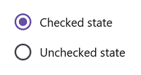
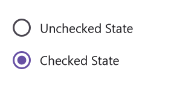

# Events in .NET MAUI Radio Button (SfRadioButton)

The [.NET MAUI Radio Button](https://help.syncfusion.com/cr/maui/Syncfusion.Maui.Buttons.SfRadioButton.html) control exposes the following events:

- [StateChanged](https://help.syncfusion.com/cr/maui/Syncfusion.Maui.Buttons.ToggleButton.html#Syncfusion_Maui_Buttons_ToggleButton_StateChanged)
- [StateChanging](https://help.syncfusion.com/cr/maui/Syncfusion.Maui.Buttons.ToggleButton.html#Syncfusion_Maui_Buttons_ToggleButton_StateChanging)

## Prerequisites

Before using the [SfRadioButton](https://help.syncfusion.com/cr/maui/Syncfusion.Maui.Buttons.SfRadioButton.html), ensure the following NuGet package is installed in your .NET MAUI project:

- `Syncfusion.Maui.Buttons`

For a step-by-step setup, refer to the [Getting Started](https://help.syncfusion.com/maui/radio-button/getting-started) documentation.

## StateChanged event

The [StateChanged](https://help.syncfusion.com/cr/maui/Syncfusion.Maui.Buttons.ToggleButton.html#Syncfusion_Maui_Buttons_ToggleButton_StateChanged) event occurs when the value of the [IsChecked](https://help.syncfusion.com/cr/maui/Syncfusion.Maui.Buttons.SfRadioButton.html#Syncfusion_Maui_Buttons_SfRadioButton_IsChecked) property is changed, either by user interaction or programmatically via XAML or C# code. The event arguments are of type [StateChangedEventArgs](https://help.syncfusion.com/cr/maui/Syncfusion.Maui.Buttons.StateChangedEventArgs.html) and expose the following property:

* `IsChecked` : The new value of the `IsChecked` property.




<syncfusion:SfRadioGroup x:Name="radioGroup">
    <syncfusion:SfRadioButton x:Name="check" 
                              Text="Checked State" 
                              IsChecked="True" 
                              StateChanged="RadioButton_StateChanged"/>
    <syncfusion:SfRadioButton x:Name="uncheck" 
                              Text="Unchecked State" 
                              StateChanged="RadioButton_StateChanged"/>
</syncfusion:SfRadioGroup>




SfRadioGroup radioGroup = new SfRadioGroup();
SfRadioButton check = new SfRadioButton();
check.Text = "Checked State";
check.IsChecked = true;
check.StateChanged += RadioButton_StateChanged;
SfRadioButton uncheck = new SfRadioButton();
uncheck.Text = "Unchecked State";
uncheck.StateChanged += RadioButton_StateChanged;
radioGroup.Children.Add(check);
radioGroup.Children.Add(uncheck);
this.Content = radioGroup;




The `StateChanged` event can be handled in C# as follows:




private void RadioButton_StateChanged(object sender, Syncfusion.Maui.Buttons.StateChangedEventArgs e)
{
    if (sender is SfRadioButton radioButton && e.IsChecked.HasValue)
    {
        radioButton.Text = e.IsChecked.Value ? "Checked State" : "Unchecked State";
    }
}




**Radio buttons after handling the StateChanged event**

## StateChanging event

The [StateChanging](https://help.syncfusion.com/cr/maui/Syncfusion.Maui.Buttons.ToggleButton.html#Syncfusion_Maui_Buttons_ToggleButton_StateChanging) event is triggered when the value of the [IsChecked](https://help.syncfusion.com/cr/maui/Syncfusion.Maui.Buttons.SfRadioButton.html#Syncfusion_Maui_Buttons_SfRadioButton_IsChecked) property is about to change, either by user interaction (tap) or programmatically. The event arguments are of type [StateChangingEventArgs](https://help.syncfusion.com/cr/maui/Syncfusion.Maui.Buttons.StateChangingEventArgs.html) and expose the following properties:

* `IsChecked`: The new value of the `IsChecked` property.
* `Cancel` : Set to `true` to cancel the selection change.

> Use `StateChanging` when you need to validate or block a state transition before it happens; use `StateChanged` when you only need to react after the state has been applied.




<syncfusion:SfRadioGroup x:Name="radioGroup">
    <syncfusion:SfRadioButton x:Name="check" 
                              Text="Checked State" 
                              IsChecked="True" 
                              StateChanging="OnStateChanging"/>
    <syncfusion:SfRadioButton x:Name="uncheck" 
                              Text="Unchecked State" 
                              StateChanging="OnStateChanging"/>
</syncfusion:SfRadioGroup>




SfRadioGroup radioGroup = new SfRadioGroup();
SfRadioButton check = new SfRadioButton();
check.Text = "Checked State";
check.IsChecked = true;
check.StateChanging += OnStateChanging;
SfRadioButton uncheck = new SfRadioButton();
uncheck.Text = "Unchecked State";
uncheck.StateChanging += OnStateChanging;
radioGroup.Children.Add(check);
radioGroup.Children.Add(uncheck);
this.Content = radioGroup;
	



The `StateChanging` event can be handled in C# as follows:




private void OnStateChanging(object sender, StateChangingEventArgs e)
{
    // Cancel the state change when the user attempts to select the second option.
    if (sender is SfRadioButton radioButton && radioButton.Text.StartsWith("Unchecked"))
    {
        e.Cancel = true;
    }
}




## See Also

- [Visual customization in .NET MAUI Radio Button](https://help.syncfusion.com/maui/radio-button/visual-customization)
- [Getting started with .NET MAUI Radio Button](https://help.syncfusion.com/maui/radio-button/getting-started)
- [Grouping in .NET MAUI Radio Button](https://help.syncfusion.com/maui/radio-button/grouping)