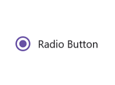
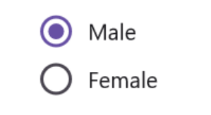

# Getting Started with .NET MAUI RadioButton

This section guides you through setting up and configuring a [RadioButton](https://help.syncfusion.com/cr/maui/Syncfusion.Maui.Buttons.SfRadioButton.html) in your .NET MAUI application. Follow the steps below to add a basic RadioButton to your project.

To quickly get started with the .NET MAUI RadioButton, watch this video.






## Prerequisites
Before proceeding, ensure the following are set up:

1. Install [.NET 8 SDK](https://dotnet.microsoft.com/en-us/download/dotnet/8.0) or later is installed.
2. Set up a .NET MAUI environment with Visual Studio 2022 (v17.3 or later).

## Step 1: Create a new .NET MAUI Project

1. Go to **File > New > Project** and choose the **.NET MAUI App** template.
2. Name the project and choose a location. Then, click **Next.**
3. Select the .NET framework version and click **Create.**

## Step 2: Install the Syncfusion® MAUI Buttons NuGet Package

1. In **Solution Explorer,** right-click the project and choose **Manage NuGet Packages.**
2. Search for [Syncfusion.Maui.Buttons](https://www.nuget.org/packages/Syncfusion.Maui.Buttons/) and install the latest version.
3. Ensure the necessary dependencies are installed correctly, and the project is restored.

## Step 3: Register the handler

[Syncfusion.Maui.Core](https://www.nuget.org/packages/Syncfusion.Maui.Core/) NuGet is a dependent package for all Syncfusion® controls of .NET MAUI. In the MauiProgram.cs file, register the handler for Syncfusion® core.



using Microsoft.Maui;
using Microsoft.Maui.Hosting;
using Microsoft.Maui.Controls.Compatibility;
using Microsoft.Maui.Controls.Hosting;
using Microsoft.Maui.Controls.Xaml;
using Syncfusion.Maui.Core.Hosting;

namespace RadioButtonGettingStarted
{
    public static class MauiProgram
    {
        public static MauiApp CreateMauiApp()
        {
            var builder = MauiApp.CreateBuilder();
            builder
            .UseMauiApp<App>()
            .ConfigureSyncfusionCore()
            .ConfigureFonts(fonts =>
            {
                fonts.AddFont("OpenSans-Regular.ttf", "OpenSansRegular");
            });

            return builder.Build();
        }      
    }
}   



## Step 4: Add a Basic RadioButton

1. To initialize the control, import the Buttons namespace into your code.
2. Initialize [SfRadioButton](https://help.syncfusion.com/cr/maui/Syncfusion.Maui.Buttons.SfRadioButton.html).





<ContentPage
    . . .    
    xmlns:buttons="clr-namespace:Syncfusion.Maui.Buttons;assembly=Syncfusion.Maui.Buttons">
        <buttons:SfRadioButton x:Name="radioButton"/>     
</ContentPage>





    using Syncfusion.Maui.Buttons;
    namespace RadioButtonGettingStarted
    {
        public partial class MainPage : ContentPage
        {
            public MainPage()
            {
                InitializeComponent();           
                SfRadioButton radioButton = new SfRadioButton();
                this.Content=radioButton
            }
        }   
    }







## Prerequisites
Before proceeding, ensure the following are set up:

1. Install [.NET 8 SDK](https://dotnet.microsoft.com/en-us/download/dotnet/8.0) or later is installed.
2. Set up a .NET MAUI environment with Visual Studio Code.
3. Ensure that the .NET MAUI extension is installed and configured as described [here.](https://learn.microsoft.com/en-us/dotnet/maui/get-started/installation?view=net-maui-8.0&tabs=visual-studio-code)

## Step 1: Create a new .NET MAUI Project

1. Open the command palette by pressing `Ctrl+Shift+P` and type **.NET:New Project** and enter.
2. Choose the **.NET MAUI App** template.
3. Select the project location, type the project name and press **Enter.**
4. Then choose **Create project.**

## Step 2: Install the Syncfusion® MAUI Buttons NuGet Package

1. Press <kbd>Ctrl</kbd> + <kbd>`</kbd> (backtick) to open the integrated terminal in Visual Studio Code.
2. Ensure you're in the project root directory where your .csproj file is located.
3. Run the command `dotnet add package Syncfusion.Maui.Buttons` to install the Syncfusion® .NET MAUI Buttons package.
4. To ensure all dependencies are installed, run `dotnet restore`.

## Step 3: Register the handler

[Syncfusion.Maui.Core](https://www.nuget.org/packages/Syncfusion.Maui.Core/) NuGet is a dependent package for all Syncfusion® controls of .NET MAUI. In the MauiProgram.cs file, register the handler for Syncfusion® core.



using Microsoft.Maui;
using Microsoft.Maui.Hosting;
using Microsoft.Maui.Controls.Compatibility;
using Microsoft.Maui.Controls.Hosting;
using Microsoft.Maui.Controls.Xaml;
using Syncfusion.Maui.Core.Hosting;

namespace RadioButtonGettingStarted
{
    public static class MauiProgram
    {
        public static MauiApp CreateMauiApp()
        {
            var builder = MauiApp.CreateBuilder();
            builder
            .UseMauiApp<App>()
            .ConfigureSyncfusionCore()
            .ConfigureFonts(fonts =>
            {
                fonts.AddFont("OpenSans-Regular.ttf", "OpenSansRegular");
            });

            return builder.Build();
        }      
    }
}   



## Step 4: Add a Basic RadioButton

1. To initialize the control, import the Buttons namespace into your code.
2. Initialize [SfRadioButton](https://help.syncfusion.com/cr/maui/Syncfusion.Maui.Buttons.SfRadioButton.html).





<ContentPage
    . . .    
    xmlns:buttons="clr-namespace:Syncfusion.Maui.Buttons;assembly=Syncfusion.Maui.Buttons">
        <buttons:SfRadioButton x:Name="radioButton"/>     
</ContentPage>





    using Syncfusion.Maui.Buttons;
    namespace RadioButtonGettingStarted
    {
        public partial class MainPage : ContentPage
        {
            public MainPage()
            {
                InitializeComponent();           
                SfRadioButton radioButton = new SfRadioButton();
                this.Content=radioButton
            }
        }   
    }








## Prerequisites

Before proceeding, ensure the following are set up:

1. Ensure you have the latest version of JetBrains Rider.
2. Install [.NET 8 SDK](https://dotnet.microsoft.com/en-us/download/dotnet/8.0) or later is installed.
3. Make sure the MAUI workloads are installed and configured as described [here.](https://www.jetbrains.com/help/rider/MAUI.html#before-you-start)

## Step 1: Create a new .NET MAUI Project

1. Go to **File > New Solution,** Select .NET (C#) and choose the .NET MAUI App template.
2. Enter the Project Name, Solution Name, and Location.
3. Select the .NET framework version and click Create.

## Step 2: Install the Syncfusion® MAUI Core NuGet Package

1. In **Solution Explorer,** right-click the project and choose **Manage NuGet Packages.**
2. Search for [Syncfusion.Maui.Core](https://www.nuget.org/packages/Syncfusion.Maui.Core/) and install the latest version.
3. Ensure the necessary dependencies are installed correctly, and the project is restored. If not, Open the Terminal in Rider and manually run: `dotnet restore`

## Step 3: Register the handler

[Syncfusion.Maui.Core](https://www.nuget.org/packages/Syncfusion.Maui.Core/) NuGet is a dependent package for all Syncfusion® controls of .NET MAUI. In the MauiProgram.cs file, register the handler for Syncfusion® core.


using Microsoft.Maui;
using Microsoft.Maui.Hosting;
using Microsoft.Maui.Controls.Compatibility;
using Microsoft.Maui.Controls.Hosting;
using Microsoft.Maui.Controls.Xaml;
using Syncfusion.Maui.Core.Hosting;

namespace RadioButtonSample
{
  public static class MauiProgram
  {
	public static MauiApp CreateMauiApp()
	{
		var builder = MauiApp.CreateBuilder();
		builder
		.UseMauiApp<App>()
		.ConfigureSyncfusionCore()
		.ConfigureFonts(fonts =>
		{
			fonts.AddFont("OpenSans-Regular.ttf", "OpenSansRegular");
		});

		return builder.Build();
	 }

  }

}     



## Step 4: Add a Basic Radio Button

1. To initialize the control, import the Core namespace into your code.
2. Initialize [SfRadioButton](https://help.syncfusion.com/cr/maui/Syncfusion.Maui.Core.SfRadioButton.html?tabs=tabid-1).





<ContentPage
    . . .    
    xmlns:sfavatar="clr-namespace:Syncfusion.Maui.Core;assembly=Syncfusion.Maui.Core">
    <Grid>
        <sfavatar:SfRadioButton />
    </Grid>
</ContentPage>





    using Syncfusion.Maui.Core;
    namespace RadioButtonGettingStarted
    {
        public partial class MainPage : ContentPage
        {
            public MainPage()
            {
                InitializeComponent();           
                SfRadioButton radioButton = new SfRadioButton();
            }
        }   
    }








## Setting caption

The .NET MAUI Radio Button caption can be defined using the [Text](https://help.syncfusion.com/cr/maui/Syncfusion.Maui.Buttons.ToggleButton.html#Syncfusion_Maui_Buttons_ToggleButton_Text) property. This caption typically describes the meaning of the radio button and is displayed next to the radio button.
 



    <buttons:SfRadioButton x:Name="radioButton" Text="Radio Button"/>




    SfRadioButton radioButton = new SfRadioButton();
    radioButton.Text = "Radio Button";
    this.Content = radioButton;




## Change the Radio Button state

The two different visual states of the [.NET MAUI Radio Button](https://help.syncfusion.com/cr/maui/Syncfusion.Maui.Buttons.SfRadioButton.html) are:

* Checked
* Unchecked

To change the state of the .NET MAUI Radio Button, you can utilize the [IsChecked](https://help.syncfusion.com/cr/maui/Syncfusion.Maui.Buttons.SfRadioButton.html#Syncfusion_Maui_Buttons_SfRadioButton_IsChecked) property of [SfRadioButton](https://help.syncfusion.com/cr/maui/Syncfusion.Maui.Buttons.SfRadioButton.html). When the Radio Button is checked, an inner circle is added to its visualization.

You can group multiple radio buttons together by using RadioGroup. Only one button within a group can be selected at a time.




    <buttons:SfRadioGroup x:Name="radioGroup">
         <buttons:SfRadioButton x:Name="male" Text="Male"/>
         <buttons:SfRadioButton x:Name="female" Text="Female" IsChecked="True"/>
    </buttons:SfRadioGroup>




    SfRadioGroup radioGroup = new SfRadioGroup();
    SfRadioButton male = new SfRadioButton();
    male.Text = "Male";
    SfRadioButton female = new SfRadioButton();
    female.IsChecked = true;
    female.Text = "Female";
    radioGroup.Children.Add(male);
    radioGroup.Children.Add(female);
    this.Content = radioGroup;




N> [SfRadioButtons](https://help.syncfusion.com/cr/maui/Syncfusion.Maui.Buttons.SfRadioButton.html) are mutually exclusive when they are defined within [SfRadioGroup](https://help.syncfusion.com/cr/maui/Syncfusion.Maui.Buttons.SfRadioGroup.html).

You can find the complete getting started sample of the .NET MAUI Radio Button from this [link.](https://github.com/SyncfusionExamples/maui-radiobutton-samples)

N> You can also explore our [.NET MAUI Radio Button Example](https://github.com/syncfusion/maui-demos/tree/master/MAUI/Buttons/SampleBrowser.Maui.Buttons/Samples/RadioButton) that shows you how to render the Radio Button in .NET MAUI.