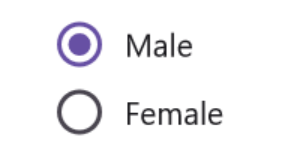

# Getting Started with .NET MAUI Radio Button

This section guides you through setting up and configuring a [SfRadioButton](https://help.syncfusion.com/cr/maui/Syncfusion.Maui.Buttons.SfRadioButton.html) in your .NET MAUI application. Follow the steps below to add a basic Radio Button to your project.

To quickly get started with the .NET MAUI Radio Button, watch this video.






## Prerequisites
Before proceeding, ensure the following are set up:

1. Install [.NET 9 SDK](https://dotnet.microsoft.com/en-us/download/dotnet/9.0) or later.
2. Set up a .NET MAUI environment with Visual Studio 2022 v17.12 or later.

## Step 1: Create a new .NET MAUI Project

1. Go to **File > New > Project** and choose the **.NET MAUI App** template.
2. Name the project and choose a location. Then, click **Next.**
3. Select the .NET framework version and click **Create.**

## Step 2: Install the Syncfusion® MAUI Buttons NuGet package

1. In **Solution Explorer,** right-click the project and choose **Manage NuGet Packages.**
2. Search for [Syncfusion.Maui.Buttons](https://www.nuget.org/packages/Syncfusion.Maui.Buttons/) and install the latest version.
3. Ensure the necessary dependencies are installed correctly, and the project is restored. If not, Open the Terminal in Rider and manually run: `dotnet restore`




## Prerequisites

Before proceeding, ensure the following are set up:

1. Install [.NET 9 SDK](https://dotnet.microsoft.com/en-us/download/dotnet/9.0) or later.
2. Set up a .NET MAUI environment with Visual Studio Code.
3. Ensure that the .NET MAUI workloads are installed and configured as described [here](https://learn.microsoft.com/en-us/dotnet/maui/get-started/installation?view=net-maui-9.0&tabs=visual-studio-code).

## Step 1: Create a .NET MAUI project

1. Open the command palette by pressing `Ctrl+Shift+P` and type **.NET:New Project** and enter.
2. Choose the **.NET MAUI App** template.
3. Select the project location, type the project name and press **Enter.**
4. Then choose **Create project.**

## Step 2: Install the Syncfusion® MAUI Buttons NuGet package

1. In **Solution Explorer,** right-click the project and choose **Manage NuGet Packages.**
2. Search for [Syncfusion.Maui.Buttons](https://www.nuget.org/packages/Syncfusion.Maui.Buttons/) and install the latest version.
3. Ensure the necessary dependencies are installed correctly, and the project is restored. If not, Open the Terminal in Rider and manually run: `dotnet restore`




## Prerequisites

Before proceeding, ensure the following are set up:

1. Install [.NET 9 SDK](https://dotnet.microsoft.com/en-us/download/dotnet/9.0) or later.
2. Set up a .NET MAUI environment with JetBrains Rider 2024.3 or later.
3. Make sure the MAUI workloads are installed and configured as described [here.](https://www.jetbrains.com/help/rider/MAUI.html#before-you-start)

## Step 1: Create a new .NET MAUI project

1. Go to **File > New Solution,** Select .NET (C#) and choose the .NET MAUI App template.
2. Enter the Project Name, Solution Name, and Location.
3. Select the .NET framework version and click Create.

## Step 2: Install the Syncfusion® MAUI Buttons NuGet package

1. In **Solution Explorer,** right-click the project and choose **Manage NuGet Packages.**
2. Search for [Syncfusion.Maui.Buttons](https://www.nuget.org/packages/Syncfusion.Maui.Buttons/) and install the latest version.
3. Ensure the necessary dependencies are installed correctly, and the project is restored. If not, Open the Terminal in Rider and manually run: `dotnet restore`




## Step 3: Register Syncfusion handler
 
Make sure to add the namespace.
 

using Syncfusion.Maui.Core.Hosting;

 
Register the Syncfusion core handler in your CreateMauiApp method of `MauiProgram.cs` file to use Syncfusion controls.
 

builder.ConfigureSyncfusionCore();


## Step 4: Import Radio Button namespace

Add the following namespace in your XAML or C#.




xmlns:buttons="clr-namespace:Syncfusion.Maui.Buttons;assembly=Syncfusion.Maui.Buttons"




using Syncfusion.Maui.Buttons;




## Step 5: Add Radio Button component

The two different visual states of the [.NET MAUI Radio Button](https://help.syncfusion.com/cr/maui/Syncfusion.Maui.Buttons.SfRadioButton.html) are:

* Checked
* Unchecked

To change the state of the .NET MAUI Radio Button, you can utilize the [IsChecked](https://help.syncfusion.com/cr/maui/Syncfusion.Maui.Buttons.SfRadioButton.html#Syncfusion_Maui_Buttons_SfRadioButton_IsChecked) property of [SfRadioButton](https://help.syncfusion.com/cr/maui/Syncfusion.Maui.Buttons.SfRadioButton.html). When the Radio Button is checked, an inner circle is added to its visualization.

You can group multiple Radio Buttons together by using Radio Group. Only one button within a group can be selected at a time.




<buttons:SfRadioGroup x:Name="radioGroup">
    <buttons:SfRadioButton x:Name="male" Text="Male"/>
    <buttons:SfRadioButton x:Name="female" Text="Female" IsChecked="True"/>
</buttons:SfRadioGroup>




SfRadioGroup radioGroup = new SfRadioGroup();
SfRadioButton male = new SfRadioButton();
male.Text = "Male";
SfRadioButton female = new SfRadioButton();
female.IsChecked = true;
female.Text = "Female";
radioGroup.Children.Add(male);
radioGroup.Children.Add(female);
this.Content = radioGroup;




N> [SfRadioButtons](https://help.syncfusion.com/cr/maui/Syncfusion.Maui.Buttons.SfRadioButton.html) are mutually exclusive when they are defined within [SfRadioGroup](https://help.syncfusion.com/cr/maui/Syncfusion.Maui.Buttons.SfRadioGroup.html).

You can download the TreeView Getting Started sammple from [here](https://github.com/SyncfusionExamples/Getting-Started-with-.NET-MAUI-RadioButton). You can also explore our [.NET MAUI Radio Button example](https://github.com/syncfusion/maui-demos/tree/master/MAUI/Buttons/SampleBrowser.Maui.Buttons/Samples/RadioButton) that shows you how to render the .NET MAUI Radio Button.