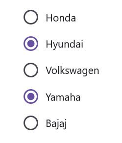
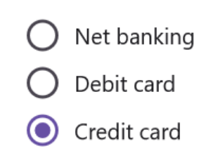
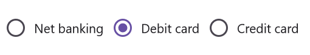

# Grouping in .NET MAUI Radio Button (SfRadioButton)

## Group Key

The [`GroupKey`] in [`SfRadioButton`] allows you to group a set of radio buttons present inside any layout. By grouping in this way, you can select only one radio button that comes under same [`GroupKey`] at a time.

* [`CheckedItem`] - Gets the current checked item from radio group.




    <ContentPage.Resources>
        <syncfusion:SfRadioGroupKey x:Key="carBrand"/>
        <syncfusion:SfRadioGroupKey x:Key="bikeBrand"/>
    </ContentPage.Resources>

    <StackLayout>
        <syncfusion:SfRadioButton Text="Honda" GroupKey="{StaticResource carBrand}"/>
        <syncfusion:SfRadioButton Text="Hyundai" GroupKey="{StaticResource carBrand}"/>
        <syncfusion:SfRadioButton Text="Volkswagen" GroupKey="{StaticResource carBrand}"/>
        <syncfusion:SfRadioButton Text="Yamaha" GroupKey="{StaticResource bikeBrand}"/>
        <syncfusion:SfRadioButton Text="Bajaj" GroupKey="{StaticResource bikeBrand}"/>
    </StackLayout>




    SfRadioGroupKey carBrand = new SfRadioGroupKey();
    SfRadioGroupKey bikeBrand = new SfRadioGroupKey();

    SfRadioButton honda = new SfRadioButton() { Text = "Honda", GroupKey = carBrand };
    SfRadioButton hyundai = new SfRadioButton() { Text = "Hyundai", GroupKey = carBrand };
    SfRadioButton volkswagen = new SfRadioButton() { Text = "Volkswagen", GroupKey = carBrand };
    SfRadioButton yamaha = new SfRadioButton() { Text = "Yamaha", GroupKey = bikeBrand };
    SfRadioButton bajaj = new SfRadioButton() { Text = "Bajaj", GroupKey = bikeBrand };

    StackLayout stackLayout = new StackLayout();
    stackLayout.Children.Add(honda);
    stackLayout.Children.Add(hyundai);
    stackLayout.Children.Add(volkswagen);
    stackLayout.Children.Add(yamaha);
    stackLayout.Children.Add(bajaj);
    this.Content = stackLayout;




### CheckedChanged event

The [`CheckedChanged`] event of [`SfRadioGroupKey`] occurs when a checked item is changed. The argument contains the following information:

* [`PreviousItem`] – Gets the previously checked radio button from group.
* [`CurrentItem`] – Gets the currently checked radio button from group.

## SfRadioGroup

[`SfRadioGroup`] is a container that contains a set of radio buttons. When you select a radio button in a radio group, all other items will be deselected automatically. At a time, you can select only one radio button from the same radio group. It also contains the [`CheckedChanged`] event and the [`CheckedItem`] property.




    <syncfusion:SfRadioGroup>
        <syncfusion:SfRadioButton Text="Net banking" />
        <syncfusion:SfRadioButton Text="Debit card" />
        <syncfusion:SfRadioButton Text="Credit card" />
    </syncfusion:SfRadioGroup>




    SfRadioGroup radioGroup = new SfRadioGroup();
    SfRadioButton netBanking = new SfRadioButton() {Text = "Net banking"};
    SfRadioButton debitCard = new SfRadioButton() {Text = "Debit card"};
    SfRadioButton creditCard = new SfRadioButton() {Text = "Credit card"};

    radioGroup.Children.Add(netBanking);
    radioGroup.Children.Add(debitCard);
    radioGroup.Children.Add(creditCard);
    this.Content = radioGroup;




### Orientation in SfRadioGroup

[`SfRadioGroup`] supports horizontal and vertical orientations. By default, [`SfRadioGroup`] is rendered with vertical orientation. You can the change the orientation by using the [`Orientation`] property.




    <SyncfusionButton:SfRadioGroup Orientation="Horizontal">
        <SyncfusionButton:SfRadioButton Text="Net banking" />
        <SyncfusionButton:SfRadioButton Text="Debit card" />
        <SyncfusionButton:SfRadioButton Text="Credit card" />
    </SyncfusionButton:SfRadioGroup>




    SfRadioGroup radioGroup = new SfRadioGroup(){Orientation = StackOrientation.Horizontal};
    SfRadioButton netBanking = new SfRadioButton() {Text = "Net banking"};
    SfRadioButton debitCard = new SfRadioButton() {Text = "Debit card"};
    SfRadioButton creditCard = new SfRadioButton() {Text = "Credit card"};

    radioGroup.Children.Add(netBanking);
    radioGroup.Children.Add(debitCard);
    radioGroup.Children.Add(creditCard);
    this.Content = radioGroup;




