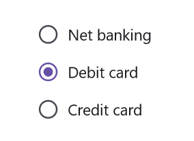

# Grouping in .NET MAUI Radio Button (SfRadioButton)

## Group Key

The [GroupKey](https://help.syncfusion.com/cr/maui/Syncfusion.Maui.Buttons.SfRadioButton.html#Syncfusion_Maui_Buttons_SfRadioButton_GroupKey) in [.NET MAUI Radio Button](https://help.syncfusion.com/cr/maui/Syncfusion.Maui.Buttons.SfRadioButton.html) allows you to group a set of radio buttons present inside any layout. By grouping in this way, you can select only one radio button that comes under same [GroupKey](https://help.syncfusion.com/cr/maui/Syncfusion.Maui.Buttons.SfRadioButton.html#Syncfusion_Maui_Buttons_SfRadioButton_GroupKey) at a time.

* [CheckedItem](https://help.syncfusion.com/cr/maui/Syncfusion.Maui.Buttons.SfRadioGroup.html#Syncfusion_Maui_Buttons_SfRadioGroup_CheckedItem) - Gets the current checked item from the .NET Maui Radio Button group.




    <ContentPage.Resources>
        <syncfusion:SfRadioGroupKey x:Key="carBrand"/>
        <syncfusion:SfRadioGroupKey x:Key="bikeBrand"/>
    </ContentPage.Resources>

    <StackLayout>
        <syncfusion:SfRadioButton Text="Honda" GroupKey="{StaticResource carBrand}"/>
        <syncfusion:SfRadioButton Text="Hyundai" GroupKey="{StaticResource carBrand}"/>
        <syncfusion:SfRadioButton Text="Volkswagen" GroupKey="{StaticResource carBrand}"/>
        <syncfusion:SfRadioButton Text="Yamaha" GroupKey="{StaticResource bikeBrand}"/>
        <syncfusion:SfRadioButton Text="Bajaj" GroupKey="{StaticResource bikeBrand}"/>
    </StackLayout>




    SfRadioGroupKey carBrand = new SfRadioGroupKey();
    SfRadioGroupKey bikeBrand = new SfRadioGroupKey();

    SfRadioButton honda = new SfRadioButton() { Text = "Honda", GroupKey = carBrand };
    SfRadioButton hyundai = new SfRadioButton() { Text = "Hyundai", GroupKey = carBrand };
    SfRadioButton volkswagen = new SfRadioButton() { Text = "Volkswagen", GroupKey = carBrand };
    SfRadioButton yamaha = new SfRadioButton() { Text = "Yamaha", GroupKey = bikeBrand };
    SfRadioButton bajaj = new SfRadioButton() { Text = "Bajaj", GroupKey = bikeBrand };

    StackLayout stackLayout = new StackLayout();
    stackLayout.Children.Add(honda);
    stackLayout.Children.Add(hyundai);
    stackLayout.Children.Add(volkswagen);
    stackLayout.Children.Add(yamaha);
    stackLayout.Children.Add(bajaj);
    this.Content = stackLayout;




### CheckedChanged event

The [CheckedChanged](https://help.syncfusion.com/cr/maui/Syncfusion.Maui.Buttons.SfRadioGroup.html#Syncfusion_Maui_Buttons_SfRadioGroup_CheckedChanged) event of [SfRadioGroup](https://help.syncfusion.com/cr/maui/Syncfusion.Maui.Buttons.SfRadioGroup.html) occurs when a checked item is changed. The argument contains the following information:

* [PreviousItem](https://help.syncfusion.com/cr/maui/Syncfusion.Maui.Buttons.CheckedChangedEventArgs.html#Syncfusion_Maui_Buttons_CheckedChangedEventArgs_PreviousItem) - Gets the previously checked radio button from group.
* [CurrentItem](https://help.syncfusion.com/cr/maui/Syncfusion.Maui.Buttons.CheckedChangedEventArgs.html#Syncfusion_Maui_Buttons_CheckedChangedEventArgs_CurrentItem) - Gets the currently checked radio button from group.

## .NET MAUI Radio Group

[SfRadioGroup](https://help.syncfusion.com/cr/maui/Syncfusion.Maui.Buttons.SfRadioGroup.html) is a container that contains a set of radio buttons. When you select a radio button in a .NET MAUI Radio Button group, all other items will be automatically deselected. At any given time, you can only select one radio button from the same .NET MAUI Radio Button group. It also includes the [CheckedChanged](https://help.syncfusion.com/cr/maui/Syncfusion.Maui.Buttons.SfRadioGroup.html#Syncfusion_Maui_Buttons_SfRadioGroup_CheckedChanged) event and the [CheckedItem](https://help.syncfusion.com/cr/maui/Syncfusion.Maui.Buttons.SfRadioGroup.html#Syncfusion_Maui_Buttons_SfRadioGroup_CheckedItem) property.




    <syncfusion:SfRadioGroup>
        <syncfusion:SfRadioButton Text="Net banking" />
        <syncfusion:SfRadioButton Text="Debit card" />
        <syncfusion:SfRadioButton Text="Credit card" />
    </syncfusion:SfRadioGroup>




    SfRadioGroup radioGroup = new SfRadioGroup();
    SfRadioButton netBanking = new SfRadioButton() {Text = "Net banking"};
    SfRadioButton debitCard = new SfRadioButton() {Text = "Debit card"};
    SfRadioButton creditCard = new SfRadioButton() {Text = "Credit card"};

    radioGroup.Children.Add(netBanking);
    radioGroup.Children.Add(debitCard);
    radioGroup.Children.Add(creditCard);
    this.Content = radioGroup;




### Orientation in .NET MAUI Radio Group

[SfRadioGroup](https://help.syncfusion.com/cr/maui/Syncfusion.Maui.Buttons.SfRadioGroup.html) supports horizontal and vertical orientations. By default, `SfRadioGroup` is rendered with vertical orientation. You can change the orientation using the `Orientation` property.




    <SyncfusionButton:SfRadioGroup Orientation="Horizontal">
        <SyncfusionButton:SfRadioButton Text="Net banking" />
        <SyncfusionButton:SfRadioButton Text="Debit card" />
        <SyncfusionButton:SfRadioButton Text="Credit card" />
    </SyncfusionButton:SfRadioGroup>




    SfRadioGroup radioGroup = new SfRadioGroup(){Orientation = StackOrientation.Horizontal};
    SfRadioButton netBanking = new SfRadioButton() {Text = "Net banking"};
    SfRadioButton debitCard = new SfRadioButton() {Text = "Debit card"};
    SfRadioButton creditCard = new SfRadioButton() {Text = "Credit card"};

    radioGroup.Children.Add(netBanking);
    radioGroup.Children.Add(debitCard);
    radioGroup.Children.Add(creditCard);
    this.Content = radioGroup;




## Selected value
The [.NET MAUI RadioGroup](https://help.syncfusion.com/cr/maui/Syncfusion.Maui.Buttons.SfRadioGroup.html) class defines a `SelectedValue` property, of type `object`, This property represents the `Value` of the checked [.NET MAUI RadioButton](https://help.syncfusion.com/cr/maui/Syncfusion.Maui.Buttons.SfRadioButton.html) within a group defined.

When any [.NET MAUI RadioButton](https://help.syncfusion.com/cr/maui/Syncfusion.Maui.Buttons.SfRadioButton.html) within a  [.NET MAUI RadioGroup](https://help.syncfusion.com/cr/maui/Syncfusion.Maui.Buttons.SfRadioGroup.html) is checked, the `Value` of that RadioButton is assigned to the `SelectedValue` property of the RadioGroup. The `SelectedValue` is dynamically updated whenever a different RadioButton within the RadioGroup is checked.




	<syncfusion:SfRadioGroup SelectedValue="DebitCard">
		<syncfusion:SfRadioButton Text="Net banking" Value="NetBanking"/>
		<syncfusion:SfRadioButton Text="Debit card" Value="DebitCard"/>
		<syncfusion:SfRadioButton Text="Credit card" Value="CreditCard"/>
	</syncfusion:SfRadioGroup>




	SfRadioGroup radioGroup = new SfRadioGroup
	{
		SelectedValue = "DebitCard"
	};
	SfRadioButton netBankingRadioButton = new SfRadioButton
	{
		Text = "Net banking",
		Value = "NetBanking"
	};
	SfRadioButton debitCardRadioButton = new SfRadioButton
	{
		Text = "Debit card",
		Value = "DebitCard"
	};
	SfRadioButton creditCardRadioButton = new SfRadioButton
	{
		Text = "Credit card",
		Value = "CreditCard"
	};
	radioGroup.Children.Add(netBankingRadioButton);
	radioGroup.Children.Add(debitCardRadioButton);
	radioGroup.Children.Add(creditCardRadioButton);




