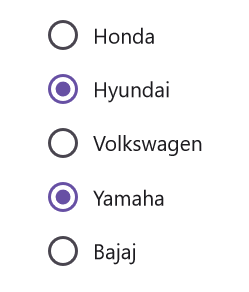
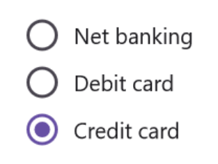
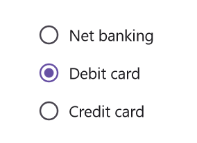
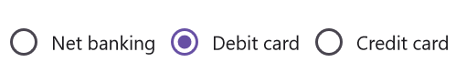

# Grouping in .NET MAUI Radio Button (SfRadioButton)

The [.NET MAUI Radio Button](https://help.syncfusion.com/cr/maui/Syncfusion.Maui.Buttons.SfRadioButton.html) control supports two approaches for grouping a set of Radio Buttons so that only one is selected at a time:

* `GroupKey` - Share a single [SfRadioGroupKey](https://help.syncfusion.com/cr/maui/Syncfusion.Maui.Buttons.SfRadioGroupKey.html) instance across Radio Buttons located in any layout.
* `Radio Group` - Wrap the Radio Buttons in an [SfRadioGroup](https://help.syncfusion.com/cr/maui/Syncfusion.Maui.Buttons.SfRadioGroup.html) container for a richer set of features (`CheckedItem`, `SelectedValue`, `CheckedChanged`, `Orientation`).

Use `GroupKey` when your Radio Buttons are scattered across different layouts or pages and must still be mutually exclusive. Use `SfRadioGroup` when the buttons are visually grouped and you need the additional properties and events.

## Prerequisites

Before using the [`SfRadioButton`](https://help.syncfusion.com/cr/maui/Syncfusion.Maui.Buttons.SfRadioButton.html), ensure the following NuGet package is installed in your .NET MAUI project:

- `Syncfusion.Maui.Buttons`

For a step-by-step setup, refer to the [Getting Started](https://help.syncfusion.com/maui/radio-button/getting-started) documentation.

## GroupKey

The [GroupKey](https://help.syncfusion.com/cr/maui/Syncfusion.Maui.Buttons.SfRadioButton.html#Syncfusion_Maui_Buttons_SfRadioButton_GroupKey) property of Radio Button allows you to group a set of Radio Buttons located in any layout. When grouped, only one Radio Button per [`SfRadioGroupKey`](https://help.syncfusion.com/cr/maui/Syncfusion.Maui.Buttons.SfRadioGroupKey.html) can be selected at a time.

Two different `SfRadioGroupKey` instances always represent different groups.




<StackLayout>
    <StackLayout.Resources>
        <syncfusion:SfRadioGroupKey x:Key="carBrand"/>
        <syncfusion:SfRadioGroupKey x:Key="bikeBrand"/>
    </StackLayout.Resources>
    <syncfusion:SfRadioButton Text="Honda" 
                              GroupKey="{StaticResource carBrand}"/>
    <syncfusion:SfRadioButton Text="Hyundai" 
                              GroupKey="{StaticResource carBrand}"/>
    <syncfusion:SfRadioButton Text="Volkswagen" 
                              GroupKey="{StaticResource carBrand}"/>
    <syncfusion:SfRadioButton Text="Yamaha" 
                              GroupKey="{StaticResource bikeBrand}"/>
    <syncfusion:SfRadioButton Text="Bajaj" 
                              GroupKey="{StaticResource bikeBrand}"/>
</StackLayout>




SfRadioGroupKey carBrand = new SfRadioGroupKey();
SfRadioGroupKey bikeBrand = new SfRadioGroupKey();

SfRadioButton honda = new SfRadioButton() { Text = "Honda", GroupKey = carBrand };
SfRadioButton hyundai = new SfRadioButton() { Text = "Hyundai", GroupKey = carBrand };
SfRadioButton volkswagen = new SfRadioButton() { Text = "Volkswagen", GroupKey = carBrand };
SfRadioButton yamaha = new SfRadioButton() { Text = "Yamaha", GroupKey = bikeBrand };
SfRadioButton bajaj = new SfRadioButton() { Text = "Bajaj", GroupKey = bikeBrand };

StackLayout stackLayout = new StackLayout();
stackLayout.Children.Add(honda);
stackLayout.Children.Add(hyundai);
stackLayout.Children.Add(volkswagen);
stackLayout.Children.Add(yamaha);
stackLayout.Children.Add(bajaj);
this.Content = stackLayout;




## .NET MAUI Radio Group

[SfRadioGroup](https://help.syncfusion.com/cr/maui/Syncfusion.Maui.Buttons.SfRadioGroup.html) is a container that holds a set of Radio Buttons. When you select a Radio Button in the group, all other items are automatically deselected. At any given time, only one Radio Button in the same group can be selected. The container also exposes the [CheckedChanged](https://help.syncfusion.com/cr/maui/Syncfusion.Maui.Buttons.SfRadioGroup.html#Syncfusion_Maui_Buttons_SfRadioGroup_CheckedChanged) event, the [CheckedItem](https://help.syncfusion.com/cr/maui/Syncfusion.Maui.Buttons.SfRadioGroup.html#Syncfusion_Maui_Buttons_SfRadioGroup_CheckedItem) property, the [SelectedValue](https://help.syncfusion.com/cr/maui/Syncfusion.Maui.Buttons.SfRadioGroup.html#Syncfusion_Maui_Buttons_SfRadioGroup_SelectedValue) property.




<syncfusion:SfRadioGroup>
    <syncfusion:SfRadioButton Text="Net banking" />
    <syncfusion:SfRadioButton Text="Debit card" />
    <syncfusion:SfRadioButton Text="Credit card" />
</syncfusion:SfRadioGroup>




SfRadioGroup radioGroup = new SfRadioGroup();
SfRadioButton netBanking = new SfRadioButton() { Text = "Net banking" };
SfRadioButton debitCard = new SfRadioButton() { Text = "Debit card" };
SfRadioButton creditCard = new SfRadioButton() { Text = "Credit card" };

radioGroup.Children.Add(netBanking);
radioGroup.Children.Add(debitCard);
radioGroup.Children.Add(creditCard);
this.Content = radioGroup;




### CheckedItem

The [`CheckedItem`](https://help.syncfusion.com/cr/maui/Syncfusion.Maui.Buttons.SfRadioGroup.html#Syncfusion_Maui_Buttons_SfRadioGroup_CheckedItem) property of `SfRadioGroup` returns the currently checked Radio Button in the group. 

### SelectedValue

The [SelectedValue](https://help.syncfusion.com/cr/maui/Syncfusion.Maui.Buttons.SfRadioGroup.html#Syncfusion_Maui_Buttons_SfRadioGroup_SelectedValue) property of `SfRadioGroup` is represents the [Value](https://help.syncfusion.com/cr/maui/Syncfusion.Maui.Buttons.SfRadioButton.html#Syncfusion_Maui_Buttons_SfRadioButton_Value) of the checked Radio Button in the group.

When any Radio Button in the group is checked, the `Value` of that Radio Button is assigned to the `SelectedValue` property of the group. The `SelectedValue` is updated whenever a different Radio Button in the group is checked.




<syncfusion:SfRadioGroup x:Name="paymentGroup" 
                         SelectedValue="DebitCard">
    <syncfusion:SfRadioButton Text="Net banking" 
                              Value="NetBanking"/>
    <syncfusion:SfRadioButton Text="Debit card" 
                              Value="DebitCard"/>
    <syncfusion:SfRadioButton Text="Credit card" 
                              Value="CreditCard"/>
</syncfusion:SfRadioGroup>




SfRadioGroup radioGroup = new SfRadioGroup
{
    SelectedValue = "DebitCard"
};
SfRadioButton netBankingRadioButton = new SfRadioButton
{
    Text = "Net banking",
    Value = "NetBanking"
};
SfRadioButton debitCardRadioButton = new SfRadioButton
{
    Text = "Debit card",
    Value = "DebitCard"
};
SfRadioButton creditCardRadioButton = new SfRadioButton
{
    Text = "Credit card",
    Value = "CreditCard"
};
radioGroup.Children.Add(netBankingRadioButton);
radioGroup.Children.Add(debitCardRadioButton);
radioGroup.Children.Add(creditCardRadioButton);
this.Content = radioGroup;




**SelectedValue reflects the Value of the checked Radio Button**

### CheckedChanged Event

The [CheckedChanged](https://help.syncfusion.com/cr/maui/Syncfusion.Maui.Buttons.SfRadioGroup.html#Syncfusion_Maui_Buttons_SfRadioGroup_CheckedChanged) event of `SfRadioGroup` is raised when the checked item in the group changes. The event arguments are of type [CheckedChangedEventArgs](https://help.syncfusion.com/cr/maui/Syncfusion.Maui.Buttons.CheckedChangedEventArgs.html) and expose the following properties:

* [PreviousItem](https://help.syncfusion.com/cr/maui/Syncfusion.Maui.Buttons.CheckedChangedEventArgs.html#Syncfusion_Maui_Buttons_CheckedChangedEventArgs_PreviousItem) - The previously checked Radio Button in the group.
* [CurrentItem](https://help.syncfusion.com/cr/maui/Syncfusion.Maui.Buttons.CheckedChangedEventArgs.html#Syncfusion_Maui_Buttons_CheckedChangedEventArgs_CurrentItem) - The currently checked Radio Button in the group.




<syncfusion:SfRadioGroup CheckedChanged="OnCheckedChanged">
    <syncfusion:SfRadioButton x:Name="netBanking" 
                              Text="Net banking" />
    <syncfusion:SfRadioButton x:Name="debitCard" 
                              Text="Debit card" />
    <syncfusion:SfRadioButton x:Name="creditCard" 
                              Text="Credit card" />
</syncfusion:SfRadioGroup>




SfRadioGroup radioGroup = new SfRadioGroup();
radioGroup.CheckedChanged += OnCheckedChanged;

SfRadioButton netBanking = new SfRadioButton() { Text = "Net banking" };
SfRadioButton debitCard = new SfRadioButton() { Text = "Debit card" };
SfRadioButton creditCard = new SfRadioButton() { Text = "Credit card" };
radioGroup.Children.Add(netBanking);
radioGroup.Children.Add(debitCard);
radioGroup.Children.Add(creditCard);
this.Content = radioGroup;




The `CheckedChanged` event can be handled in C# as follows:




private void OnCheckedChanged(object sender, Syncfusion.Maui.Buttons.CheckedChangedEventArgs e)
{
    string previous = e.PreviousItem?.Text ?? "none";
    string current = e.CurrentItem?.Text ?? "none";
    // Handle the selection change here.
}




### Orientation in .NET MAUI Radio Group

`SfRadioGroup` supports horizontal and vertical orientations. By default, `SfRadioGroup` uses vertical orientation. Use the `Orientation` property to change the layout direction.

| Value | Description |
|-------|-------------|
| `Vertical` *(default)* | Radio Buttons are stacked vertically. |
| `Horizontal` | Radio Buttons are arranged in a single horizontal row. |




<syncfusion:SfRadioGroup Orientation="Horizontal">
    <syncfusion:SfRadioButton Text="Net banking" />
    <syncfusion:SfRadioButton Text="Debit card" />
    <syncfusion:SfRadioButton Text="Credit card" />
</syncfusion:SfRadioGroup>




SfRadioGroup radioGroup = new SfRadioGroup() { Orientation = StackOrientation.Horizontal };
SfRadioButton netBanking = new SfRadioButton() { Text = "Net banking" };
SfRadioButton debitCard = new SfRadioButton() { Text = "Debit card" };
SfRadioButton creditCard = new SfRadioButton() { Text = "Credit card" };

radioGroup.Children.Add(netBanking);
radioGroup.Children.Add(debitCard);
radioGroup.Children.Add(creditCard);
this.Content = radioGroup;




## See Also

- [Visual customization in .NET MAUI Radio Button](https://help.syncfusion.com/maui/radio-button/visual-customization)
- [Getting started with .NET MAUI Radio Button](https://help.syncfusion.com/maui/radio-button/getting-started)