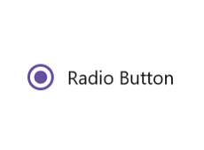

# Grouping in .NET MAUI Radio Button (SfRadioButton)

The [`SfRadioButton`](https://help.syncfusion.com/cr/maui/Syncfusion.Maui.Buttons.SfRadioButton.html) control supports two approaches for grouping a set of Radio Buttons so that only one is selected at a time:

* [GroupKey](#groupkey) - Share a single [`SfRadioGroupKey`](https://help.syncfusion.com/cr/maui/Syncfusion.Maui.Buttons.SfRadioGroupKey.html) instance across buttons located in any layout.
* [.NET MAUI Radio Group](#net-maui-radio-group) - Wrap the buttons in an [`SfRadioGroup`](https://help.syncfusion.com/cr/maui/Syncfusion.Maui.Buttons.SfRadioGroup.html) container for a richer set of features (`CheckedItem`, `SelectedValue`, `CheckedChanged`, `Orientation`).

Use `GroupKey` when your Radio Buttons are scattered across different layouts or pages and must still be mutually exclusive. Use `SfRadioGroup` when the buttons are visually grouped and you need the additional properties and events.

> **Prerequisites:** Add the `Syncfusion.Maui.Buttons` NuGet package to your project and register the handler in `MauiProgram.cs`:
>
> ```csharp
> using Syncfusion.Maui.Buttons.Hosting;
> builder.ConfigureSyncfusionButtons();
> ```
>
> Add the namespace to your XAML page:
>
> ```xaml
> xmlns:syncfusion="clr-namespace:Syncfusion.Maui.Buttons;assembly=Syncfusion.Maui.Buttons"
> ```

> **Version compatibility:** `SfRadioGroupKey`, `SfRadioGroup`, `CheckedChanged`, `SelectedValue`, and `Orientation` are available starting with `Syncfusion.Maui.Buttons` package version 19.4.0.x and require .NET MAUI (.NET 6 or later).

## Setting the Caption

The .NET MAUI Radio Button caption is defined using the [Text](https://help.syncfusion.com/cr/maui/Syncfusion.Maui.Buttons.ToggleButton.html#Syncfusion_Maui_Buttons_ToggleButton_Text) property. This caption typically describes the meaning of the Radio Button and is displayed next to it.




<ContentPage xmlns:syncfusion="clr-namespace:Syncfusion.Maui.Buttons;assembly=Syncfusion.Maui.Buttons">
    <syncfusion:SfRadioButton x:Name="radioButton" Text="Radio Button"/>
</ContentPage>




using Syncfusion.Maui.Buttons;

SfRadioButton radioButton = new SfRadioButton();
radioButton.Text = "Radio Button";
this.Content = radioButton;






## GroupKey

The [GroupKey](https://help.syncfusion.com/cr/maui/Syncfusion.Maui.Buttons.SfRadioButton.html#Syncfusion_Maui_Buttons_SfRadioButton_GroupKey) property of [`SfRadioButton`](https://help.syncfusion.com/cr/maui/Syncfusion.Maui.Buttons.SfRadioButton.html) allows you to group a set of Radio Buttons located in any layout. When grouped, only one Radio Button per [`SfRadioGroupKey`](https://help.syncfusion.com/cr/maui/Syncfusion.Maui.Buttons.SfRadioGroupKey.html) can be selected at a time.

A single `SfRadioGroupKey` instance can be shared across multiple Radio Buttons located in different layouts, pages, or even windows. Two different `SfRadioGroupKey` instances always represent different groups.




<ContentPage xmlns:syncfusion="clr-namespace:Syncfusion.Maui.Buttons;assembly=Syncfusion.Maui.Buttons">
    <ContentPage.Resources>
        <syncfusion:SfRadioGroupKey x:Key="carBrand"/>
        <syncfusion:SfRadioGroupKey x:Key="bikeBrand"/>
    </ContentPage.Resources>

    <StackLayout>
        <syncfusion:SfRadioButton Text="Honda" GroupKey="{StaticResource carBrand}"/>
        <syncfusion:SfRadioButton Text="Hyundai" GroupKey="{StaticResource carBrand}"/>
        <syncfusion:SfRadioButton Text="Volkswagen" GroupKey="{StaticResource carBrand}"/>
        <syncfusion:SfRadioButton Text="Yamaha" GroupKey="{StaticResource bikeBrand}"/>
        <syncfusion:SfRadioButton Text="Bajaj" GroupKey="{StaticResource bikeBrand}"/>
    </StackLayout>
</ContentPage>




using Syncfusion.Maui.Buttons;

SfRadioGroupKey carBrand = new SfRadioGroupKey();
SfRadioGroupKey bikeBrand = new SfRadioGroupKey();

SfRadioButton honda = new SfRadioButton() { Text = "Honda", GroupKey = carBrand };
SfRadioButton hyundai = new SfRadioButton() { Text = "Hyundai", GroupKey = carBrand };
SfRadioButton volkswagen = new SfRadioButton() { Text = "Volkswagen", GroupKey = carBrand };
SfRadioButton yamaha = new SfRadioButton() { Text = "Yamaha", GroupKey = bikeBrand };
SfRadioButton bajaj = new SfRadioButton() { Text = "Bajaj", GroupKey = bikeBrand };

StackLayout stackLayout = new StackLayout();
stackLayout.Children.Add(honda);
stackLayout.Children.Add(hyundai);
stackLayout.Children.Add(volkswagen);
stackLayout.Children.Add(yamaha);
stackLayout.Children.Add(bajaj);
this.Content = stackLayout;




**GroupKey grouping - selecting one option per group**


## .NET MAUI Radio Group

[`SfRadioGroup`](https://help.syncfusion.com/cr/maui/Syncfusion.Maui.Buttons.SfRadioGroup.html) is a container that holds a set of Radio Buttons. When you select a Radio Button in the group, all other items are automatically deselected. At any given time, only one Radio Button in the same group can be selected. The container also exposes the [`CheckedChanged`](https://help.syncfusion.com/cr/maui/Syncfusion.Maui.Buttons.SfRadioGroup.html#Syncfusion_Maui_Buttons_SfRadioGroup_CheckedChanged) event, the [`CheckedItem`](https://help.syncfusion.com/cr/maui/Syncfusion.Maui.Buttons.SfRadioGroup.html#Syncfusion_Maui_Buttons_SfRadioGroup_CheckedItem) property, the [`SelectedValue`](https://help.syncfusion.com/cr/maui/Syncfusion.Maui.Buttons.SfRadioGroup.html#Syncfusion_Maui_Buttons_SfRadioGroup_SelectedValue) property.




<ContentPage xmlns:syncfusion="clr-namespace:Syncfusion.Maui.Buttons;assembly=Syncfusion.Maui.Buttons">
    <syncfusion:SfRadioGroup>
        <syncfusion:SfRadioButton Text="Net banking" />
        <syncfusion:SfRadioButton Text="Debit card" />
        <syncfusion:SfRadioButton Text="Credit card" />
    </syncfusion:SfRadioGroup>
</ContentPage>




using Syncfusion.Maui.Buttons;

SfRadioGroup radioGroup = new SfRadioGroup();
SfRadioButton netBanking = new SfRadioButton() { Text = "Net banking" };
SfRadioButton debitCard = new SfRadioButton() { Text = "Debit card" };
SfRadioButton creditCard = new SfRadioButton() { Text = "Credit card" };

radioGroup.Children.Add(netBanking);
radioGroup.Children.Add(debitCard);
radioGroup.Children.Add(creditCard);
this.Content = radioGroup;





### CheckedItem

The [`CheckedItem`](https://help.syncfusion.com/cr/maui/Syncfusion.Maui.Buttons.SfRadioGroup.html#Syncfusion_Maui_Buttons_SfRadioGroup_CheckedItem) property of `SfRadioGroup` returns the currently checked Radio Button in the group. **Type:** `SfRadioButton`. Returns `null` if no Radio Button in the group is currently checked.

### SelectedValue

The [`SelectedValue`](https://help.syncfusion.com/cr/maui/Syncfusion.Maui.Buttons.SfRadioGroup.html#Syncfusion_Maui_Buttons_SfRadioGroup_SelectedValue) property of `SfRadioGroup` is of type `object` and represents the [Value](https://help.syncfusion.com/cr/maui/Syncfusion.Maui.Buttons.SfRadioButton.html#Syncfusion_Maui_Buttons_SfRadioButton_Value) of the checked Radio Button in the group. **Type:** `object` (default `null`).

When any Radio Button in the group is checked, the `Value` of that Radio Button is assigned to the `SelectedValue` property of the group. The `SelectedValue` is updated whenever a different Radio Button in the group is checked.

> If `SelectedValue` is set to a value that does not match the `Value` of any child Radio Button, no button in the group will be checked and `CheckedItem` returns `null`.




<ContentPage xmlns:syncfusion="clr-namespace:Syncfusion.Maui.Buttons;assembly=Syncfusion.Maui.Buttons">
    <syncfusion:SfRadioGroup x:Name="paymentGroup" SelectedValue="DebitCard">
        <syncfusion:SfRadioButton Text="Net banking" Value="NetBanking"/>
        <syncfusion:SfRadioButton Text="Debit card" Value="DebitCard"/>
        <syncfusion:SfRadioButton Text="Credit card" Value="CreditCard"/>
    </syncfusion:SfRadioGroup>
</ContentPage>




using Syncfusion.Maui.Buttons;

SfRadioGroup radioGroup = new SfRadioGroup
{
    SelectedValue = "DebitCard"
};
SfRadioButton netBankingRadioButton = new SfRadioButton
{
    Text = "Net banking",
    Value = "NetBanking"
};
SfRadioButton debitCardRadioButton = new SfRadioButton
{
    Text = "Debit card",
    Value = "DebitCard"
};
SfRadioButton creditCardRadioButton = new SfRadioButton
{
    Text = "Credit card",
    Value = "CreditCard"
};
radioGroup.Children.Add(netBankingRadioButton);
radioGroup.Children.Add(debitCardRadioButton);
radioGroup.Children.Add(creditCardRadioButton);
this.Content = radioGroup;




**SelectedValue reflects the Value of the checked Radio Button**


**Binding SelectedValue to a view-model property (MVVM)**




<ContentPage xmlns:syncfusion="clr-namespace:Syncfusion.Maui.Buttons;assembly=Syncfusion.Maui.Buttons">
    <ContentPage.BindingContext>
        <local:PaymentViewModel/>
    </ContentPage.BindingContext>
    <syncfusion:SfRadioGroup SelectedValue="{Binding SelectedPayment}">
        <syncfusion:SfRadioButton Text="Net banking" Value="NetBanking"/>
        <syncfusion:SfRadioButton Text="Debit card" Value="DebitCard"/>
        <syncfusion:SfRadioButton Text="Credit card" Value="CreditCard"/>
    </syncfusion:SfRadioGroup>
</ContentPage>




using Syncfusion.Maui.Buttons;
using System.ComponentModel;
using System.Runtime.CompilerServices;

public class PaymentViewModel : INotifyPropertyChanged
{
    private string selectedPayment = "DebitCard";
    public string SelectedPayment
    {
        get => selectedPayment;
        set
        {
            if (selectedPayment != value)
            {
                selectedPayment = value;
                OnPropertyChanged();
            }
        }
    }

    public event PropertyChangedEventHandler PropertyChanged;
    private void OnPropertyChanged([CallerMemberName] string name = null)
        => PropertyChanged?.Invoke(this, new PropertyChangedEventArgs(name));
}




### CheckedChanged Event

The [`CheckedChanged`](https://help.syncfusion.com/cr/maui/Syncfusion.Maui.Buttons.SfRadioGroup.html#Syncfusion_Maui_Buttons_SfRadioGroup_CheckedChanged) event of `SfRadioGroup` is raised when the checked item in the group changes. The event arguments are of type [`CheckedChangedEventArgs`](https://help.syncfusion.com/cr/maui/Syncfusion.Maui.Buttons.CheckedChangedEventArgs.html) and expose the following properties:

* [PreviousItem](https://help.syncfusion.com/cr/maui/Syncfusion.Maui.Buttons.CheckedChangedEventArgs.html#Syncfusion_Maui_Buttons_CheckedChangedEventArgs_PreviousItem) - The previously checked Radio Button in the group. **Type:** `SfRadioButton` (or `null` if none was checked).
* [CurrentItem](https://help.syncfusion.com/cr/maui/Syncfusion.Maui.Buttons.CheckedChangedEventArgs.html#Syncfusion_Maui_Buttons_CheckedChangedEventArgs_CurrentItem) - The currently checked Radio Button in the group. **Type:** `SfRadioButton` (or `null` if no item is now checked).




<ContentPage xmlns:syncfusion="clr-namespace:Syncfusion.Maui.Buttons;assembly=Syncfusion.Maui.Buttons">
    <syncfusion:SfRadioGroup CheckedChanged="OnCheckedChanged">
        <syncfusion:SfRadioButton x:Name="netBanking" Text="Net banking" />
        <syncfusion:SfRadioButton x:Name="debitCard" Text="Debit card" />
        <syncfusion:SfRadioButton x:Name="creditCard" Text="Credit card" />
    </syncfusion:SfRadioGroup>
</ContentPage>




using Syncfusion.Maui.Buttons;

SfRadioGroup radioGroup = new SfRadioGroup();
radioGroup.CheckedChanged += OnCheckedChanged;

SfRadioButton netBanking = new SfRadioButton() { Text = "Net banking" };
SfRadioButton debitCard = new SfRadioButton() { Text = "Debit card" };
SfRadioButton creditCard = new SfRadioButton() { Text = "Credit card" };
radioGroup.Children.Add(netBanking);
radioGroup.Children.Add(debitCard);
radioGroup.Children.Add(creditCard);
this.Content = radioGroup;

private void OnCheckedChanged(object sender, Syncfusion.Maui.Buttons.CheckedChangedEventArgs e)
{
    string previous = e.PreviousItem?.Text ?? "none";
    string current = e.CurrentItem?.Text ?? "none";
    // Handle the selection change here.
}




### Orientation in .NET MAUI Radio Group

`SfRadioGroup` supports horizontal and vertical orientations. By default, `SfRadioGroup` uses vertical orientation. Use the `Orientation` property to change the layout direction. **Type:** `StackOrientation` (an enum with `Horizontal` and `Vertical` values).

| Value | Description |
|-------|-------------|
| `Vertical` *(default)* | Radio Buttons are stacked vertically. |
| `Horizontal` | Radio Buttons are arranged in a single horizontal row. |




<ContentPage xmlns:syncfusion="clr-namespace:Syncfusion.Maui.Buttons;assembly=Syncfusion.Maui.Buttons">
    <syncfusion:SfRadioGroup Orientation="Horizontal">
        <syncfusion:SfRadioButton Text="Net banking" />
        <syncfusion:SfRadioButton Text="Debit card" />
        <syncfusion:SfRadioButton Text="Credit card" />
    </syncfusion:SfRadioGroup>
</ContentPage>




using Syncfusion.Maui.Buttons;

SfRadioGroup radioGroup = new SfRadioGroup() { Orientation = StackOrientation.Horizontal };
SfRadioButton netBanking = new SfRadioButton() { Text = "Net banking" };
SfRadioButton debitCard = new SfRadioButton() { Text = "Debit card" };
SfRadioButton creditCard = new SfRadioButton() { Text = "Credit card" };

radioGroup.Children.Add(netBanking);
radioGroup.Children.Add(debitCard);
radioGroup.Children.Add(creditCard);
this.Content = radioGroup;





## Troubleshooting

* **Buttons in the same layout are not mutually exclusive** - Ensure they all reference the **same** `SfRadioGroupKey` instance, not two separate `new SfRadioGroupKey()` objects.
* **Setting `SelectedValue` has no visible effect** - The value must match the `Value` of one of the child `SfRadioButton` elements exactly (case-sensitive).
* **`CheckedChanged` fires unexpectedly on initial load** - If `SelectedValue` is set in XAML or code, the event may fire as the matching button becomes checked. Use a flag if you need to skip this initial notification.
* **C# samples fail to compile** - Make sure `using Syncfusion.Maui.Buttons;` is added to the code-behind file and that the snippet is placed inside a `ContentPage` (or another `IView` host) so `this.Content` resolves.
