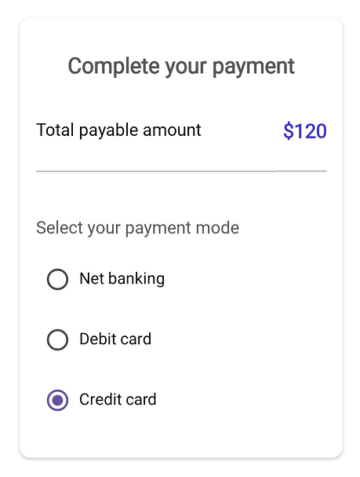

# .NET MAUI Radio Button (SfRadioButton) Overview

The .NET MAUI Radio Button is a selection control that allows users to select one option from a set. The two states of the Radio Button are checked and unchecked.

## Business use cases

- Form-based applications that require **single selection from multiple options such as gender, plan type, or preferences**.  
- Survey and questionnaire systems that collect **user responses using exclusive selection inputs**.  
- Settings pages that allow users to **choose one option from predefined configurations**.  
- Business applications that require **clear and structured decision-based input controls**.  

## Key features

- **Single selection** allows choosing only one option from a group of radio buttons.  
- **Tap interaction** allows users to select options easily through touch input.  
- **Appearance customization** allows modifying color and label text to match application themes.  
- **Grouped behavior** allows logically grouping radio buttons for exclusive selection scenarios.  

   

## Globalization

The following table summarizes the globalization support available in the [SfRadioButton](https://www.syncfusion.com/maui-controls/maui-radio-button) control.

 Full Support    
 Not Applicable

<table>
<tr>
<th align="center">Control</th>
<th align="center">Localization</th>
<th align="center">RTL</th>
<th align="center">Time zone</th>
<th align="center">Screen reader</th>
<th align="center">Keyboard navigation</th>
</tr>
<tr>
<td><a href="/maui/radio-button/overview">Radio Button</a></td>
<td align="center"></td>
<td align="center"></td>
<td align="center"></td>
<td align="center"></td>
<td align="center"></td>
</tr> 
</table>

## Related controls

- **[CheckBox](https://help.syncfusion.com/maui/checkbox/overview)** for handling multiple selection scenarios.  
- **[Switch](https://help.syncfusion.com/maui/switch/overview)** for toggle-based on and off interactions.  
- **[DataForm](https://help.syncfusion.com/maui/dataform/overview)** for integrating selection controls within forms.  

## Next steps

Explore further resources:

- [Getting Started](https://help.syncfusion.com/maui/radio-button/getting-started) - step-by-step guide to begin using the Radio Button control.  
- [Customization](https://help.syncfusion.com/maui/radio-button/visual-customization) - customize appearance and behavior.  
- [Grouping](https://help.syncfusion.com/maui/radio-button/grouping) - configure grouping and selection logic.
- [UI Kit](https://www.syncfusion.com/demos/maui#maui-ui-control) - explore interactive demos and ready‑made UI examples.

## Learnings

<!-- Card 1 -->
<a href="https://www.syncfusion.com/blogs/category/net-maui" class="form-card" target="_blank">
  

    <h3 class="form-title">Explore Blogs</h3>
    

      Read insights, tutorials, and developer journeys.
    

  

</a>
<!-- Card 2 -->
<a href="https://support.syncfusion.com/kb/cross-platforms/category/76" class="form-card" target="_blank">
  

    <h3 class="form-title">Explore KB's</h3>
    

      Find quick solutions and step‑by‑step guidance.
    

  

</a>
<!-- Card 3 -->
<a href="https://www.syncfusion.com/maui-controls/maui-radio-button" class="form-card" target="_blank">
  

    <h3 class="form-title">Feature Tour</h3>
    

      Walk through highlights and core capabilities.
    

  

</a>
<!-- Card 4 -->
<a href="https://www.syncfusion.com/tutorial-videos/maui/radio-button" class="form-card" target="_blank">
  

    <h3 class="form-title">Tutorial Videos</h3>
    

      Step‑by‑step guidance through video tutorials.
    

  

</a>
