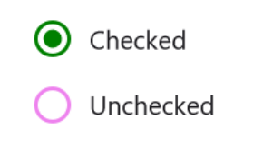

# Visual Customization in .NET MAUI Radio Button (SfRadioButton)

## Customizing a state color

The default state colors can be customized using the [`CheckedColor`] and [`UncheckedColor`] properties. The checked state color is updated to the [`CheckedColor`] property value when the state is changed to the checked. The unchecked state color is updated to the [`UncheckedColor`] property value when the state is changed to unchecked.




	<syncfusion:SfRadioGroup x:Name="radioGroup">
		<syncfusion:SfRadioButton x:Name="check" Text="Radio Button" IsChecked="True" CheckedColor="Green"/>
		<syncfusion:SfRadioButton x:Name="uncheck" Text="Radio Button" UncheckedColor="Violet"/>
	</syncfusion:SfRadioGroup>




	SfRadioGroup radioGroup = new SfRadioGroup();
	SfRadioButton check = new SfRadioButton();
	check.Text = "Radio Button";
	check.IsChecked = true;
	check.CheckedColor = Color.Green;
	SfRadioButton uncheck = new SfRadioButton();
	uncheck.Text = "Radio Button";
	uncheck.UncheckedColor = Colors.Violet;
	radioGroup.Children.Add(check);
	radioGroup.Children.Add(uncheck);
	this.Content = radioGroup;




## StrokeThickness

The stroke thickness of the circle in the Radio Button control can be customized using the [`StrokeThickness`] property.  




	<syncfusion:SfRadioGroup>
		<syncfusion:SfRadioButton Text="Checked State" IsChecked="True" StrokeThickness="3"/>
		<syncfusion:SfRadioButton Text="UnChecked State" StrokeThickness="3"/>
	</syncfusion:SfRadioGroup>




	SfRadioGroup radioGroup = new SfRadioGroup();
	SfRadioButton check = new SfRadioButton();
	check.Text = "Checked State";
	check.IsChecked = true;
	check.StrokeThickness = 3;
	SfRadioButton uncheck = new SfRadioButton();
	uncheck.Text = "UnChecked State";
	uncheck.StrokeThickness = 3;
	radioGroup.Children.Add(check);
	radioGroup.Children.Add(uncheck);
	this.Content = radioGroup;




N> StrokeThickness support has not been provided for Android Platform.

## Setting a caption text appearance 

You can customize the display text appearance of the [`SfRadioButton`] control using the following properties:

* [`TextColor`] : Changes the color of the text.
* [`HorizontalTextAlignment`] : Changes the horizontal alignment of the caption text.
* [`FontFamily`] : Changes the font family of the caption text.
* [`FontAttributes`] : Sets font attributes(bold/italic/none) of the caption text.
* [`FontSize`] : Sets font size of the caption text.




	<syncfusion:SfRadioButton x:Name="radioButton" Text="Radio Button" IsChecked="True" TextColor="Violet" HorizontalTextAlignment="Center" FontFamily="Arial" FontAttributes="Bold" FontSize="20"/>




	SfRadioButton radioButton = new SfRadioButton();
	radioButton.Text = "Radio Button";
	radioButton.IsChecked = true;
	radioButton.TextColor = Colors.Violet;
	radioButton.HorizontalTextAlignment = TextAlignment.Center;
	radioButton.FontFamily = "Arial";
	radioButton.FontAttributes = FontAttributes.Bold;
	radioButton.FontSize = 20;
	this.Content = radioButton;




