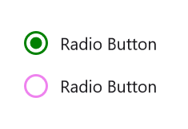
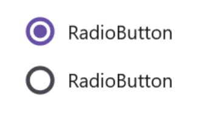
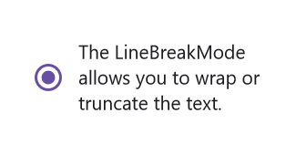

# Visual Customization in .NET MAUI Radio Button (SfRadioButton)

## Customizing a state color

The default state colors can be customized using the CheckedColor and UncheckedColor properties. The checked state color is updated to the value of the CheckedColor property when the state changes to check. The unchecked state color is updated to the value of the UncheckedColor property when the state changes to unchecked.




	<syncfusion:SfRadioGroup x:Name="radioGroup">
		<syncfusion:SfRadioButton x:Name="check" Text="Radio Button" IsChecked="True" CheckedColor="Green"/>
		<syncfusion:SfRadioButton x:Name="uncheck" Text="Radio Button" UncheckedColor="Violet"/>
	</syncfusion:SfRadioGroup>




	SfRadioGroup radioGroup = new SfRadioGroup();
	SfRadioButton check = new SfRadioButton();
	check.Text = "Radio Button";
	check.IsChecked = true;
	check.CheckedColor = Color.Green;
	SfRadioButton uncheck = new SfRadioButton();
	uncheck.Text = "Radio Button";
	uncheck.UncheckedColor = Colors.Violet;
	radioGroup.Children.Add(check);
	radioGroup.Children.Add(uncheck);
	this.Content = radioGroup;




## StrokeThickness

The stroke thickness of the circle in the Radio Button control can be customized using the [`StrokeThickness`](https://help.syncfusion.com/cr/maui/Syncfusion.Maui.Buttons.ToggleButton.html#Syncfusion_Maui_Buttons_ToggleButton_StrokeThickness) property.  




	<syncfusion:SfRadioGroup>
		<syncfusion:SfRadioButton Text="Checked state" IsChecked="True" StrokeThickness="3"/>
		<syncfusion:SfRadioButton Text="Unchecked state" StrokeThickness="3"/>
	</syncfusion:SfRadioGroup>




	SfRadioGroup radioGroup = new SfRadioGroup();
	SfRadioButton check = new SfRadioButton();
	check.Text = "Checked State";
	check.IsChecked = true;
	check.StrokeThickness = 3;
	SfRadioButton uncheck = new SfRadioButton();
	uncheck.Text = "Unchecked State";
	uncheck.StrokeThickness = 3;
	radioGroup.Children.Add(check);
	radioGroup.Children.Add(uncheck);
	this.Content = radioGroup;




N> StrokeThickness support has not been provided for Android Platform.

## Setting a caption text appearance 

You can customize the display text appearance of the [`SfRadioButton`](https://help.syncfusion.com/cr/maui/Syncfusion.Maui.Buttons.SfRadioButton.html) control using the following properties:

* [`TextColor`](https://help.syncfusion.com/cr/maui/Syncfusion.Maui.Buttons.ToggleButton.html#Syncfusion_Maui_Buttons_ToggleButton_TextColor) : Changes the color of the text.
* [`HorizontalTextAlignment`](https://help.syncfusion.com/cr/maui/Syncfusion.Maui.Buttons.ToggleButton.html#Syncfusion_Maui_Buttons_ToggleButton_HorizontalTextAlignment) : Changes the horizontal alignment of the caption text.
* [`FontFamily`](https://help.syncfusion.com/cr/maui/Syncfusion.Maui.Buttons.ToggleButton.html#Syncfusion_Maui_Buttons_ToggleButton_FontFamily) : Changes the font family of the caption text.
* [`FontAttributes`](https://help.syncfusion.com/cr/maui/Syncfusion.Maui.Buttons.ToggleButton.html#Syncfusion_Maui_Buttons_ToggleButton_FontAttributes) : Sets font attributes(bold/italic/none) of the caption text.
* [`FontSize`](https://help.syncfusion.com/cr/maui/Syncfusion.Maui.Buttons.ToggleButton.html#Syncfusion_Maui_Buttons_ToggleButton_FontSize) : Sets font size of the caption text.




	<syncfusion:SfRadioButton x:Name="radioButton" 
				  Text="Radio Button" 
				  IsChecked="True" 
				  TextColor="Blue" 
				  HorizontalTextAlignment="Center" 
			          FontFamily="Arial" 
				  FontAttributes="Bold" 
				  FontSize="20"/>




	SfRadioButton radioButton = new SfRadioButton();
	radioButton.Text = "Radio Button";
	radioButton.IsChecked = true;
	radioButton.TextColor = Colors.Blue;
	radioButton.HorizontalTextAlignment = TextAlignment.Center;
	radioButton.FontFamily = "Arial";
	radioButton.FontAttributes = FontAttributes.Bold;
	radioButton.FontSize = 20;
	this.Content = radioButton;




## LineBreakMode

The [`LineBreakMode`](https://help.syncfusion.com/cr/maui/Syncfusion.Maui.Buttons.SfRadioButton.html#Syncfusion_Maui_Buttons_SfRadioButton_LineBreakMode) allows you to wrap or truncate the text. The default value of this property is NoWrap. The following other options are available in [`LineBreakMode`](https://help.syncfusion.com/cr/maui/Syncfusion.Maui.Buttons.SfRadioButton.html#Syncfusion_Maui_Buttons_SfRadioButton_LineBreakMode):

*   `NoWrap` - Avoids the text wrap.
*   `WordWrap` - Wraps the text by words.
*   `CharacterWrap` - Wraps the text by character.
*   `HeadTruncation` - Truncates the text at the start.
*   `MiddleTruncation` - Truncates the text at the center.
*   `TailTruncation` - Truncates the text at the end.




    <syncfusion:SfRadioButton   x:Name="RadioButton" 
				IsChecked="True" 
				WidthRequest="200" 
				LineBreakMode="WordWrap" 
				Text="The LineBreakMode allows you to wrap or truncate the text.">
				</syncfusion:SfRadioButton>





    StackLayout stackLayout = new StackLayout();
    SfRadioButton radioButton = new SfRadioButton();
    radioButton.Text = "The LineBreakMode allows you to wrap or truncate the text.";
    radioButton.LineBreakMode = LineBreakMode.WordWrap;
    radioButton.WidthRequest = 200;
    stackLayout.Children.Add(radioButton);




This demo can be downloaded from [GitHub link](https://github.com/SyncfusionExamples/How-to-wrap-text-in-DOTNET-MAUI-RadiButton)

## Size customization

The [`ControlSize`](https://help.syncfusion.com/cr/maui/Syncfusion.Maui.Buttons.ToggleButton.html#Syncfusion_Maui_Buttons_ToggleButton_ControlSize) property is used to customize the [`RadioButton`](https://help.syncfusion.com/cr/maui/Syncfusion.Maui.Buttons.SfRadioButton.html) control size. 




<StackLayout>
    <syncfusion:SfRadioButton Text="RadioButton" ControlSize="40"/>
</StackLayout>




	StackLayout stackLayout = new StackLayout();
	SfRadioButton radioButton = new SfRadioButton();
	radioButton.Text = "Radio Button";
	radioButton.ControlSize = 40;
	stackLayout.Children.Add(radioButton);
	this.Content = stackLayout;


