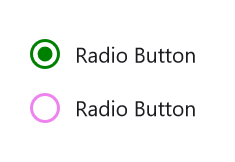
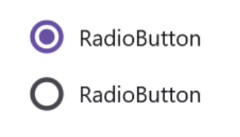
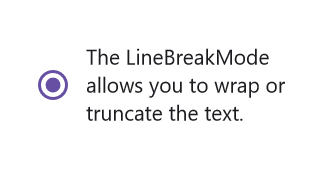

# Visual Customization in .NET MAUI Radio Button (SfRadioButton)

This section covers the visual properties of [`SfRadioButton`](https://help.syncfusion.com/cr/maui/Syncfusion.Maui.Buttons.SfRadioButton.html) and how to customize them. For the caption text and basic usage, see [Getting Started with .NET MAUI Radio Button (SfRadioButton)](Getting-Started.md).

Available customization categories:

* [State Colors](#state-colors) - `CheckedColor`, `UncheckedColor`
* [Stroke](#stroke) - `StrokeThickness`
* [Text Appearance](#text-appearance) - `TextColor`, `HorizontalTextAlignment`, `FontFamily`, `FontAttributes`, `FontSize`, `LineBreakMode`, `FontAutoScalingEnabled`
* [Size and Spacing](#size-and-spacing) - `ControlSize`, `ContentSpacing`
* [Animation](#animation) - `EnabledAnimation`

> **Prerequisites:** Add the `Syncfusion.Maui.Buttons` NuGet package to your project and register the handler in `MauiProgram.cs`:
>
> ```csharp
> using Syncfusion.Maui.Buttons.Hosting;
> builder.ConfigureSyncfusionButtons();
> ```
>
> Add the namespace to your XAML page:
>
> ```xaml
> xmlns:syncfusion="clr-namespace:Syncfusion.Maui.Buttons;assembly=Syncfusion.Maui.Buttons"
> ```

> **Version compatibility:** The visual-customization properties documented here are available starting with `Syncfusion.Maui.Buttons` package version 19.4.0.x and require .NET MAUI (.NET 6 or later).

## State Colors

The checked and unchecked state colors of `SfRadioButton` can be customized using the [`CheckedColor`](https://help.syncfusion.com/cr/maui/Syncfusion.Maui.Buttons.ToggleButton.html#Syncfusion_Maui_Buttons_ToggleButton_CheckedColor) and [`UncheckedColor`](https://help.syncfusion.com/cr/maui/Syncfusion.Maui.Buttons.ToggleButton.html#Syncfusion_Maui_Buttons_ToggleButton_UncheckedColor) properties. The circle is filled with `CheckedColor` when the state is checked and with `UncheckedColor` when the state is unchecked. **Type:** `Color`. **Default:** theme-dependent (typically the accent color for checked and a neutral gray for unchecked).




<ContentPage xmlns:syncfusion="clr-namespace:Syncfusion.Maui.Buttons;assembly=Syncfusion.Maui.Buttons">
    <syncfusion:SfRadioGroup x:Name="radioGroup">
        <syncfusion:SfRadioButton x:Name="check" Text="Checked" IsChecked="True" CheckedColor="Green"/>
        <syncfusion:SfRadioButton x:Name="uncheck" Text="Unchecked" UncheckedColor="Violet"/>
    </syncfusion:SfRadioGroup>
</ContentPage>




using Syncfusion.Maui.Buttons;

SfRadioGroup radioGroup = new SfRadioGroup();
SfRadioButton check = new SfRadioButton();
check.Text = "Checked";
check.IsChecked = true;
check.CheckedColor = Colors.Green;
SfRadioButton uncheck = new SfRadioButton();
uncheck.Text = "Unchecked";
uncheck.UncheckedColor = Colors.Violet;
radioGroup.Children.Add(check);
radioGroup.Children.Add(uncheck);
this.Content = radioGroup;




**Custom CheckedColor and UncheckedColor**



## Stroke

### StrokeThickness

The stroke thickness of the circle in `SfRadioButton` can be customized using the [`StrokeThickness`](https://help.syncfusion.com/cr/maui/Syncfusion.Maui.Buttons.ToggleButton.html#Syncfusion_Maui_Buttons_ToggleButton_StrokeThickness) property. **Type:** `double`. **Default:** `1`.

> **Platform note:** `StrokeThickness` is not supported on the Android platform. The value is ignored on Android and the default stroke is rendered.




<ContentPage xmlns:syncfusion="clr-namespace:Syncfusion.Maui.Buttons;assembly=Syncfusion.Maui.Buttons">
    <syncfusion:SfRadioGroup>
        <syncfusion:SfRadioButton Text="Checked state" IsChecked="True" StrokeThickness="3"/>
        <syncfusion:SfRadioButton Text="Unchecked state" StrokeThickness="3"/>
    </syncfusion:SfRadioGroup>
</ContentPage>




using Syncfusion.Maui.Buttons;

SfRadioGroup radioGroup = new SfRadioGroup();
SfRadioButton check = new SfRadioButton();
check.Text = "Checked state";
check.IsChecked = true;
check.StrokeThickness = 3;
SfRadioButton uncheck = new SfRadioButton();
uncheck.Text = "Unchecked state";
uncheck.StrokeThickness = 3;
radioGroup.Children.Add(check);
radioGroup.Children.Add(uncheck);
this.Content = radioGroup;




**StrokeThickness applied to the radio circle**



## Text Appearance

The display text of `SfRadioButton` can be customized using the following properties:

| Property | Type | Description |
|----------|------|-------------|
| [`TextColor`](https://help.syncfusion.com/cr/maui/Syncfusion.Maui.Buttons.ToggleButton.html#Syncfusion_Maui_Buttons_ToggleButton_TextColor) | `Color` | Color of the caption text. |
| [`HorizontalTextAlignment`](https://help.syncfusion.com/cr/maui/Syncfusion.Maui.Buttons.ToggleButton.html#Syncfusion_Maui_Buttons_ToggleButton_HorizontalTextAlignment) | `TextAlignment` | Horizontal alignment of the caption text. Values: `Start`, `Center`, `End`. |
| [`FontFamily`](https://help.syncfusion.com/cr/maui/Syncfusion.Maui.Buttons.ToggleButton.html#Syncfusion_Maui_Buttons_ToggleButton_FontFamily) | `string` | Font family of the caption text. |
| [`FontAttributes`](https://help.syncfusion.com/cr/maui/Syncfusion.Maui.Buttons.ToggleButton.html#Syncfusion_Maui_Buttons_ToggleButton_FontAttributes) | `FontAttributes` | Font style of the caption text. Values: `None`, `Bold`, `Italic`. |
| [`FontSize`](https://help.syncfusion.com/cr/maui/Syncfusion.Maui.Buttons.ToggleButton.html#Syncfusion_Maui_Buttons_ToggleButton_FontSize) | `double` | Font size of the caption text. **Default:** platform-default. |




<ContentPage xmlns:syncfusion="clr-namespace:Syncfusion.Maui.Buttons;assembly=Syncfusion.Maui.Buttons">
    <syncfusion:SfRadioButton x:Name="radioButton"
                              Text="Radio Button"
                              IsChecked="True"
                              TextColor="Blue"
                              HorizontalTextAlignment="Center"
                              FontFamily="Arial"
                              FontAttributes="Bold"
                              FontSize="20"/>
</ContentPage>




using Syncfusion.Maui.Buttons;
using Microsoft.Maui;

SfRadioButton radioButton = new SfRadioButton();
radioButton.Text = "Radio Button";
radioButton.IsChecked = true;
radioButton.TextColor = Colors.Blue;
radioButton.HorizontalTextAlignment = TextAlignment.Center;
radioButton.FontFamily = "Arial";
radioButton.FontAttributes = FontAttributes.Bold;
radioButton.FontSize = 20;
this.Content = radioButton;




**Customized text appearance**


### LineBreakMode

The [`LineBreakMode`](https://help.syncfusion.com/cr/maui/Syncfusion.Maui.Buttons.SfRadioButton.html#Syncfusion_Maui_Buttons_SfRadioButton_LineBreakMode) property controls how the caption text is wrapped or truncated when it does not fit in the available space. **Type:** `LineBreakMode` (a MAUI enum). **Default:** `NoWrap`.

| Value | Description |
|-------|-------------|
| `NoWrap` | Does not wrap the text. |
| `WordWrap` | Wraps the text at word boundaries. |
| `CharacterWrap` | Wraps the text at character boundaries. |
| `HeadTruncation` | Truncates the text at the start. |
| `MiddleTruncation` | Truncates the text in the middle. |
| `TailTruncation` | Truncates the text at the end. |




<ContentPage xmlns:syncfusion="clr-namespace:Syncfusion.Maui.Buttons;assembly=Syncfusion.Maui.Buttons">
    <syncfusion:SfRadioButton x:Name="radioButton"
                              IsChecked="True"
                              WidthRequest="200"
                              LineBreakMode="WordWrap"
                              Text="The LineBreakMode allows you to wrap or truncate the text."/>
</ContentPage>




using Syncfusion.Maui.Buttons;
using Microsoft.Maui;

StackLayout stackLayout = new StackLayout();
SfRadioButton radioButton = new SfRadioButton();
radioButton.Text = "The LineBreakMode allows you to wrap or truncate the text.";
radioButton.LineBreakMode = LineBreakMode.WordWrap;
radioButton.WidthRequest = 200;
stackLayout.Children.Add(radioButton);
this.Content = stackLayout;




**LineBreakMode = WordWrap**



Download a working sample demonstrating `LineBreakMode` from the [GitHub sample repository](https://github.com/SyncfusionExamples/How-to-wrap-text-in-DOTNET-MAUI-RadiButton).

### FontAutoScalingEnabled

The [`FontAutoScalingEnabled`](https://help.syncfusion.com/cr/maui/Syncfusion.Maui.Buttons.ToggleButton.html#Syncfusion_Maui_Buttons_ToggleButton_FontAutoScalingEnabled) property controls whether the caption text automatically scales with the operating system's text size. **Type:** `bool`. **Default:** `false`.

When `true`, the caption text respects the user's accessibility text-size preferences on each platform. When `false`, the text is rendered at the explicit `FontSize` regardless of the OS setting.




<ContentPage xmlns:syncfusion="clr-namespace:Syncfusion.Maui.Buttons;assembly=Syncfusion.Maui.Buttons">
    <syncfusion:SfRadioButton Text="Radio Button" FontAutoScalingEnabled="True"/>
</ContentPage>




using Syncfusion.Maui.Buttons;

SfRadioButton radioButton = new SfRadioButton();
radioButton.Text = "Radio Button";
radioButton.FontAutoScalingEnabled = true;
this.Content = radioButton;




## Size and Spacing

### ControlSize

The [`ControlSize`](https://help.syncfusion.com/cr/maui/Syncfusion.Maui.Buttons.ToggleButton.html#Syncfusion_Maui_Buttons_ToggleButton_ControlSize) property customizes the size of the radio circle and caption in `SfRadioButton`. **Type:** `double`. **Default:** platform-default. Larger values produce a larger circle and proportionally larger caption text.




<ContentPage xmlns:syncfusion="clr-namespace:Syncfusion.Maui.Buttons;assembly=Syncfusion.Maui.Buttons">
    <VerticalStackLayout>
        <syncfusion:SfRadioButton Text="Small" ControlSize="20"/>
        <syncfusion:SfRadioButton Text="Default" ControlSize="40"/>
        <syncfusion:SfRadioButton Text="Large" ControlSize="60"/>
    </VerticalStackLayout>
</ContentPage>




using Syncfusion.Maui.Buttons;

StackLayout stackLayout = new StackLayout();
SfRadioButton small = new SfRadioButton() { Text = "Small", ControlSize = 20 };
SfRadioButton defaultSize = new SfRadioButton() { Text = "Default", ControlSize = 40 };
SfRadioButton large = new SfRadioButton() { Text = "Large", ControlSize = 60 };
stackLayout.Children.Add(small);
stackLayout.Children.Add(defaultSize);
stackLayout.Children.Add(large);
this.Content = stackLayout;




### ContentSpacing

The [`ContentSpacing`](https://help.syncfusion.com/cr/maui/Syncfusion.Maui.Buttons.ToggleButton.html#Syncfusion_Maui_Buttons_ToggleButton_ContentSpacing) property adjusts the space between the radio circle and the caption text. **Type:** `double`. **Default:** platform-default (typically `4`-`8` device-independent units).




<ContentPage xmlns:syncfusion="clr-namespace:Syncfusion.Maui.Buttons;assembly=Syncfusion.Maui.Buttons">
    <syncfusion:SfRadioButton Text="Radio Button" ContentSpacing="25"/>
</ContentPage>




using Syncfusion.Maui.Buttons;

StackLayout stackLayout = new StackLayout();
SfRadioButton radioButton = new SfRadioButton();
radioButton.Text = "Radio Button";
radioButton.ContentSpacing = 25;
stackLayout.Children.Add(radioButton);
this.Content = stackLayout;




**ContentSpacing increases the gap between circle and caption**


## Animation

### EnabledAnimation

The [`EnabledAnimation`](https://help.syncfusion.com/cr/maui/Syncfusion.Maui.Buttons.ToggleButton.html#Syncfusion_Maui_Buttons_ToggleButton_EnabledAnimation) property enables or disables the state-change animation of `SfRadioButton`. **Type:** `bool`. **Default:** `true`.

When `true`, the circle is animated when the checked state changes. When `false`, the state change is applied instantly without animation.




<ContentPage xmlns:syncfusion="clr-namespace:Syncfusion.Maui.Buttons;assembly=Syncfusion.Maui.Buttons">
    <syncfusion:SfRadioButton Text="Radio Button" EnabledAnimation="False"/>
</ContentPage>




using Syncfusion.Maui.Buttons;

SfRadioButton radioButton = new SfRadioButton
{
    Text = "Radio Button",
    EnabledAnimation = false
};
this.Content = radioButton;




## Troubleshooting

* **Colors do not update when toggling** - Make sure the value is assigned to the property directly (not a `StaticResource` that has not been re-evaluated). For dynamic color changes, use a binding to a view-model property and call `PropertyChanged`.
* **`StrokeThickness` is ignored on Android** - The property is not supported on Android; use `Stroke` color or `CheckedColor` to differentiate the unchecked state instead.
* **`LineBreakMode` sample does not wrap** - Set an explicit `WidthRequest` (or place the Radio Button inside a constrained layout) so the text has a finite width to wrap within.
* **`FontAutoScalingEnabled` has no effect on Windows** - Verify the OS-level text-size setting is enabled in Windows Settings > Accessibility > Text size; otherwise the OS returns the default scale.
* **C# samples fail to compile** - Add `using Syncfusion.Maui.Buttons;` and `using Microsoft.Maui;` (for `Colors`, `TextAlignment`, `FontAttributes`, `LineBreakMode`) to the code-behind file. The XAML snippet must be placed inside a `ContentPage` (or another `IView` host) so `this.Content` resolves.