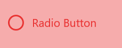

# Visual States in .NET MAUI Radio Button (SfRadioButton)

The visual of the Radio Button can be customized using VisualStates. The [`SfRadioButton`](https://help.syncfusion.com/cr/maui/Syncfusion.Maui.Buttons.SfRadioButton.html) control contains the following two visual states:

* Checked
* Unchecked




    <syncfusion:SfRadioButton Text="Radio Button">
        <VisualStateManager.VisualStateGroups>
            <VisualStateGroup x:Name="CommonStates">
                <VisualState x:Name="Checked">
                    <VisualState.Setters>
                        <Setter Property="TextColor" Value="Blue"/>
                        <Setter Property="BackgroundColor" Value="#8bc5fb"/>
                        <Setter Property="CheckedColor" Value="Blue"/>
                    </VisualState.Setters>
                </VisualState>
                <VisualState x:Name="Unchecked">
                    <VisualState.Setters>
                        <Setter Property="TextColor" Value="#ea3737"/>
                        <Setter Property="BackgroundColor" Value="#f6acac"/>
                        <Setter Property="UncheckedColor" Value="#ea3737"/>
                    </VisualState.Setters>
                </VisualState>
            </VisualStateGroup>
        </VisualStateManager.VisualStateGroups>
    </syncfusion:SfRadioButton>




    SfRadioButton radioButton = new SfRadioButton { Text = "Radio Button" };
    VisualStateGroupList visualStateGroupList = new VisualStateGroupList();
    VisualStateGroup commonStateGroup = new VisualStateGroup();

    VisualState checkedState = new VisualState
    {
        Name = "Checked"
    };

    checkedState.Setters.Add(new Setter { Property = SfRadioButton.TextColorProperty, Value = Colors.Blue });
    checkedState.Setters.Add(new Setter { Property = SfRadioButton.BackgroundColorProperty, Value = Color.FromHex("#8bc5fb") });
    checkedState.Setters.Add(new Setter { Property = SfRadioButton.CheckedColorProperty, Value = Colors.Blue });

    VisualState uncheckedState = new VisualState
    {
        Name = "Unchecked"
    };
    uncheckedState.Setters.Add(new Setter { Property = SfRadioButton.TextColorProperty, Value = Color.FromHex("#ea3737") });
    uncheckedState.Setters.Add(new Setter { Property = SfRadioButton.BackgroundColorProperty, Value = Color.FromHex("#f6acac") });
    uncheckedState.Setters.Add(new Setter { Property = SfRadioButton.UncheckedColorProperty, Value = Color.FromHex("#ea3737") });

    commonStateGroup.States.Add(checkedState);
    commonStateGroup.States.Add(uncheckedState);

    visualStateGroupList.Add(commonStateGroup);
    VisualStateManager.SetVisualStateGroups(radioButton, visualStateGroupList);
    this.Content = radioButton;




**Checked visual state:**

**Unchecked visual state:**

