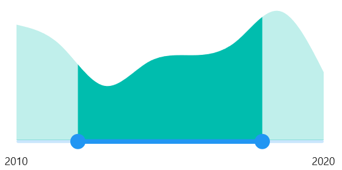

# Basic features  in .NET MAUI Range Selector (SfRangeSelector)

This section explains about how to add the numeric and date range selector.

## Minimum

The minimum value that the user can select. The default value of [`Minimum`](https://help.syncfusion.com/cr/maui/Syncfusion.Maui.Sliders.SliderBase.html#Syncfusion_Maui_Sliders_SliderBase_Minimum) property is 0.0 and it must be less than the [`Maximum`](https://help.syncfusion.com/cr/maui/Syncfusion.Maui.Sliders.SliderBase.html#Syncfusion_Maui_Sliders_SliderBase_Maximum) value.

## Maximum

The maximum value that the user can select. The default value of [`Maximum`](https://help.syncfusion.com/cr/maui/Syncfusion.Maui.Sliders.SliderBase.html#Syncfusion_Maui_Sliders_SliderBase_Maximum) property is 1.5 and it must be greater than the [`Minimum`](https://help.syncfusion.com/cr/maui/Syncfusion.Maui.Sliders.SliderBase.html#Syncfusion_Maui_Sliders_SliderBase_Minimum) value.

## Range values

It represents the values currently selected in the range slider. The range slider’s thumb is drawn corresponding to this [`RangeStart`](https://help.syncfusion.com/cr/maui/Syncfusion.Maui.Sliders.SfRangeSlider.html#Syncfusion_Maui_Sliders_SfRangeSlider_RangeStart) and [`RangeEnd`](https://help.syncfusion.com/cr/maui/Syncfusion.Maui.Sliders.SfRangeSlider.html#Syncfusion_Maui_Sliders_SfRangeSlider_RangeEnd) values.

For date values, the range selector does not have auto interval support. So, it is mandatory to set [`Interval`](https://help.syncfusion.com/cr/maui/Syncfusion.Maui.Sliders.SliderBase.html?tabs=tabid-1#Syncfusion_Maui_Sliders_SliderBase_Interval), [`IntervalType`](https://help.syncfusion.com/cr/maui/Syncfusion.Maui.Sliders.SliderBase.html#Syncfusion_Maui_Sliders_SliderBase_DateIntervalType), and [`DateFormat`](https://help.syncfusion.com/cr/maui/Syncfusion.Maui.Sliders.SliderBase.html#Syncfusion_Maui_Sliders_SliderBase_DateFormat) for date values.

## Numeric Range selector

You can show numeric values in the range selector by setting double values to the Minimum, Maximum, RangeStart, and RangeEnd properties.





<ContentPage 
             ...
             xmlns:rangeselector="clr-namespace:Syncfusion.Maui.Sliders;assembly=Syncfusion.Maui.Sliders"
             xmlns:chart="clr-namespace:Syncfusion.Maui.Charts;assembly=Syncfusion.Maui.Charts"
             xmlns:local="clr-namespace:SliderTestbedSample.RangeSelector">
    <ContentPage.BindingContext>
        <local:ViewModel />
    </ContentPage.BindingContext>
    <rangeselector:SfRangeSelector Minimum="10"
                                   Maximum="20"
                                   RangeStart="13"
                                   RangeEnd="17"
                                   ShowLabels="True">
        <chart:SfCartesianChart>
            <chart:SfCartesianChart.XAxes>
                <chart:DateTimeAxis IsVisible="False"
                                    ShowMajorGridLines="False" />
            </chart:SfCartesianChart.XAxes>
            <chart:SfCartesianChart.YAxes>
                <chart:NumericalAxis IsVisible="False"
                                     ShowMajorGridLines="False" />
            </chart:SfCartesianChart.YAxes>
            <chart:SfCartesianChart.Series>
                <chart:SplineAreaSeries ItemsSource="{Binding Source}"
                                        XBindingPath="X"
                                        YBindingPath="Y"
                                        Fill="Blue">
                </chart:SplineAreaSeries>
            </chart:SfCartesianChart.Series>
        </chart:SfCartesianChart>
    </rangeselector:SfRangeSelector>
</ContentPage>
 




SfRangeSelector rangeSelector = new SfRangeSelector();
rangeSelector.Minimum = 10;
rangeSelector.Maximum = 20;
rangeSelector.RangeStart = 13;
rangeSelector.RangeEnd = 17;
rangeSelector.ShowLabels = true;
SfCartesianChart chart = new SfCartesianChart();
DateTimeAxis primaryAxis = new DateTimeAxis();
chart.XAxes = primaryAxis;
NumericalAxis secondaryAxis = new NumericalAxis();
chart.YAxes = secondaryAxis;
SplineAreaSeries series = new SplineAreaSeries();
series.ItemsSource = (new ViewModel()).Source;
series.XBindingPath = "X";
series.YBindingPath = "Y";
rangeSelector.Content = chart;





## Date Range selector

You can show date values in the range selector by setting double values to the Minimum, Maximum, RangeStart, and RangeEnd properties.





<ContentPage 
             ...
             xmlns:rangeselector="clr-namespace:Syncfusion.Maui.Sliders;assembly=Syncfusion.Maui.Sliders"
             xmlns:chart="clr-namespace:Syncfusion.Maui.Charts;assembly=Syncfusion.Maui.Charts"
             xmlns:local="clr-namespace:SliderTestbedSample.RangeSelector">
    <ContentPage.BindingContext>
        <local:ViewModel />
    </ContentPage.BindingContext>
    <rangeselector:SfDateTimeRangeSelector Minimum="2010-01-01" 
                                           Maximum="2020-01-01" 
                                           RangeStart="2012-01-01" 
                                           RangeEnd="2018-01-01" 
                                           ShowLabels="True">
        <chart:SfCartesianChart>
            <chart:SfCartesianChart.XAxes>
                <chart:DateTimeAxis IsVisible="False"
                                    ShowMajorGridLines="False" />
            </chart:SfCartesianChart.XAxes>
            <chart:SfCartesianChart.YAxes>
                <chart:NumericalAxis IsVisible="False"
                                     ShowMajorGridLines="False" />
            </chart:SfCartesianChart.YAxes>
            <chart:SfCartesianChart.Series>
                <chart:SplineAreaSeries ItemsSource="{Binding Source}"
                                        XBindingPath="X"
                                        YBindingPath="Y"
                                        Fill="Blue">
                </chart:SplineAreaSeries>
            </chart:SfCartesianChart.Series>
        </chart:SfCartesianChart>
    </rangeselector:SfRangeSelector>
</ContentPage>
 




SfDateTimeRangeSelector rangeselector = new SfDateTimeRangeSelector();
rangeselector.Minimum = new DateTime(2010, 01, 01);
rangeselector.Maximum = new DateTime(2020, 01, 01);
rangeselector.RangeStart = new DateTime(2012, 01, 01);
rangeselector.RangeEnd = new DateTime(2018, 01, 01);
rangeselector.ShowLabels = true;
SfCartesianChart chart = new SfCartesianChart();
DateTimeAxis primaryAxis = new DateTimeAxis();
chart.XAxes = primaryAxis;
NumericalAxis secondaryAxis = new NumericalAxis();
chart.YAxes = secondaryAxis;
SplineAreaSeries series = new SplineAreaSeries();
series.ItemsSource = (new ViewModel()).Source;
series.XBindingPath = "X";
series.YBindingPath = "Y";
rangeSelector.Content = chart;





