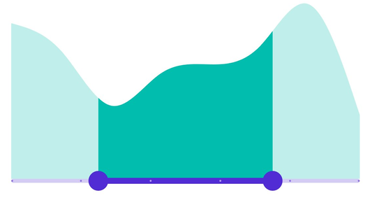

# Dividers in .NET MAUI Range Selector (SfRangeSelector)

This section explains about how to add the dividers in the Range Selector.

## Show dividers

The [`ShowDividers`](https://help.syncfusion.com/cr/maui/Syncfusion.Maui.Sliders.SliderBase.html#Syncfusion_Maui_Sliders_SliderBase_ShowDividers) property is used to render the dividers on the track. The default value of the [`ShowDividers`](https://help.syncfusion.com/cr/maui/Syncfusion.Maui.Sliders.SliderBase.html#Syncfusion_Maui_Sliders_SliderBase_ShowDividers) property is `False`. It is a shape which is used to represent the major interval points of the track.

For example, if [`Minimum`](https://help.syncfusion.com/cr/maui/Syncfusion.Maui.Sliders.SliderBase.html#Syncfusion_Maui_Sliders_SliderBase_Minimum) is 0.0 and [`Maximum`](https://help.syncfusion.com/cr/maui/Syncfusion.Maui.Sliders.SliderBase.html#Syncfusion_Maui_Sliders_SliderBase_Minimum) is 10.0 and [`Interval`](https://help.syncfusion.com/cr/maui/Syncfusion.Maui.Sliders.SliderBase.html#Syncfusion_Maui_Sliders_SliderBase_Interval) is 2.0, the Range Selector will render the dividers at 0.0, 2.0, 4.0 and so on.





<ContentPage 
             ...
             xmlns:sliders="clr-namespace:Syncfusion.Maui.Sliders;assembly=Syncfusion.Maui.Sliders"
             xmlns:charts="clr-namespace:Syncfusion.Maui.Charts;assembly=Syncfusion.Maui.Charts">

    <sliders:SfRangeSelector Interval="0.2" 
                             ShowDividers="True">

        <charts:SfCartesianChart>
            ...
        </charts:SfCartesianChart>

    </sliders:SfRangeSelector>
</ContentPage>





SfRangeSelector rangeSelector = new SfRangeSelector();
rangeSelector.Interval = 0.2;
rangeSelector.ShowDividers = true;
SfCartesianChart chart = new SfCartesianChart();
rangeSelector.Content = chart;





## Divider radius

You can change the active and inactive divider radius of the Range Selector using the [`ActiveRadius`](https://help.syncfusion.com/cr/maui/Syncfusion.Maui.Sliders.SliderDividerStyle.html#Syncfusion_Maui_Sliders_SliderDividerStyle_ActiveRadius) and the [`InactiveRadius`](https://help.syncfusion.com/cr/maui/Syncfusion.Maui.Sliders.SliderDividerStyle.html#Syncfusion_Maui_Sliders_SliderDividerStyle_InactiveRadius) properties of the [`DividerStyle`](https://help.syncfusion.com/cr/maui/Syncfusion.Maui.Sliders.SliderDividerStyle.html) class.





<ContentPage 
             ...
             xmlns:sliders="clr-namespace:Syncfusion.Maui.Sliders;assembly=Syncfusion.Maui.Sliders"
             xmlns:charts="clr-namespace:Syncfusion.Maui.Charts;assembly=Syncfusion.Maui.Charts">
    
    <sliders:SfRangeSelector Interval="0.2" 
                             ShowDividers="True">
        
        <sliders:SfRangeSelector.DividerStyle>
            <sliders:SliderDividerStyle ActiveRadius="7" 
                                        InactiveRadius="7" />
        </sliders:SfRangeSelector.DividerStyle>
        
        <charts:SfCartesianChart>
            ...
        </charts:SfCartesianChart>

    </sliders:SfRangeSelector>
</ContentPage>





SfRangeSelector rangeSelector = new SfRangeSelector();
rangeSelector.Interval = 0.2;
rangeSelector.ShowDividers = true;
rangeSelector.DividerStyle.ActiveRadius = 7;
rangeSelector.DividerStyle.InactiveRadius = 7;
SfCartesianChart chart = new SfCartesianChart();
rangeSelector.Content = chart;





## Divider stroke width and stroke color

You can change the active and inactive divider stroke width of the Range Selector using the [`ActiveStrokeThickness`](https://help.syncfusion.com/cr/maui/Syncfusion.Maui.Sliders.SliderDividerStyle.html#Syncfusion_Maui_Sliders_SliderDividerStyle_ActiveStrokeThickness) and the [`InactiveStrokeThickness`](https://help.syncfusion.com/cr/maui/Syncfusion.Maui.Sliders.SliderDividerStyle.html#Syncfusion_Maui_Sliders_SliderDividerStyle_InactiveStrokeThickness) properties of the [`DividerStyle`](https://help.syncfusion.com/cr/maui/Syncfusion.Maui.Sliders.SliderDividerStyle.html) class.

Also, you can change the active and inactive divider stroke color of the Range Selector using the [`ActiveStroke`](https://help.syncfusion.com/cr/maui/Syncfusion.Maui.Sliders.SliderDividerStyle.html#Syncfusion_Maui_Sliders_SliderDividerStyle_ActiveStroke) and the [`InactiveStroke`](https://help.syncfusion.com/cr/maui/Syncfusion.Maui.Sliders.SliderDividerStyle.html#Syncfusion_Maui_Sliders_SliderDividerStyle_InactiveStroke) properties of the [`DividerStyle`](https://help.syncfusion.com/cr/maui/Syncfusion.Maui.Sliders.SliderDividerStyle.html) class.





<ContentPage 
             ...
             xmlns:sliders="clr-namespace:Syncfusion.Maui.Sliders;assembly=Syncfusion.Maui.Sliders"
             xmlns:charts="clr-namespace:Syncfusion.Maui.Charts;assembly=Syncfusion.Maui.Charts">

    <sliders:SfRangeSelector Interval="0.2" 
                             ShowDividers="True">

        <sliders:SfRangeSelector.DividerStyle>
            <sliders:SliderDividerStyle ActiveRadius="7" 
                                        InactiveRadius="7" 
                                        ActiveStrokeThickness="2" 
                                        InactiveStrokeThickness="2" 
                                        ActiveStroke="#EE3F3F" 
                                        InactiveStroke="#F7B1AE" />
        </sliders:SfRangeSelector.DividerStyle>

        <charts:SfCartesianChart>
            ...
        </charts:SfCartesianChart>

    </rangeselector:SfRangeSelector>
</ContentPage>





SfRangeSelector rangeSelector = new SfRangeSelector();
SfRangeSelector.Interval = 0.2;
SfRangeSelector.ShowDividers = true;
SfRangeSelector.DividerStyle.ActiveRadius = 7;
SfRangeSelector.DividerStyle.InactiveRadius = 7;
SfRangeSelector.DividerStyle.ActiveStroke = new SolidColorBrush(Color.FromArgb("#EE3F3F"));
SfRangeSelector.DividerStyle.InactiveStroke = new SolidColorBrush(Color.FromArgb("#F7B1AE"));
SfRangeSelector.DividerStyle.ActiveStrokeThickness = 2;
SfRangeSelector.DividerStyle.InactiveStrokeThickness = 2;
SfCartesianChart chart = new SfCartesianChart();
rangeSelector.Content = chart;





## Divider color

You can change the active and inactive divider color of the Range Selector using the [`ActiveFill`](https://help.syncfusion.com/cr/maui/Syncfusion.Maui.Sliders.SliderDividerStyle.html#Syncfusion_Maui_Sliders_SliderDividerStyle_ActiveFill) and [`InactiveFill`](https://help.syncfusion.com/cr/maui/Syncfusion.Maui.Sliders.SliderDividerStyle.html#Syncfusion_Maui_Sliders_SliderDividerStyle_InactiveFill) properties of the [`DividerStyle`](https://help.syncfusion.com/cr/maui/Syncfusion.Maui.Sliders.SliderDividerStyle.html) class.





<ContentPage 
             ...
             xmlns:sliders="clr-namespace:Syncfusion.Maui.Sliders;assembly=Syncfusion.Maui.Sliders"
             xmlns:charts="clr-namespace:Syncfusion.Maui.Charts;assembly=Syncfusion.Maui.Charts">

    <sliders:SfRangeSelector Interval="0.2" 
                             ShowDividers="True">

        <sliders:SfRangeSelector.DividerStyle>
            <sliders:SliderDividerStyle ActiveRadius="7" 
                                        InactiveRadius="7" 
                                        ActiveFill="#EE3F3F" 
                                        InactiveFill="#F7B1AE" />
        </sliders:SfRangeSelector.DividerStyle>

        <charts:SfCartesianChart>
            ...
        </charts:SfCartesianChart>
        
    </sliders:SfRangeSelector>
</ContentPage>





SfRangeSelector rangeSelector = new SfRangeSelector();
rangeSelector.Interval = 0.2;
rangeSelector.ShowDividers = true;
rangeSelector.DividerStyle.ActiveRadius = 7;
rangeSelector.DividerStyle.InactiveRadius = 7;
rangeSelector.DividerStyle.ActiveFill = new SolidColorBrush(Color.FromArgb("#EE3F3F"));
rangeSelector.DividerStyle.InactiveFill = new SolidColorBrush(Color.FromArgb("#F7B1AE"));
SfCartesianChart chart = new SfCartesianChart();
rangeSelector.Content = chart;





