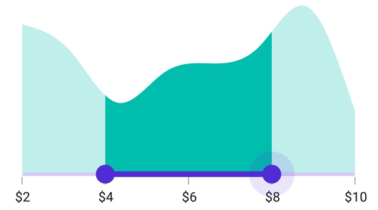
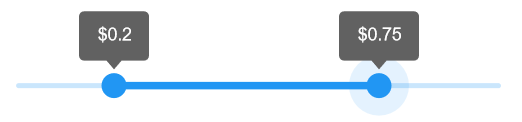

# Events and Commands in .NET MAUI Range Selector (SfRangeSelector)

This section explains how to add the events and commands for Range Selector.

## Events

### Handle callbacks

* [ValueChangeStart](https://help.syncfusion.com/cr/maui/Syncfusion.Maui.Sliders.RangeView-1.html#Syncfusion_Maui_Sliders_RangeView_1_ValueChangeStart) -  Called when the user selecting a new value for the selector by tap/mouse down in the thumb.
* [ValueChanging](https://help.syncfusion.com/cr/maui/Syncfusion.Maui.Sliders.SfRangeSelector.html#Syncfusion_Maui_Sliders_SfRangeSelector_ValueChanging) - Called when the user is selecting a new value for the selector by dragging the thumb.
* [ValueChanged](https://help.syncfusion.com/cr/maui/Syncfusion.Maui.Sliders.SfRangeSelector.html#Syncfusion_Maui_Sliders_SfRangeSelector_ValueChanged) - Called when the user completed selecting a new value.
* [ValueChangeEnd](https://help.syncfusion.com/cr/maui/Syncfusion.Maui.Sliders.RangeView-1.html#Syncfusion_Maui_Sliders_RangeView_1_ValueChangeEnd) - Called when the user stopped interacting with selector by tap/mouse up the thumb.





<ContentPage 
             ...
             xmlns:sliders="clr-namespace:Syncfusion.Maui.Sliders;assembly=Syncfusion.Maui.Sliders"
             xmlns:charts="clr-namespace:Syncfusion.Maui.Charts;assembly=Syncfusion.Maui.Charts">

    <sliders:SfRangeSelector ValueChangeStart="OnValueChangeStart"
                             ValueChanging="OnValueChanging"
                             ValueChanged="OnValueChanged"
                             ValueChangeEnd="OnValueChangeEnd">

        <charts:SfCartesianChart>
            ...
        </charts:SfCartesianChart>

    </sliders:SfRangeSelector>
</ContentPage>





{
    SfCartesianChart chart = new SfCartesianChart();
    SfRangeSelector rangeSelector = new SfRangeSelector()
    {
        Content = chart,
    };
    rangeSelector.ValueChangeStart += OnValueChangeStart;
    rangeSelector.ValueChanging += OnValueChanging;
    rangeSelector.ValueChanged += OnValueChanged;
    rangeSelector.ValueChangeEnd += OnValueChangeEnd;
}

private void OnValueChangeStart(object sender, EventArgs e)
{
}

private void OnValueChanging(object sender, RangeSelectorValueChangingEventArgs e)
{
}

private void OnValueChanged(object sender, RangeSelectorValueChangedEventArgs e)
{
}

private void OnValueChangeEnd(object sender, EventArgs e)
{
}





### Customize label text

Format or change the whole numeric label text using the [`LabelCreated`](https://help.syncfusion.com/cr/maui/Syncfusion.Maui.Sliders.RangeView-1.html#Syncfusion_Maui_Sliders_RangeView_1_LabelCreated) event. The [`SliderLabelCreatedEventArgs`](https://help.syncfusion.com/cr/maui/Syncfusion.Maui.Sliders.SliderLabelCreatedEventArgs.html) contains the following parameters,

* Text – Customize the text color using the [`Text`](https://help.syncfusion.com/cr/maui/Syncfusion.Maui.Sliders.SliderLabelCreatedEventArgs.html#Syncfusion_Maui_Sliders_SliderLabelCreatedEventArgs_Text) parameter.
* Style – Formats the text color, font size, font family, offset using the [`Style`](https://help.syncfusion.com/cr/maui/Syncfusion.Maui.Sliders.SliderLabelCreatedEventArgs.html#Syncfusion_Maui_Sliders_SliderLabelCreatedEventArgs_Style) parameter.





<ContentPage 
             ...
             xmlns:sliders="clr-namespace:Syncfusion.Maui.Sliders;assembly=Syncfusion.Maui.Sliders"
             xmlns:charts="clr-namespace:Syncfusion.Maui.Charts;assembly=Syncfusion.Maui.Charts">

      <sliders:SfRangeSelector Minimum="2" 
                               Maximum="10" 
                               RangeStart="4" 
                               RangeEnd="8"
                               Interval="2"
                               ShowLabels="True"
                               ShowTicks="True" 
                               LabelCreated="OnLabelCreated">

         <charts:SfCartesianChart>
            ...
         </charts:SfCartesianChart>

      </sliders:SfRangeSelector>
</ContentPage>





{
    SfCartesianChart chart = new SfCartesianChart();
    SfRangeSelector rangeSelector = new SfRangeSelector()
    {

        Minimum = 2,
        Maximum = 10,
        RangeStart = 4,
        RangeEnd = 8,
        Interval = 2,
        ShowLabels = true,
        ShowTicks = true,
        Content = chart,
    };
    rangeSelector.LabelCreated += OnLabelCreated;
}

private void OnLabelCreated(object sender, SliderLabelCreatedEventArgs e)
{
	e.Text = "$" + e.Text;
}





### Tooltip text format

By default, it is formatted based on the [`SliderTooltip.NumberFormat`](https://help.syncfusion.com/cr/maui/Syncfusion.Maui.Sliders.SliderTooltip.html#Syncfusion_Maui_Sliders_SliderTooltip_NumberFormat)  property.

Format or change the whole tooltip label text using the [`ToolTipLabelCreated`](https://help.syncfusion.com/cr/maui/Syncfusion.Maui.Sliders.SliderTooltip.html#Syncfusion_Maui_Sliders_SliderTooltip_TooltipLabelCreated) event. The [`SliderTooltipLabelCreatedEventArgs`](https://help.syncfusion.com/cr/maui/Syncfusion.Maui.Sliders.SliderTooltipLabelCreatedEventArgs.html) contains the following parameters,

* Text – Change the tooltip text using the [`Text`](https://help.syncfusion.com/cr/maui/Syncfusion.Maui.Sliders.SliderTooltipLabelCreatedEventArgs.html#Syncfusion_Maui_Sliders_SliderTooltipLabelCreatedEventArgs_Text) property.
* Color – Change the color of the tooltip text using the [`TextColor`](https://help.syncfusion.com/cr/maui/Syncfusion.Maui.Sliders.SliderTooltipLabelCreatedEventArgs.html#Syncfusion_Maui_Sliders_SliderTooltipLabelCreatedEventArgs_TextColor) property.
* Font Size – Change the font size of the tooltip text using the [`FontSize`](https://help.syncfusion.com/cr/maui/Syncfusion.Maui.Sliders.SliderTooltipLabelCreatedEventArgs.html#Syncfusion_Maui_Sliders_SliderTooltipLabelCreatedEventArgs_FontSize) property.
* Font Family – Change the font family of the tooltip text using the [`FontFamily`](https://help.syncfusion.com/cr/maui/Syncfusion.Maui.Sliders.SliderTooltipLabelCreatedEventArgs.html#Syncfusion_Maui_Sliders_SliderTooltipLabelCreatedEventArgs_FontFamily) property.
* Font Attributes – Change the font attributes of the tooltip text using the [`FontAttributes`](https://help.syncfusion.com/cr/maui/Syncfusion.Maui.Sliders.SliderTooltipLabelCreatedEventArgs.html#Syncfusion_Maui_Sliders_SliderTooltipLabelCreatedEventArgs_FontAttributes) property.





<ContentPage 
             ...
             xmlns:sliders="clr-namespace:Syncfusion.Maui.Sliders;assembly=Syncfusion.Maui.Sliders"
             xmlns:charts="clr-namespace:Syncfusion.Maui.Charts;assembly=Syncfusion.Maui.Charts">

    <sliders:SfRangeSelector Minimum="2"
                             Maximum="10"
                             RangeStart="4"
                             RangeEnd="8"
                             Interval="2">

        <sliders:SfRangeSelector.Tooltip>
            <sliders:SliderTooltip TooltipLabelCreated="OnTooltipLabelCreated" />
        </sliders:SfRangeSelector.Tooltip>

        <charts:SfCartesianChart>
            ...
        </charts:SfCartesianChart>

    </sliders:SfRangeSelector>
</ContentPage>





{
    SfCartesianChart chart = new SfCartesianChart();
    SfRangeSelector rangeSelector = new SfRangeSelector()
    {
        Minimum = 2,
        Maximum = 10,
        RangeStart = 4,
        RangeEnd = 8,
        Interval = 2,
        Tooltip = new SliderTooltip(),
        Content = chart,
    };
    rangeSelector.Tooltip.TooltipLabelCreated += OnTooltipLabelCreated;
}

 private void OnTooltipLabelCreated(object sender, SliderTooltipLabelCreatedEventArgs e)
 {
     e.Text = "$" + e.Text;
 }





## Commands and their parameter

### Drag started command

The [`DragStartedCommand`](https://help.syncfusion.com/cr/maui/Syncfusion.Maui.Sliders.RangeView-1.html#Syncfusion_Maui_Sliders_RangeView_1_DragStartedCommand) will be executed when the user starts moving the thumb.





<ContentPage 
             ...
             xmlns:sliders="clr-namespace:Syncfusion.Maui.Sliders;assembly=Syncfusion.Maui.Sliders"
             xmlns:charts="clr-namespace:Syncfusion.Maui.Charts;assembly=Syncfusion.Maui.Charts">
    
    <ContentPage.BindingContext>
        <local:ViewModel x:Name="viewModel" />
    </ContentPage.BindingContext>

    <sliders:SfRangeSelector DragStartedCommand="{Binding DragStartedCommand}">

        <charts:SfCartesianChart>
            ...
        </charts:SfCartesianChart>

    </sliders:SfRangeSelector>
</ContentPage>





SfCartesianChart chart = new SfCartesianChart();
SfRangeSelector rangeSelector = new SfRangeSelector()
{
    DragStartedCommand = viewModel.DragStartedCommand,
    Content = chart
};

public class ViewModel
{
    public ICommand DragStartedCommand { get; }

    public ViewModel()
    {
        DragStartedCommand = new Command(OnDragStarted);
    }

    private void OnDragStarted(object obj)
    {
    }
}





### Drag started command parameter

The [`DragStartedCommandParameter`](https://help.syncfusion.com/cr/maui/Syncfusion.Maui.Sliders.RangeView-1.html#Syncfusion_Maui_Sliders_RangeView_1_DragStartedCommandParameter) will be executed when the user starts moving the thumb.





<ContentPage 
             ...
             xmlns:sliders="clr-namespace:Syncfusion.Maui.Sliders;assembly=Syncfusion.Maui.Sliders"
             xmlns:charts="clr-namespace:Syncfusion.Maui.Charts;assembly=Syncfusion.Maui.Charts">

    <ContentPage.BindingContext>
        <local:ViewModel x:Name="viewModel" />
    </ContentPage.BindingContext>

    <sliders:SfRangeSelector DragStartedCommand="{Binding DragStartedCommand}"
                             DragStartedCommandParameter="1">

        <charts:SfCartesianChart>
            ...
        </charts:SfCartesianChart>

    </sliders:SfRangeSelector>
</ContentPage>





SfCartesianChart chart = new SfCartesianChart();
SfRangeSelector rangeSelector = new SfRangeSelector()
{
    DragStartedCommand = viewModel.DragStartedCommand,
    DragStartedCommandParameter = "1",
    Content = chart
};

public class ViewModel
{
    public ICommand DragStartedCommand { get; }

    public ViewModel()
    {
        DragStartedCommand = new Command(OnDragStarted);
    }

    private void OnDragStarted(object obj)
    {
    }
}





### Drag completed command

The [`DragCompletedCommand`](https://help.syncfusion.com/cr/maui/Syncfusion.Maui.Sliders.RangeView-1.html#Syncfusion_Maui_Sliders_RangeView_1_DragCompletedCommand) will be executed when the user completes moving the thumb.





<ContentPage 
             ...
             xmlns:sliders="clr-namespace:Syncfusion.Maui.Sliders;assembly=Syncfusion.Maui.Sliders"
             xmlns:charts="clr-namespace:Syncfusion.Maui.Charts;assembly=Syncfusion.Maui.Charts">

    <ContentPage.BindingContext>
        <local:ViewModel x:Name="viewModel" />
    </ContentPage.BindingContext>

    <sliders:SfRangeSelector DragCompletedCommand="{Binding DragCompletedCommand}">

        <charts:SfCartesianChart>
            ...
        </charts:SfCartesianChart>

    </sliders:SfRangeSelector>
</ContentPage>





SfCartesianChart chart = new SfCartesianChart();
SfRangeSelector rangeSelector = new SfRangeSelector()
{
    DragStartedCommand = viewModel.DragStartedCommand,
    Content = chart
};

public class ViewModel
{
    public ICommand DragCompletedCommand { get; }

    public ViewModel()
    {
        DragCompletedCommand = new Command(OnDragCompleted);
    }

    private void OnDragCompleted(object obj)
    {
    }
}





### Drag completed command parameter

The [`DragCompletedCommandParameter`](https://help.syncfusion.com/cr/maui/Syncfusion.Maui.Sliders.RangeView-1.html#Syncfusion_Maui_Sliders_RangeView_1_DragCompletedCommandParameter) will be executed when the user completes moving the thumb.





<ContentPage 
             ...
             xmlns:sliders="clr-namespace:Syncfusion.Maui.Sliders;assembly=Syncfusion.Maui.Sliders"
             xmlns:charts="clr-namespace:Syncfusion.Maui.Charts;assembly=Syncfusion.Maui.Charts">

    <ContentPage.BindingContext>
        <local:ViewModel x:Name="viewModel" />
    </ContentPage.BindingContext>

    <sliders:SfRangeSelector DragCompletedCommand="{Binding DragCompletedCommand}"
                             DragCompletedCommandParameter="1">

        <charts:SfCartesianChart>
            ...
        </charts:SfCartesianChart>

    </sliders:SfRangeSelector>
</ContentPage>





SfCartesianChart chart = new SfCartesianChart();
SfRangeSelector rangeSelector = new SfRangeSelector()
{
    DragStartedCommand = viewModel.DragStartedCommand,
    DragCompletedCommandParameter = "1",
    Content = chart
};

public class ViewModel
{
    public ICommand DragCompletedCommand { get; }

    public ViewModel()
    {
        DragCompletedCommand = new Command(OnDragCompleted);
    }

    private void OnDragCompleted(object obj)
    {
    }
}



