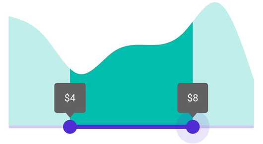

# Events in .NET MAUI Range Selector (SfRangeSelector)

This section explains about how to add the events for Range Selector.

## Handle callbacks

* [ValueChangeStart](https://help.syncfusion.com/cr/maui/Syncfusion.Maui.Sliders.SfRangeSlider.html#Syncfusion_Maui_Sliders_SfRangeSlider_ValueChangeStart) -  Called when the user selecting a new value for the selector by tap/mouse down in the thumb.
* [ValueChanging](https://help.syncfusion.com/cr/maui/Syncfusion.Maui.Sliders.SfRangeSlider.html#Syncfusion_Maui_Sliders_SfRangeSlider_ValueChanging) - Called when the user is selecting a new value for the selector by dragging the thumb.
* [ValueChanged](https://help.syncfusion.com/cr/maui/Syncfusion.Maui.Sliders.SfRangeSlider.html#Syncfusion_Maui_Sliders_SfRangeSlider_ValueChanged) - Called when the user completed selecting a new value.
* [ValueChangeEnd](https://help.syncfusion.com/cr/maui/Syncfusion.Maui.Sliders.SfRangeSlider.html#Syncfusion_Maui_Sliders_SfRangeSlider_ValueChangeEnd) - Called when the user stopped interacting with selector by tap/mouse up the thumb.





<ContentPage 
             ...
             xmlns:sliders="clr-namespace:Syncfusion.Maui.Sliders;assembly=Syncfusion.Maui.Sliders"
             xmlns:charts="clr-namespace:Syncfusion.Maui.Charts;assembly=Syncfusion.Maui.Charts">
   
   <sliders:SfDateTimeRangeSelector Minimum="2010-01-01" 
                                    Maximum="2020-01-01" 
                                    RangeStart="2012-01-01" 
                                    RangeEnd="2018-01-01" 
                                    ValueChangeStart="OnValueChangeStart" 
                                    ValueChanging="OnValueChanging" 
                                    ValueChanged="OnValueChanged" 
                                    ValueChangeEnd="OnValueChangeEnd">
      
      <charts:SfCartesianChart>
            ...
      </charts:SfCartesianChart>
   
   </sliders:SfRangeSelector>
</ContentPage>





{
   SfRangeSelector rangeSelector = new SfRangeSelector();
   rangeSelector.ValueChangeStart += OnValueChanged;
   rangeSelector.ValueChanging += OnValueChanged;
   rangeSelector.ValueChanged += OnValueChanged;
   rangeSelector.ValueChangeEnd += OnValueChanged;
   SfCartesianChart chart = new SfCartesianChart();
   rangeSelector.Content = chart;
}

private void OnValueChangeStart(object sender, EventArgs e)
{
}

private void OnValueChanging(object sender, DateTimeRangeSelectorValueChangingEventArgs e)
{
}

private void OnValueChanged(object sender, DateTimeRangeSelectorValueChangedEventArgs e)
{
}

private void OnValueChangeEnd(object sender, EventArgs e)
{
}





## Customize label text

You can format or change the whole numeric or date label text using the [`LabelCreated`](https://help.syncfusion.com/cr/maui/Syncfusion.Maui.Sliders.SliderBase.html#Syncfusion_Maui_Sliders_SliderBase_LabelCreated) event. The [`SliderLabelCreatedEventArgs`](https://help.syncfusion.com/cr/maui/Syncfusion.Maui.Sliders.SliderLabelCreatedEventArgs.html) contains the following parameters,

* Text – Customize the text color using the [`Text`](https://help.syncfusion.com/cr/maui/Syncfusion.Maui.Sliders.SliderLabelCreatedEventArgs.html#Syncfusion_Maui_Sliders_SliderLabelCreatedEventArgs_Style) parameter.
* Style – Formats the text color, font size, font family, offset using the [`Style`](https://help.syncfusion.com/cr/maui/Syncfusion.Maui.Sliders.SliderLabelCreatedEventArgs.html#Syncfusion_Maui_Sliders_SliderLabelCreatedEventArgs_Style) parameter.





<ContentPage 
             ...
             xmlns:sliders="clr-namespace:Syncfusion.Maui.Sliders;assembly=Syncfusion.Maui.Sliders"
             xmlns:charts="clr-namespace:Syncfusion.Maui.Charts;assembly=Syncfusion.Maui.Charts">

      <sliders:SfRangeSelector Minimum="2" 
                               Maximum="10" 
                               RangeStart="4" 
                               RangeEnd="8"
                               Interval="2"
                               ShowLabels="True"
                               ShowTicks="True" 
                               LabelCreated="OnLabelCreated">

         <charts:SfCartesianChart>
            ...
         </charts:SfCartesianChart>

      </sliders:SfRangeSelector>
</ContentPage>





{
   SfRangeSelector rangeSelector = new SfRangeSelector();
   rangeSelector.Minimum = 2;
   rangeSelector.Maximum = 10;
   rangeSelector.RangeStart = 4;
   rangeSelector.RangeEnd = 8;
   rangeSelector.Interval = 2;
   rangeSelector.ShowLabels = true;
   rangeSelector.ShowTicks = true;
   rangeSelector.LabelCreated += OnLabelCreated;
   SfCartesianChart chart = new SfCartesianChart();
   rangeSelector.Content = chart;
}
private void OnLabelCreated(object sender, SliderLabelCreatedEventArgs e)
{
	e.Text = "$" + e.Text;
}





## Tooltip text format

By default it is formatted based on [`NumberFormat`](https://help.syncfusion.com/cr/maui/Syncfusion.Maui.Sliders.SliderBase.html#Syncfusion_Maui_Sliders_SliderBase_NumberFormat)  property and [`DateFormat`](https://help.syncfusion.com/cr/maui/Syncfusion.Maui.Sliders.SliderBase.html#Syncfusion_Maui_Sliders_SliderBase_DateFormat) property based on whether it is date type [`SfDateTimeRangeSelector`](https://help.syncfusion.com/cr/maui/Syncfusion.Maui.Sliders.SfDateTimeRangeSelector.html) or numeric [`SfRangeSelector`](https://help.syncfusion.com/cr/maui/Syncfusion.Maui.Sliders.SfRangeSelector.html).

You can format or change the whole tooltip label text using the [`ToolTipLabelCreated`](https://help.syncfusion.com/cr/maui/Syncfusion.Maui.Sliders.SliderBase.html#Syncfusion_Maui_Sliders_SliderBase_ToolTipLabelCreated) event. The [`SliderLabelCreatedEventArgs`](https://help.syncfusion.com/cr/maui/Syncfusion.Maui.Sliders.SliderLabelCreatedEventArgs.html) contains the following parameters,

* Text – Change the format of the tooltip text using the [`Text`](https://help.syncfusion.com/cr/maui/Syncfusion.Maui.Sliders.SliderLabelCreatedEventArgs.html#Syncfusion_Maui_Sliders_SliderLabelCreatedEventArgs_Text) property.
* Style – Change the appearance of the tooltip text like color, stroke color, and padding using the [`Style`](https://help.syncfusion.com/cr/maui/Syncfusion.Maui.Sliders.SliderLabelCreatedEventArgs.html#Syncfusion_Maui_Sliders_SliderLabelCreatedEventArgs_Style) property.





<ContentPage 
             ...
             xmlns:sliders="clr-namespace:Syncfusion.Maui.Sliders;assembly=Syncfusion.Maui.Sliders"
             xmlns:charts="clr-namespace:Syncfusion.Maui.Charts;assembly=Syncfusion.Maui.Charts">
   
   <sliders:SfRangeSelector>
      
      <sliders:SfRangeSelector.Tooltip>
         <sliders:SliderTooltip TooltipLabelCreated="OnTooltipLabelCreated" />
      </sliders:SfRangeSelector.Tooltip>
      
      <charts:SfCartesianChart>
            ...
      </charts:SfCartesianChart>
   
   </sliders:SfRangeSelector>
</ContentPage>





{
    SfRangeSelector rangeSelector = new SfRangeSelector();
    rangeSelector.Tooltip.TooltipLabelCreated += OnTooltipLabelCreated;
    SfCartesianChart chart = new SfCartesianChart();
    rangeSelector.Content = chart;
 }
 private void OnTooltipLabelCreated(object sender, SliderTooltipLabelCreatedEventArgs e)
 {
     e.Text = "$" + e.Text;
 }





