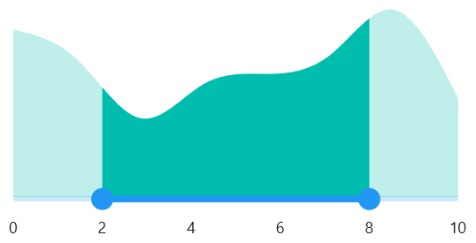
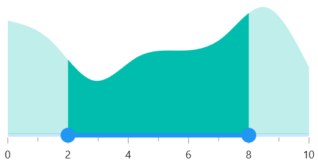
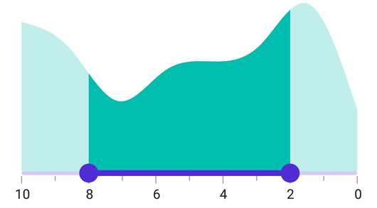
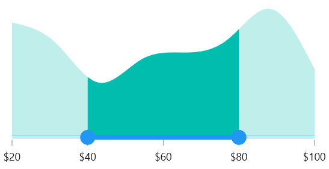

# Getting Started with .NET MAUI Range Selector
This section guides you through setting up and configuring a [Range Selector](https://help.syncfusion.com/cr/maui/Syncfusion.Maui.Sliders.SfRangeSelector.html) in your .NET MAUI application. Follow the steps below to add a basic Range Selector to your project.

To get start quickly with .NET MAUI Range Selector, you can check the below video.



## Prerequisites

Before proceeding, ensure the following are in place:

Install [.NET 7 SDK](https://dotnet.microsoft.com/en-us/download/dotnet/7.0) or later.

Set up a .NET MAUI environment with Visual Studio 2022 (v17.3 or later) or VS Code. For VS Code users, ensure that the .NET MAUI workload is installed and configured as described [here](https://github.com/dotnet/maui/wiki/VS-Code-setup).

## Step 1: Create a New MAUI Project

### Visual Studio
1. Go to **File > New > Project** and choose the **.NET MAUI App** template.
2. Name the project and choose a location, then click **Next**.
3. Select the .NET framework version and click **Create**.

### Visual Studio Code
1. Open the command palette by pressing `Ctrl+Shift+P`` and type **.NET:New Project** and enter.
2. Choose the **.NET MAUI App** template.
3. Select the project location, type the project name and press enter.
Then choose **Create project**

## Step 2: Install the Syncfusion MAUI Sliders NuGet Package

1. In **Solution Explorer**, right-click the project and choose **Manage NuGet Packages**.
2. Search for [Syncfusion.Maui.Sliders](https://www.nuget.org/packages/Syncfusion.Maui.Sliders) and install the latest version.
3. Ensure the necessary dependencies are installed correctly, and the project is restored.

## Step 3: Register the Handler

[Syncfusion.Maui.Core](https://www.nuget.org/packages/Syncfusion.Maui.Core) nuget is a dependent package for all Syncfusion controls of .NET MAUI. In the **MauiProgram.cs file**, register the handler for Syncfusion core.



using Microsoft.Maui;
using Microsoft.Maui.Hosting;
using Microsoft.Maui.Controls.Compatibility;
using Microsoft.Maui.Controls.Hosting;
using Microsoft.Maui.Controls.Xaml;
using Syncfusion.Maui.Core.Hosting;

namespace RangeSelector
{
    public static class MauiProgram
    {
        public static MauiApp CreateMauiApp()
        {
            var builder = MauiApp.CreateBuilder();
            builder
            .UseMauiApp<App>()
            .ConfigureSyncfusionCore()
            .ConfigureFonts(fonts =>
            {
                fonts.AddFont("OpenSans-Regular.ttf", "OpenSansRegular");
            });

            return builder.Build();
        }
    }
}



## Step 4: Add a Basic Range Selector

Import the [SfRangeSelector](https://help.syncfusion.com/cr/maui/Syncfusion.Maui.Sliders.SfRangeSelector.html) namespace and initialize the Range Selector as shown below.





<ContentPage
    . . .
    xmlns:sliders="clr-namespace:Syncfusion.Maui.Sliders;assembly=Syncfusion.Maui.Sliders">
    <sliders:SfRangeSelector />
</ContentPage>





using Syncfusion.Maui.Sliders;

namespace GettingStarted
{
    public partial class MainPage : ContentPage
    {
        public MainPage()
        {
            InitializeComponent();
            SfRangeSelector rangeSelector = new SfRangeSelector();
            content = rangeSelector;
        }
    }
}





## Adding content to Range Selector

The [Content](https://help.syncfusion.com/cr/maui/Syncfusion.Maui.Sliders.RangeSelectorBase-1.html#Syncfusion_Maui_Sliders_RangeSelectorBase_1_Content) property will add the content to the Range Selector. Add any control within the Range Selector with this property. In most cases, the [Charts](https://www.syncfusion.com/maui-controls/maui-cartesian-charts) will be added as a content.





<ContentPage 
             ...
             xmlns:sliders="clr-namespace:Syncfusion.Maui.Sliders;assembly=Syncfusion.Maui.Sliders"
             xmlns:charts="clr-namespace:Syncfusion.Maui.Charts;assembly=Syncfusion.Maui.Charts"
             xmlns:local="clr-namespace:SliderTestbedSample.RangeSelector">
    
    <ContentPage.BindingContext>
        <local:ViewModel />
    </ContentPage.BindingContext>

    <sliders:SfRangeSelector Minimum="10"
                             Maximum="20"
                             RangeStart="13"
                             RangeEnd="17">
        <charts:SfCartesianChart>

            <charts:SfCartesianChart.XAxes>
                <charts:DateTimeAxis IsVisible="False"
                                    ShowMajorGridLines="False" />
            </charts:SfCartesianChart.XAxes>

            <charts:SfCartesianChart.YAxes>
                <charts:NumericalAxis IsVisible="False"
                                     ShowMajorGridLines="False" />
            </charts:SfCartesianChart.YAxes>

            <charts:SfCartesianChart.Series>
                <charts:SplineAreaSeries ItemsSource="{Binding Source}"
                                        XBindingPath="X"
                                        YBindingPath="Y">
                </charts:SplineAreaSeries>

            </charts:SfCartesianChart.Series>
        
        </charts:SfCartesianChart>
    
    </sliders:SfRangeSelector>
</ContentPage>





SfRangeSelector rangeSelector = new SfRangeSelector();
rangeSelector.Minimum = 10;
rangeSelector.Maximum = 20;
rangeSelector.RangeStart = 13;
rangeSelector.RangeEnd = 17;
SfCartesianChart chart = new SfCartesianChart();
DateTimeAxis primaryAxis = new DateTimeAxis();
chart.XAxes = primaryAxis;
NumericalAxis secondaryAxis = new NumericalAxis();
chart.YAxes = secondaryAxis;
SplineAreaSeries series = new SplineAreaSeries();
series.ItemsSource = (new ViewModel()).Source;
series.XBindingPath = "X";
series.YBindingPath = "Y";
rangeSelector.Content = chart;





## Enable labels

The [ShowLabels](https://help.syncfusion.com/cr/maui/Syncfusion.Maui.Sliders.RangeView-1.html#Syncfusion_Maui_Sliders_RangeView_1_ShowLabels) property enables the labels which renders on given interval.





<ContentPage 
             ...
             xmlns:sliders="clr-namespace:Syncfusion.Maui.Sliders;assembly=Syncfusion.Maui.Sliders"
             xmlns:charts="clr-namespace:Syncfusion.Maui.Charts;assembly=Syncfusion.Maui.Charts">

    <sliders:SfRangeSelector Minimum="0" 
                             Maximum="10" 
                             RangeStart="2" 
                             RangeEnd="8"
                             Interval="2" 
                             ShowLabels="True">

        <charts:SfCartesianChart>
            ...
        </charts:SfCartesianChart>

    </sliders:SfRangeSelector>
</ContentPage>





SfRangeSelector rangeSelector = new SfRangeSelector();
rangeSelector.Minimum = 0;
rangeSelector.Maximum = 10;
rangeSelector.RangeStart = 2;
rangeSelector.RangeEnd = 8;
rangeSelector.Interval = 2;
rangeSelector.ShowLabels = true;
SfCartesianChart chart = new SfCartesianChart();
rangeSelector.Content = chart;





## Enable ticks

The [ShowTicks](https://help.syncfusion.com/cr/maui/Syncfusion.Maui.Sliders.RangeView-1.html#Syncfusion_Maui_Sliders_RangeView_1_ShowTicks) property enables the ticks in the Range Selector, while the [MinorTicksPerInterval](https://help.syncfusion.com/cr/maui/Syncfusion.Maui.Sliders.RangeView-1.html#Syncfusion_Maui_Sliders_RangeView_1_MinorTicksPerInterval) property enables the minor ticks between the major ticks.





<ContentPage 
             ...
             xmlns:sliders="clr-namespace:Syncfusion.Maui.Sliders;assembly=Syncfusion.Maui.Sliders"
             xmlns:charts="clr-namespace:Syncfusion.Maui.Charts;assembly=Syncfusion.Maui.Charts">
    
    <sliders:SfRangeSelector Minimum="0" 
                             Maximum="10" 
                             RangeStart="2" 
                             RangeEnd="8"                       
                             Interval="2" 
                             ShowLabels="True"
                             ShowTicks="True" 
                             MinorTicksPerInterval="1">
        
        <charts:SfCartesianChart>
            ...
        </charts:SfCartesianChart>
    
    </sliders:SfRangeSelector>
</ContentPage>





SfRangeSelector rangeSelector = new SfRangeSelector();
rangeSelector.Minimum = 0;
rangeSelector.Maximum = 10;
rangeSelector.RangeStart = 2;
rangeSelector.RangeEnd = 8;
rangeSelector.Interval = 2;
rangeSelector.ShowLabels = true;
rangeSelector.ShowTicks = true;
rangeSelector.MinorTicksPerInterval = 1;
SfCartesianChart chart = new SfCartesianChart();
rangeSelector.Content = chart;





## Inverse the Range Selector

Invert the Range Selector using the [IsInversed](https://help.syncfusion.com/cr/maui/Syncfusion.Maui.Sliders.RangeView-1.html#Syncfusion_Maui_Sliders_RangeView_1_IsInversed) property. The default value of the [IsInversed](https://help.syncfusion.com/cr/maui/Syncfusion.Maui.Sliders.RangeView-1.html#Syncfusion_Maui_Sliders_RangeView_1_IsInversed) property is `False`.





<ContentPage 
             ...
             xmlns:sliders="clr-namespace:Syncfusion.Maui.Sliders;assembly=Syncfusion.Maui.Sliders"
             xmlns:charts="clr-namespace:Syncfusion.Maui.Charts;assembly=Syncfusion.Maui.Charts">

    <sliders:SfRangeSelector Minimum="0" 
                             Maximum="10" 
                             RangeStart="2" 
                             RangeEnd="8"
                             Interval="2"
                             ShowLabels="True"
                             ShowTicks="True" 
                             MinorTicksPerInterval="1" 
                             IsInversed="True">

        <charts:SfCartesianChart>
            ...
        </charts:SfCartesianChart>

    </sliders:SfRangeSelector>
</ContentPage>





SfRangeSelector rangeSelector = new SfRangeSelector();
rangeSelector.Minimum = 0;
rangeSelector.Maximum = 10;
rangeSelector.RangeStart = 2;
rangeSelector.RangeEnd = 8;
rangeSelector.Interval = 2;
rangeSelector.ShowLabels = true;
rangeSelector.ShowTicks = true;
rangeSelector.MinorTicksPerInterval = 1;
rangeSelector.IsInversed = true;
SfCartesianChart chart = new SfCartesianChart();
rangeSelector.Content = chart;





## Formatting labels

Add prefix or suffix to the labels using the [NumberFormat](https://help.syncfusion.com/cr/maui/Syncfusion.Maui.Sliders.INumericElement.html#Syncfusion_Maui_Sliders_INumericElement_NumberFormat) property.





<ContentPage 
             ...
             xmlns:sliders="clr-namespace:Syncfusion.Maui.Sliders;assembly=Syncfusion.Maui.Sliders"
             xmlns:charts="clr-namespace:Syncfusion.Maui.Charts;assembly=Syncfusion.Maui.Charts">
    
    <sliders:SfRangeSelector Minimum="20" 
                             Maximum="100" 
                             RangeStart="40" 
                             RangeEnd="80"
                             Interval="20"
                             ShowLabels="True"
                             NumberFormat="$#" 
                             ShowTicks="True">
        
        <charts:SfCartesianChart>
            ...
        </charts:SfCartesianChart>
    
    </sliders:SfRangeSelector>
</ContentPage> 





SfRangeSelector rangeSelector = new SfRangeSelector();
rangeSelector.Minimum = 20;
rangeSelector.Maximum = 100;
rangeSelector.RangeStart = 40;
rangeSelector.RangeEnd = 80;
rangeSelector.ShowLabels = true;
rangeSelector.ShowTicks = true;
rangeSelector.Interval = 20;
rangeSelector.NumberFormat = "$#";
SfCartesianChart chart = new SfCartesianChart();
rangeSelector.Content = chart;





N> You can refer to our [.NET MAUI Range Selector](https://www.syncfusion.com/maui-controls/maui-range-selector) feature tour page for its groundbreaking feature representations. You can also explore our [.NET MAUI Range Selector Example](https://github.com/syncfusion/maui-demos/tree/master/MAUI/Sliders/SampleBrowser.Maui.Sliders/Samples/RangeSelector) that shows you how to render the Range Selector in .NET MAUI.