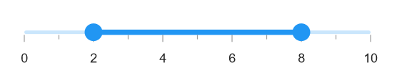

# Getting Started with .NET MAUI Range Selector

This section guides you through setting up and configuring a [Range Selector](https://help.syncfusion.com/cr/maui/Syncfusion.Maui.Sliders.SfRangeSelector.html) in your .NET MAUI application. Follow the steps below to add a basic Range Selector to your project.

To quickly get started with the .NET MAUI Range Selector, watch this video.






## Prerequisites
Before proceeding, ensure the following are set up:

1. Install [.NET 9 SDK](https://dotnet.microsoft.com/en-us/download/dotnet/9.0) or later.
2. Set up a .NET MAUI environment with Visual Studio 2022 v17.12 or later.

## Step 1: Create a new .NET MAUI project

1. Go to **File > New > Project** and choose the **.NET MAUI App** template.
2. Name the project and choose a location. Then, click **Next**.
3. Select the .NET framework version and click **Create**.

## Step 2: Install the Syncfusion® MAUI Sliders NuGet package

1. In **Solution Explorer**, right-click the project and choose **Manage NuGet Packages**.
2. Search for [Syncfusion.Maui.Sliders](https://www.nuget.org/packages/Syncfusion.Maui.Sliders) and install the latest version.
3. Ensure the necessary dependencies are installed correctly, and the project is restored.




## Prerequisites

Before proceeding, ensure the following are set up:

1. Install [.NET 9 SDK](https://dotnet.microsoft.com/en-us/download/dotnet/9.0) or later.
2. Set up a .NET MAUI environment with Visual Studio Code.
3. Ensure that the .NET MAUI workloads are installed and configured as described [here](https://learn.microsoft.com/en-us/dotnet/maui/get-started/installation?view=net-maui-9.0&tabs=visual-studio-code).

## Step 1: Create a new .NET MAUI project

1. Open the Command Palette by pressing **Ctrl+Shift+P** and type **.NET:New Project** and press Enter.
2. Choose the **.NET MAUI App** template.
3. Select the project location, type the project name and press Enter.
4. Then choose **Create project**

## Step 2: Install the Syncfusion® MAUI Sliders NuGet package

1. Press <kbd>Ctrl</kbd> + <kbd>`</kbd> (backtick) to open the integrated terminal in Visual Studio Code.
2. Ensure you're in the project root directory where your .csproj file is located.
3. Run the command `dotnet add package Syncfusion.Maui.Sliders` to install the Syncfusion® .NET MAUI Sliders package.
4. To ensure all dependencies are installed, run `dotnet restore`.




## Prerequisites

Before proceeding, ensure the following are set up:

1. Install [.NET 9 SDK](https://dotnet.microsoft.com/en-us/download/dotnet/9.0) or later.
2. Set up a .NET MAUI environment with JetBrains Rider 2024.3 or later.
3. Make sure the MAUI workloads are installed and configured as described [here.](https://www.jetbrains.com/help/rider/MAUI.html#before-you-start)

## Step 1: Create a new .NET MAUI project

1. Go to **File > New Solution,** Select .NET (C#) and choose the .NET MAUI App template.
2. Enter the Project Name, Solution Name, and Location.
3. Select the .NET framework version and click Create.

## Step 2: Install the Syncfusion® MAUI Sliders NuGet package

1. In **Solution Explorer,** right-click the project and choose **Manage NuGet Packages.**
2. Search for [Syncfusion.Maui.Sliders](https://www.nuget.org/packages/Syncfusion.Maui.Sliders/) and install the latest version.
3. Ensure the necessary dependencies are installed correctly, and the project is restored. If not, Open the Terminal in Rider and manually run: `dotnet restore`




## Step 3: Register Syncfusion handler

Make sure to add the namespace.



using Syncfusion.Maui.Core.Hosting;



Register the Syncfusion core handler in your `CreateMauiApp` method of `MauiProgram.cs` file to use Syncfusion controls.



builder.ConfigureSyncfusionCore();
 


## Step 4: Import Range Selector namespace

Add the following namespace in your XAML or C#.




xmlns:sliders="clr-namespace:Syncfusion.Maui.Sliders;assembly=Syncfusion.Maui.Sliders"




using Syncfusion.Maui.Sliders;




## Step 5: Add the Range Selector component

The [Content](https://help.syncfusion.com/cr/maui/Syncfusion.Maui.Sliders.RangeSelectorBase-1.html#Syncfusion_Maui_Sliders_RangeSelectorBase_1_Content) property will add the content to the Range Selector. Add any control within the Range Selector with this property. In most cases, the [Charts](https://www.syncfusion.com/maui-controls/maui-cartesian-charts) will be added as a content.





<sliders:SfRangeSelector Minimum="10" Maximum="20" RangeStart="13" ShowLabels="True" ShowTicks="True"  MinorTicksPerInterval="1" RangeEnd="17">
    <charts:SfCartesianChart>
        <charts:SfCartesianChart.XAxes>
            <charts:DateTimeAxis IsVisible="False" ShowMajorGridLines="False" />
        </charts:SfCartesianChart.XAxes>
        <charts:SfCartesianChart.YAxes>
            <charts:NumericalAxis IsVisible="False" ShowMajorGridLines="False" />
        </charts:SfCartesianChart.YAxes>
        <charts:SfCartesianChart.Series>
            <charts:SplineAreaSeries ItemsSource="{Binding Source}" XBindingPath="X" YBindingPath="Y"/>
        </charts:SfCartesianChart.Series>     
    </charts:SfCartesianChart>
</sliders:SfRangeSelector>





SfRangeSelector rangeSelector = new SfRangeSelector();
rangeSelector.Minimum = 10;
rangeSelector.Maximum = 20;
rangeSelector.RangeStart = 13;
rangeSelector.RangeEnd = 17;
rangeSelector.ShowLabels = true;
rangeSelector.ShowTicks = true;
rangeSelector.MinorTicksPerInterval = 1;
SfCartesianChart chart = new SfCartesianChart();
DateTimeAxis primaryAxis = new DateTimeAxis();
chart.XAxes = primaryAxis;
NumericalAxis secondaryAxis = new NumericalAxis();
chart.YAxes = secondaryAxis;
SplineAreaSeries series = new SplineAreaSeries();
series.ItemsSource = (new ViewModel()).Source;
series.XBindingPath = "X";
series.YBindingPath = "Y";
rangeSelector.Content = chart;





You can download the Range Selector Getting Started sample from [GitHub](https://github.com/SyncfusionExamples/getting-started-with-the-dotnet-maui-range-selector)

N> You can refer to our [.NET MAUI Range Selector](https://www.syncfusion.com/maui-controls/maui-range-selector) feature tour page for its groundbreaking feature representations. You can also explore our [.NET MAUI Range Selector Example](https://github.com/syncfusion/maui-demos/tree/master/MAUI/Sliders/SampleBrowser.Maui.Sliders/Samples/RangeSelector) that shows you how to render the Range Selector in .NET MAUI.
