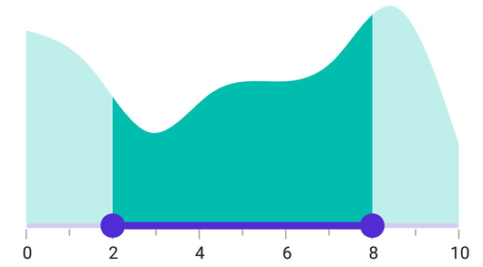
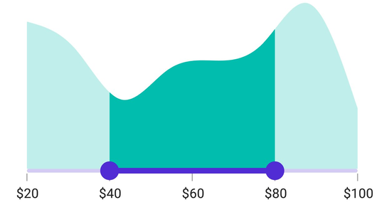

# Getting Started with .NET MAUI Range Selector

This section explains the steps required to add the range selector control and its elements such as numeric and date values, ticks, labels and tooltip. This section covers only basic features needed to know to get started with Syncfusion Range Selector.

## Creating an application with .NET MAUI

Create a new .NET MAUI application in Visual Studio.

 

## Adding SfRangeSelector reference

Syncfusion .NET MAUI components are available in [nuget.org](https://www.nuget.org/). To add SfRangeSelector to your project, open the NuGet package manager in Visual Studio, search for Syncfusion.Maui.Sliders and then install it.

 

## Handler registration

In the MauiProgram.cs file, register the handler for Syncfusion core



using Microsoft.Maui;
using Microsoft.Maui.Hosting;
using Microsoft.Maui.Controls.Compatibility;
using Microsoft.Maui.Controls.Hosting;
using Microsoft.Maui.Controls.Xaml;
using Syncfusion.Maui.Core.Hosting;

namespace RangeSelector
{
    public static class MauiProgram
    {
        public static MauiApp CreateMauiApp()
        {
            var builder = MauiApp.CreateBuilder();
            builder
            .UseMauiApp<App>()
            .ConfigureSyncfusionCore()
            .ConfigureFonts(fonts =>
            {
                fonts.AddFont("OpenSans-Regular.ttf", "OpenSansRegular");
            });

            return builder.Build();
        }
    }
}



## Import the Range Selector namespace





    xmlns:rangeselector="clr-namespace:Syncfusion.Maui.Sliders;assembly=Syncfusion.Maui.Sliders">





using Syncfusion.Maui.Sliders;





## Initialize Range Selector

Import the [`SfRangeSelector`](https://help.syncfusion.com/cr/maui/Syncfusion.Maui.Sliders.SfRangeSelector.html) namespace and initialize the range selector as shown below.





<ContentPage
    . . .
    xmlns:rangeselector="clr-namespace:Syncfusion.Maui.Sliders;assembly=Syncfusion.Maui.Sliders">
    <Grid>
        <rangeselector:SfRangeSelector />
    </Grid>
</ContentPage>





using Syncfusion.Maui.Sliders;

namespace RangeSelector
{
    public partial class MainPage : ContentPage
    {
        public MainPage()
        {
            InitializeComponent();
            SfRangeSelector rangeSelector = new SfRangeSelector();
            this.content = rangeSelector;
        }
    }
}





## Adding content to Range Selector

The [`Content`](https://help.syncfusion.com/cr/maui/Syncfusion.Maui.Sliders.SliderBase.html#Syncfusion_Maui_Sliders_SliderBase_ShowLabels) property adding the content to the range selector.





<ContentPage 
             ...
             xmlns:rangeselector="clr-namespace:Syncfusion.Maui.Sliders;assembly=Syncfusion.Maui.Sliders"
             xmlns:chart="clr-namespace:Syncfusion.Maui.Charts;assembly=Syncfusion.Maui.Charts"
             xmlns:local="clr-namespace:SliderTestbedSample.RangeSelector">
    <ContentPage.BindingContext>
        <local:ViewModel />
    </ContentPage.BindingContext>
    <rangeselector:SfRangeSelector Minimum="10"
                                   Maximum="20"
                                   RangeStart="13"
                                   RangeEnd="17">
            <chart:SfCartesianChart>
                <chart:SfCartesianChart.XAxes>
                    <chart:DateTimeAxis IsVisible="False"
                                        ShowMajorGridLines="False" />
                </chart:SfCartesianChart.XAxes>
                <chart:SfCartesianChart.YAxes>
                    <chart:NumericalAxis IsVisible="False"
                                         ShowMajorGridLines="False" />
                </chart:SfCartesianChart.YAxes>
                <chart:SfCartesianChart.Series>
                    <chart:SplineAreaSeries ItemsSource="{Binding Source}"
                                            XBindingPath="X"
                                            YBindingPath="Y"
                                            Fill="Blue">
                    </chart:SplineAreaSeries>
                </chart:SfCartesianChart.Series>
            </chart:SfCartesianChart>
        </rangeselector:SfRangeSelector>
</ContentPage>





SfRangeSelector rangeSelector = new SfRangeSelector();
SfCartesianChart chart = new SfCartesianChart();
DateTimeAxis primaryAxis = new DateTimeAxis();
chart.XAxes = primaryAxis;
NumericalAxis secondaryAxis = new NumericalAxis();
chart.YAxes = secondaryAxis;
SplineAreaSeries series = new SplineAreaSeries();
series.ItemsSource = (new ViewModel()).Source;
series.XBindingPath = "X";
series.YBindingPath = "Y";
rangeSelector.Content = chart;





## Enable labels

The [`ShowLabels`](https://help.syncfusion.com/cr/maui/Syncfusion.Maui.Sliders.SliderBase.html#Syncfusion_Maui_Sliders_SliderBase_ShowLabels) property enables label in range selector that renders on given interval.





<ContentPage 
             ...
             xmlns:rangeselector="clr-namespace:Syncfusion.Maui.Sliders;assembly=Syncfusion.Maui.Sliders"
             xmlns:chart="clr-namespace:Syncfusion.Maui.Charts;assembly=Syncfusion.Maui.Charts">
    <rangeselector:SfRangeSelector Minimum="0" 
                                   Maximum="10" 
                                   RangeStart="2" 
                                   RangeEnd="8" 
                                   ShowLabel="True" 
                                   Interval="2">
        <chart:SfCartesianChart />
    </rangeselector:SfRangeSelector>
</ContentPage>





SfRangeSelector rangeSelector = new SfRangeSelector();
rangeSelector.Minimum = 0;
rangeSelector.Maximum = 10;
rangeSelector.RangeStart = 2;
rangeSelector.RangeEnd = 8;
rangeSelector.ShowLabel = true;
rangeSelector.Interval = 2;
SfCartesianChart chart = new SfCartesianChart();
rangeSelector.Content = chart;





## Enable ticks

The [`ShowTicks`](https://help.syncfusion.com/cr/maui/Syncfusion.Maui.Sliders.SliderBase.html#Syncfusion_Maui_Sliders_SliderBase_ShowTicks) property enables ticks in the range selector, while the [`MinorTicksPerInterval`](https://help.syncfusion.com/cr/maui/Syncfusion.Maui.Sliders.SliderBase.html#Syncfusion_Maui_Sliders_SliderBase_MinorTicksPerInterval) property enables minor ticks between the major ticks.





<ContentPage 
             ...
             xmlns:rangeselector="clr-namespace:Syncfusion.Maui.Sliders;assembly=Syncfusion.Maui.Sliders"
             xmlns:chart="clr-namespace:Syncfusion.Maui.Charts;assembly=Syncfusion.Maui.Charts">
    <rangeselector:SfRangeSelector ShowTicks="True" 
                                   Minimum="0" 
                                   Maximum="10" 
                                   RangeStart="2" 
                                   RangeEnd="8"                       
                                   Interval="2" 
                                   ShowLabels="True"
                                   MinorTicksPerInterval="1">
        <chart:SfCartesianChart />
    </rangeselector:SfRangeSelector>
</ContentPage>





SfRangeSelector rangeSelector = new SfRangeSelector();
rangeSelector.Minimum = 0;
rangeSelector.Maximum = 10;
rangeSelector.RangeStart = 2;
rangeSelector.RangeEnd = 8;
rangeSelector.ShowLabels = true;
rangeSelector.ShowTicks = true;
rangeSelector.Interval = 2;
rangeSelector.MinorTicksPerInterval = 1;
SfCartesianChart chart = new SfCartesianChart();
rangeSelector.Content = chart;





## Inverse the Range Selector

You can invert the range selector using the [`IsInversed`](https://help.syncfusion.com/cr/maui/Syncfusion.Maui.Sliders.SliderBase.html#Syncfusion_Maui_Sliders_SliderBase_IsInversed) property. The default value of the [`IsInversed`](https://help.syncfusion.com/cr/maui/Syncfusion.Maui.Sliders.SliderBase.html#Syncfusion_Maui_Sliders_SliderBase_IsInversed) property is `False`.





<ContentPage 
             ...
             xmlns:rangeselector="clr-namespace:Syncfusion.Maui.Sliders;assembly=Syncfusion.Maui.Sliders"
             xmlns:chart="clr-namespace:Syncfusion.Maui.Charts;assembly=Syncfusion.Maui.Charts">
    <rangeselector:SfRangeSelector IsInversed="True"
                                   Minimum="0" 
                                   Maximum="10" 
                                   RangeStart="2" 
                                   RangeEnd="8" 
                                   ShowTicks="True" 
                                   Interval="2" 
                                   MinorTicksPerInterval="1">
        <chart:SfCartesianChart />
    </rangeselector:SfRangeSelector>
</ContentPage>





SfRangeSelector rangeSelector = new SfRangeSelector();
rangeSelector.IsInversed = true;
rangeSelector.Minimum = 0;
rangeSelector.Maximum = 10;
rangeSelector.RangeStart = 2;
rangeSelector.RangeEnd = 8;
rangeSelector.ShowLabels = true;
rangeSelector.ShowTicks = true;
rangeSelector.Interval = 2;
rangeSelector.MinorTicksPerInterval = 1;
SfCartesianChart chart = new SfCartesianChart();
rangeSelector.Content = chart;





## Formatting labels

You can add prefix or suffix to the labels using the [`NumberFormat`](https://help.syncfusion.com/cr/maui/Syncfusion.Maui.Sliders.SliderBase.html#Syncfusion_Maui_Sliders_SliderBase_NumberFormat) or [`DateFormat`](https://help.syncfusion.com/cr/maui/Syncfusion.Maui.Sliders.SliderBase.html#Syncfusion_Maui_Sliders_SliderBase_DateFormat) properties.

N> The format type (numeric or date) of the range selector is determined based on the values specified in [`Minimum`](https://help.syncfusion.com/cr/maui/Syncfusion.Maui.Sliders.SliderBase.html#Syncfusion_Maui_Sliders_SliderBase_Minimum), [`Maximum`](https://help.syncfusion.com/cr/maui/Syncfusion.Maui.Sliders.SliderBase.html#Syncfusion_Maui_Sliders_SliderBase_Maximum) properties.





<ContentPage 
             ...
             xmlns:rangeselector="clr-namespace:Syncfusion.Maui.Sliders;assembly=Syncfusion.Maui.Sliders"
             xmlns:chart="clr-namespace:Syncfusion.Maui.Charts;assembly=Syncfusion.Maui.Charts">
    <rangeselector:SfRangeSelector Minimum="20" 
                                   Maximum="100" 
                                   RangeStart="20" 
                                   RangeEnd="80"
                                   NumberFormat="$##" 
                                   ShowLabels="True" 
                                   ShowTicks="True" 
                                   Interval="20">
        <chart:SfCartesianChart />
    </rangeselector:SfRangeSelector>
</ContentPage> 





SfRangeSelector rangeSelector = new SfRangeSelector();
rangeSelector.Minimum = 20;
rangeSelector.Maximum = 100;
rangeSelector.RangeStart = 20;
rangeSelector.RangeEnd = 80;
rangeSelector.ShowLabels = true;
rangeSelector.ShowTicks = true;
rangeSelector.Interval = 20;
rangeSelector.NumberFormat = "$##";
SfCartesianChart chart = new SfCartesianChart();
rangeSelector.Content = chart;





